\* Chapter 2: What is Node.js?
==============================

- Node.js is JavaScript runtime. javascript on the server. it allows you to run javascript no just in the browser but anywhere else like a normal programming language, like normal programs on your computer or some computer in the internet effectively making it a great choice for building web applications that runs on servers which are just computers running somewhere in the internet.

- node.js basically takes that V8 codebase which is written in C++ and adds certain features like for example working with your local file system, opening files, reading files, deleting files, these are all things which are not possible in the browser, you can’t access your local filesystem in the browser for security reasons, so this is not supported. so node.js adds these features to V8’s engine. so that you can do that. node.js doesn’t run in the browser so these restrictions still apply there. you use vanila V8 only without the node.js extension.

- but if you then install node.js, you can use it to basically use that extended V8 version to run javascript on your computer which then suddenly can access these new features because they don’t run in the browser but are directly executed through that node.js runtime. 

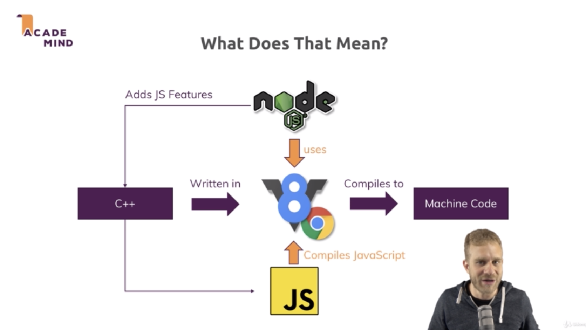

\* Chapter 3: Installing Node.js And Creating Our First App
===========================================================

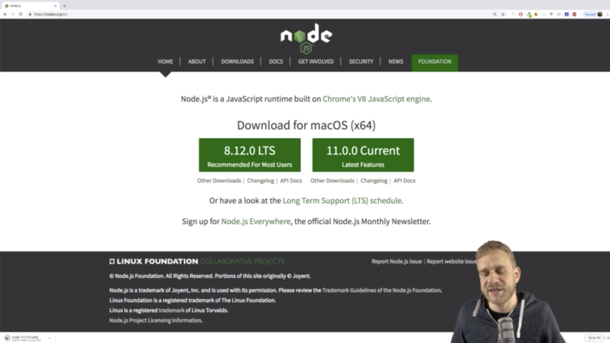

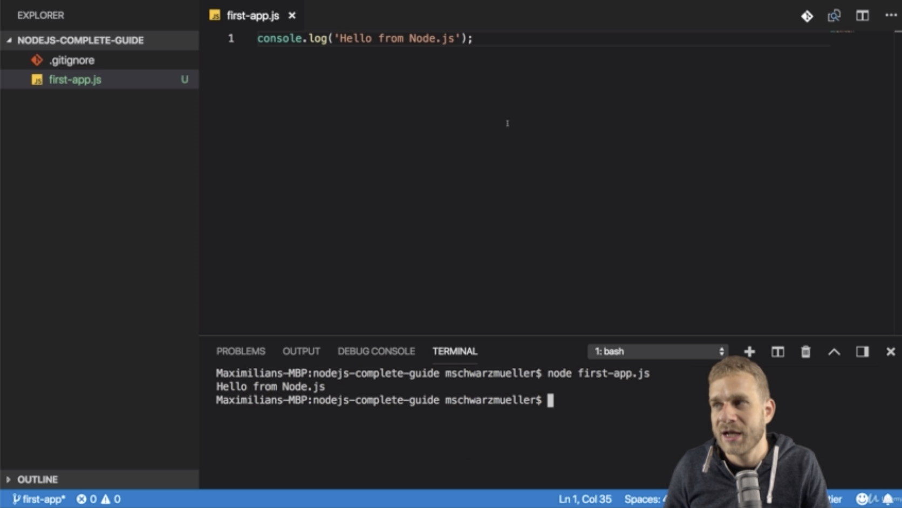

- this is not using a browser, it’s just using the internal engine. the extended internal javascript engine used by the browser to execute your code locally, totally outside of a browser.

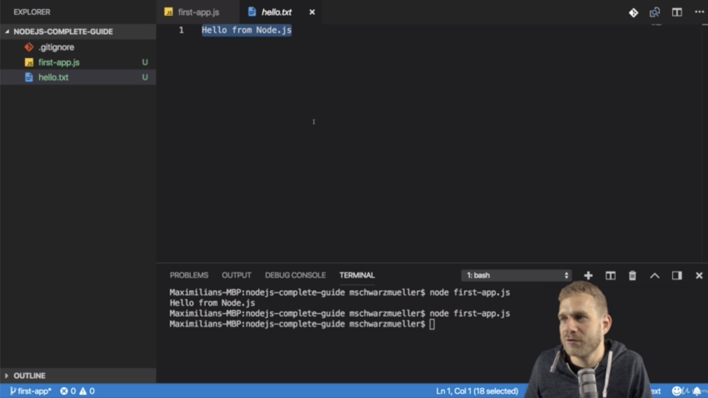

- ‘fs’ stands for ‘file system’ and this syntax simply imports some file system functionalities into this javascript file.

- after using ‘fs.write’, this is something you couldn’y do in the browser because there you can’t access your local file system and obviously it’s features like this which you need to then also create a server which we don’t have at this point.

\* Chapter 4: Understanding The Role And Usage Of Node.js
=========================================================

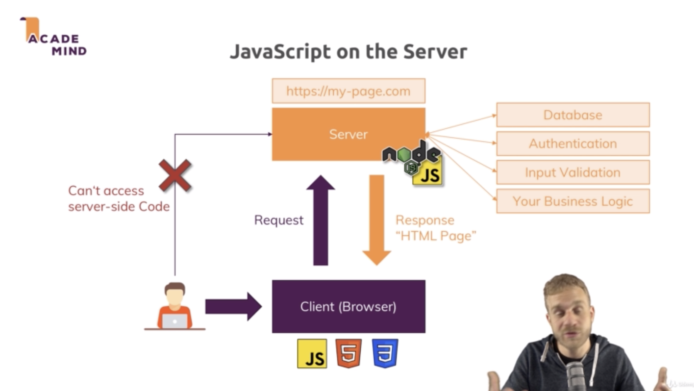

- On the server, we typically do tasks that we don’t or can’t want to do from inside the browser for performance or security reasons.

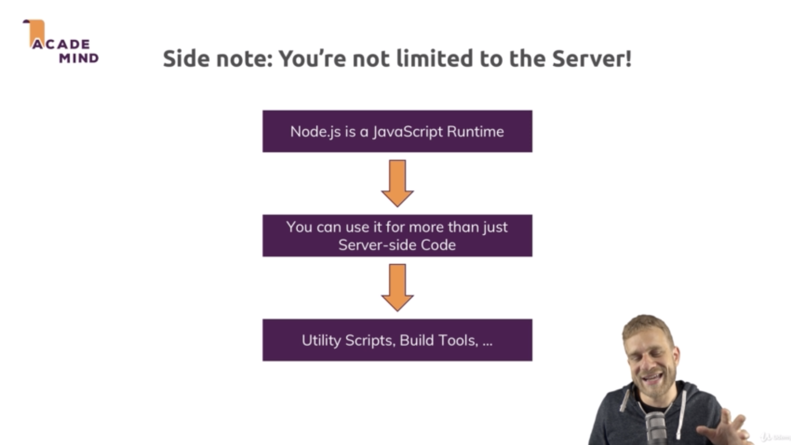

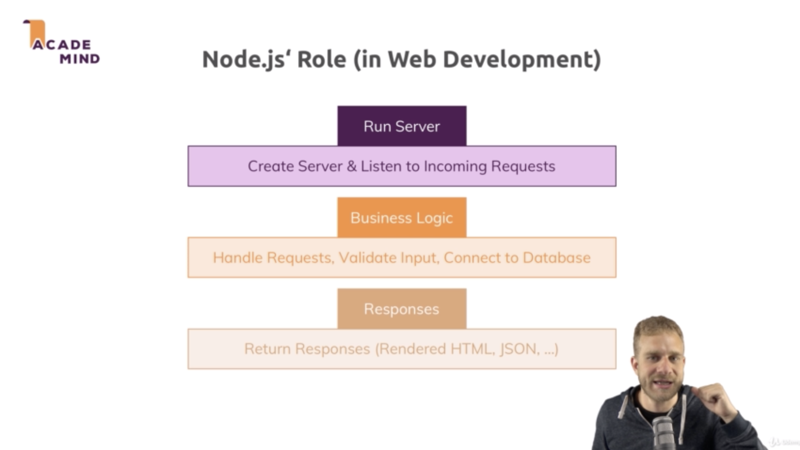

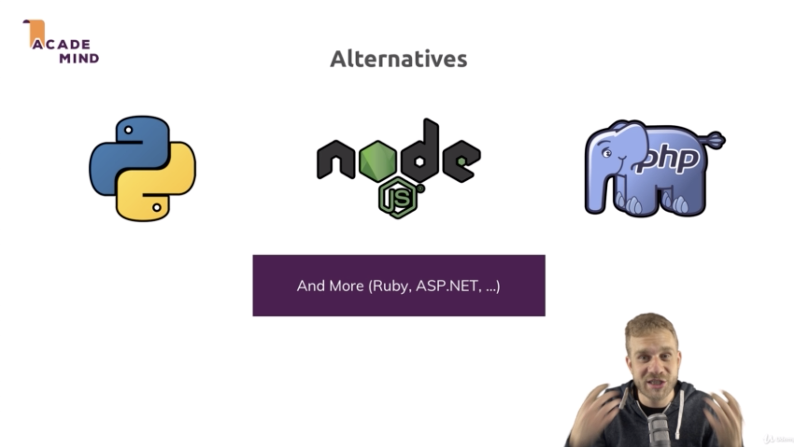

\* Chapter 5: Course Outline
============================

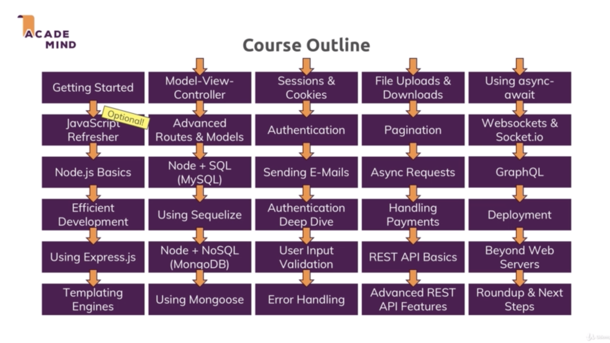

\* Chapter 6: How To Get The Most Out Of The Course
===================================================

\* Chapter 7: Working With The REPL Vs Using Files
==================================================

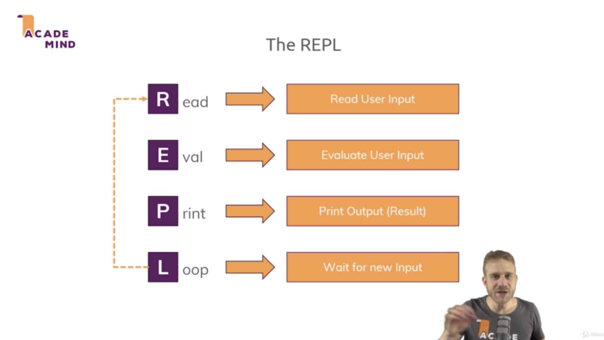

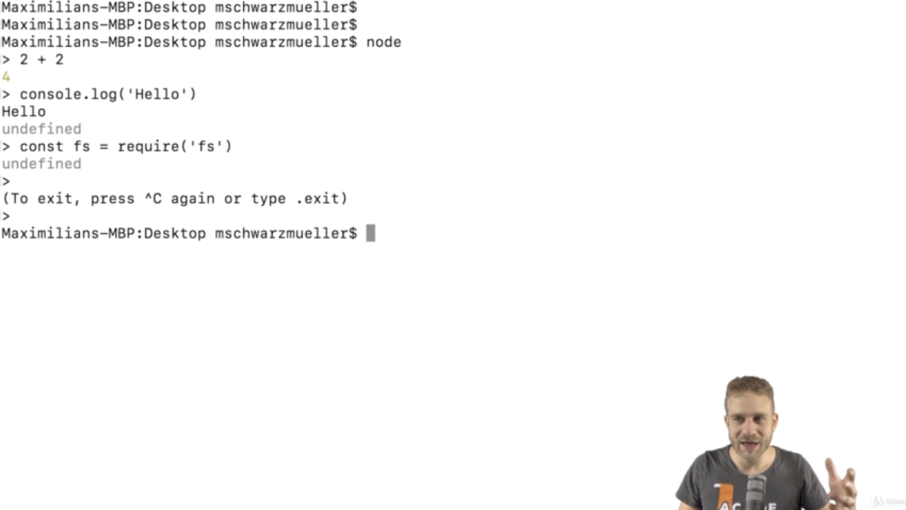

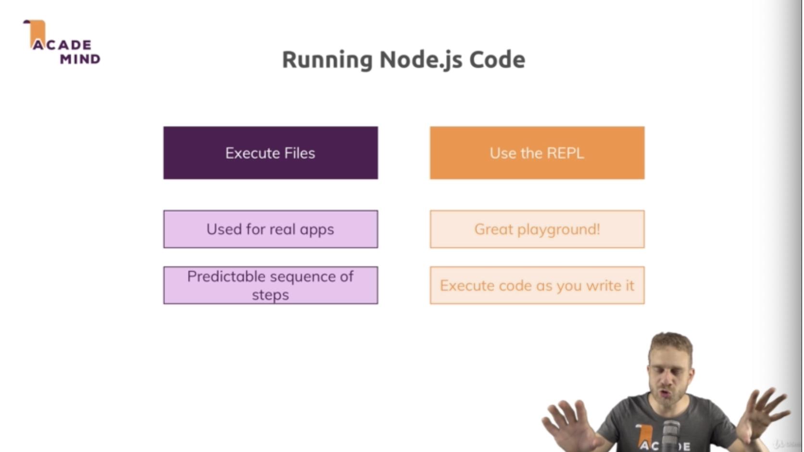

\* Chapter 8: Using The Attached Source Code
============================================

Using the Attached Source Code

Throughout this course, we'll write a lot of code. And to give you the possibility of comparing your code to mine (to find + fix potential errors in your code), you'll find **multiple code snapshots per module** attached to lectures in this course.

The **last lecture of each module** always holds **all snapshots** for the module, ordered chronologically.

You can view the code and compare it to yours or replace (parts of) your code with it temporarily (to narrow down the issue).

**How do you use the attached code?**

**BEFORE** we started using npm, you simply run the main .js file via node - just as we do it in the videos. Or you simply look into the code files to view + compare the code.

**AFTER** we started using npm, you need to run `npm install` inside of the extracted code attachment before you can run npm start to run the server.