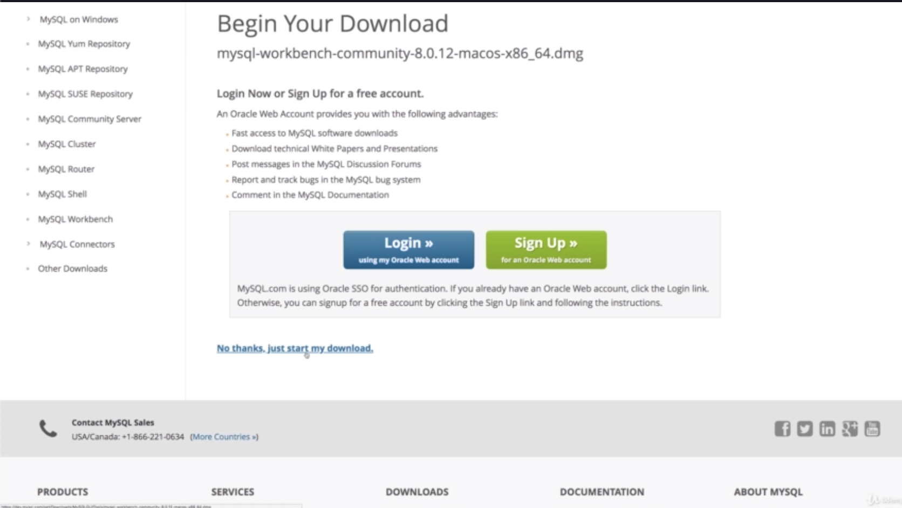
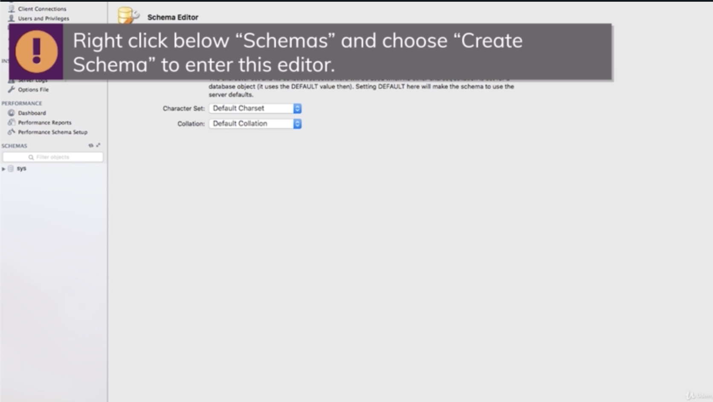

\* Chapter 131: Module Introduction
===================================


\* Chapter 132: Choosing A Database
===================================


- SQL database thinks in so-called tables. so we might have a users, a product and let’s say an orders table and in each table, you have so-called fields or columns. for example, a user could be defined by having an ID, email, a name and product could have an ID, title, price and a description.

- now we fill in data for these fields, so-called records. so basically the rows in our tables. for example, we got a couple of users with their data and we get a couple of products too.

- SQL-based database also have one important thing. they allow you to relate different tables. for example, an order could simply be described as a connection of a user and a product. because a user might order a couple of different products and a product might be ordered by a couple of different users.


- the core SQL database characteristics are that we have a strong data schema. so that for each table, we clearly define how the data in there should look like. so which fields do we have, which type of data does each field store. is it a number? or string or text and so on.

- so the schema, this definition of how the data has to look like is one core thing in a SQL database.

- we relate our different table with 3 important kinds of relations. one to one, one to many, or many to many. this means that we can have 2 tables where each record fits one other record, a record might fit multiple other records or multiple records in table A can fit multiple records in table B. 


- SQL stands for ’Structured Query Language’. Queries are commands we use to interact with the database.

- this command would be a command that selects all users, so all entries, all records in the users table where the age is greater than 28\. so this is so-called ‘query’

\* Chapter 133: NoSQL Introduction
==================================


- NoSQL means that it doesn’t follow the approach SQL follows. it also uses a different query language. but instead of having schemas and relations, NoSQL has other focuses or other strength.

- in NoSQL, we can still have a database and we can give this database a name, shop. that’s the same for SQL. there we also have database

- in SQL, we had tables, users an orders and also products. these are just examples here.

- in NoSQL, tables are called ‘collections’ but you can think of them as tables, so as the table equivalent. but we call them collections in the NoSQL world. in collection, we don’t find records but so-called documents which look like this. documents are very close to how we describe data in javascript. 

- that are the documents in our collections and what you can already see in the users collection example is that NoSQL doesn’t have a strict schema. we got 2 documents in the same collection. but the second document ‘{name: ‘Manu’}’ doesn’t have a age and that is perfectly fine in NoSQL. you can store multiple documents with different structures in the same collection. you still try to have kind of a similar structure, but it’s also not uncommon for some application that you don’t always have exactly the same fields available for the data you’re storing in the database and that is ok in NoSQL. so you can store documents which are generally equal but where some fields might differ.


- One other thing is that in the NoSQL world, we got no real relations, instead we go for duplicated data. that means that if we have an orders collection here, we have a nested document, the user which also is stored as a separate document with more details maybe in the users collection. we don’t connect that through some ID or behind the scenes setup relation. 

- instead we duplicate data we need in the orders collection. that means that if that data changes, we have to update it in multiple places. if all these places need the latest update or the latest data change but that can be OK because on the other hand, this gives us the huge advantage that if we ever retrieve data, we don’t have to join multiple tables together which can lead to very long and difficult code and which can also impact performance, instead we can read the data from the orders collection and we probably got all the data we need to display on the orders page without having to reach out to other collections. 

- and therefore this can be done in a super fast way and that is one of the huge advantages of NoSQL. 


- we have generally no data relations. now we can relate document in some way. 

- we can differentiate between horizontal and vertical scaling. 

\* Chapter 134: Comparing SQL And NoSQL
=======================================


- in horizontal scaling, we simply add more servers. the advantage is that we can do this infinitely. we can always buy new servers, be that on a cloud provider or in our own data center and connect them to our database and split our data across all these servers. this also means that we also need some process that runs queries on all of them and merges them together. so this is generally something which is not that easy to do but this is a good way of scaling. 

- Vertical Scaling means that we make our existing server stornger by adding more CPU or memory, especially with cloud provider, this is very easy, you choose another option from the dropdown. the problem is that you have some limit, you can’t fit infinitely much CPU power into a single machine.


\* Chapter 135: Setting Up MySQL
================================


- we need MySQL Community Edition.


- and we need ‘MySQL Community Server’ and ‘MySQL Workbench'


- you can choose ’No thanks. just start my download’ 


- you should make sure that during this configuration process, you do choose the 'lagacy password encrytion’ which sounds insecure but which is perfectly fine and the newer version simply is not supported by the Node SQL package we are using yet.


- next, you have to choose a password for your root user.


- The workbench is a client, a visual client we can use to connect to our database to inspect it and play around with it outside of our node application which makes debugging and developing a bit easier.





- you can now test your setup by starting the MySQL workbench you just installed 


- and then there you should already see your MySQL instance running. if not the case, have a look at the attached document where i describe some common issues or in general give you some links on how to make this work and how to bring this up. 

- you need to make sure that your MySQL server is running and during installation, you had a choice to check that it should always start with your system.


- on MacOS, you can open your system preferences and there you should have the MySQL option where you can also stop and start the server.


- To connect your database, click on that instance and enter that root password you assigned during the installation. this should allow you to connect to your SQL server instance like this.


- then once you enter the password, you should be connected to your database system. and this is the empty window and we won’t work too much in that. we will work with our database from inside our node application. but this will allow us to conveniently look into our database from time to time and see what is stored 



and one thing we can do is we can go down to schemas which can be translated with database. 


- we can define a new schema, so a new database with which we will work and i will name it ’node-complete’. you can name this whatever you want and you can leave the other setting here and then on the bottom, you can click ‘apply’. 


- this will create a new database which we can interact later, you can leave all the default settings and click apply 


and you should see that 'node-complete’ thing which has a couple of tables or none right now. but where you can then later connect to and store your data in the tables that will be created here.


- so with that, we can continue and we can now move on with our code and start interacting with MySQL from insdie our node application.

\* Chapter 136: Connecting Our App To The SQL Database
======================================================

1\. update

- ./util/database.js

- app.js


- To use SQL or to interact with SQL from inside node, we need to install a new package and we do that with ’npm install’

- ’npm install —save’ because it will be production dependency, one which is a crucial part of our application

- the name is ‘mysql2’, this is a later version of well MySQL1\. as you might guess and it allows us to write SQL code and execute SQL code in node and interact with a database.

 

- with that installed, we made one important step forward toward using MySQL.

- The next step is that we need to connect our database from inside our application and for that, i go to the ‘util’ folder we created in past, and there we have that path.js file in there which we don’t really use anymore but we can also create a new file in there , which name is ‘database.js’.

- in there, i wanna set up the code that will allow us to connect to the SQL database and then also give us back a connection object which allows us to run quries.


- go back to our ‘workbench’, and in the table, we are gonna create table.


- The name should be ‘products’ and in there, you can add new fields.

```js
//app.js

const path = require('path');

const express = require('express');
const bodyParser = require('body-parser');

const errorController = require('./controllers/error');
const db = require('./util/database');

const app = express();

app.set('view engine', 'ejs');
app.set('views', 'views');

const adminRoutes = require('./routes/admin');

const shopRoutes = require('./routes/shop');
/**one of them is 'execute' which allows us to execute queries
 * we can also end it whenever our application is to shut down.
 * 
 * we wanna connect or execute a command
 * and we can execute a command by writing SQL syntax as string
 * that means that you need to know SQL.
 */
db.execute('SELECT * FROM products')

app.use(bodyParser.urlencoded({ extended: false }));
app.use(express.static(path.join(__dirname, 'public')));

app.use('/admin', adminRoutes);
app.use(shopRoutes);

app.use(errorController.get404);

app.listen(3000);

```

```js
const mysql = require('mysql2')

/**i will call 'createPool'
 * and create connection is not what we want
 * we don't want a single connection
 * but a pool of connections which will allow us to always reach out to it whenever we have a query to run
 * and then we get a new connection from that pool which manages multiple connection
 * so that we can run multiple queries simultaneously
 * because each query needs its own connection
 * and once query is done,
 * the connection will be handed back into the pool
 * and it's available again for a new qurey
 * and the pool can then be finished when our application shuts down
 *
 * and i need to pass in a javascript object
 * with some information about our data engine
 * we are connencting to
 * */
const pool = mysql.createPool({
    /**'localhost' because we are running it on our local machine
     *
     * then i need to define the username
     * and that by default is root that was given to us during the configuration
     *
     * i also need to define the exact database name
     * because this gives us access to a database server
     * but that server typically has multiple databases
     * and our databases are our schemas.
     */
    host: 'localhost',
    user: 'root',
    database: 'node-complete',
    password: 'rldnjs12'
})
/**i will export it in a special way
 * i will call 'promise()'
 * because this will allow us to use 'promises' when working with these connections
 * which handle asynchronous tasks, asynchronous data instead of callbacks
 * because promises allow us to write code in more structured way,
 * we don't have many nested callbacks.
 * instead we can use promise chain
 */

module.exports = pool.promise();
```

\* Chapter 137: Basic SQL & Creating A Table
============================================


- first of all, define the name of a field, ID and the data type. and for the ID, an integer is fine. 

- we can also check that it should be the primary key(PK) by which records in this table will be identified. 

that it must not be null(NN), that it should be unique(UQ), that should definitely be the case, 

if it should hold binary data(BIN) which is not the case, 

if it’s unsigned(UN) so if it holds no negative values which should also be the case because that should be an integer starting at 1 and then incrementing, 

if it is zero fill(ZF) and for us important, 

if it’s auto-incrementing(AI) and that should be the case because every new record should receive that automatically and it should be a higher number than in the last record. 


- A product typically has a title and there i will use a VARCHAR which is a string. i will define that it may be up to 255 characters long and longer titles will be cut off. so that is what we have to keep in mind. it must also not be null. so we have to have a value in there but i don’t need any other setting here.


- for a product, i wanna have a price. and i wanna have DOUBLE so that we can enter decimal places. 

- this must also not be null. i also wanna have a description which now will not be a VARCHAR. 


- i also wanna have a description which now will not be a VARCHAR. but will be TEXT and if you are wondering which data types are available, that is exactly what i meant. you should definitely consult a full SQL course to learn more about the available data types. 

- here i got my text which is a longer text than the VARCHAR which has a limitation.


- i will have an image URL which i will set to VARCHAR 255 which means longer URLs also won’t work.

- i defined how my product should look like. 


- it shows you the SQL statement. it will execute and you could execute this on your own, for example in node to always create this new table, here we will do it in the workbench.


- after that, now on tables, you see the new products table 


- and if you click this icon here, on the very right, you can see the entries in there. 

- you also see the SQL query that was executed to look into that and that’s pretty similar to the query we are executing here. 


- now the table is set up, we need to enter one dummy data so that we have something to fetch.


- now let’s enter an ID that should be auto-generated. click ‘apply’ on the bottom right, apply and close and if you again click on this on the very right, you will see that now this one element was added here. 

- now that we get a book in here


- let’s go back to our node code.

\* Chapter 138: Retrieving Data
===============================

1\. update

- app.js


- this immediately executes because it’s part of the app.js file

- if we have a look at this, we see this is the object we got back and in this object, we essentially see the data that was retrieved here.

- the data we get back has a format of an array with a nested array where the first nested array seems to depict our data, the rows it fetched and the second array seems to hold some metadata about the table we fetched it from


- so result is an array with 2 nested elements. so we can logout result[0] and result[1]. and if we save this and therefore our server restarts, we have almost the same output, but now it’s not a nested array but we have the first object we retrieved, the row we got and then this ends 


here is the closing square bracket and then here we get the second log, so this is the result one with the metadata.

```js
//app.js

const path = require('path');

const express = require('express');
const bodyParser = require('body-parser');

const errorController = require('./controllers/error');
const db = require('./util/database');

const app = express();

app.set('view engine', 'ejs');
app.set('views', 'views');

const adminRoutes = require('./routes/admin');

const shopRoutes = require('./routes/shop');

/**we can chain 'then()'
 * and this is something provided by the fact
 * that we are using 'promise()' when exporting the pool in ./util/database.js
 * we get back promises when executing queries like this with execute
 * and promises have 2 functions 'then()' and 'catch()'
 *
 * these are functions we can chain onto the result of the execute call.
 * they will execute on whatever this gives us back
 * and this whatever is some so-called promise
 *
 * promise is a basic javascript object not specific to node
 * it's available in javascript in the browser which allows us to work with asynchronous code.
 * instead of using callbacks which we could also use with the MySQL package,
 * promises allow us to write more structured code
 * because instead of having nested anonymous function like having a second argument,
 * we have 'then()' block which will then get the anonymous function to execute.
 *      then(() => {})
 */

 /**we also have 'catch()'
  * and this also has a function which executes in case of an error.
  */
db.execute('SELECT * FROM products')
    .then(result => {
        console.log(result[0], result[1])
    })
    .catch(err => {
        console.log(err)
    })

app.use(bodyParser.urlencoded({ extended: false }));
app.use(express.static(path.join(__dirname, 'public')));

app.use('/admin', adminRoutes);
app.use(shopRoutes);

app.use(errorController.get404);

app.listen(3000);

```

\* Chapter 139: Fetching Products
=================================

1\. update

- ./models/product.js

- ./controllers/shop.js


- if we go to localhost:3000, you can see the book here and also have no errors on our console. now we see that book because our data is retrieved from the database.


- if we were to go to the database and we add an exclamation mark(!) in the title, and click ‘apply’ and if i reload that, and i can see the change.

```js
//./controllers/shop.js

const Product = require('../models/product');
const Cart = require('../models/cart');

exports.getProducts = (req, res, next) => {
  Product.fetchAll(products => {
    res.render('shop/product-list', {
      prods: products,
      pageTitle: 'All Products',
      path: '/products'
    });
  });
};

exports.getProduct = (req, res, next) => {
  const prodId = req.params.productId;
  Product.findById(prodId, product => {
    res.render('shop/product-detail', {
      product: product,
      pageTitle: product.title,
      path: '/products'
    });
  });
};

exports.getIndex = (req, res, next) => {
/**we call 'fetchAll'
 * but we still pass in a function that previously was the callback.
 * but now we got no callback anymore, so let's take out that render code,
 * 
 * 'fetchAll' will return a promise.
 * so we can add 'then()' and 'catch()'
 * 
*/
  Product.fetchAll()
  /**'rows' will be the first element of the nested array
   * which would be our argument data
   * and 'fieldData' will be the second element
   * 
   * we can use these 2 variables which holds these 2 nested arrays
   */
    .then(([rows, fieldData]) => {
      res.render('shop/index', {
        /**'rows' should be my products
         * because my rows are the entries in the products table
         * and therefore these should be my products.
         */
        prods: rows,
        pageTitle: 'Shop',
        path: '/'
      })
    })
    .catch(err => console.log(err))
};

exports.getCart = (req, res, next) => {
  Cart.getCart(cart => {
    Product.fetchAll(products => {
      const cartProducts = [];
      for (product of products) {
        const cartProductData = cart.products.find(
          prod => prod.id === product.id
        );
        if (cartProductData) {
          cartProducts.push({ productData: product, qty: cartProductData.qty });
        }
      }
      res.render('shop/cart', {
        path: '/cart',
        pageTitle: 'Your Cart',
        products: cartProducts
      });
    });
  });
};

exports.postCart = (req, res, next) => {
  const prodId = req.body.productId;
  Product.findById(prodId, product => {
    Cart.addProduct(prodId, product.price);
  });
  res.redirect('/cart');
};

exports.postCartDeleteProduct = (req, res, next) => {
  const prodId = req.body.productId;
  Product.findById(prodId, product => {
    Cart.deleteProduct(prodId, product.price);
    res.redirect('/cart');
  });
};

exports.getOrders = (req, res, next) => {
  res.render('shop/orders', {
    path: '/orders',
    pageTitle: 'Your Orders'
  });
};

exports.getCheckout = (req, res, next) => {
  res.render('shop/checkout', {
    path: '/checkout',
    pageTitle: 'Checkout'
  });
};

```

```js
//./models/product.js

const db = require('../util/database')

const Cart = require('./cart');


module.exports = class Product {
  constructor(id, title, imageUrl, description, price) {
    this.id = id;
    this.title = title;
    this.imageUrl = imageUrl;
    this.description = description;
    this.price = price;
  }

  save() {

  }

  static deleteById(id) {

  }

  static fetchAll() {
    /** '*' star stands for 'everything' in SQL  
     * you could write 'SELECT' and 'FROM' in lowercase too like 'select' and 'from'
     * but i like to keep these keyword uppercase to indicate what is core SQL syntax
     * and what are our dynamic values.
    */
   /** i'm interested in the returned value in the place where i'm calling fetchAll
    * so i will simply return the entire promise that execute returns
    * so that we can use it somewehere else.
    * 
   */
    return db.execute('SELECT * FROM products')
  }

  static findById(id, ) {

  };
}
```

\* Chapter 140: Fetching Products - Time To Practice
====================================================

1\. update

- ./controllers/shop.js


- products page also work well again.

```js
//./controllers/shop.js

const Product = require('../models/product');
const Cart = require('../models/cart');

exports.getProducts = (req, res, next) => {
  Product.fetchAll()
  /**you can get rid of 'fieldData'
   * you don't need to extract that
   * because we are not using it.
   * i just wanna show you 
   * how you can extract the different elements of an array in the argument list already
   */
    .then(([rows, fieldData]) => {
      res.render('shop/product-list', {
        prods: rows,
        pageTitle: 'All Products',
        path: '/products'
      })
    })
};

exports.getProduct = (req, res, next) => {
  const prodId = req.params.productId;
  Product.findById(prodId, product => {
    res.render('shop/product-detail', {
      product: product,
      pageTitle: product.title,
      path: '/products'
    });
  });
};

exports.getIndex = (req, res, next) => {
  Product.fetchAll()
    .then(([rows, fieldData]) => {
      res.render('shop/index', {
        prods: rows,
        pageTitle: 'Shop',
        path: '/'
      })
    })
    .catch(err => console.log(err))
};

exports.getCart = (req, res, next) => {
  Cart.getCart(cart => {
    Product.fetchAll(products => {
      const cartProducts = [];
      for (product of products) {
        const cartProductData = cart.products.find(
          prod => prod.id === product.id
        );
        if (cartProductData) {
          cartProducts.push({ productData: product, qty: cartProductData.qty });
        }
      }
      res.render('shop/cart', {
        path: '/cart',
        pageTitle: 'Your Cart',
        products: cartProducts
      });
    });
  });
};

exports.postCart = (req, res, next) => {
  const prodId = req.body.productId;
  Product.findById(prodId, product => {
    Cart.addProduct(prodId, product.price);
  });
  res.redirect('/cart');
};

exports.postCartDeleteProduct = (req, res, next) => {
  const prodId = req.body.productId;
  Product.findById(prodId, product => {
    Cart.deleteProduct(prodId, product.price);
    res.redirect('/cart');
  });
};

exports.getOrders = (req, res, next) => {
  res.render('shop/orders', {
    path: '/orders',
    pageTitle: 'Your Orders'
  });
};

exports.getCheckout = (req, res, next) => {
  res.render('shop/checkout', {
    path: '/checkout',
    pageTitle: 'Checkout'
  });
};

```

\* Chapter 141: Inserting Data Into The Database
================================================

1\. update

- ./models/product.js

- ./controllers/admin.js


- we have the title, the price, the imageUrl and the description and the important, you need to make sure that the field you define here match the field names you defined in your table, in the database.

- you don’t need to specify the ID because that should be generated automatically by the database engine.


- if we click ‘Add Product’ button, we are redirected and this is looking good.


- and if we have a look at our database and click that refresh button here, we see our entry, so our new entry with an auto-generated ID.

```js
//./models/product.js

const db = require('../util/database');

const Cart = require('./cart');

module.exports = class Product {
  constructor(id, title, imageUrl, description, price) {
    this.id = id;
    this.title = title;
    this.imageUrl = imageUrl;
    this.description = description;
    this.price = price;
  }

  save() {
    /** with SQL, we saw select for getting data,
     * for inserting data, there is the 'INSERT INTO' command
     * and we then define the table where we wanna insert something
     * and i will use the 'products' table here, followed by brackets
     * where we list the different fields we wanna insert value into
     * so we have the title, price, imageUrl, description
     * and important, you need to make sure
     * that the fields you define here match the field names you defined in your table, in the database.
     * and you don't need to specify the ID
     * because that should be generated automatically by the databse engine.
     *
     * we need the 'VALUE' keyword followed by brackets with the VALUES
     * to safely insert values and not face the issue of SQL injection
     * which is an attack pattern
     * where users can insert special data into your input fields in your web page that runs as SQL queries,
     * we should use an approach where we just use question marks,
     * one for each of the fields we insert data into
     * separated with commas,
     * and then there is a second argument we pass to execute with the VALUES that will be injected
     * instead of these question marks
     * so the order of the elements we add to this array is the order of arguments.
     *
     * and again i will simply return the promise that execute yields
     * that allows us to go back to the admin.js file to the controller
     */
    return db.execute(
      'INSERT INTO products (title, price, imageUrl, description) VALUES (?, ?, ?, ?)',
      [this.title, this.price, this.imageUrl, this.description]
    );
  }

  static deleteById(id) {}

  static fetchAll() {
    return db.execute('SELECT * FROM products');
  }

  static findById(id) {}
};

```

```js
// ./controllers/admin.js

const Product = require('../models/product');

exports.getAddProduct = (req, res, next) => {
  res.render('admin/edit-product', {
    pageTitle: 'Add Product',
    path: '/admin/add-product',
    editing: false
  });
};

exports.postAddProduct = (req, res, next) => {
  const title = req.body.title;
  const imageUrl = req.body.imageUrl;
  const price = req.body.price;
  const description = req.body.description;
  const product = new Product(null, title, imageUrl, description, price);
  product
    .save()
    .then(() => {
      res.redirect('/');
    })
    .catch(err => console.log(err));
};

exports.getEditProduct = (req, res, next) => {
  const editMode = req.query.edit;
  if (!editMode) {
    return res.redirect('/');
  }
  const prodId = req.params.productId;
  Product.findById(prodId, product => {
    if (!product) {
      return res.redirect('/');
    }
    res.render('admin/edit-product', {
      pageTitle: 'Edit Product',
      path: '/admin/edit-product',
      editing: editMode,
      product: product
    });
  });
};

exports.postEditProduct = (req, res, next) => {
  const prodId = req.body.productId;
  const updatedTitle = req.body.title;
  const updatedPrice = req.body.price;
  const updatedImageUrl = req.body.imageUrl;
  const updatedDesc = req.body.description;
  const updatedProduct = new Product(
    prodId,
    updatedTitle,
    updatedImageUrl,
    updatedDesc,
    updatedPrice
  );
  updatedProduct.save();
  res.redirect('/admin/products');
};

exports.getProducts = (req, res, next) => {
  Product.fetchAll(products => {
    res.render('admin/products', {
      prods: products,
      pageTitle: 'Admin Products',
      path: '/admin/products'
    });
  });
};

exports.postDeleteProduct = (req, res, next) => {
  const prodId = req.body.productId;
  Product.deleteById(prodId);
  res.redirect('/admin/products');
};

```

\* Chapter 142: Fetching A Single Product With The “Where” Condition
====================================================================

1\. update

- ./models/product.js

- ./controllers/shop.js


```js
//./models/product.js

const db = require('../util/database');

const Cart = require('./cart');

module.exports = class Product {
  constructor(id, title, imageUrl, description, price) {
    this.id = id;
    this.title = title;
    this.imageUrl = imageUrl;
    this.description = description;
    this.price = price;
  }

  save() {
    return db.execute(
      'INSERT INTO products (title, price, imageUrl, description) VALUES (?, ?, ?, ?)',
      [this.title, this.price, this.imageUrl, this.description]
    );
  }

  static deleteById(id) {}

  static fetchAll() {
    return db.execute('SELECT * FROM products');
  }

  static findById(id) {
    /** everything '*' means not all rows but simply all fields
     * but now we can restrict the number of rows with a 'WHERE' condition
     * and 'WHERE' is another SQL keyword.
     * so we can execute 'WHERE products.id = '
     * one equals sign only, not multiple ones as in javascript
     * 'WHERE products.id' is equal to question mark
     * simply to let my MySQL inject the value again,
     * the ID we are getting as an argument
     * 
     * let's return this promise here.
     * and this is our statement for fetching a single product with all the columns though.
     * so with all the data.
     * now we can go back to ./controllers/shop.js
    */

    return db.execute('SELECT * FROM products WHERE products.id = ?', [id]);
  }
};

```

```js
//./controllers/shop.js

const Product = require('../models/product');
const Cart = require('../models/cart');

exports.getProducts = (req, res, next) => {
  Product.fetchAll()
    .then(([rows, fieldData]) => {
      res.render('shop/product-list', {
        prods: rows,
        pageTitle: 'All Products',
        path: '/products'
      });
    })
    .catch(err => console.log(err));
};

exports.getProduct = (req, res, next) => {
  const prodId = req.params.productId;
  /**we got that nested array
   * where we know that the first element will be all the rows we got
   * and that will just be our product
   * or it should just be the product
   *
   * make sure to wrap that special syntax with the squre brackets in the parentheses
   */
  Product.findById(prodId)
    .then(([product]) => {
      res.render('shop/product-detail', {
        product: product[0],
        pageTitle: product.title,
        path: '/products'
      });
    })
    .catch(err => console.log(err));
};

exports.getIndex = (req, res, next) => {
  Product.fetchAll()
    .then(([rows, fieldData]) => {
      res.render('shop/index', {
        prods: rows,
        pageTitle: 'Shop',
        path: '/'
      });
    })
    .catch(err => console.log(err));
};

exports.getCart = (req, res, next) => {
  Cart.getCart(cart => {
    Product.fetchAll(products => {
      const cartProducts = [];
      for (product of products) {
        const cartProductData = cart.products.find(
          prod => prod.id === product.id
        );
        if (cartProductData) {
          cartProducts.push({ productData: product, qty: cartProductData.qty });
        }
      }
      res.render('shop/cart', {
        path: '/cart',
        pageTitle: 'Your Cart',
        products: cartProducts
      });
    });
  });
};

exports.postCart = (req, res, next) => {
  const prodId = req.body.productId;
  Product.findById(prodId, product => {
    Cart.addProduct(prodId, product.price);
  });
  res.redirect('/cart');
};

exports.postCartDeleteProduct = (req, res, next) => {
  const prodId = req.body.productId;
  Product.findById(prodId, product => {
    Cart.deleteProduct(prodId, product.price);
    res.redirect('/cart');
  });
};

exports.getOrders = (req, res, next) => {
  res.render('shop/orders', {
    path: '/orders',
    pageTitle: 'Your Orders'
  });
};

exports.getCheckout = (req, res, next) => {
  res.render('shop/checkout', {
    path: '/checkout',
    pageTitle: 'Checkout'
  });
};

```