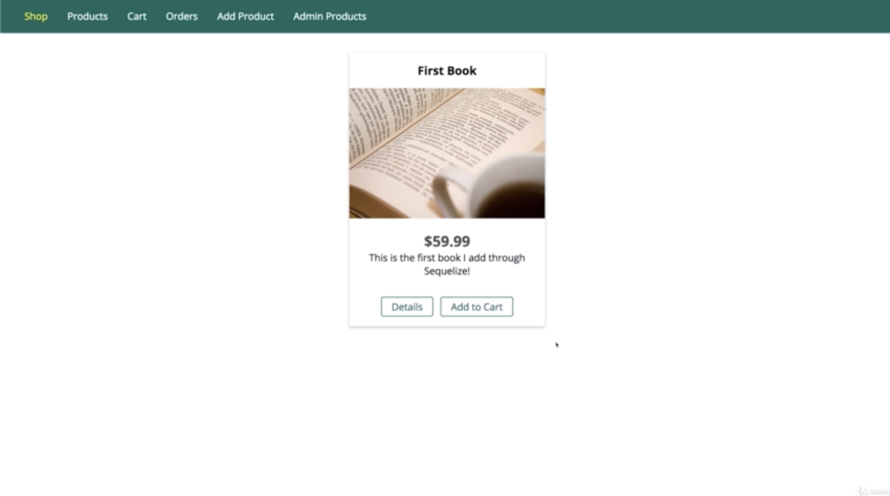
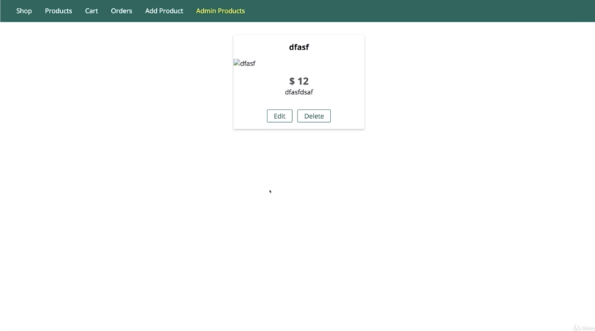
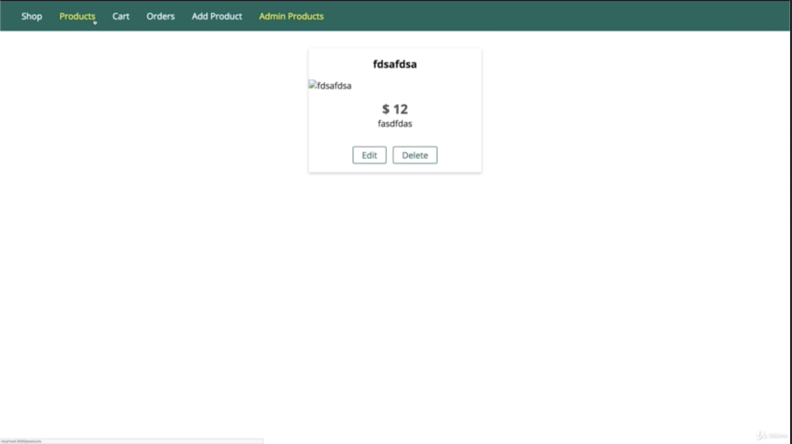
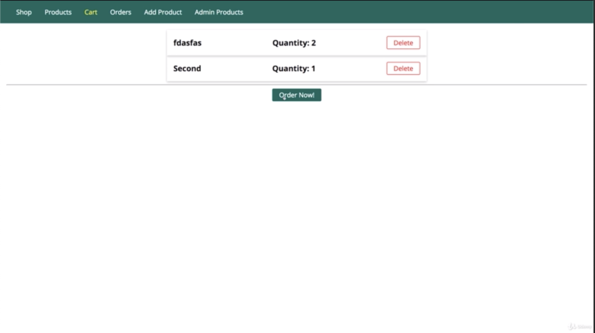

\* Chapter 146: What Is Sequelize
=================================


- this is long name which means it does all the heavy lifting, all the SQL code behind the scenes for us and maps it into javascript objects with convenience methods which we can call to execute that behind the scenes SQL code. so that we never have to write SQL code on our own.


- Sequelize offers us the models to work with our database. as i showed you on the last slide and it allows us to define such models. so basically define which data makes up a model and therefore which data will be saved in the database. 

- and then we can instantiate these models. so these classes, we can execute the constructor functions or use utility methods to create let’s say a new user object based on that model. so we have a connection 

- and we can then run queries on that. that could be that we save a new user, but it could also be that we find all users as an example. this always relate back to our model which we define with sequelize.

- and we can also associate our models. for example, we could associate our user model to a product model. 

\* Chapter 147: Connecting To The Database
==========================================

1\. update

- ./util/database.js


- we will do this by running ’npm install —save’ because this is also a production dependency, it’s core dependency of our project and then the name is sequelize.

- now important, sequelize needs that MySQL 2 package which we already installed. so this MySQL 2 package we installed in the last module needs to be installed. 

- the first step always is that we create a model with sequelize. and also that we connect to the database. now therefore the first step is that when i connect to MySQL database with the workbench which we also used in the last module already 


- and in there, i will go into my node complete database and delete the products table by right clicking on it, ‘drop table’ and then simply click 'drop now’. i do this because i now wanna use sequelize to manage my tables.

```js
const Sequelize = require('sequelize')

/** i will connect it to my database.
 * you see we have to configure it
 * with the database name -> 'node-complelte'
 * with a username to connect to it, -> 'root'
 * with a password. -> 'rldnjs12'
 * so my schema name which is 'node-complete'
 *
 * we can also pass a fourth argument, an option object
 * and in there you can see, for example, the 'dialect'
 * we can set this to MySQL to make it clear
 * that we connect to a MySQL database
 * because different SQL engine or databases use slightly different SQL syntax
 *
 * the one thing i wanna set for now is the 'host'
 * by default, it would use 'localhost'
 * so we don't need to set it.
 * but i will explicitly set this to 'localhost'
 * 
 * so we are creating a new sequelize object
 * and it will automatically connect to the database
 * then it will set up a connection pool just as we did it manually in the last lecture module.
 */
const sequelize = new Sequelize('node-complete', 'root', 'rldnjs12', {
    dialect: 'mysql', 
    host: 'localhost'
})

/**i can export my sequelize object
 * which is essentially that database connection pool however managed by sequelize giving us a lot of useful features
 * with that we got the connection setup
 */
module.exports = sequelize
```

\* Chapter 148: Defining A Model
================================

1\. update

- ./models/product.js

```js
//./models/product.js

/** i will require sequelize
 * and that will give me back a class or constructor function
 * hence i name this with a capital S
 */
const Sequelize = require('sequelize')

/** the next thing i will import is my database connection pool
 * managed by sequelize
 * i will also name this sequelize but with lowercase s
 * so i will import what i export in my ./util/database.js file.
 *
 * my database connection pool
 * which is more than a connection pool
 * it's a fully configured sequelize environment
 * which does also have the connection pool
 * but also all the features of the sequelize package.
 */
const sequelize = require('../util/database')

/**we can define a model that will be managed by sequelize
 *
 * we can define a new model by calling 'define()'
 * the first name is the model name
 * and the model name is typically a lowercase
 *
 * the second argument defines the structure of our model
 * and therefore also of the automatically created database table
 * this will be a javascript object
 * and in there, we simply define the attributes or fields our product should have,
 * for example i wanna have an ID
 * now an ID is then in turn defined with an object
 * where i configured this attribute
*/
const Product = sequelize.define('product', {
  id: {
    /**'type' is one of the types defined by the sequelize package
     * and i would choose 'INT(integer)'
     * because my ID will be number starting at 1
     * and then incrementing
     *
     * i also configured this attribute to auto-incrementing
     * by auto-increment to 'true'
     *
     * and i don't wanna allow this value to be empty
     * so i will 'allowNull' to false
     * because i don't wanna allowNull value in there.
     * 
     * and i will set 'primaryKey' to true 
     * to basically define this as the primaryKey of the table
     * which is an important concept in SQL database 
     * for retrieving the data and then also for later defining relations.
    */
    type: Sequelize.INTEGER,
    autoIncrement: true,
    allowNull: false,
    primaryKey: true
  },
  /** we can define a javascript object to configure it in detail
   * if you wanna set type,
   * you can use sequelize and then the type like below
   * 
   *    Sequelize.STRING
   */
  title: Sequelize.STRING,
  price: {
    type: Sequelize.DOUBLE,
    allowNull: false
  },
  imageUrl: {
    type: Sequelize.STRING,
    allowNull: false
  },
  description: {
    type: Sequelize.STRING,
    allowNull: false
  }
})
 /**with that, we made a huge step forward
  * and we can now starting using this product.
  */
module.exports = Product
```

\* Chapter 149: Syncing JS Definition To The Database
=====================================================

1\. update

- app.js


- if i now run ’npm start’, it starts up and we can see there is some log output.

- if you scroll up quite a bit because we got back a complex object, you see that this is a default log thrown by sequelize, it executed this SQL query for us without us writing this query. it created a table, if not exists ‘products’ yet which it named product, products and that is that automatically inferred name because we named our model product, it automatically pluralizes that and then it assigned a couple of fields which it configured according to our model definition. 

- and then this is the return value we get back, basically our sequelize object you can tell.


- and if you quit the server and restart, you will see it runs this again. but it does not overwrite the existing table because we have that if not exists check in there automatically. so we can run this again without issues and our server starts up even if this table already exists. 


- go to our database, and click on ‘refresh all’, we can see that under tables, we get a products table and if we inspect that with this icon, we see all the fields we defined and that is added by sequelize to new fields, created at and updated at. so it automatically manages some timestamps for us. 

- this is how we sync our tables to the database and what sequelize does for us.

```js
//app.js

const path = require('path');

const express = require('express');
const bodyParser = require('body-parser');

const errorController = require('./controllers/error');
const sequelize = require('./util/database');

const app = express();

app.set('view engine', 'ejs');
app.set('views', 'views');

const adminRoutes = require('./routes/admin');

const shopRoutes = require('./routes/shop');

app.use(bodyParser.urlencoded({ extended: false }));
app.use(express.static(path.join(__dirname, 'public')));

app.use('/admin', adminRoutes);
app.use(shopRoutes);

app.use(errorController.get404);

/**there's a special method.
 * the 'sync' method
 * 
 * The 'sync' method has a look at all the models you defined.
 * and keep in mind that you defined your models in your ./models/product.js files 
 * by calling 'sequelize' defined on that same sequelize object.
 * 
 * so it is aware of all your models
 * and it then basically creates tables for them.
 * it syncs your models to the database
 * by creating the appropriate tables. 
 * and if you have them, relations.
 */
sequelize.sync().then(result => {
    //console.log(result)
    app.listen(3000);
})
.catch(err => {
    console.log(err)
})
```

\* Chapter 150: Inserting Data & Creating A Product
===================================================

1\. update

- ./controllers/admin.js


- if i click ‘Add Product’, we go back to node.js, this seems to have succeeded because we see the SQL statement it executed.


- i got an error before that. that was when i tried to reach the the page listing all the products where we failed to call ‘fetchAll’ because that is not provided by sequelize.

- but thereafter once i was in the right page, ‘INSERT INTO’ this was executed. you see it also executed the syntax where it escapes the values automatically as we did in the last module 


- and in the return value, this is looking good. it looks like it did create this book 


- and we can prove that by going to our products table and refresh this and we should see our book being added there, so this indeed succeeded.

```js
// ./controllers/admin.js

const Product = require('../models/product');

exports.getAddProduct = (req, res, next) => {
  res.render('admin/edit-product', {
    pageTitle: 'Add Product',
    path: '/admin/add-product',
    editing: false
  });
};

exports.postAddProduct = (req, res, next) => {
  const title = req.body.title;
  const imageUrl = req.body.imageUrl;
  const price = req.body.price;
  const description = req.body.description;
  /**i will now create a new Product
   * by calling one of the methods provided by sequelize
   * and we got 'create' for example.
   * 'create' creates a new element based on that model
   * and immediately save it to the database.
   * there's also 'build' which creates a new object
   * based on the model
   * but only in javascript
   * and then we need to save it manually
   * 
   * 'create()' take some arguments
   * that we need to pass per our model definition
   * so i can pass in a javascript object
   */
  Product.create({
    /**i don't need to assign an ID
     * that will be managed automatically
     * 
     * this will be immediately saved into database.
     */
    title: title,
    price: price,
    imageUrl: imageUrl,
    description: description
  })
    .then(result => {
      //console.log(result)
      console.log('Cfreated Product')
    })
    .catch(err => {
    console.log(err)
  })
};

exports.getEditProduct = (req, res, next) => {
  const editMode = req.query.edit;
  if (!editMode) {
    return res.redirect('/');
  }
  const prodId = req.params.productId;
  Product.findById(prodId, product => {
    if (!product) {
      return res.redirect('/');
    }
    res.render('admin/edit-product', {
      pageTitle: 'Edit Product',
      path: '/admin/edit-product',
      editing: editMode,
      product: product
    });
  });
};

exports.postEditProduct = (req, res, next) => {
  const prodId = req.body.productId;
  const updatedTitle = req.body.title;
  const updatedPrice = req.body.price;
  const updatedImageUrl = req.body.imageUrl;
  const updatedDesc = req.body.description;
  const updatedProduct = new Product(
    prodId,
    updatedTitle,
    updatedImageUrl,
    updatedDesc,
    updatedPrice
  );
  updatedProduct.save();
  res.redirect('/admin/products');
};

exports.getProducts = (req, res, next) => {
  Product.fetchAll(products => {
    res.render('admin/products', {
      prods: products,
      pageTitle: 'Admin Products',
      path: '/admin/products'
    });
  });
};

exports.postDeleteProduct = (req, res, next) => {
  const prodId = req.body.productId;
  Product.deleteById(prodId);
  res.redirect('/admin/products');
};

```

\* Chapter 151: MUST READ: findById() in Sequelize 5
====================================================

- With Sequelize v5, ‘findById()’ (which we will use in this course) was replaced by ‘findByPk()’

- You use it in the same way, so you can simply replace all occurrences of ‘findById()’ with ‘findByPk()’

\* Chapter 152: Retrieving Data & Finding Products
==================================================

1\. update

- ./controllers/shop.js



- it retrieves the data. and the data still has the same field names as before and therefore rendering this automatically works. 


```js
//./controllers/shop.js

const Product = require('../models/product');
const Cart = require('../models/cart');

exports.getProducts = (req, res, next) => {

  Product.findAll()
    .then(products => {
      res.render('shop/product-list', {
        prods: products,
        pageTitle: 'All Products',
        path: '/products'
      });
    })
    .catch(err => {
      console.log(err)
    })
}

exports.getProduct = (req, res, next) => {
  const prodId = req.params.productId;
  Product.findById(prodId)
    .then(([product]) => {
      res.render('shop/product-detail', {
        product: product[0],
        pageTitle: product.title,
        path: '/products'
      });
    })
    .catch(err => console.log(err));
};

exports.getIndex = (req, res, next) => {
  /**sequelize models have plenty of methods for getting data
   * and instead of 'fetchAll()',
   * they, for example, have 'findAll()' to get all the records for this model.
   * 'findAll()' also gives us back a promise where we can use the result.
   *
   * we can pass our options
   * and we could define a 'where' condition
   * to also restrict the kind of data we trieve
   *
   * in the 'then()' block,
   * we should have our products
   *
   */
  Product.findAll()
    .then(products => {
      res.render('shop/index', {
        prods: products,
        pageTitle: 'Shop',
        path: '/'
      });
    })
    .catch(err => {
      console.log(err)
    })
};

exports.getCart = (req, res, next) => {
  Cart.getCart(cart => {
    Product.fetchAll(products => {
      const cartProducts = [];
      for (product of products) {
        const cartProductData = cart.products.find(
          prod => prod.id === product.id
        );
        if (cartProductData) {
          cartProducts.push({ productData: product, qty: cartProductData.qty });
        }
      }
      res.render('shop/cart', {
        path: '/cart',
        pageTitle: 'Your Cart',
        products: cartProducts
      });
    });
  });
};

exports.postCart = (req, res, next) => {
  const prodId = req.body.productId;
  Product.findById(prodId, product => {
    Cart.addProduct(prodId, product.price);
  });
  res.redirect('/cart');
};

exports.postCartDeleteProduct = (req, res, next) => {
  const prodId = req.body.productId;
  Product.findById(prodId, product => {
    Cart.deleteProduct(prodId, product.price);
    res.redirect('/cart');
  });
};

exports.getOrders = (req, res, next) => {
  res.render('shop/orders', {
    path: '/orders',
    pageTitle: 'Your Orders'
  });
};

exports.getCheckout = (req, res, next) => {
  res.render('shop/checkout', {
    path: '/checkout',
    pageTitle: 'Checkout'
  });
};
```

\* Chapter 153: Getting A Single Product With The ‘Where’ Condition
===================================================================

1\. update

- ./controllers/shop.js

- ./views/shop/product-detail.ejs

- ./public/css/main.css


- if we save that and let it restart therefore, now we can reload this page and it works as before. but now we are using 'findAll()’ and ‘where’ query. i simply wanted to show you alternative approach. 


- it’s perfectly fine and even preferrable in this case to use ‘findById()’. 

- so i will actually switch back to that other approach. it’s good to know how you can query though.

```js
//./controllers/shop.js

const Product = require('../models/product');
const Cart = require('../models/cart');

exports.getProducts = (req, res, next) => {
  Product.findAll()
    .then(products => {
      res.render('shop/product-list', {
        prods: products,
        pageTitle: 'All Products',
        path: '/products'
      });
    })
    .catch(err => {
      console.log(err)
    })
}

exports.getProduct = (req, res, next) => {
  const prodId = req.params.productId;
  /**we only have one product with that ID
   * but i wanna show you that 'where' syntax
   * so any object we can pass to 'findAll()'
   * 
   * and there you got a rich query language
   * or rich amount of options you can use to configure this
   * 
   * the one important thing is by default 'findAll({where: {id: prodId}})' gives us an array
   * because even though we know that only one product will have this ID,
   * 'findAll()' per definition always gives you multiple items
   * even if it's an array with only one element.
   */
//  Product.findAll({where: {id: prodId}})
//    .then(products => {
//      res.render('shop/product-detail', {
//        product: products[0],
//        pageTitle: products[0].title,
//        path: '/products'
//      });
//    })
//    .catch(err => console.log(err));
  Product.findById(prodId)
    .then(product => {
      res.render('shop/product-detail', {
        product: product,
        pageTitle: product.title,
        path: '/products'
      });
    })
    .catch(err => console.log(err));
};

exports.getIndex = (req, res, next) => {
  Product.findAll()
    .then(products => {
      res.render('shop/index', {
        prods: products,
        pageTitle: 'Shop',
        path: '/'
      });
    })
    .catch(err => {
      console.log(err)
    })
};

exports.getCart = (req, res, next) => {
  Cart.getCart(cart => {
    Product.fetchAll(products => {
      const cartProducts = [];
      for (product of products) {
        const cartProductData = cart.products.find(
          prod => prod.id === product.id
        );
        if (cartProductData) {
          cartProducts.push({ productData: product, qty: cartProductData.qty });
        }
      }
      res.render('shop/cart', {
        path: '/cart',
        pageTitle: 'Your Cart',
        products: cartProducts
      });
    });
  });
};

exports.postCart = (req, res, next) => {
  const prodId = req.body.productId;
  Product.findById(prodId, product => {
    Cart.addProduct(prodId, product.price);
  });
  res.redirect('/cart');
};

exports.postCartDeleteProduct = (req, res, next) => {
  const prodId = req.body.productId;
  Product.findById(prodId, product => {
    Cart.deleteProduct(prodId, product.price);
    res.redirect('/cart');
  });
};

exports.getOrders = (req, res, next) => {
  res.render('shop/orders', {
    path: '/orders',
    pageTitle: 'Your Orders'
  });
};

exports.getCheckout = (req, res, next) => {
  res.render('shop/checkout', {
    path: '/checkout',
    pageTitle: 'Checkout'
  });
};
```

```js
<!--./views/shop/product-detail.ejs-->

<%- include('../includes/head.ejs') %>
    </head>

    <body>
        <%- include('../includes/navigation.ejs') %>
        <main class="centered">
            <h1><%= product.title %></h1>
            <hr>
            <div class="image">
                " alt="<%= product.title %>">
            </div>
            <h2><%= product.price %></h2>
            <p><%= product.description %></p>
            <%- include('../includes/add-to-cart.ejs') %>        </main>
        <%- include('../includes/end.ejs') %>
```

```js
/*./public/css/main.css*/

@import url('https://fonts.googleapis.com/css?family=Open+Sans:400,700');

* {
  box-sizing: border-box;
}

body {
  padding: 0;
  margin: 0;
  font-family: 'Open Sans', sans-serif;
}

main {
  padding: 1rem;
  margin: auto;
}

form {
  display: inline;
}

.centered {
  text-align: center;
}

.image {
  height: 20rem;
}

.image img {
  height: 100%;
}

.main-header {
  width: 100%;
  height: 3.5rem;
  background-color: #00695c;
  padding: 0 1.5rem;
  display: flex;
  align-items: center;
}

.main-header__nav {
  height: 100%;
  display: none;
  align-items: center;
}

.main-header__item-list {
  list-style: none;
  margin: 0;
  padding: 0;
  display: flex;
}

.main-header__item {
  margin: 0 1rem;
  padding: 0;
}

.main-header__item a {
  text-decoration: none;
  color: white;
}

.main-header__item a:hover,
.main-header__item a:active,
.main-header__item a.active {
  color: #ffeb3b;
}

.mobile-nav {
  width: 30rem;
  height: 100vh;
  max-width: 90%;
  position: fixed;
  left: 0;
  top: 0;
  background: white;
  z-index: 10;
  padding: 2rem 1rem 1rem 2rem;
  transform: translateX(-100%);
  transition: transform 0.3s ease-out;
}

.mobile-nav.open {
  transform: translateX(0);
}

.mobile-nav__item-list {
  list-style: none;
  display: flex;
  flex-direction: column;
  margin: 0;
  padding: 0;
}

.mobile-nav__item {
  margin: 1rem;
  padding: 0;
}

.mobile-nav__item a {
  text-decoration: none;
  color: black;
  font-size: 1.5rem;
  padding: 0.5rem 2rem;
}

.mobile-nav__item a:active,
.mobile-nav__item a:hover,
.mobile-nav__item a.active {
  background: #00695c;
  color: white;
  border-radius: 3px;
}

#side-menu-toggle {
  border: 1px solid white;
  font: inherit;
  padding: 0.5rem;
  display: block;
  background: transparent;
  color: white;
  cursor: pointer;
}

#side-menu-toggle:focus {
  outline: none;
}

#side-menu-toggle:active,
#side-menu-toggle:hover {
  color: #ffeb3b;
  border-color: #ffeb3b;
}

.backdrop {
  position: fixed;
  top: 0;
  left: 0;
  width: 100%;
  height: 100vh;
  background: rgba(0, 0, 0, 0.5);
  z-index: 5;
  display: none;
}

.grid {
  display: flex;
  flex-wrap: wrap;
  justify-content: space-around;
  align-items: stretch;
}

.card {
  box-shadow: 0 2px 8px rgba(0, 0, 0, 0.26);
}

.card__header,
.card__content {
  padding: 1rem;
}

.card__header h1,
.card__content h1,
.card__content h2,
.card__content p {
  margin: 0;
}

.card__image {
  width: 100%;
}

.card__image img {
  width: 100%;
}

.card__actions {
  padding: 1rem;
  text-align: center;
}

.card__actions button,
.card__actions a {
  margin: 0 0.25rem;
}

.btn {
  display: inline-block;
  padding: 0.25rem 1rem;
  text-decoration: none;
  font: inherit;
  border: 1px solid #00695c;
  color: #00695c;
  background: white;
  border-radius: 3px;
  cursor: pointer;
}

.btn:hover,
.btn:active {
  background-color: #00695c;
  color: white;
}

@media (min-width: 768px) {
  .main-header__nav {
    display: flex;
  }

  #side-menu-toggle {
    display: none;
  }
}

```

\* Chapter 154: Fetching Admin Products
=======================================

1\. update

- ./controllers/admin.js


```js
// ./controllers/admin.js

const Product = require('../models/product');

exports.getAddProduct = (req, res, next) => {
  res.render('admin/edit-product', {
    pageTitle: 'Add Product',
    path: '/admin/add-product',
    editing: false
  });
};

exports.postAddProduct = (req, res, next) => {
  const title = req.body.title;
  const imageUrl = req.body.imageUrl;
  const price = req.body.price;
  const description = req.body.description;
  Product.create({
    title: title,
    price: price,
    imageUrl: imageUrl,
    description: description
  })
    .then(result => {
      //console.log(result)
      console.log('Cfreated Product')
    })
    .catch(err => {
    console.log(err)
  })
};

exports.getEditProduct = (req, res, next) => {
  const editMode = req.query.edit;
  if (!editMode) {
    return res.redirect('/');
  }
  const prodId = req.params.productId;
  Product.findById(prodId, product => {
    if (!product) {
      return res.redirect('/');
    }
    res.render('admin/edit-product', {
      pageTitle: 'Edit Product',
      path: '/admin/edit-product',
      editing: editMode,
      product: product
    });
  });
};

exports.postEditProduct = (req, res, next) => {
  const prodId = req.body.productId;
  const updatedTitle = req.body.title;
  const updatedPrice = req.body.price;
  const updatedImageUrl = req.body.imageUrl;
  const updatedDesc = req.body.description;
  const updatedProduct = new Product(
    prodId,
    updatedTitle,
    updatedImageUrl,
    updatedDesc,
    updatedPrice
  );
  updatedProduct.save();
  res.redirect('/admin/products');
};

exports.getProducts = (req, res, next) => {
  Product.findAll()
    .then(products => {
      res.render('admin/products', {
        prods: products,
        pageTitle: 'Admin Products',
        path: '/admin/products'
      })
    })
    .catch(err => console.log(err))
};

exports.postDeleteProduct = (req, res, next) => {
  const prodId = req.body.productId;
  Product.deleteById(prodId);
  res.redirect('/admin/products');
};

```

\* Chapter 155: Updating Products
=================================

1\. update

- ./controllers/admin.js


- if i reload this page, this is looking good. the fields get populated with our values. 

- we just need to make sure that if we do change something and we save it, this does get saved to the datbase correctly. for that, we have to have a look at ‘postEditProduct’ which gets called once we submit this page.


- if we click ‘updated product’, we get redirected to the products page. and we can see the updated thing.


- and we also can see that change in here.


```js
// ./controllers/admin.js

const Product = require('../models/product');

exports.getAddProduct = (req, res, next) => {
  res.render('admin/edit-product', {
    pageTitle: 'Add Product',
    path: '/admin/add-product',
    editing: false
  });
};

exports.postAddProduct = (req, res, next) => {
  const title = req.body.title;
  const imageUrl = req.body.imageUrl;
  const price = req.body.price;
  const description = req.body.description;
  Product.create({
    title: title,
    price: price,
    imageUrl: imageUrl,
    description: description
  })
    .then(result => {
      // console.log(result);
      console.log('Created Product');
    })
    .catch(err => {
      console.log(err);
    });
};

exports.getEditProduct = (req, res, next) => {
  const editMode = req.query.edit;
  if (!editMode) {
    return res.redirect('/');
  }
  const prodId = req.params.productId;
  /**With Sequelize v5, ‘findById()’ (which we will use in this course) was replaced by ‘findByPk()’
   * You use it in the same way, so you can simply replace all occurrences of ‘findById()’ with ‘findByPk()’ 
   * */
  Product.findByPk(prodId)
    .then(product => {
      if (!product) {
        return res.redirect('/');
      }
      res.render('admin/edit-product', {
        pageTitle: 'Edit Product',
        path: '/admin/edit-product',
        editing: editMode,
        product: product
      });
    })
    .catch(err => console.log(err));
};

exports.postEditProduct = (req, res, next) => {
  const prodId = req.body.productId;
  const updatedTitle = req.body.title;
  const updatedPrice = req.body.price;
  const updatedImageUrl = req.body.imageUrl;
  const updatedDesc = req.body.description;
  /**let's handle any error by logging them for now
   * and in then, let's work with the product we retrieved
   * that product now needs to be updated
   *
   * we can simply do that by saying 'product.title = updatedTitle'
   * so we can work with all the attributes our product has per our model definition and change them
   * note that this will not directly change the data in the database,
   * it will only do it locally in our app in our javascript app for the moment.
   *
   */
  Product.findByPk(prodId)
    .then(product => {
      product.title = updatedTitle;
      product.price = updatedPrice;
      product.description = updatedDesc;
      product.imageUrl = updatedImageUrl;
      /**as i said, this will not directly edit it in the database
       * to do that, we have to call 'product.save()'
       * this is another method provided by sequelize
       * those takes the product as we edit it and save it back to the database.
       *
       * if the product doesn't exist yet,
       * it will create a new one,
       * if it does as this one,
       * then it will overwrite or update the old one with our new values.
       * 
       * we can again chain then and catch
       * but to not start nesting our promises 
       * which would yield the same ugly picture as nesting callbacks,
       * we can 'return' this,
       * so we return the promise which is returned by 'save()'
       * and we can add 'then()' block below.
       */
      return product.save();
    })
    .then(result => {
      console.log('UPDATED PRODUCT!');
      res.redirect('/admin/products');
    })
    /**this 'catch()' block would catch errors both for this first '.then()' and second '.then()' 
     * the second 'then()' block will handle any success response from this 'save()' promise
     * 
    */
    .catch(err => console.log(err));
};

exports.getProducts = (req, res, next) => {
  Product.findAll()
    .then(products => {
      res.render('admin/products', {
        prods: products,
        pageTitle: 'Admin Products',
        path: '/admin/products'
      });
    })
    .catch(err => console.log(err));
};

exports.postDeleteProduct = (req, res, next) => {
  const prodId = req.body.productId;
  Product.deleteById(prodId);
  res.redirect('/admin/products');
};

```

\* Chapter 156: Deleting Products
=================================

1\. update

- ./controllers/admin.js


- if we go to ‘Admin Products’ and click ‘Delete’, this works

```js
// ./controllers/admin.js

const Product = require('../models/product');

exports.getAddProduct = (req, res, next) => {
  res.render('admin/edit-product', {
    pageTitle: 'Add Product',
    path: '/admin/add-product',
    editing: false
  });
};

exports.postAddProduct = (req, res, next) => {
  const title = req.body.title;
  const imageUrl = req.body.imageUrl;
  const price = req.body.price;
  const description = req.body.description;
  Product.create({
    title: title,
    price: price,
    imageUrl: imageUrl,
    description: description
  })
    .then(result => {
      // console.log(result);
      console.log('Created Product');
      res.redirect('/admin/products')
    })
    .catch(err => {
      console.log(err);
    });
};

exports.getEditProduct = (req, res, next) => {
  const editMode = req.query.edit;
  if (!editMode) {
    return res.redirect('/');
  }
  const prodId = req.params.productId;
  Product.findByPk(prodId)
    .then(product => {
      if (!product) {
        return res.redirect('/');
      }
      res.render('admin/edit-product', {
        pageTitle: 'Edit Product',
        path: '/admin/edit-product',
        editing: editMode,
        product: product
      });
    })
    .catch(err => console.log(err));
};

exports.postEditProduct = (req, res, next) => {
  const prodId = req.body.productId;
  const updatedTitle = req.body.title;
  const updatedPrice = req.body.price;
  const updatedImageUrl = req.body.imageUrl;
  const updatedDesc = req.body.description;
  Product.findByPk(prodId)
    .then(product => {
      product.title = updatedTitle;
      product.price = updatedPrice;
      product.description = updatedDesc;
      product.imageUrl = updatedImageUrl;
      return product.save();
    })
    .then(result => {
      console.log('UPDATED PRODUCT!');
      res.redirect('/admin/products');
    })
    .catch(err => console.log(err));
};

exports.getProducts = (req, res, next) => {
  Product.findAll()
    .then(products => {
      res.render('admin/products', {
        prods: products,
        pageTitle: 'Admin Products',
        path: '/admin/products'
      });
    })
    .catch(err => console.log(err));
};

exports.postDeleteProduct = (req, res, next) => {
  const prodId = req.body.productId;
  /**'deleteById' doesn't exist in a sequelize
   * instead on the product, we can call 'destroy'
   * and 'destroy' allows us to destroy any product we find through our options
   * and these options, for example, allow us to add a 'where' condition to narrow down which product to delete
   * 
   * we can use different approach
   * instead of calling destroy like this
   * and adding a condition which product to find which is fine
   * we can use 'findById' again to find a product by that ID
  */
  Product.findById(prodId)
    .then(product => {
      /**we can 'return' this
       * because this will also yield a promise 
       * and therefore add another 'then()' block
       * which will execute once the destruction succeeded
       */
      return product.destroy()
    })
    .then(result => {
      /**we should redirect to make sure we only redirect once the deletion succeeded. */
      console.log('DESTROYED PRODUCT')
      res.redirect('/admin/products');
    })
    .catch(err => console.log(err))
};

```

\* Chapter 157: Creating A User Model
=====================================

1\. update

- ./models/user.js

```js
//./models/user.js

/**we have no real authentication process,
 * so we will only work with one dummy user
 * who doesn't really have to log in.
 *
 * i wanna show you how you could have a user
 * who did create a product and who therefore is connected to that product
 * and at the same time, a user should own a cart
 * and that cart will hold multiple products
 * and this is how we can then overall connect everything.
 */

 /**first of all, requiring the sequelize constructor or class
  * and then also with lowercase s
  */
const Sequelize = require('sequelize')

const sequelize = require('../util/database')

const User = sequelize.define('user', {
    id: {
        type: Sequelize.INTEGER,
        autoIncrement: true,
        allowNull: false,
        primaryKey: true
    },
    name: Sequelize.STRING,
    email: Sequelize.STRING
})

module.exports = User
```

\* Chapter 158: Adding A One-To-Many Relationship
=================================================

1\. update

- app.js


- after restarting, we see a couple of statement were executed. 

- first of all, it dropped any existing tables 


- and then it created a new table, ‘users’ with all the setup


- and then it also creates a new products table 


- and beside adding all the fields there, it also defined that there is a new field, the user id fields which is an INTEGER and which is a FOREIGN KEY that references the ID field in the users table.

- and that ‘ON DELETE’, it should ‘CASCADE’ and ‘ON UPDATE CASCADE’ is the default.

- so this is some meta setup in the database which sequelize now also added to connect our tables


- if we go to workbench and we right click on our database and set call ‘refresh All’, we see there 2 tables now.

- if we inspect products, we see that our product is gone because it recreated the table. 

- but now besides createdAt, updatedAt that werer added by sequelize

- there is a userId field which was also added by sequelize and this will automatically be populated by sequelize once we create products that are related to a user.

- let’s make sure we have a user because that table is empty and that we then can connect users and products in our app.

```js
//app.js

const path = require('path');

const express = require('express');
const bodyParser = require('body-parser');

const errorController = require('./controllers/error');
const sequelize = require('./util/database');
const Product = require('./models/product')
const User = require('./models/user')

const app = express();

app.set('view engine', 'ejs');
app.set('views', 'views');

const adminRoutes = require('./routes/admin');

const shopRoutes = require('./routes/shop');

app.use(bodyParser.urlencoded({ extended: false }));
app.use(express.static(path.join(__dirname, 'public')));

app.use('/admin', adminRoutes);
app.use(shopRoutes);

app.use(errorController.get404);

/**with the 2 models('Product', 'User'),
 * we can relate them and i will relate them in the same place where i sequelize
 * but before i sync it.
 */

 /**we can also configure this by passing a second argument which is optional
  * we can define how this relationship would be managed
  * and very important, we can define so-called constraints
  * 
  * and for example, 'onDelete'
  * so if a user is deleted, what should happen to any connected products?
  * and here we can say 'CASCADE' which means the deletion would then also be executed for the product
  * so if we delete a User, any price related to User would be gone
  */

 Product.belongsTo(User, {constraint: true, onDelete: 'CASCADE'})
 /**you can also define the inverse
  * and say that one User has many products
  * because one user can add more than one product to the shop
  * 
  * this is optional, you don't need that.
  * you can replace 'belongsTo' with a 'hasMany' call
  * but here i also like to define both directions to really make it clear how this relation works.
  */
 User.hasMany(Product)

 /**sequelize sync will not just create tables for our models
  * but also define the relation in our database as we define them.
  * 
  * The one problem is that we already created the products table
  * and therefore will not override it with the new information
  * and we can ensure that it will by setting 'force' to true
  * a setting you wouldn't use in production
  * because you don't always wanna overwrite your tables all the time.
  */
sequelize
    .sync({force: true})
    .then(result => {
    //console.log(result)
    app.listen(3000);
})
.catch(err => {
    console.log(err)
})
```

\* Chapter 159: Creating & Managing A Dummy User
================================================

1\. update

- app.js


- here’s my user creation result that i get back


- if i go back to my workbench database and i refresh the user’s table, we see the user here

- if i do restart my server with ’npm start’ and that still works and it doesn’t create a new user because we already have one.

```js
//app.js

const path = require('path');

const express = require('express');
const bodyParser = require('body-parser');

const errorController = require('./controllers/error');
const sequelize = require('./util/database');
const Product = require('./models/product')
const User = require('./models/user')

const app = express();

app.set('view engine', 'ejs');
app.set('views', 'views');

const adminRoutes = require('./routes/admin');

const shopRoutes = require('./routes/shop');

app.use(bodyParser.urlencoded({ extended: false }));
app.use(express.static(path.join(__dirname, 'public')));

/**i will register a new middleware
 * because i wanna store that user in my request
 * so that i can use it from anywhere in my app conveniently
 */
app.use((req, res, next) => {
    /**i wanna reach out to my database
     * and retrieve my user with 'User.findById(1)'
     *
     * 'app.use()' only register a middleware
     * so for incoming request, we will then execute this function
     *
     * 'npm start' runs this code for the first time
     * and 'npm start' is what runs sequelize, not incoming request.
     * incoming requests are only funneled through our middleware
     * so 'npm start' starts runs below which sets up our database
     * but never this anonymous function which just register it as middleware for incoming request.
     *
     *      sequelize
                .sync()
                .then(result => {
                    return User.findByPk(1)
                })
                .then(user => {
                    if(!user){
                        return User.create({ name: 'Max', email: 'test@test.com'})
                    }
                    return user
                })
                .then(user => {
                    app.listen(3000)
                })
                .catch(err => {
                    console.log(err)
                })
     * 
     */

     /**so 'User.findById(1)' will only run for incoming requests
      * which, on the other hand, can only reach this
      * if we did successfully start our server with 'app.listen(3000)'
      * and that in turn is only true
      * if we are done with our initialization code here.
      * 
      * so we are guaranteed to find a user
      */
    User.findById(1)
        .then(user => {
            /**i wanna store it in a request.
             * we can add a new field to our request object
             * we should make sure we don't overwrite an existing one like body
             * 
             * but 'user' is undefined by default
             * now i'm storing the user i retrieved from the database in there.
             * 
             * keep in mind that the user we are retrieving from the database is not just a javascript object with values stored in a database.
             * it's sequelize object with the value stored in the database
             * and with all these utility methods sequelize added, like destroy,
             * so we are storing this sequelize object here in the request
             * and not just a javascript object with the field values
             * 
             * so whenever we call 'req.user' in the future in our app,
             * we can also execute method like 'destroy'
             */
            req.user = user
            /**call 'next()' so that we can continue with the next step
             * if we get our user and stored it.
             */
            next()
        })
        .catch(err => console.log(err))
})

app.use('/admin', adminRoutes);
app.use(shopRoutes);

app.use(errorController.get404);

Product.belongsTo(User, {constraint: true, onDelete: 'CASCADE'})
User.hasMany(Product)

sequelize
    //.sync({force: true})
    .sync()
    .then(result => {
        /**i will use my User model
         * and first of all, check if i find a user with the ID 1
         * and this is just some dummy code to see if i do have 1 User
         * because i only need 1 for now as we have no authentication
         * if i do have it, i will not create a new one,
         * if i don't have it, i will.
         */
        return User.findByPk(1)
        //console.log(result)
    })
    .then(user => {
        if(!user){
            return User.create({ name: 'Max', email: 'test@test.com' })
        }
        /**now we are inconsistent
         * because now this anonymous function either returns a promise or just an object
         * we should always return the same
         * so that we can chain then here successfully
         *
         * and therefore i will call 'Promise.resolve' which is essentially a promise
         * that will immediately resolve to user
         *
         * technically you can omit 'Promise.resolve()'
         * because if you return a value like 'return user' in a 'then()' block,
         * it is automatically wrapped into a new promise
         * just wanted to highlight that you should make sure that the value are equal
         */
        return user
    })
    .then(user => {
        //console.log(user)
        app.listen(3000);
    })
    .catch(err => {
        console.log(err)
    })

```

\* Chapter 160: Using Magic Association Methods
===============================================





- no error here. 


- if we look into our products table by clicking on this icon here, we have the user ID stored here.


- we see we also get the ‘userId’ even though we didn’t set it explicitly.

- this is done by sequelize with this magic way of connecting it.

```js
//app.js

const path = require('path');

const express = require('express');
const bodyParser = require('body-parser');

const errorController = require('./controllers/error');
const sequelize = require('./util/database');
const Product = require('./models/product')
const User = require('./models/user')

const app = express();

app.set('view engine', 'ejs');
app.set('views', 'views');

const adminRoutes = require('./routes/admin');

const shopRoutes = require('./routes/shop');

app.use(bodyParser.urlencoded({ extended: false }));
app.use(express.static(path.join(__dirname, 'public')));

app.use((req, res, next) => {
/**from now on, all new products that are created should be associated to the currently logged in user
 * and for now, this below will only be this one dummy user
 * 
 *      User. findById(1)
 *          .then(user => {
 *              req.user = user
 *              next()
 *          })
 *          .catch(err => console.log(err))
 *      })
 * 
 * that means if i'm in the ./controllers/admin.js,
 * when we create a new product in 'postAddProduct',
 * we will not create the product like this anymore
 */
    User.findById(1)
        .then(user => {
            req.user = user
            next()
        })
        .catch(err => console.log(err))
})

app.use('/admin', adminRoutes);
app.use(shopRoutes);

app.use(errorController.get404);

Product.belongsTo(User, {constraint: true, onDelete: 'CASCADE'})
User.hasMany(Product)

sequelize
    //.sync({force: true})
    .sync()
    .then(result => {
        return User.findByPk(1)
        //console.log(result)
    })
    .then(user => {
        if(!user){
            return User.create({ name: 'Max', email: 'test@test.com' })
        }
        return user
    })
    .then(user => {
        //console.log(user)
        app.listen(3000);
    })
    .catch(err => {
        console.log(err)
    })

```

```js
// ./controllers/admin.js

const Product = require('../models/product');

exports.getAddProduct = (req, res, next) => {
  res.render('admin/edit-product', {
    pageTitle: 'Add Product',
    path: '/admin/add-product',
    editing: false
  });
};

/** that means if i'm in the ./controllers/admin.js,
 * when we create a new product in 'postAddProduct',
 * we will not create the product like this anymore 
 * we need to pass in extra information regarding our user that is associated.
 * 
 * one way of doing this is that we set this new user id field we got
 * the user ID was added as a database field
 * because we now have a relation set up
 * and we set this to req.user.id
 * 
 * keep in mind that req.user is the sequelize user object
 * which holds both the database data for that user as well as helper methods
 * 
 * this should create new products with that user being associated to it.*/
exports.postAddProduct = (req, res, next) => {
  const title = req.body.title;
  const imageUrl = req.body.imageUrl;
  const price = req.body.price;
  const description = req.body.description;
  /** we have another cool feature of sequelize,
   * we can use our user object as it's stored in the request
   * 
   * keep inmind that this is a sequelize object with all the magic features
   * and there we will actually have 'req.user.createProduct()' method
   * 
   * sequelize add special methods depending on the association you added
   * and for 'Belongs-To' has Many association as we did,
   * sequelize adds methods that allows us, for example, to create a new associated object
   * so since a user has many products or a product belongs to a user as the setup in app.js,
   * since we have that relation defined like below
   * 
   *    Product.belongsTo(User, { constraints: true, onDelete: 'CASCADE' })
   *    User.hasMany(Product)
   * 
   * sequelize automatically adds a createProduct() method to the user
   * 'createProduct()' because our model is named product
   * and create is then automatically added at the beginning of the method name.
   * that is by sequelize.
   */

   /** the rest doesn't change
    * but this now automatically creates a connected model.
    */
  req.user.createProduct({
    title: title,
    price: price,
    imageUrl: imageUrl,
    description: description
  })
  .then(result => {
    // console.log(result);
    console.log('Created Product');
    res.redirect('/admin/products')
  })
  .catch(err => {
    console.log(err);
  });
};

exports.getEditProduct = (req, res, next) => {
  const editMode = req.query.edit;
  if (!editMode) {
    return res.redirect('/');
  }
  const prodId = req.params.productId;
  Product.findByPk(prodId)
    .then(product => {
      if (!product) {
        return res.redirect('/');
      }
      res.render('admin/edit-product', {
        pageTitle: 'Edit Product',
        path: '/admin/edit-product',
        editing: editMode,
        product: product
      });
    })
    .catch(err => console.log(err));
};

exports.postEditProduct = (req, res, next) => {
  const prodId = req.body.productId;
  const updatedTitle = req.body.title;
  const updatedPrice = req.body.price;
  const updatedImageUrl = req.body.imageUrl;
  const updatedDesc = req.body.description;
  Product.findByPk(prodId)
    .then(product => {
      product.title = updatedTitle;
      product.price = updatedPrice;
      product.description = updatedDesc;
      product.imageUrl = updatedImageUrl;
      return product.save();
    })
    .then(result => {
      console.log('UPDATED PRODUCT!');
      res.redirect('/admin/products');
    })
    .catch(err => console.log(err));
};

exports.getProducts = (req, res, next) => {
  Product.findAll()
    .then(products => {
      res.render('admin/products', {
        prods: products,
        pageTitle: 'Admin Products',
        path: '/admin/products'
      });
    })
    .catch(err => console.log(err));
};

exports.postDeleteProduct = (req, res, next) => {
  const prodId = req.body.productId;
  Product.findById(prodId)
    .then(product => {
      return product.destroy()
    })
    .then(result => {
      console.log('DESTROYED PRODUCT')
      res.redirect('/admin/products');
    })
    .catch(err => console.log(err))
};

```

\* Chapter 161: Fetching Related Products
=========================================

1\. update

- ./controllers/admin.js


- we see the SQL statement here where it looks for a product with the userId = 1 that is not the condition we wrote, we are responsible for this part(‘product’, ‘id’ = ‘1') where it then also narrows down the product id.

- but user id = 1 was added by sequelize because we use ‘getProducts’ on the user

- keep in mind we get back an array even if it only holds one element. so we got products and therefore we know that one product, the one we are interested in will always be the first element. so we have to store that separately in a new constant.


- so if we reload, this works


```js
// ./controllers/admin.js

const Product = require('../models/product');

exports.getAddProduct = (req, res, next) => {
  res.render('admin/edit-product', {
    pageTitle: 'Add Product',
    path: '/admin/add-product',
    editing: false
  });
};

exports.postAddProduct = (req, res, next) => {
  const title = req.body.title;
  const imageUrl = req.body.imageUrl;
  const price = req.body.price;
  const description = req.body.description;
  req.user.createProduct({
    title: title,
    price: price,
    imageUrl: imageUrl,
    description: description
  })
  .then(result => {
    // console.log(result);
    console.log('Created Product');
    res.redirect('/admin/products')
  })
  .catch(err => {
    console.log(err);
  });
};

exports.getEditProduct = (req, res, next) => {
  const editMode = req.query.edit;
  if (!editMode) {
    return res.redirect('/');
  }
  const prodId = req.params.productId;
  req.user
    .getProducts({ where: { id: prodId } })
  //Product.findByPk(prodId)
  /**keep in mind we get back an array even if it only holds one element.
   * so we got 'products'
   * and therefore we know that one product,
   * the one we are interested in will always be the first element
   * so we have to store that separately in a new constant */
  .then(products => {
    const product = products[0]
      if (!product) {
        return res.redirect('/');
      }
      res.render('admin/edit-product', {
        pageTitle: 'Edit Product',
        path: '/admin/edit-product',
        editing: editMode,
        product: product
      });
    })
    .catch(err => console.log(err));
};

exports.postEditProduct = (req, res, next) => {
  const prodId = req.body.productId;
  const updatedTitle = req.body.title;
  const updatedPrice = req.body.price;
  const updatedImageUrl = req.body.imageUrl;
  const updatedDesc = req.body.description;
  Product.findByPk(prodId)
    .then(product => {
      product.title = updatedTitle;
      product.price = updatedPrice;
      product.description = updatedDesc;
      product.imageUrl = updatedImageUrl;
      return product.save();
    })
    .then(result => {
      console.log('UPDATED PRODUCT!');
      res.redirect('/admin/products');
    })
    .catch(err => console.log(err));
};

exports.getProducts = (req, res, next) => {
  req.user
    .getProducts()
    .then(products => {
      res.render('admin/products', {
        prods: products,
        pageTitle: 'Admin Products',
        path: '/admin/products'
      });
    })
    .catch(err => console.log(err));
};

exports.postDeleteProduct = (req, res, next) => {
  const prodId = req.body.productId;
  Product.findById(prodId)
    .then(product => {
      return product.destroy()
    })
    .then(result => {
      console.log('DESTROYED PRODUCT')
      res.redirect('/admin/products');
    })
    .catch(err => console.log(err))
};

```

\* Chapter 162: One-To-Many & Many-To-Many Relations
====================================================

1\. update

- ./models/cart.js

- ./models/cart-item.js

- app.js


- if we go back and refresh all, now we see carts and cartitems 


- and we can see that in carts, we only got id, createdAt, updatedAt, userId to which the cart belongs.


- in users, we don’t care about that, we only have the user information 


- and in cartitems, we have a combination of the cartId to which this cartitem belongs and the productId

- so now we get everything we need to manage our cart items for the carts we need

```js
//app.js

const path = require('path');

const express = require('express');
const bodyParser = require('body-parser');

const errorController = require('./controllers/error');
const sequelize = require('./util/database');
const Product = require('./models/product')
const User = require('./models/user')
const Cart = require('./models/cart')
const CartItem = require('./models/cart-item')

const app = express();

app.set('view engine', 'ejs');
app.set('views', 'views');

const adminRoutes = require('./routes/admin');

const shopRoutes = require('./routes/shop');

app.use(bodyParser.urlencoded({ extended: false }));
app.use(express.static(path.join(__dirname, 'public')));

app.use((req, res, next) => {
    User.findByPk(1)
        .then(user => {
            req.user = user
            next()
        })
        .catch(err => console.log(err))
})

app.use('/admin', adminRoutes);
app.use(shopRoutes);

app.use(errorController.get404);

Product.belongsTo(User, {constraint: true, onDelete: 'CASCADE'})
User.hasMany(Product)
/**this is basically the inverse of this relation
 * and it's optional
 * you don't need to add it.
 * one direction is enough. 
 */
User.hasOne(Cart)
Cart.belongsTo(User)
/**it's a many-to-many relationship
 * because one cart can hold multiple products
 * and a single product can be part of multiple different carts
 * this only works with an intermediate table that connects them
 * which basically stores a combination of Product Ids and Cart Ids
 * for that, i created my CartItem model
 * 
 * and we add the 'through' key telling sequelize 
 * where these connection should be stored
 * and that is my CartItem model.
 * so i will add that to both 'belongsToMany' calls here.
 */
Cart.belongsToMany(Product, { through: CartItem })
Product.belongsToMany(Cart, { through: CartItem })

sequelize
    .sync({force: true})
    //.sync()
    .then(result => {
        return User.findByPk(1)
        //console.log(result)
    })
    .then(user => {
        if(!user){
            return User.create({ name: 'Max', email: 'test@test.com' })
        }
        return user
    })
    .then(user => {
        //console.log(user)
        app.listen(3000);
    })
    .catch(err => {
        console.log(err)
    })

```

```js
//./models/cart-item.js

const Sequelize = require('sequelize');

const sequelize = require('../util/database');

const CartItem = sequelize.define('cartItem', {
  id: {
    type: Sequelize.INTEGER,
    autoIncrement: true,
    allowNull: false,
    primaryKey: true
  },
  /**now the ID of the cart to which this is related doesn't have to be added by us
   * because we will again create an association
   * and let sequelize manage this
   * so it's time for some associations.
   */
  quantity: Sequelize.INTEGER
});

module.exports = CartItem;

```

```js
//./models/cart.js

const Sequelize = require('sequelize');

const sequelize = require('../util/database');

const Cart = sequelize.define('cart', {
  id: {
    type: Sequelize.INTEGER,
    autoIncrement: true,
    allowNull: false,
    primaryKey: true
  }
});

module.exports = Cart;
```

\* Chapter 163: Creating & Fetching A Cart
==========================================

1\. update

- ./controllers/shop.js

- app.js


- the reason why we don’t find anything is that we got no carts yet.


- if we look into our database, carts is totally empty.


- you see an ‘INSERT INTO ‘carts’’ call is done here

 

- if we have a look into our carts, we see we get a cart associated to our user with the ID 1 


- and if i try to reload that carts web page again, we get some output and this output is stemming from our 'getCart()’ call here.


- if we console log req.user.cart, and if i reload here, this still is the old log, but if we scroll above it, we still see ‘undefined’

- so we can’t access ‘cart’ as a property but we can call 'getCart()’ to work with the cart

- we can see that this is the statement executed by sequelize. and if you didn’t see it before, here we can definitely see the advantage we have by using a package like this. we don’t have to write that SQL statement on our own. we use sequelize and let it do that behind the scenes

```js
//./controllers/shop.js

const Product = require('../models/product');
const Cart = require('../models/cart');

exports.getProducts = (req, res, next) => {
  Product.findAll()
    .then(products => {
      res.render('shop/product-list', {
        prods: products,
        pageTitle: 'All Products',
        path: '/products'
      });
    })
    .catch(err => {
      console.log(err);
    });
};

exports.getProduct = (req, res, next) => {
  const prodId = req.params.productId;
  // Product.findAll({ where: { id: prodId } })
  //   .then(products => {
  //     res.render('shop/product-detail', {
  //       product: products[0],
  //       pageTitle: products[0].title,
  //       path: '/products'
  //     });
  //   })
  //   .catch(err => console.log(err));
  Product.findById(prodId)
    .then(product => {
      res.render('shop/product-detail', {
        product: product,
        pageTitle: product.title,
        path: '/products'
      });
    })
    .catch(err => console.log(err));
};

exports.getIndex = (req, res, next) => {
  Product.findAll()
    .then(products => {
      res.render('shop/index', {
        prods: products,
        pageTitle: 'Shop',
        path: '/'
      });
    })
    .catch(err => {
      console.log(err);
    });
};

/**i wanna use the Cart associated with my existing user to get all the products in it
 * and renderthem to the screen
 */
exports.getCart = (req, res, next) => {
  console.log(req.user.cart)
  req.user.getCart()
    .then(cart => {
      /**we can use it to fetch the products that are inside of it
       * by returning 'cart.getProduct()'
       * 
       * 'cart' is associated to products in our app.js file
       * through belongsToMany
       * and sequelize will do the magic of looking into 'CartItem' and so on.
       */
      return cart.getProducts()
        .then(products => {
          /**we should have the products that are in this cart
           * and means that we can now render these products
           */
          res.render('shop/cart', {
            path: '/cart',
            pageTitle: 'Your Cart',
            products: Products
          })
        })
        .catch(err => console.log(err))
    })
    .catch(err => console.log(err))
};

exports.postCart = (req, res, next) => {
  const prodId = req.body.productId;
  Product.findById(prodId, product => {
    Cart.addProduct(prodId, product.price);
  });
  res.redirect('/cart');
};

exports.postCartDeleteProduct = (req, res, next) => {
  const prodId = req.body.productId;
  Product.findById(prodId, product => {
    Cart.deleteProduct(prodId, product.price);
    res.redirect('/cart');
  });
};

exports.getOrders = (req, res, next) => {
  res.render('shop/orders', {
    path: '/orders',
    pageTitle: 'Your Orders'
  });
};

exports.getCheckout = (req, res, next) => {
  res.render('shop/checkout', {
    path: '/checkout',
    pageTitle: 'Checkout'
  });
};

```

```js
//app.js

const path = require('path');

const express = require('express');
const bodyParser = require('body-parser');

const errorController = require('./controllers/error');
const sequelize = require('./util/database');
const Product = require('./models/product')
const User = require('./models/user')
const Cart = require('./models/cart')
const CartItem = require('./models/cart-item')

const app = express();

app.set('view engine', 'ejs');
app.set('views', 'views');

const adminRoutes = require('./routes/admin');

const shopRoutes = require('./routes/shop');

app.use(bodyParser.urlencoded({ extended: false }));
app.use(express.static(path.join(__dirname, 'public')));

app.use((req, res, next) => {
    User.findByPk(1)
        .then(user => {
            req.user = user
            next()
        })
        .catch(err => console.log(err))
})

app.use('/admin', adminRoutes);
app.use(shopRoutes);

app.use(errorController.get404);

Product.belongsTo(User, {constraint: true, onDelete: 'CASCADE'})
User.hasMany(Product)
/**this is basically the inverse of this relation
 * and it's optional
 * you don't need to add it.
 * one direction is enough.
 */
User.hasOne(Cart)
Cart.belongsTo(User)
/**'cart' is associated to products in our app.js file
 * through belongsToMany
 * and sequelize will do the magic of looking into 'CartItem' and so on.
 */
Cart.belongsToMany(Product, { through: CartItem })
Product.belongsToMany(Cart, { through: CartItem })

sequelize
/**let's disable that force syncing again
 * so that we don't always override any data we stored
 */
    //.sync({force: true})
    .sync()
    .then(result => {
        return User.findByPk(1)
        //console.log(result)
    })
    .then(user => {
        if(!user){
            return User.create({ name: 'Max', email: 'test@test.com' })
        }
        return user
    })
    .then(user => {
        //console.log(user)
        /**i don't need to pass any data in here
         * because cart in the beginning will not hold any special data
         * it just needs to be there.
         */
        return user.createCart()
    })
    .then(cart => {
        app.listen(3000);
    })
    .catch(err => {
        console.log(err)
    })

```

\* Chapter 164: Adding New Products To The Cart
===============================================

1\. update

- ./controllers/shop.js

- ./models/cart-item.js





- if we refresh or load cartitems, we see a new product was added or a new element was added to the cart with quantity 1 pointing at that cart with ID 1 and the product with ID 1.

```js
//./controllers/shop.js

const Product = require('../models/product');
const Cart = require('../models/cart');

exports.getProducts = (req, res, next) => {
  Product.findAll()
    .then(products => {
      res.render('shop/product-list', {
        prods: products,
        pageTitle: 'All Products',
        path: '/products'
      });
    })
    .catch(err => {
      console.log(err);
    });
};

exports.getProduct = (req, res, next) => {
  const prodId = req.params.productId;
  // Product.findAll({ where: { id: prodId } })
  //   .then(products => {
  //     res.render('shop/product-detail', {
  //       product: products[0],
  //       pageTitle: products[0].title,
  //       path: '/products'
  //     });
  //   })
  //   .catch(err => console.log(err));
  Product.findByPk(prodId)
    .then(product => {
      res.render('shop/product-detail', {
        product: product,
        pageTitle: product.title,
        path: '/products'
      });
    })
    .catch(err => console.log(err));
};

exports.getIndex = (req, res, next) => {
  Product.findAll()
    .then(products => {
      res.render('shop/index', {
        prods: products,
        pageTitle: 'Shop',
        path: '/'
      });
    })
    .catch(err => {
      console.log(err);
    });
};

exports.getCart = (req, res, next) => {
  req.user
    .getCart()
    .then(cart => {
      return cart
        .getProducts()
        .then(products => {
          res.render('shop/cart', {
            path: '/cart',
            pageTitle: 'Your Cart',
            products: products
          });
        })
        .catch(err => console.log(err));
    })
    .catch(err => console.log(err));
};

exports.postCart = (req, res, next) => {
  const prodId = req.body.productId;
  let fetchedCart
  req.user
    .getCart()
    .then(cart => {
      fetchedCart = cart
      return cart.getProducts({ where: { id: prodId } })
    })
    .then(products => {
      /**first of all i need to check if products.length > 0
       * i will write this a bit differently
       * create a product variable here
       * and assign a value to that variable if we do have products,
       * otherwise it will stay undefined.
       */
      let product
      if(products.length > 0){
        product = products[0]
      }
      let newQuantity = 1
      if(product){
        //...
      }
      return Product.findByPk(prodId)
        .then(product => {
          /**'addProduct()' is another magic method added by sequelize for many-to-many relationships
           * i can add a single product and i will add it to this in-between table with its ID
           *
           * i just need to also make sure
           * that i set this extra field i added to my ./models/cart-item.js file
           * 'cart-item.js' is in-between table.
           * but for every entry, i also wanna have quantity
           * if i have more than just 2 matching IDs,
           * i need to tell sequelize that there is an extra field that needs to be set
           *
           * and i do this by passing an object to 'addProduct()' as the second argument
           * and there i will add 'through' which we use to tell sequelize which model to use as the in-between model
           * and therefore as the in-between table.
           * 
           * now i'm telling sequelize that for that in-between table,
           * here's some additional information you need to set the values in there.
           * so that's another object and i'm setting the keys or the fields that should be set in the in-between table.
           * 
          */
          return fetchedCart.addProduct(product, { through: { quantity: newQuantity } })
        })
        .catch(err => console.log(err))
    })
    .then(() => {
      res.redirect('/cart')
    })
    .catch(err => console.log(err))

};

exports.postCartDeleteProduct = (req, res, next) => {
  const prodId = req.body.productId;
  Product.findByPk(prodId, product => {
    Cart.deleteProduct(prodId, product.price);
    res.redirect('/cart');
  });
};

exports.getOrders = (req, res, next) => {
  res.render('shop/orders', {
    path: '/orders',
    pageTitle: 'Your Orders'
  });
};

exports.getCheckout = (req, res, next) => {
  res.render('shop/checkout', {
    path: '/checkout',
    pageTitle: 'Checkout'
  });
};

```

```js
//./models/cart-item.js

/** this is in-between table */

const Sequelize = require('sequelize');

const sequelize = require('../util/database');

const CartItem = sequelize.define('cartItem', {
  id: {
    type: Sequelize.INTEGER,
    autoIncrement: true,
    allowNull: false,
    primaryKey: true
  },
  quantity: Sequelize.INTEGER
});

module.exports = CartItem;

```

\* Chapter 165: Adding Existing Products & Retrieving Cart Items
================================================================

1\. update

- ./views/shop/cart.ejs

- ./controllers/shop.js


```js
//./controllers/shop.js

const Product = require('../models/product');
const Cart = require('../models/cart');

exports.getProducts = (req, res, next) => {
  Product.findAll()
    .then(products => {
      res.render('shop/product-list', {
        prods: products,
        pageTitle: 'All Products',
        path: '/products'
      });
    })
    .catch(err => {
      console.log(err);
    });
};

exports.getProduct = (req, res, next) => {
  const prodId = req.params.productId;
  // Product.findAll({ where: { id: prodId } })
  //   .then(products => {
  //     res.render('shop/product-detail', {
  //       product: products[0],
  //       pageTitle: products[0].title,
  //       path: '/products'
  //     });
  //   })
  //   .catch(err => console.log(err));
  Product.findByPk(prodId)
    .then(product => {
      res.render('shop/product-detail', {
        product: product,
        pageTitle: product.title,
        path: '/products'
      });
    })
    .catch(err => console.log(err));
};

exports.getIndex = (req, res, next) => {
  Product.findAll()
    .then(products => {
      res.render('shop/index', {
        prods: products,
        pageTitle: 'Shop',
        path: '/'
      });
    })
    .catch(err => {
      console.log(err);
    });
};

exports.getCart = (req, res, next) => {
  req.user
    .getCart()
    .then(cart => {
      return cart
        .getProducts()
        .then(products => {
          res.render('shop/cart', {
            path: '/cart',
            pageTitle: 'Your Cart',
            products: products
          });
        })
        .catch(err => console.log(err));
    })
    .catch(err => console.log(err));
};

exports.postCart = (req, res, next) => {
  const prodId = req.body.productId;
  let fetchedCart
  /**to make sure that we correctly get that data,
   * we can pull newQuantity out of this anonymous function,
   * make it a top level variable in this overall function here.
   *
   * and therefore newQuantity is available in all 'then()' blocks
   * and we either leave it at one here.
   */
  let newQuantity = 1
  req.user
    .getCart()
    .then(cart => {
      fetchedCart = cart
      return cart.getProducts({ where: { id: prodId } })
    })
    .then(products => {
      let product
      if(products.length > 0){
        product = products[0]
      }
      if(product){
        /**'product.carItem' is the extra field that gets added by sequelize
         * to give us access to this in-between table
         * and there to the quantity and sequelize doesn't just give us access to the in-between table
         * but to this exact product in the in-between table,
         * so therefore we get the quantity for this product as it's stored in the cart
         */
        const oldQuantity = product.cartItem.quantity
        newQuantity = oldQuantity + 1;
        /**or if we got a product,
         * we also need to return that product here
         * because that will then be our product.
         * we receive in the 'then()' block.
         * it's automatically wrapped by a promise. 
         */
        return product
      }
      return Product.findByPk(prodId)
    })
    /**now the difference is that
     * 'data' here should hold both the product that needs to be added and our quantity
     * because the quantity is calculated differently
     *
     * it either stays at one or here
     * we set it to oldQuantity + 1
     */
    .then(product => {
      return fetchedCart.addProduct(product, {
        through: { quantity: newQuantity }
      })
    })
    .then(() => {
      res.redirect('/cart')
    })
    .catch(err => console.log(err))
};

exports.postCartDeleteProduct = (req, res, next) => {
  const prodId = req.body.productId;
  Product.findByPk(prodId, product => {
    Cart.deleteProduct(prodId, product.price);
    res.redirect('/cart');
  });
};

exports.getOrders = (req, res, next) => {
  res.render('shop/orders', {
    path: '/orders',
    pageTitle: 'Your Orders'
  });
};

exports.getCheckout = (req, res, next) => {
  res.render('shop/checkout', {
    path: '/checkout',
    pageTitle: 'Checkout'
  });
};

```

```js
<!--./views/shop/cart.ejs-->

<%- include('../includes/head.ejs') %>
    <link rel="stylesheet" href="/css/cart.css">
    </head>

    <body>
        <%- include('../includes/navigation.ejs') %>
        <main>
            <% if (products.length > 0) { %>
                <ul class="cart__item-list">
                    <% products.forEach(p => { %>
                        <li class="cart__item">
                            <h1><%= p.title %></h1>
                            <!--sequelize also gives us a 'cartItem' key for this
                                which stores information about this in-between table
                                and the entry that is related to this product there.
                            -->
                            <h2>Quantity: <%= p.cartItem.quantity %></h2>
                            <form action="/cart-delete-item" method="POST">
                                <input type="hidden" value="<%= p.id %>" name="productId">
                                <button class="btn danger" type="submit">Delete</button>
                            </form>
                        </li>
                    <% }) %>
                </ul>
            <% } else { %>
                <h1>No Products in Cart!</h1>
            <% } %>
        </main>
        <%- include('../includes/end.ejs') %>
```

\* Chapter 166: Deleting Related Items & Deleting Cart Products
===============================================================

1\. update

- ./controllers/shop.js


```js
//./controllers/shop.js

const Product = require('../models/product');
const Cart = require('../models/cart');

exports.getProducts = (req, res, next) => {
  Product.findAll()
    .then(products => {
      res.render('shop/product-list', {
        prods: products,
        pageTitle: 'All Products',
        path: '/products'
      });
    })
    .catch(err => {
      console.log(err);
    });
};

exports.getProduct = (req, res, next) => {
  const prodId = req.params.productId;
  // Product.findAll({ where: { id: prodId } })
  //   .then(products => {
  //     res.render('shop/product-detail', {
  //       product: products[0],
  //       pageTitle: products[0].title,
  //       path: '/products'
  //     });
  //   })
  //   .catch(err => console.log(err));
  Product.findByPk(prodId)
    .then(product => {
      res.render('shop/product-detail', {
        product: product,
        pageTitle: product.title,
        path: '/products'
      });
    })
    .catch(err => console.log(err));
};

exports.getIndex = (req, res, next) => {
  Product.findAll()
    .then(products => {
      res.render('shop/index', {
        prods: products,
        pageTitle: 'Shop',
        path: '/'
      });
    })
    .catch(err => {
      console.log(err);
    });
};

exports.getCart = (req, res, next) => {
  req.user
    .getCart()
    .then(cart => {
      return cart
        .getProducts()
        .then(products => {
          res.render('shop/cart', {
            path: '/cart',
            pageTitle: 'Your Cart',
            products: products
          });
        })
        .catch(err => console.log(err));
    })
    .catch(err => console.log(err));
};

exports.postCart = (req, res, next) => {
  const prodId = req.body.productId;
  let fetchedCart
  let newQuantity = 1
  req.user
    .getCart()
    .then(cart => {
      fetchedCart = cart
      return cart.getProducts({ where: { id: prodId } })
    })
    .then(products => {
      let product
      if(products.length > 0){
        product = products[0]
      }
      if(product){
        const oldQuantity = product.cartItem.quantity
        newQuantity = oldQuantity + 1;
        return product
      }
      return Product.findByPk(prodId)
    })
    .then(product => {
      return fetchedCart.addProduct(product, {
        through: { quantity: newQuantity }
      })
    })
    .then(() => {
      res.redirect('/cart')
    })
    .catch(err => console.log(err))
};

exports.postCartDeleteProduct = (req, res, next) => {
  const prodId = req.body.productId;
  req.user
    .getCart()
    .then(cart => {
      return cart.getProducts({ where: { id: prodId } })
    })
    .then(products => {
      const product = products[0]
      /**i wanna destroy that product
       * but not in the products table
       * but only in that in-between cartItem table that connects my cart with that product
       * 
       * to do that, i can call 'product.cartItem'
       * using that magic field sequelize gives me to access the element in the in-between table
       * and then 'destroy()'
       * and that will remove it from that in-between table.
       */
      return product.cartItem.destroy()
    })
    .then(result => {
      res.redirect('/cart');
    })
    .catch(err => console.log(err))
};

exports.getOrders = (req, res, next) => {
  res.render('shop/orders', {
    path: '/orders',
    pageTitle: 'Your Orders'
  });
};

exports.getCheckout = (req, res, next) => {
  res.render('shop/checkout', {
    path: '/checkout',
    pageTitle: 'Checkout'
  });
};

```

\* Chapter 167: Adding A Order Model
====================================

1\. update

- ./models/order.js

- ./models/order-item.js

- app.js


- let me make sure we can sync again. so let’s turn on forcing this. 

- if we now refresh our database, we should have new orders and orderItems


- in orders, we see a connection to a user 


- and in orderitems, we see a connection to an order and to our product id.


- i will disable forcing this so that we don’t overwrite tables all the time now

```js
//app.js

const path = require('path');

const express = require('express');
const bodyParser = require('body-parser');

const errorController = require('./controllers/error');
const sequelize = require('./util/database');
const Product = require('./models/product')
const User = require('./models/user')
const Cart = require('./models/cart')
const CartItem = require('./models/cart-item')
const Order = require('./models/order')
const OrderItem = require('./models/order-item')

const app = express();

app.set('view engine', 'ejs');
app.set('views', 'views');

const adminRoutes = require('./routes/admin');

const shopRoutes = require('./routes/shop');

app.use(bodyParser.urlencoded({ extended: false }));
app.use(express.static(path.join(__dirname, 'public')));

app.use((req, res, next) => {
    User.findByPk(1)
        .then(user => {
            req.user = user
            next()
        })
        .catch(err => console.log(err))
})

app.use('/admin', adminRoutes);
app.use(shopRoutes);

app.use(errorController.get404);

Product.belongsTo(User, {constraint: true, onDelete: 'CASCADE'})
User.hasMany(Product)
User.hasOne(Cart)
Cart.belongsTo(User)
Cart.belongsToMany(Product, { through: CartItem })
Product.belongsToMany(Cart, { through: CartItem })
/**this is not a 'many-to-many' relationship
 * it's 'one-to-many' relationship.
 * One user can have many orders.
 */
Order.belongsTo(User)
User.hasMany(Order)
/**An order however can belong to many product. 
 * and it does so with an in-between table which we specify with 'through'
 * which is 'OrderItem'
*/
Order.belongsToMany(Product, { through: OrderItem })


sequelize
    //.sync({force: true})
    .sync()
    .then(result => {
        return User.findByPk(1)
        //console.log(result)
    })
    .then(user => {
        if(!user){
            return User.create({ name: 'Max', email: 'test@test.com' })
        }
        return user
    })
    .then(user => {
        //console.log(user)
        return user.createCart()
    })
    .then(cart => {
        app.listen(3000);
    })
    .catch(err => {
        console.log(err)
    })
```

```js
//./models/order-item.js

const Sequelize = require('sequelize');

const sequelize = require('../util/database');

const OrderItem = sequelize.define('orderItem', {
  id: {
    type: Sequelize.INTEGER,
    autoIncrement: true,
    allowNull: false,
    primaryKey: true
  }
});

module.exports = OrderItem;
```

```js
//./models/order.js

const Sequelize = require('sequelize');

const sequelize = require('../util/database');

/**'order is, in the end, just an in-between table between a user to which the order belongs
 * and then multiple products that are part of the order
 * and these products again do have a quantity attached to them
 */
const Order = sequelize.define('order', {
  id: {
    type: Sequelize.INTEGER,
    autoIncrement: true,
    allowNull: false,
    primaryKey: true
  },
  quantity: Sequelize.INTEGER
});

module.exports = Order;
```

\* Chapter 168: Storing Caritems As Orderitems
==============================================

1\. update

- ./views/shop/cart.ejs

- ./controllers/shop.js

- ./routes/shop.js

- ./models/order-item.js


- now order now should create a new order with these 2 items and clear the cart 




- if we now click this button, it won’t do anything here.

- but in the console, we can see the products that were retrieved and we see that the products that were retrieved are the products here which also have that cartItem attribute which in turn gives us information about the cart item in this in-between table.


- if we click ‘order now’, i’m on the orders page where we never display anything. but we should be able to see some data if we load the orders table in workbench. there’s one order


- and in orderItems also has the respective elements that belongs to the order with the right quantitles

```js
//./models/order-item.js

const Sequelize = require('sequelize');

const sequelize = require('../util/database');

/**you define this name 'orderItem'
 * that is the name you have to use to ./controllers/shop.js
 */
const OrderItem = sequelize.define('orderItem', {
  id: {
    type: Sequelize.INTEGER,
    autoIncrement: true,
    allowNull: false,
    primaryKey: true
  }
});

module.exports = OrderItem;
```

```js
//./controllers/shop.js

const Product = require('../models/product');
/**we don't need the cart import
 * because we never directly use the cart model.
 * we always do so through the user model
 * but we will need the order model
 *
 * or do we?
 * just as a cart is related to user,
 * so is an order
 *
 * so we don't even need that import,
 * we can clear both 'Cart' and 'Order'
 * becuase we will create a new order as an order
 * that is associated to a user
 */
//const Cart = require('../models/cart');
//const Order = require('../models/order')

exports.getProducts = (req, res, next) => {
  Product.findAll()
    .then(products => {
      res.render('shop/product-list', {
        prods: products,
        pageTitle: 'All Products',
        path: '/products'
      });
    })
    .catch(err => {
      console.log(err);
    });
};

exports.getProduct = (req, res, next) => {
  const prodId = req.params.productId;
  // Product.findAll({ where: { id: prodId } })
  //   .then(products => {
  //     res.render('shop/product-detail', {
  //       product: products[0],
  //       pageTitle: products[0].title,
  //       path: '/products'
  //     });
  //   })
  //   .catch(err => console.log(err));
  Product.findByPk(prodId)
    .then(product => {
      res.render('shop/product-detail', {
        product: product,
        pageTitle: product.title,
        path: '/products'
      });
    })
    .catch(err => console.log(err));
};

exports.getIndex = (req, res, next) => {
  Product.findAll()
    .then(products => {
      res.render('shop/index', {
        prods: products,
        pageTitle: 'Shop',
        path: '/'
      });
    })
    .catch(err => {
      console.log(err);
    });
};

exports.getCart = (req, res, next) => {
  req.user
    .getCart()
    .then(cart => {
      return cart
        .getProducts()
        .then(products => {
          res.render('shop/cart', {
            path: '/cart',
            pageTitle: 'Your Cart',
            products: products
          });
        })
        .catch(err => console.log(err));
    })
    .catch(err => console.log(err));
};

exports.postCart = (req, res, next) => {
  const prodId = req.body.productId;
  let fetchedCart
  let newQuantity = 1
  req.user
    .getCart()
    .then(cart => {
      fetchedCart = cart
      return cart.getProducts({ where: { id: prodId } })
    })
    .then(products => {
      let product
      if(products.length > 0){
        product = products[0]
      }
      if(product){
        const oldQuantity = product.cartItem.quantity
        newQuantity = oldQuantity + 1;
        return product
      }
      return Product.findByPk(prodId)
    })
    .then(product => {
      return fetchedCart.addProduct(product, {
        through: { quantity: newQuantity }
      })
    })
    .then(() => {
      res.redirect('/cart')
    })
    .catch(err => console.log(err))
};

exports.postCartDeleteProduct = (req, res, next) => {
  const prodId = req.body.productId;
  req.user
    .getCart()
    .then(cart => {
      return cart.getProducts({ where: { id: prodId } })
    })
    .then(products => {
      const product = products[0]
      return product.cartItem.destroy()
    })
    .then(result => {
      res.redirect('/cart');
    })
    .catch(err => console.log(err))
};

/**i will also create the new route for this to handle a POST request to this order route
 * so a POST request to '/create-order'
 *
 */
exports.postOrder = (req, res, next) => {
  req.user.getCart()
    .then(cart => {
      return cart.getProducts()
    })
    .then(products => {
/**we don't need the cart import
 * because we never directly use the cart model.
 * we always do so through the user model
 * but we will need the order model
 *
 * or do we?
 * just as a cart is related to user,
 * so is an order
 *
 * so we don't even need that import,
 * we can clear both 'Cart' and 'Order'
 * becuase we will create a new order as an order
 * that is associated to a user
 *
 * so in postOrder here,
 * we can now call 'req.user'
 * and just as we create a Cart for that user in app.js
 * with 'createCart()', we can call 'createOrder()' for that user
 *
 * now this gives us an order
 * but we don't need the order
 * we also need to associate our products to that order
 * so i will return 'req.user.createOrder()'
 */
      return req.user
        .createOrder()
/**i will get my created order
 * and i wanna associate my products to that order
 * and that can be done by calling 'order.addProducts(products)'
 * and we need to specify 'through'
 * and set the quantity correctly too
 * 
 * each product needs to have a special key field which is then understood by sequelize
 * to assign that special field,
 * the products we pass in have to be modified
 * and we can do that with 'map()' method which is a default javascript method that runs on array
 * and returns a new array with slightly modified elements.
 * we add a function that is executed for every element in the array
 * and takes the element as an input
 * and returns the modified version
 * i will return products in the end
 * but before i do so,
 * i edit it slightly, a new property 
 * which sequelize will look for named 'orderItem'
 * Now the name here 'orderItem' is importatn to get this right
 * go to ./models/order-item.js file.
 * you define this name 'orderItem' that is the naem you have to use
 * if you choose a different name, you have to use different name.
 */

 /**this stores a javascript object where i configure the value for this in-between table
  * so here i define 'quantity' which is the value i need to store in-between table
  * and i set this equal to 'product.cartItem'
  * which is the related table i have due to my cart, quantity.
  */
        .then(order => {
          return order.addProducts(
            products.map(product => {
              product.orderItem = { quantity: product.cartItem.quantity }
            })
          )
        })
        .catch(err => console.log(err))
    })
    .then(result => {
      res.redirect('/orders')
    })
    .catch(err => console.log(err))
}

exports.getOrders = (req, res, next) => {
  res.render('shop/orders', {
    path: '/orders',
    pageTitle: 'Your Orders'
  });
};

exports.getCheckout = (req, res, next) => {
  res.render('shop/checkout', {
    path: '/checkout',
    pageTitle: 'Checkout'
  });
};

```

```js
// ./routes/shop.js

const path = require('path');

const express = require('express');

const shopController = require('../controllers/shop');

const router = express.Router();

router.get('/', shopController.getIndex);

router.get('/products', shopController.getProducts);

router.get('/products/:productId', shopController.getProduct);

router.get('/cart', shopController.getCart);

router.post('/cart', shopController.postCart);

router.post('/cart-delete-item', shopController.postCartDeleteProduct);

router.post('/create-order', shopController.postOrder)

router.get('/orders', shopController.getOrders);

router.get('/checkout', shopController.getCheckout);

module.exports = router;

```

```js
<!--./views/shop/cart.ejs-->

<%- include('../includes/head.ejs') %>
    <link rel="stylesheet" href="/css/cart.css">
    </head>

    <body>
        <%- include('../includes/navigation.ejs') %>
        <main>
            <% if (products.length > 0) { %>
                <ul class="cart__item-list">
                    <% products.forEach(p => { %>
                        <li class="cart__item">
                            <h1><%= p.title %></h1>
                            <h2>Quantity: <%= p.cartItem.quantity %></h2>
                            <form action="/cart-delete-item" method="POST">
                                <input type="hidden" value="<%= p.id %>" name="productId">
                                <button class="btn danger" type="submit">Delete</button>
                            </form>
                        </li>
                    <% }) %>
                </ul>
                <hr>
                <div class="centered">
                    <form action="/create-order" method="POST">
                        <button type="submit" class="btn">Order Now!</button>
                    </form>
                </div>
            <% } else { %>
                <h1>No Products in Cart!</h1>
            <% } %>
        </main>
        <%- include('../includes/end.ejs') %>
```

\* Chapter 169: Resetting The Cart & Fetching And Outputting Orders
===================================================================

1\. update

- ./controllers/shop.js

- ./views/orders.ejs

- ./routes/shop.js


- reload the cart page, click ‘order now’, we are on the orders page.


- go back to the cart and we got no products in the cart 


because if we go into the workbench, we see that the cartitems are empty becasue we dropped all the items in the cart by setting them to null


- if we reload this page, we do see our orders with the nested products in there. 


- we can always verify this by looking into the database, we get 4 order items related to orders with the ID 9 and 11


- in the orders, we got 9, 10 and 11 so indeed there’s the order with the ID 10 which has no items


- right cliking ‘delete’ now and ‘apply’ and you can see \#10 is gone

```js
//./controllers/shop.js

const Product = require('../models/product');

exports.getProducts = (req, res, next) => {
  Product.findAll()
    .then(products => {
      res.render('shop/product-list', {
        prods: products,
        pageTitle: 'All Products',
        path: '/products'
      });
    })
    .catch(err => {
      console.log(err);
    });
};

exports.getProduct = (req, res, next) => {
  const prodId = req.params.productId;
  // Product.findAll({ where: { id: prodId } })
  //   .then(products => {
  //     res.render('shop/product-detail', {
  //       product: products[0],
  //       pageTitle: products[0].title,
  //       path: '/products'
  //     });
  //   })
  //   .catch(err => console.log(err));
  Product.findByPk(prodId)
    .then(product => {
      res.render('shop/product-detail', {
        product: product,
        pageTitle: product.title,
        path: '/products'
      });
    })
    .catch(err => console.log(err));
};

exports.getIndex = (req, res, next) => {
  Product.findAll()
    .then(products => {
      res.render('shop/index', {
        prods: products,
        pageTitle: 'Shop',
        path: '/'
      });
    })
    .catch(err => {
      console.log(err);
    });
};

exports.getCart = (req, res, next) => {
  req.user
    .getCart()
    .then(cart => {
      return cart
        .getProducts()
        .then(products => {
          res.render('shop/cart', {
            path: '/cart',
            pageTitle: 'Your Cart',
            products: products
          });
        })
        .catch(err => console.log(err));
    })
    .catch(err => console.log(err));
};

exports.postCart = (req, res, next) => {
  const prodId = req.body.productId;
  let fetchedCart;
  let newQuantity = 1;
  req.user
    .getCart()
    .then(cart => {
      fetchedCart = cart;
      return cart.getProducts({ where: { id: prodId } });
    })
    .then(products => {
      let product;
      if (products.length > 0) {
        product = products[0];
      }

      if (product) {
        const oldQuantity = product.cartItem.quantity;
        newQuantity = oldQuantity + 1;
        return product;
      }
      return Product.findByPk(prodId);
    })
    .then(product => {
      return fetchedCart.addProduct(product, {
        through: { quantity: newQuantity }
      });
    })
    .then(() => {
      res.redirect('/cart');
    })
    .catch(err => console.log(err));
};

exports.postCartDeleteProduct = (req, res, next) => {
  const prodId = req.body.productId;
  req.user
    .getCart()
    .then(cart => {
      return cart.getProducts({ where: { id: prodId } });
    })
    .then(products => {
      const product = products[0];
      return product.cartItem.destroy();
    })
    .then(result => {
      res.redirect('/cart');
    })
    .catch(err => console.log(err));
};

/**i will also create the new route for this to handle a POST request to this order route
 * so a POST request to '/create-order'
 *
 */

exports.postOrder = (req, res, next) => {
/**a magic method added by sequelize
 * thanks to our association.
 */
  let fetchedCart;
  req.user
    /**if we wanna fetch the related products to an order,
     * we have to pass an object 
     * where we set 'include' to an array with the field 'products' or the element 'products' as a string
     * why 'products'?
     * because in app.js file, we associate an order to many 'Product',
     * and if we have a look at the ./models/product.js file,
     * the 'product' model has the name 'product'
     * sequelize pluralize this
     * and then we can use a concept called 'eager loading'
     * where we instruct sequelize like
     * hey if you are fetcing all the orders,
     * please also fetch all related 'products' already
     * and give me back one array of orders that also includes the 'products' per order
     * this only works because we do have a relation between orders and products as set up in app.js 'Order.belongsToMany(Product, { through: OrderItem })'
     * we can load both together.
     * 
     * this will still not make our template work immediately
     * but now we got orders with more data in them
     * each order will now have a products array
     * and with that in mind, we can go back to ./views/shop/orders.ejs file
     * we can loop through the orders
     * and every order will have an ID
     */
    .getCart()
    .then(cart => {
      fetchedCart = cart;
      return cart.getProducts();
    })
    .then(products => {
      return req.user
        .createOrder()
        .then(order => {
          return order.addProducts(
            products.map(product => {
              product.orderItem = { quantity: product.cartItem.quantity };
              return product;
            })
          );
        })
        .catch(err => console.log(err));
    })
    .then(result => {
      return fetchedCart.setProducts(null);
    })
    .then(result => {
      res.redirect('/orders');
    })
    .catch(err => console.log(err));
};

exports.getOrders = (req, res, next) => {
  req.user
    .getOrders({include: ['products']})
    .then(orders => {
      res.render('shop/orders', {
        path: '/orders',
        pageTitle: 'Your Orders',
        orders: orders
      });
    })
    .catch(err => console.log(err));
};

```

```js
// ./routes/shop.js

const path = require('path');

const express = require('express');

const shopController = require('../controllers/shop');

const router = express.Router();

router.get('/', shopController.getIndex);

router.get('/products', shopController.getProducts);

router.get('/products/:productId', shopController.getProduct);

router.get('/cart', shopController.getCart);

router.post('/cart', shopController.postCart);

router.post('/cart-delete-item', shopController.postCartDeleteProduct);

router.post('/create-order', shopController.postOrder)

router.get('/orders', shopController.getOrders);

module.exports = router;

```

```js
<!--./views/shop/orders.ejs-->

<%- include('../includes/head.ejs') %>
    </head>

    <body>
        <%- include('../includes/navigation.ejs') %>
        <main>
            <% if (orders.length <= 0) { %>
                <h1>Nothing there!</h1>
            <% } else { %>
                <ul>
                    <% orders.forEach(order => { %>
                        <li>
                            <h1># <%= order.id %></h1>
                            <ul>
                                <% order.products.forEach(product => { %>
                                    <li><%= product.title %> (<%= product.orderItem.quantity %>)</li>
                                <% }); %>
                            </ul>
                        </li>
                    <% }); %>
                </ul>
            <% } %>
        </main>
        <%- include('../includes/end.ejs') %>
```

\* Chapter 170: Wrap Up
=======================

