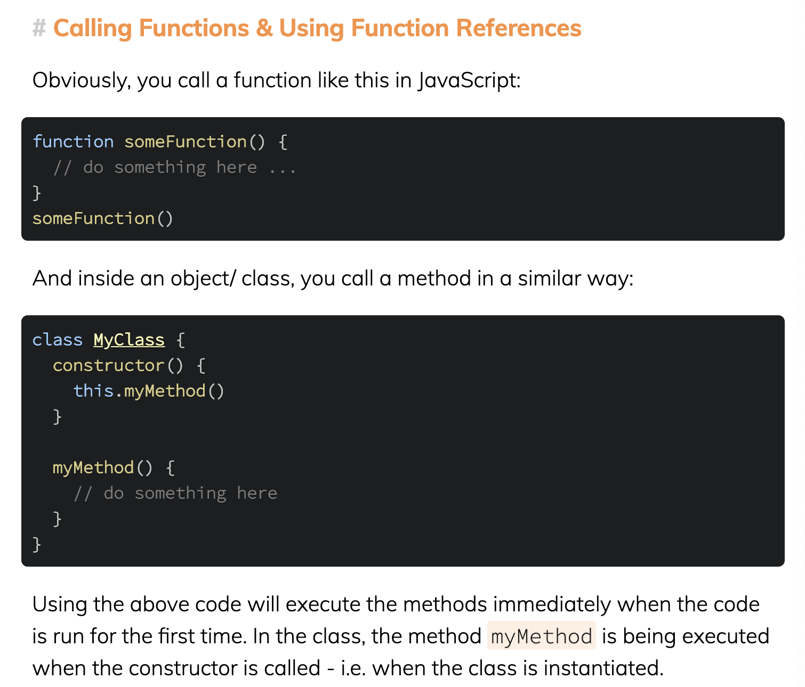
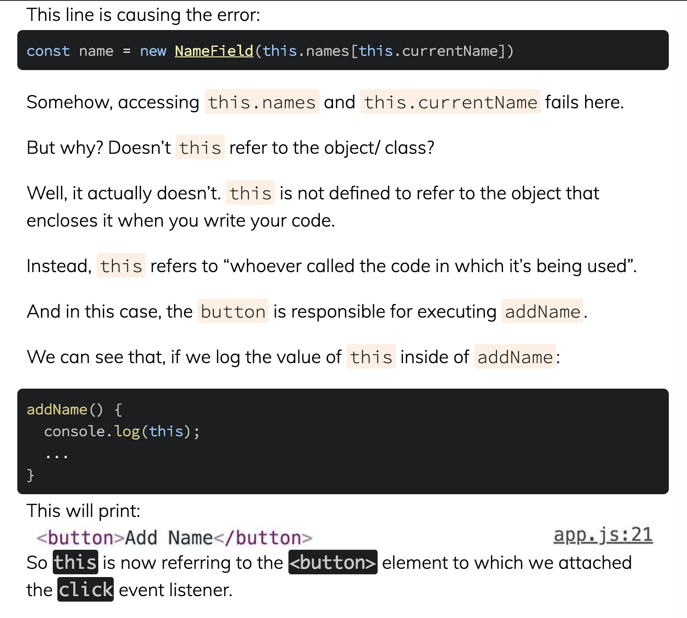
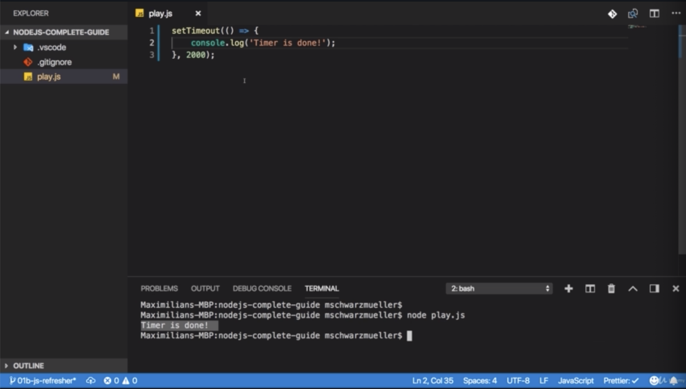

\* Chapter 9: Module Introduction
=================================


\* Chapter 10: JavaScript In A Nutshell
=======================================


- Data types can be switched dynamically. but it also lead to errors.

\* Chapter 11: Refreshing The Core Syntax
=========================================


\* Chapter 12: let & const
==========================


- the core reason for using ‘let’ is that we now also have another way of creating a variable and with that, i mean a variable which never changes which actually is the case for all 3 variables


- ‘const’ keyword makes clear that we never plan on chaning the value of name or hasHobbies. we do plan to change it of age. that’s why we have let and that’s the reason why we have 2 different keywords for creating variables, 


- if i try to assign to a constant variable, we get error.

- you wanna use const as often as possible to be as clear about what happens in your code as possible and if something should never change, make it a const so that you get an error if you do accidentally change it. so here i will revert this change.

```js
const name = 'Max';
let age = 29;
const hasHobbies = true;

age = 30
name = 'kiwon'

function summarizeUser(userName, userAge, userHasHobby){
    return ('Name is '+
    userName +
    ', age is ' +
    userAge +
    ' and the user has hobbies: ' +
    userHasHobby
    )
}

console.log(summarizeUser(name, age, hasHobbies))
```

\* Chapter 13: Understanding Arrow Functions
============================================


- the part on the right side is a so-called ‘anonymous function’ because we don’t set up a name after function. but we make it a named function implicitly by storing the anonymous function in that named constant. so we can always call that constant which holds a function as a value and we call the value with the syntax and therefore this is like a named function. this is a way of different way of defining a function.


- now we remove the ‘function’ keyword and instead we add an arrow between the argument list and the curly braces and this arrow is simply an equal sign and an greater than sign. this also create a function. it’s a bit shorter since we save the ‘function’ keyword and it runs in the same way as this function ran before

- why would we use the syntax except for the reason that it’s a bit shorter? there’s one key difference regarding the ’this’ keyword which javascript knows.


- this simply is the same syntax as before with the curly braces and with return and this function will now always return the result of this statement


- if you only have 1 argument and that’s the case really for that case only, if you have only one argument only, then you can just have the argument name without parentheses and it will work just as it will work with parentheses


- if you have an arrow function with no arguments at random, then you have to specify an empty pair and then you can have your code there which obviously uses no arguments because that’s exactly what i wanna show here. you can’t have just whitespace.

```js
const name = 'Max';
let age = 29;
const hasHobbies = true;

age = 30;

const summarizeUser = (userName, userAge, userHasHobby) => {
  return (
    'Name is ' +
    userName +
    ', age is ' +
    userAge +
    ' and the user has hobbies: ' +
    userHasHobby
  );
};

// const add = (a, b) => a + b;
// const addOne = a => a + 1;
const addRandom = () => 1 + 2;

// console.log(add(1, 2));
// console.log(addOne(1));
console.log(addRandom());

console.log(summarizeUser(name, age, hasHobbies));
```








\* Chapter 14: Working With Objects, Properties & Methods
=========================================================


- objects allow us to group data together. you can also not just have variables in there so to say but you can also have functions in there.


- this would now be accessed with the ’this’ keyword, instead of an object you have to use this. ’this’ keyword refers to the surrounding object. so dot to acess properties or methods, so variables or functions inside of that object. so we could now use this name. 

 

- the reason for the undefined is arrow functions. ‘this’ keyword now refers to the global scope, to the global node runtime scope and not to this object

- ’this’ keyword in this photo refers ‘window’ object which is global object, not the object which have the method calling ’this’ keyword in arrow function.


- to have it refer to object, we either have to use the old school function, like this. 


- or use like that. omit the colon, add the parentheses after the key name and then without a function keyword or anything like that, you add your function body.

```js
const person = {
  name: 'Max',
  age: 29,
  greet() {
    console.log('Hi, I am ' + this.name);
  }
};

person.greet();
 
```

\* Chapter 15: Array & Array Methods
====================================


- An array is defined with square brackets [ ] and in that array, you can have any data you could normally use too, you can use string, numbers, boolean values, object and you don’t have to use one and the same type in that array. here we are mixing text and numbers.


- and you can use for loops to go through that with this syntax. for example with the ‘for of’ loop where we store each element for each iteration in that hobby variable


- in javascript, we got a lot of methods we can use on arrays. all these methods help me go through the elements in the array, manipulate them, get a subset of that array, whatever i need.

- often you will see ‘map’ method which allows you to transform an array or transform the values and map will return a new array. so it will not edit the old one but give you a new one. 

- and now map always takes a function where you define how to edit that array or how to edit the elements. that function will be executed on every elelemtn in the array one after another and you return the updated version of the element. 


- first one is new one and second one is old one. 

- i see the old array was no t edited. that is my second output which is coming from the original array.

- but the result of my ‘map’, new array pops up where i have my edited items with hobby added in front of every item.

```js
const person = {
  name: 'Max',
  age: 29,
  greet() {
    console.log('Hi, I am ' + this.name);
  }
};

const hobbies = ['Sports', 'Cooking'];
// for (let hobby of hobbies){
//     console.log(hobby);
// }
console.log(hobbies.map(hobby => 'Hobby: ' + hobby));
console.log(hobbies);
```

\* Chapter 16: Arrays, Objects & Reference Types
================================================


- objects and arrays are so-called ‘reference types’ and you will learn all about that. they are reference types and therefore when i store an array in a constant hobbies, i can still edit this array. without violating the restriction that the constants must not change


- you see we get no error about editing this constant. the reason for that is that reference types only store an address pointing at the place in memory where that array is stored and that pointer this address has not changed by us adding a new element. 

- so the thing stored in this constant is just this pointer, just this address and this has not changed. therefore our constant value has not changed.

- the thing it’s pointing at has changed but that totally doesn’t matter here. 

- We are not really editing a thing that is stored in a constant, but we are only editing the thing that constant thing is pointing at

(we didn’t change the place where we are pointing, but we changed the thing we are pointing at)

```js
const person = {
  name: 'Max',
  age: 29,
  greet() {
    console.log('Hi, I am ' + this.name);
  }
};

const hobbies = ['Sports', 'Cooking'];
// for (let hobby of hobbies) {
//     console.log(hobby);
// }
// console.log(hobbies.map(hobby => 'Hobby: ' + hobby));
// console.log(hobbies);
hobbies.push('Programming');
console.log(hobbies);
```

Reference Vs Primitive Values / Types
=====================================

- Primitive Types

 1\. number

 2\. string

 3\. boolean

 4\. undefined

 5\. null

- reference types

 1\. object

 2\. array

```js
//these are 'primitive types'

var age = 28;       //number
var name = 'Max'    //string
var isMale = true   //boolean
undefined           //undefined
null                //null

//these are 'reference types'

var person = {      //Object
    name: 'Max',
    age: 28
}

var hobbies = [     //Array
    'Sports', 'Cooking'
]
```

```js
//reference types: object, array
/*
reference means that 
when you create instance of object or array and change properties with that instance, 
you change instance and original object or array both.
because you just only copied address(so-called pointer in C++ or C something) of original object or array. 
so in result, you change properties along the address.
*/
var person = { name: 'Max' }
var newPerson = person
newPerson.name = 'Anna'
console.log(person.name, 'a')
console.log(newPerson.name, 'b')

//-----------

var hobbies = ['Sports', 'Cooking']
var copiedHobbies = hobbies
copiedHobbies.push('music')
console.log(hobbies[2], 'c')
console.log(copiedHobbies[2], 'd')

//-----------

//these are how you can copy the actual value
//## for array
//1. use slice() without arguments
var hobbies = ['Sports', 'Cooking']
var copiedHobbies = hobbies.slice()
copiedHobbies.push('programming')
console.log(hobbies,'e')
console.log(copiedHobbies,'f')

//2. use the spread operator
var hobbies = ['Sports', 'Cooking']
var copiedHobbies = [...hobbies]
copiedHobbies.push('Composing')
console.log(hobbies, 'g')
console.log(copiedHobbies, 'h')

//## for object
//1. Object.assign()
var person = { name: 'Max' }
var copiedHobbies = Object.assign({}, person)
console.log(person, 'i')
console.log(copiedHobbies, 'j')

//2. use spread operator on object
var person = { name: 'Max' }
var copiedPerson = {...person}
console.log(person, 'k')
console.log(copiedHobbies, 'l')
```

\* Chapter 17: Understanding Spread & Rest Operators
====================================================

- let’s say we wanna implement a pattern where when we add a new hobby, we don’t edit the original array. but we create a new array with all the old values and the new values which is actually a pretty common pattern called ‘immutability’ where we never edit existing values but we always replace them with copies + changes.

- the idea behind that is that we avoid errors becasue we always have this clear approach of copy then edit. Don’t edit existing objects which might lead to more unreadable code. 


- we got a couple of possible techniques to copy things which is slice(). slice() simply copies an array, we can pass arguments to narrow down the range of elements we want to copy with no arguments, we copy the entire array. 


- another copy technique is that we create bracket and put in what we wanna copy. 

- it looks like a copy on first sight, but actually the outer array has only one element and that’s the inner array. so it’s not a copy but a new array where the first element is the old array. and with that i mean the exact same object, not a copy of that. 


 - as you see, these 3 dots do one thing. they take the array or object after the operator and pull out all the elements or properties and put it to whatever is around that spread operator

- in this case, we got square brackets around the spread operator and therefore all the elemtns which are pulled out of the existing array are added to the new array. 

- now this is a copy of the old one because we take the spread operator to pull out these elements and add them one by one to the new array. 


- in the same way, we could have our copied person by using curly braces then the spread operator.


- by the way, the Rest Operator is essentially the opposite to spread operator. 

- this is working but this is not totally flexible. what if we wanna pass 4 arguments? 


- it doesn’t get added because we only work with 3 arguments. what we could do is rest operator which is like ‘…args’


- ‘…args’ is totally take all the arguments, how many we might specify that doesn’t matter and it will bundle them up in a array for us.

```js
const person = {
  name: 'Max',
  age: 29,
  greet() {
    console.log('Hi, I am ' + this.name);
  }
};

const copiedPerson = { ...person };
console.log(copiedPerson);

const hobbies = ['Sports', 'Cooking'];
// for (let hobby of hobbies) {
//     console.log(hobby);
// }
// console.log(hobbies.map(hobby => 'Hobby: ' + hobby));
// console.log(hobbies);
const copiedArray = [...hobbies];
console.log(copiedArray);

const toArray = (...args) => {
  return args;
};

console.log(toArray(1, 2, 3, 4));

```

\* Chapter 18: Destructuring
============================


```js
const person = {
    name: 'Max',
    age: 29,
    greet(){
        console.log('Hi, I am ' + this.name);
    }
}

/*
this is actually takes the full person object because for whatever reason we write, wrote it like this
or we simply have a function where we are able to get multiple arguments or a full object because some third party package always gives us that person we can't change that, 
so we get the person here
*/
/**now to avoid naming confusion, you can name this here however you want. */
const printName = (personData) => {
    console.log(personData.name);
}

printName(person);

/**or we can print out 'name' property by using called 'destructuring' */
const printName = ({ name }) => {
    console.log(name)
}

printName(person)

/**you can also use destructuring outside of function 
 * these names(name, age in here) have to match the property names of the person.
*/
const { name, age } = person;
console.log(name, age);

/**you can also have destructure arrays. 
 * there are no square brackets around them in the console log
 * because we are not logging an array here, 
 * we are logging 2 individual values which we got via array destructuring
 * unlike the object destructuring, you can choose any names you want because in arrays your elements have no names,
 * they are instead pulled out by position
*/
const hobbies = ['Sports', 'Cooking']
const [hobby1, hobby2] = hobbies;
console.log(hobby1, hobby2)
```

```js
const person = {
  name: 'Max',
  age: 29,
  greet() {
    console.log('Hi, I am ' + this.name);
  }
};

const printName = ({ name }) => {
  console.log(name);
};

printName(person);

const { name, age } = person;
console.log(name, age);

// const copiedPerson = { ...person };
// console.log(copiedPerson);

const hobbies = ['Sports', 'Cooking'];
const [hobby1, hobby2] = hobbies;
console.log(hobby1, hobby2);

// // for (let hobby of hobbies) {
// //     console.log(hobby);
// // }
// // console.log(hobbies.map(hobby => 'Hobby: ' + hobby));
// // console.log(hobbies);
// const copiedArray = [...hobbies];
// console.log(copiedArray);

// const toArray = (...args) => {
//   return args;
// };

// console.log(toArray(1, 2, 3, 4));

```

\* Chapter 19: Async Code & Promises
====================================



- this is asynchronous code because it doesn’t finish immediately. and it would even be async code if we had one millisecond there. so if it’s super fast, it does not happen immediately. 


- this 2 codes are synchronous code because they are executed right after each other and technically node will take some time to execute them but there is no delay other than your hardware. 

- if i execute this file like this, you see ‘Hello!’ and ‘Hi!’ befor you see ’Timer is done!’ even though it’s super fast becasue node.js and javascript in general does not block your code execution until that is done, it will recognize this so-called callback(() =\> {console.log(’Timer is done!’}). so a function that should execute in the future, it should call back later once it is done so once this timer expired here, it will just recognize that and will then immediately move onto the next line. and it will execute all the synchronous code and then execute your async code once this is done which is why we see ‘Hello!’ and ‘Hi!’ first even though ’Timer is done’ is printed first. 


- what is the advantage of this is that if we had multiple such as promises, let’s say i called fetchData again in there. i don’t have to use then like this.


- but instead inside of a promise and then block is part of promise. so i can just return a new promise and then add the next then block after the previous one like this

```js
/**i need some way of doing something when inner 'Timer is done'
 * so i will actually expect an argument which i will name 'callback'
 * because this argument will be a function 
 * i will eventually call in my inner function once i'm done with the 'Timer is done'
 * and there i can pass the value called 'Done!'
*/

const fetchData = () => {
/* we will use 3rd party packages that already use promises for us,
 * so the syntax i will show you now is one you rarely have to write on your own.
 * That will be done by the packages behind the scenes.
 */
  const promise = new Promise((resolve, reject) => {
/* 'resolve' completes the promise successfully, it resolves it successfully
 * 'reject' rejects it which is like throwing an error.
 */
    setTimeout(() => {
      resolve('Done!');
    }, 1500);
  });
/* 'promise' is synchronous code. so this will be returned immediately 
 * after the promise gets created 
 * before the code in the promise run which will happen sometimes later
 * when we call fetchData function and setTimeout function complete
 */
  return promise;
};

setTimeout(() => {
  console.log('Timer is done!');
  fetchData()
/*'text' is what is passed by the callback in my callback() when i excute it.*/
/* 'then()' is callable on a promise
 * and we return a promise and this simply allows you to define the callback function 
 * which will execute once the promise is resolved
*/
    .then(text => {
      console.log(text);
      return fetchData();
    })
    .then(text2 => {
      console.log(text2);
    });
}, 2000);

console.log('Hello!');
console.log('Hi!');
```

```js
//clean version

const fetchData = () => {
  const promise = new Promise((resolve, reject) => {
    setTimeout(() => {
      resolve('Done!');
    }, 1500);
  });
  return promise;
};

setTimeout(() => {
  console.log('Timer is done!');
  fetchData()
    .then(text => {
      console.log(text);
      return fetchData();
    })
    .then(text2 => {
      console.log(text2);
    });
}, 2000);

console.log('Hello!');
console.log('Hi!');
```

\* Chapter 20: Template Literals
================================

- Template Literals is a different way of writing strings. 

- instead of using double or single quotation marks like ‘A String’ or “Another string”, you can use backticks(`) like `Another way of writing strings`

- now why would we use that way of creating strings? 

- with that syntax, you can dynamically add data into a string like this

```js
const name = "Max";
const age = 29
console.log(`My name is ${name} and I am ${age} years old`);
```

- this is the shorter and easier to read than the ‘old’ way of concatenating strings

```js
const name = "Max"
const age = 29
console.log("My name is " + name + " and I am " + age + " years old");
```
