\* Chapter 334: Adding Pagination Links
=======================================

1\. update

- ./views/shop/index.ejs

- ./public/css/main.css

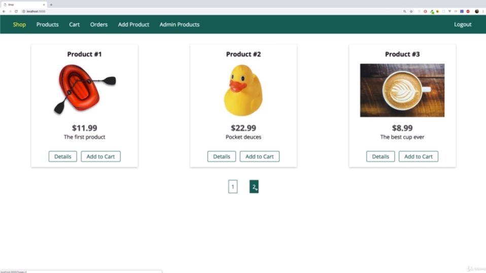

```js
<!--./views/shop/index.ejs-->

<%- include('../includes/head.ejs') %>
    <link rel="stylesheet" href="/css/product.css">
</head>

<body>
    <%- include('../includes/navigation.ejs') %>

    <main>
        <% if (prods.length > 0) { %>
            <div class="grid">
                <% for (let product of prods) { %>
                    <article class="card product-item">
                        <header class="card__header">
                            <h1 class="product__title"><%= product.title %></h1>
                        </header>
                        <div class="card__image">
                            "
                                alt="<%= product.title %>">
                        </div>
                        <div class="card__content">
                            <h2 class="product__price">$<%= product.price %></h2>
                            <p class="product__description"><%= product.description %></p>
                        </div>
                        <div class="card__actions">
                            <a href="/products/<%= product._id %>" class="btn">Details</a>
                            <% if (isAuthenticated) { %>
                                <%- include('../includes/add-to-cart.ejs', {product: product}) %>
                            <% } %>
                        </div>
                    </article>
                <% } %>
            </div>
            <section class="pagination">
                <a href="/?page=1">1</a>
                <a href="/?page=2">2</a>
            </section>
        <% } else { %>
            <h1>No Products Found!</h1>
        <% } %>
    </main>
<%- include('../includes/end.ejs') %>
```

```js
/*./public/css/main.css*/

@import url('https://fonts.googleapis.com/css?family=Open+Sans:400,700');

* {
  box-sizing: border-box;
}

body {
  padding: 0;
  margin: 0;
  font-family: 'Open Sans', sans-serif;
}

main {
  padding: 1rem;
  margin: auto;
}

form {
  display: inline;
}

.centered {
  text-align: center;
}

.image {
  height: 20rem;
}

.image img {
  height: 100%;
}

.main-header {
  width: 100%;
  height: 3.5rem;
  background-color: #00695c;
  padding: 0 1.5rem;
  display: flex;
  align-items: center;
}

.main-header__nav {
  height: 100%;
  width: 100%;
  display: none;
  align-items: center;
  justify-content: space-between;
}

.main-header__item-list {
  list-style: none;
  margin: 0;
  padding: 0;
  display: flex;
}

.main-header__item {
  margin: 0 1rem;
  padding: 0;
}

.main-header__item a,
.main-header__item button {
  font: inherit;
  background: transparent;
  border: none;
  text-decoration: none;
  color: white;
  cursor: pointer;
}

.main-header__item a:hover,
.main-header__item a:active,
.main-header__item a.active,
.main-header__item button:hover,
.main-header__item button:active {
  color: #ffeb3b;
}

.mobile-nav {
  width: 30rem;
  height: 100vh;
  max-width: 90%;
  position: fixed;
  left: 0;
  top: 0;
  background: white;
  z-index: 10;
  padding: 2rem 1rem 1rem 2rem;
  transform: translateX(-100%);
  transition: transform 0.3s ease-out;
}

.mobile-nav.open {
  transform: translateX(0);
}

.mobile-nav__item-list {
  list-style: none;
  display: flex;
  flex-direction: column;
  margin: 0;
  padding: 0;
}

.mobile-nav__item {
  margin: 1rem;
  padding: 0;
}

.mobile-nav__item a,
.mobile-nav__item button {
  font: inherit;
  text-decoration: none;
  color: black;
  font-size: 1.5rem;
  padding: 0.5rem 2rem;
  background: transparent;
  border: none;
  cursor: pointer;
}

.mobile-nav__item a:active,
.mobile-nav__item a:hover,
.mobile-nav__item a.active,
.mobile-nav__item button:hover,
.mobile-nav__item button:active {
  background: #00695c;
  color: white;
  border-radius: 3px;
}

#side-menu-toggle {
  border: 1px solid white;
  font: inherit;
  padding: 0.5rem;
  display: block;
  background: transparent;
  color: white;
  cursor: pointer;
}

#side-menu-toggle:focus {
  outline: none;
}

#side-menu-toggle:active,
#side-menu-toggle:hover {
  color: #ffeb3b;
  border-color: #ffeb3b;
}

.backdrop {
  position: fixed;
  top: 0;
  left: 0;
  width: 100%;
  height: 100vh;
  background: rgba(0, 0, 0, 0.5);
  z-index: 5;
  display: none;
}

.grid {
  display: flex;
  flex-wrap: wrap;
  justify-content: space-around;
  align-items: stretch;
}

.card {
  box-shadow: 0 2px 8px rgba(0, 0, 0, 0.26);
}

.card__header,
.card__content {
  padding: 1rem;
}

.card__header h1,
.card__content h1,
.card__content h2,
.card__content p {
  margin: 0;
}

.card__image {
  width: 100%;
}

.card__image img {
  width: 100%;
}

.card__actions {
  padding: 1rem;
  text-align: center;
}

.card__actions button,
.card__actions a {
  margin: 0 0.25rem;
}

.btn {
  display: inline-block;
  padding: 0.25rem 1rem;
  text-decoration: none;
  font: inherit;
  border: 1px solid #00695c;
  color: #00695c;
  background: white;
  border-radius: 3px;
  cursor: pointer;
}

.btn:hover,
.btn:active {
  background-color: #00695c;
  color: white;
}

.btn.danger {
  color: red;
  border-color: red;
}

.btn.danger:hover,
.btn.danger:active {
  background: red;
  color: white;
}

.user-message {
  margin: auto;
  width: 90%;
  border: 1px solid #4771fa;
  padding: 0.5rem;
  border-radius: 3px;
  background: #b9c9ff;
  text-align: center;
}

.user-message--error {
  border-color: red;
  background: rgb(255, 176, 176);
  color: red;
}

.pagination {
  margin-top: 2rem;
  text-align: center
}

.pagination a {
  text-decoration: none;
  color: #00695c;
  padding: 0.5rem;
  border: 1px solid #00695c;
  margin: 0 1rem;
}

.pagination a:hover,
.pagination a:active {
  background: #00695c;
  color: white;
}

@media (min-width: 768px) {
  .main-header__nav {
    display: flex;
  }

  #side-menu-toggle {
    display: none;
  }

  .user-message {
    width: 30rem;
  }
}

```

\* Chapter 335: Retrieving A Chunk Of Data
==========================================

1\. update

- ./controllers/shop.js

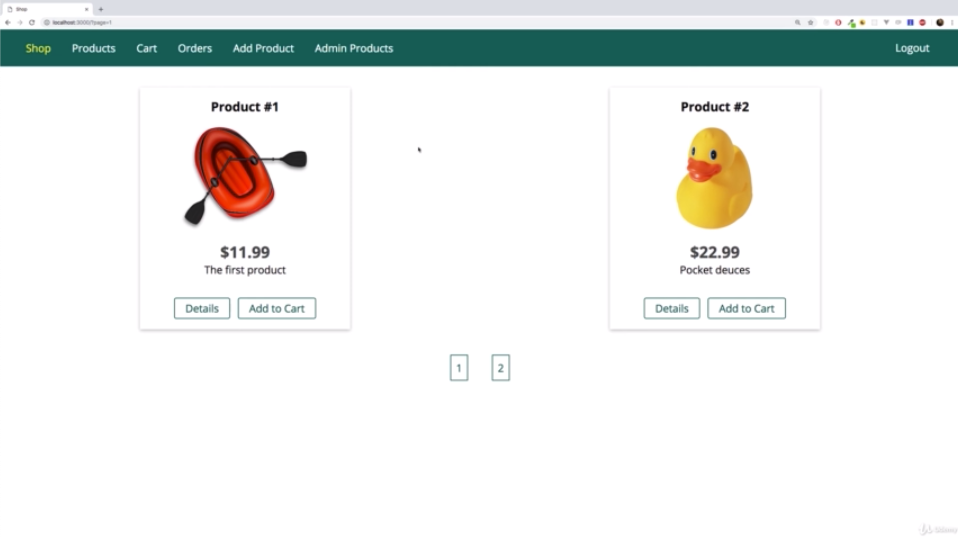

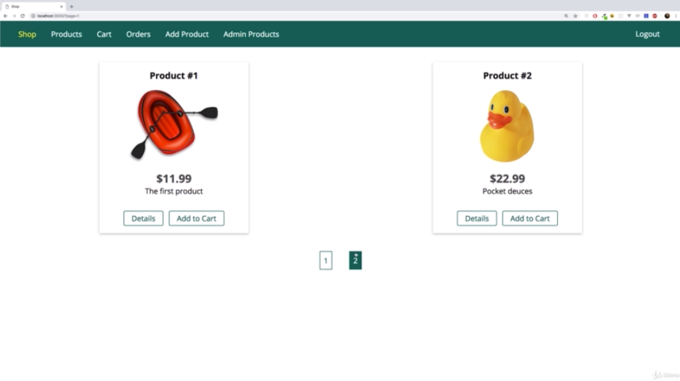

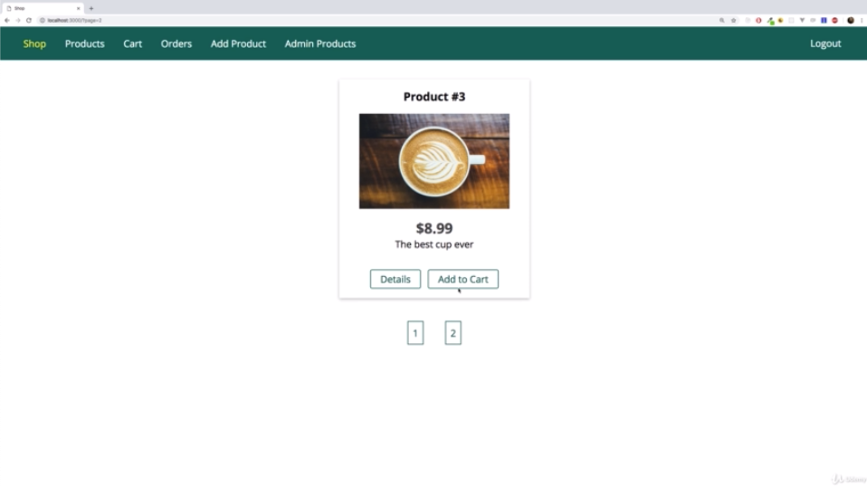

—————————————————————

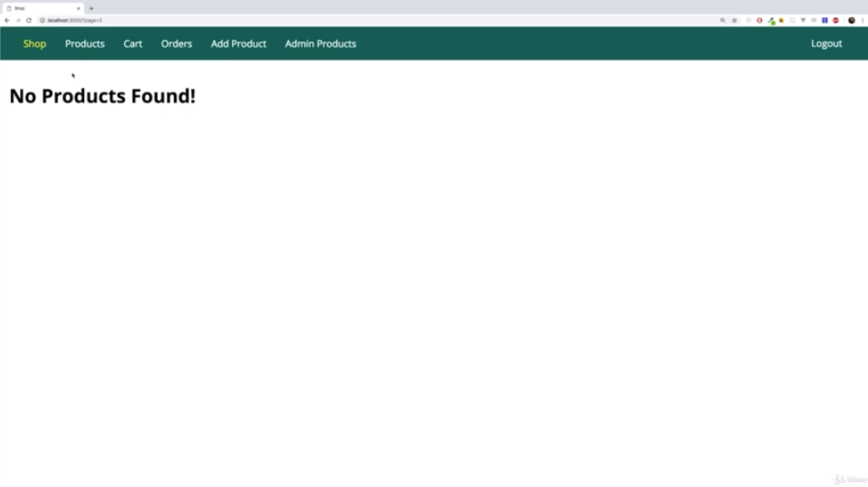

- if i type ‘page3’ in the end of the URL, ’No Products Found!’ we would not find any products because i have no items for this page. but page 1, 2 is fine.

```js
//./controllers/shop.js

const fs = require('fs');
const path = require('path');

const PDFDocument= require('pdfkit')

const Product = require('../models/product');
const Order = require('../models/order');

const ITEMS_PER_PAGE = 2

exports.getProducts = (req, res, next) => {
  Product.find()
    .then(products => {
      console.log(products);
      res.render('shop/product-list', {
        prods: products,
        pageTitle: 'All Products',
        path: '/products'
      });
    })
    .catch(err => {
      const error = new Error(err);
      error.httpStatusCode = 500;
      return next(error);
    });
};

exports.getProduct = (req, res, next) => {
  const prodId = req.params.productId;
  Product.findById(prodId)
    .then(product => {
      res.render('shop/product-detail', {
        product: product,
        pageTitle: product.title,
        path: '/products'
      });
    })
    .catch(err => {
      const error = new Error(err);
      error.httpStatusCode = 500;
      return next(error);
    });
};

exports.getIndex = (req, res, next) => {
  /**request
   * and we can get query parameters on the 'query' object
   * provided by express.js
   * and i can access page
   * because i named that query parameter 'page' in the URL
   */
  const page = req.query.page

  Product.find()
  /**there is 'skip()' function
   * we can skip x amount of results
   * 'page - 1' is the previous page number
   *
   * '(page - 1) * ITEMS_PER_PAGE' means that
   * if i'm on page 2,
   * i would skip the first page,
   * so the first one times ITEMS_PER_PAGE items
   * so result is that
   * i would skip the first one * 2
   * so the first 2 items
   */
    .skip((page - 1) * ITEMS_PER_PAGE)
    /**'limit()' method limits the amount of data we fetch to the number we specify
     * and i can pass 'ITEMS_PER_PAGE'
     * because that is my item limit per page.
     */
    .limit(ITEMS_PER_PAGE)
    .then(products => {
      res.render('shop/index', {
        prods: products,
        pageTitle: 'Shop',
        path: '/'
      });
    })
    .catch(err => {
      const error = new Error(err);
      error.httpStatusCode = 500;
      return next(error);
    });
};

exports.getCart = (req, res, next) => {
  req.user
    .populate('cart.items.productId')
    .execPopulate()
    .then(user => {
      const products = user.cart.items;
      res.render('shop/cart', {
        path: '/cart',
        pageTitle: 'Your Cart',
        products: products
      });
    })
    .catch(err => {
      const error = new Error(err);
      error.httpStatusCode = 500;
      return next(error);
    });
};

exports.postCart = (req, res, next) => {
  const prodId = req.body.productId;
  Product.findById(prodId)
    .then(product => {
      return req.user.addToCart(product);
    })
    .then(result => {
      console.log(result);
      res.redirect('/cart');
    })
    .catch(err => {
      const error = new Error(err);
      error.httpStatusCode = 500;
      return next(error);
    });
};

exports.postCartDeleteProduct = (req, res, next) => {
  const prodId = req.body.productId;
  req.user
    .removeFromCart(prodId)
    .then(result => {
      res.redirect('/cart');
    })
    .catch(err => {
      const error = new Error(err);
      error.httpStatusCode = 500;
      return next(error);
    });
};

exports.postOrder = (req, res, next) => {
  req.user
    .populate('cart.items.productId')
    .execPopulate()
    .then(user => {
      const products = user.cart.items.map(i => {
        return { quantity: i.quantity, product: { ...i.productId._doc } };
      });
      const order = new Order({
        user: {
          email: req.user.email,
          userId: req.user
        },
        products: products
      });
      return order.save();
    })
    .then(result => {
      return req.user.clearCart();
    })
    .then(() => {
      res.redirect('/orders');
    })
    .catch(err => {
      const error = new Error(err);
      error.httpStatusCode = 500;
      return next(error);
    });
};

exports.getOrders = (req, res, next) => {
  Order.find({ 'user.userId': req.user._id })
    .then(orders => {
      res.render('shop/orders', {
        path: '/orders',
        pageTitle: 'Your Orders',
        orders: orders
      });
    })
    .catch(err => {
      const error = new Error(err);
      error.httpStatusCode = 500;
      return next(error);
    });
};

exports.getInvoice = (req, res, next) => {
  const orderId = req.params.orderId;
  Order.findById(orderId)
    .then(order => {
      if (!order) {
        return next(new Error('No order found.'));
      }
      if (order.user.userId.toString() !== req.user._id.toString()) {
        return next(new Error('Unauthorized'));
      }
      const invoiceName = 'invoice-' + orderId + '.pdf';
      const invoicePath = path.join('data', 'invoices', invoiceName);

      const pdfDoc = new PDFDocument()
      res.setHeader('Content-Type', 'application/pdf');
      res.setHeader(
        'Content-Disposition',
        'inline; filename="' + invoiceName + '"'
      )
      pdfDoc.pipe(fs.createWriteStream(invoicePath))
      pdfDoc.pipe(res)

      pdfDoc.fontSize(26).text('Invoice', {
        underline: true
      })

      pdfDoc.text('----------------------')
      let totalPrice = 0
      /**'products' is an array
       * because we store this products in a database as an array.
       */
      order.products.forEach(prod => {
        totalPrice += prod.quantity * prod.product.price
        pdfDoc
          .fontSize(14)
          .text(
            prod.product.title +
            ' - ' +
            prod.quantity +
            ' x ' +
            '$' +
            prod.product.price)
      })
      pdfDoc.text('---')
      pdfDoc.fontSize(20).text('Total Price: $' + totalPrice)

      pdfDoc.end()
      //fs.readFile(invoicePath, (err, data) => {
      //  if (err) {
      //    return next(err);
      //  }
      //  res.setHeader('Content-Type', 'application/pdf');
      //  res.setHeader(
      //    'Content-Disposition',
      //    'inline; filename="' + invoiceName + '"'
      //  );
      //  res.send(data);
      //});

      //const file = fs.createReadStream(invoicePath)
      //file.pipe(res)
    })
    .catch(err => next(err));
};

```

\* Chapter 337: Preparing Pagination Data On The Server
=======================================================

1\. update

- ./controllers/shop.js

```js
//./controllers/shop.js

const fs = require('fs');
const path = require('path');

const PDFDocument= require('pdfkit')

const Product = require('../models/product');
const Order = require('../models/order');

const ITEMS_PER_PAGE = 2

exports.getProducts = (req, res, next) => {
  Product.find()
    .then(products => {
      console.log(products);
      res.render('shop/product-list', {
        prods: products,
        pageTitle: 'All Products',
        path: '/products'
      });
    })
    .catch(err => {
      const error = new Error(err);
      error.httpStatusCode = 500;
      return next(error);
    });
};

exports.getProduct = (req, res, next) => {
  const prodId = req.params.productId;
  Product.findById(prodId)
    .then(product => {
      res.render('shop/product-detail', {
        product: product,
        pageTitle: product.title,
        path: '/products'
      });
    })
    .catch(err => {
      const error = new Error(err);
      error.httpStatusCode = 500;
      return next(error);
    });
};

exports.getIndex = (req, res, next) => {
  const page = req.query.page
  let totalItems

  Product
    .find()
    .count()
    .then(numProducts => {
      totalItems = numProducts
      return Product
        .find()
        .skip((page - 1) * ITEMS_PER_PAGE)
        .limit(ITEMS_PER_PAGE)
    })
    .then(products => {
      res.render('shop/index', {
        prods: products,
        pageTitle: 'Shop',
        path: '/',
        totalProducts: totalItems,
        /**'hasNextPage' is only be the case
         * if the total number of items is greater than the page we are on.
         * times ITEMS_PER_PAGE
         */
        hasNextPage: ITEMS_PER_PAGE * page < totalItems,
        hasPreviousPage: page > 1,
        nextPage: page + 1,
        previousPage: page - 1,
        lastPage: Math.ceil(totalItems / ITEMS_PER_PAGE)
      });
    })
    .catch(err => {
      const error = new Error(err);
      error.httpStatusCode = 500;
      return next(error);
    });
};

exports.getCart = (req, res, next) => {
  req.user
    .populate('cart.items.productId')
    .execPopulate()
    .then(user => {
      const products = user.cart.items;
      res.render('shop/cart', {
        path: '/cart',
        pageTitle: 'Your Cart',
        products: products
      });
    })
    .catch(err => {
      const error = new Error(err);
      error.httpStatusCode = 500;
      return next(error);
    });
};

exports.postCart = (req, res, next) => {
  const prodId = req.body.productId;
  Product.findById(prodId)
    .then(product => {
      return req.user.addToCart(product);
    })
    .then(result => {
      console.log(result);
      res.redirect('/cart');
    })
    .catch(err => {
      const error = new Error(err);
      error.httpStatusCode = 500;
      return next(error);
    });
};

exports.postCartDeleteProduct = (req, res, next) => {
  const prodId = req.body.productId;
  req.user
    .removeFromCart(prodId)
    .then(result => {
      res.redirect('/cart');
    })
    .catch(err => {
      const error = new Error(err);
      error.httpStatusCode = 500;
      return next(error);
    });
};

exports.postOrder = (req, res, next) => {
  req.user
    .populate('cart.items.productId')
    .execPopulate()
    .then(user => {
      const products = user.cart.items.map(i => {
        return { quantity: i.quantity, product: { ...i.productId._doc } };
      });
      const order = new Order({
        user: {
          email: req.user.email,
          userId: req.user
        },
        products: products
      });
      return order.save();
    })
    .then(result => {
      return req.user.clearCart();
    })
    .then(() => {
      res.redirect('/orders');
    })
    .catch(err => {
      const error = new Error(err);
      error.httpStatusCode = 500;
      return next(error);
    });
};

exports.getOrders = (req, res, next) => {
  Order.find({ 'user.userId': req.user._id })
    .then(orders => {
      res.render('shop/orders', {
        path: '/orders',
        pageTitle: 'Your Orders',
        orders: orders
      });
    })
    .catch(err => {
      const error = new Error(err);
      error.httpStatusCode = 500;
      return next(error);
    });
};

exports.getInvoice = (req, res, next) => {
  const orderId = req.params.orderId;
  Order.findById(orderId)
    .then(order => {
      if (!order) {
        return next(new Error('No order found.'));
      }
      if (order.user.userId.toString() !== req.user._id.toString()) {
        return next(new Error('Unauthorized'));
      }
      const invoiceName = 'invoice-' + orderId + '.pdf';
      const invoicePath = path.join('data', 'invoices', invoiceName);

      const pdfDoc = new PDFDocument()
      res.setHeader('Content-Type', 'application/pdf');
      res.setHeader(
        'Content-Disposition',
        'inline; filename="' + invoiceName + '"'
      )
      pdfDoc.pipe(fs.createWriteStream(invoicePath))
      pdfDoc.pipe(res)

      pdfDoc.fontSize(26).text('Invoice', {
        underline: true
      })

      pdfDoc.text('----------------------')
      let totalPrice = 0
      order.products.forEach(prod => {
        totalPrice += prod.quantity * prod.product.price
        pdfDoc
          .fontSize(14)
          .text(
            prod.product.title +
            ' - ' +
            prod.quantity +
            ' x ' +
            '$' +
            prod.product.price)
      })
      pdfDoc.text('---')
      pdfDoc.fontSize(20).text('Total Price: $' + totalPrice)

      pdfDoc.end()
      //fs.readFile(invoicePath, (err, data) => {
      //  if (err) {
      //    return next(err);
      //  }
      //  res.setHeader('Content-Type', 'application/pdf');
      //  res.setHeader(
      //    'Content-Disposition',
      //    'inline; filename="' + invoiceName + '"'
      //  );
      //  res.send(data);
      //});

      //const file = fs.createReadStream(invoicePath)
      //file.pipe(res)
    })
    .catch(err => next(err));
};

```

\* Chapter 338: Adding Dynamic Pagination Buttons
=================================================

1\. update

- ./controllers/shop.js

- ./views/shop/index.ejs

- ./public/css/main.css

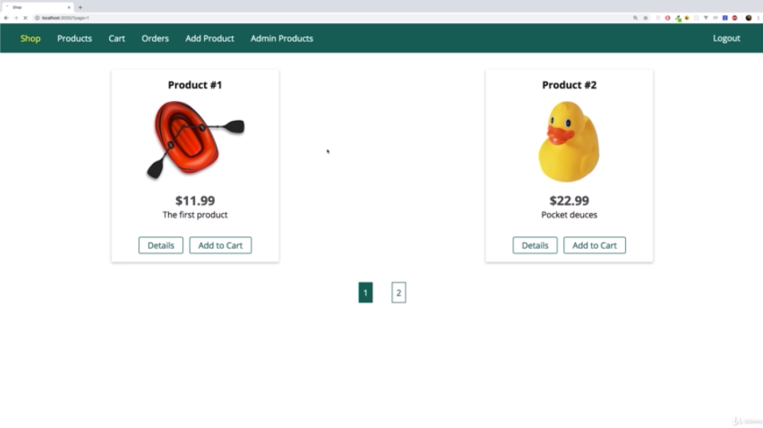


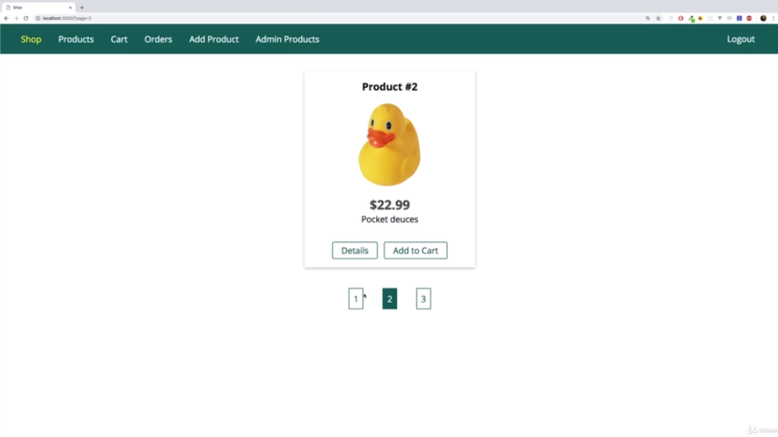

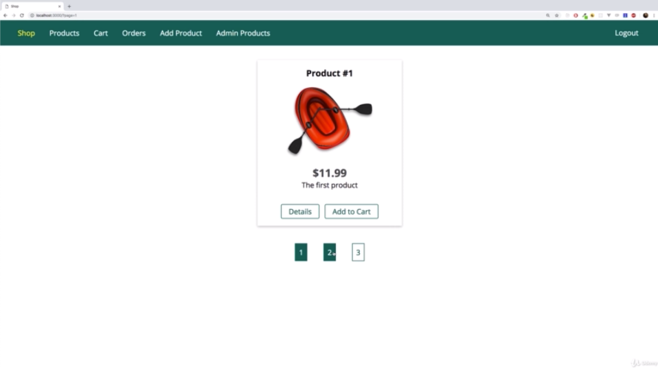

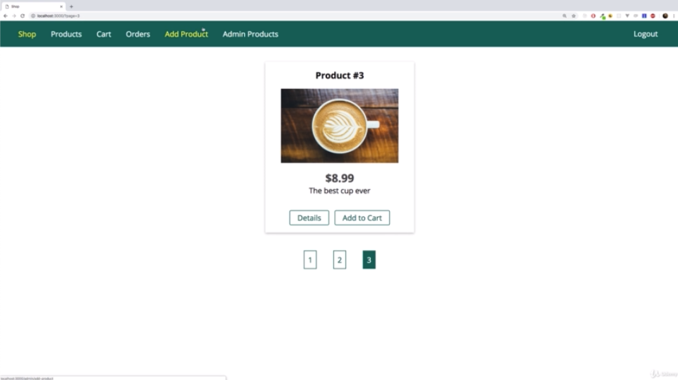

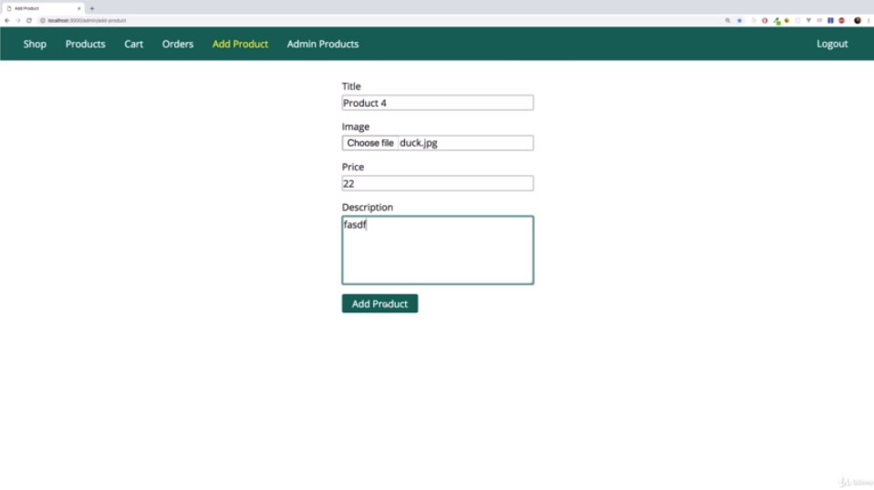

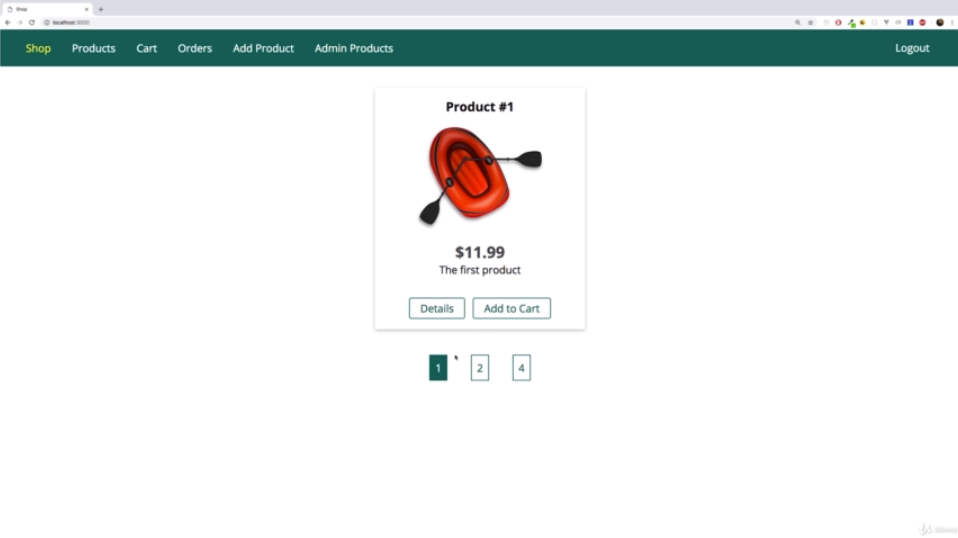

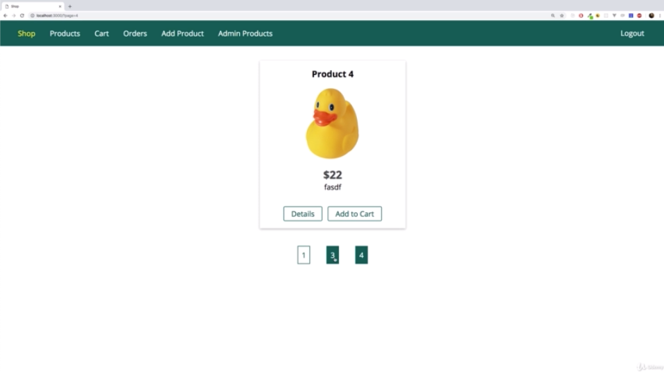

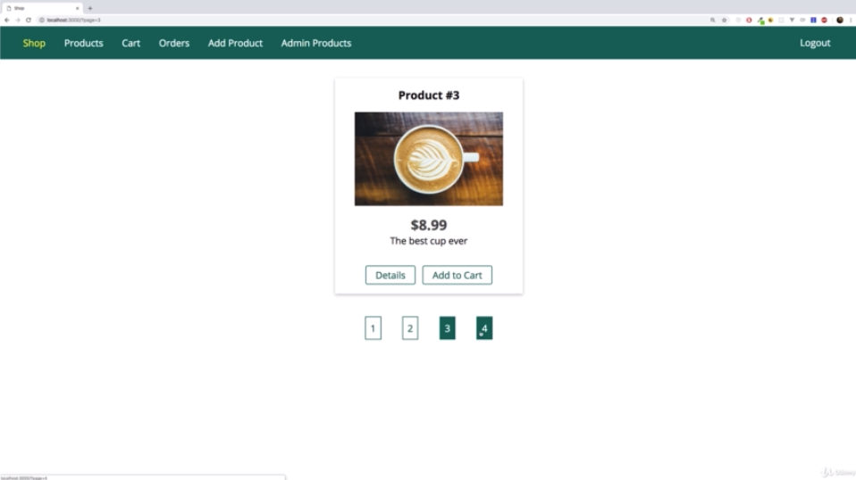

```js
//./controllers/shop.js

const fs = require('fs');
const path = require('path');

const PDFDocument = require('pdfkit');

const Product = require('../models/product');
const Order = require('../models/order');

const ITEMS_PER_PAGE = 2;

exports.getProducts = (req, res, next) => {
  Product.find()
    .then(products => {
      console.log(products);
      res.render('shop/product-list', {
        prods: products,
        pageTitle: 'All Products',
        path: '/products'
      });
    })
    .catch(err => {
      const error = new Error(err);
      error.httpStatusCode = 500;
      return next(error);
    });
};

exports.getProduct = (req, res, next) => {
  const prodId = req.params.productId;
  Product.findById(prodId)
    .then(product => {
      res.render('shop/product-detail', {
        product: product,
        pageTitle: product.title,
        path: '/products'
      });
    })
    .catch(err => {
      const error = new Error(err);
      error.httpStatusCode = 500;
      return next(error);
    });
};

exports.getIndex = (req, res, next) => {
  const page = req.query.page;
  let totalItems;

  Product.find()
    .countDocuments()
    .then(numProducts => {
      totalItems = numProducts;
      return Product.find()
        .skip((page - 1) * ITEMS_PER_PAGE)
        .limit(ITEMS_PER_PAGE);
    })
    .then(products => {
      res.render('shop/index', {
        prods: products,
        pageTitle: 'Shop',
        path: '/',
        totalProducts: totalItems,
        hasNextPage: ITEMS_PER_PAGE * page < totalItems,
        hasPreviousPage: page > 1,
        nextPage: page + 1,
        previousPage: page - 1,
        lastPage: Math.ceil(totalItems / ITEMS_PER_PAGE)
      });
    })
    .catch(err => {
      const error = new Error(err);
      error.httpStatusCode = 500;
      return next(error);
    });
};

exports.getCart = (req, res, next) => {
  req.user
    .populate('cart.items.productId')
    .execPopulate()
    .then(user => {
      const products = user.cart.items;
      res.render('shop/cart', {
        path: '/cart',
        pageTitle: 'Your Cart',
        products: products
      });
    })
    .catch(err => {
      const error = new Error(err);
      error.httpStatusCode = 500;
      return next(error);
    });
};

exports.postCart = (req, res, next) => {
  const prodId = req.body.productId;
  Product.findById(prodId)
    .then(product => {
      return req.user.addToCart(product);
    })
    .then(result => {
      console.log(result);
      res.redirect('/cart');
    })
    .catch(err => {
      const error = new Error(err);
      error.httpStatusCode = 500;
      return next(error);
    });
};

exports.postCartDeleteProduct = (req, res, next) => {
  const prodId = req.body.productId;
  req.user
    .removeFromCart(prodId)
    .then(result => {
      res.redirect('/cart');
    })
    .catch(err => {
      const error = new Error(err);
      error.httpStatusCode = 500;
      return next(error);
    });
};

exports.postOrder = (req, res, next) => {
  req.user
    .populate('cart.items.productId')
    .execPopulate()
    .then(user => {
      const products = user.cart.items.map(i => {
        return { quantity: i.quantity, product: { ...i.productId._doc } };
      });
      const order = new Order({
        user: {
          email: req.user.email,
          userId: req.user
        },
        products: products
      });
      return order.save();
    })
    .then(result => {
      return req.user.clearCart();
    })
    .then(() => {
      res.redirect('/orders');
    })
    .catch(err => {
      const error = new Error(err);
      error.httpStatusCode = 500;
      return next(error);
    });
};

exports.getOrders = (req, res, next) => {
  Order.find({ 'user.userId': req.user._id })
    .then(orders => {
      res.render('shop/orders', {
        path: '/orders',
        pageTitle: 'Your Orders',
        orders: orders
      });
    })
    .catch(err => {
      const error = new Error(err);
      error.httpStatusCode = 500;
      return next(error);
    });
};

exports.getInvoice = (req, res, next) => {
  const orderId = req.params.orderId;
  Order.findById(orderId)
    .then(order => {
      if (!order) {
        return next(new Error('No order found.'));
      }
      if (order.user.userId.toString() !== req.user._id.toString()) {
        return next(new Error('Unauthorized'));
      }
      const invoiceName = 'invoice-' + orderId + '.pdf';
      const invoicePath = path.join('data', 'invoices', invoiceName);

      const pdfDoc = new PDFDocument();
      res.setHeader('Content-Type', 'application/pdf');
      res.setHeader(
        'Content-Disposition',
        'inline; filename="' + invoiceName + '"'
      );
      pdfDoc.pipe(fs.createWriteStream(invoicePath));
      pdfDoc.pipe(res);

      pdfDoc.fontSize(26).text('Invoice', {
        underline: true
      });
      pdfDoc.text('-----------------------');
      let totalPrice = 0;
      order.products.forEach(prod => {
        totalPrice += prod.quantity * prod.product.price;
        pdfDoc
          .fontSize(14)
          .text(
            prod.product.title +
              ' - ' +
              prod.quantity +
              ' x ' +
              '$' +
              prod.product.price
          );
      });
      pdfDoc.text('---');
      pdfDoc.fontSize(20).text('Total Price: $' + totalPrice);

      pdfDoc.end();
      // fs.readFile(invoicePath, (err, data) => {
      //   if (err) {
      //     return next(err);
      //   }
      //   res.setHeader('Content-Type', 'application/pdf');
      //   res.setHeader(
      //     'Content-Disposition',
      //     'inline; filename="' + invoiceName + '"'
      //   );
      //   res.send(data);
      // });
      // const file = fs.createReadStream(invoicePath);

      // file.pipe(res);
    })
    .catch(err => next(err));
};

```

```js
<!--./views/shop/index.ejs-->

<%- include('../includes/head.ejs') %>
    <link rel="stylesheet" href="/css/product.css">
</head>

<body>
    <%- include('../includes/navigation.ejs') %>

    <main>
        <% if (prods.length > 0) { %>
            <div class="grid">
                <% for (let product of prods) { %>
                    <article class="card product-item">
                        <header class="card__header">
                            <h1 class="product__title"><%= product.title %></h1>
                        </header>
                        <div class="card__image">
                            "
                                alt="<%= product.title %>">
                        </div>
                        <div class="card__content">
                            <h2 class="product__price">$<%= product.price %></h2>
                            <p class="product__description"><%= product.description %></p>
                        </div>
                        <div class="card__actions">
                            <a href="/products/<%= product._id %>" class="btn">Details</a>
                            <% if (isAuthenticated) { %>
                                <%- include('../includes/add-to-cart.ejs', {product: product}) %>
                            <% } %>
                        </div>
                    </article>
                <% } %>
            </div>
            <section class="pagination">
                    <% if (currentPage !== 1 && previousPage !== 1) { %>
                        <a href="/?page=1">1</a>
                    <% } %>
                    <% if (hasPreviousPage) { %>
                        <a href="/?page=<%= previousPage %>"><%= previousPage %></a>
                    <% } %>
                    <a href="/?page=<%= currentPage %>" class="active"><%= currentPage %></a>
                    <% if (hasNextPage) { %>
                        <a href="/?page=<%= nextPage %>"><%= nextPage %></a>
                    <% } %>
                    <% if (lastPage !== currentPage && nextPage !== lastPage) { %>
                        <a href="/?page=<%= lastPage %>"><%= lastPage %></a>
                    <% } %>
                </section>
            <% } else { %>
            <h1>No Products Found!</h1>
        <% } %>
    </main>
<%- include('../includes/end.ejs') %>
```

```js
/*./public/css/main.css*/

@import url('https://fonts.googleapis.com/css?family=Open+Sans:400,700');

* {
  box-sizing: border-box;
}

body {
  padding: 0;
  margin: 0;
  font-family: 'Open Sans', sans-serif;
}

main {
  padding: 1rem;
  margin: auto;
}

form {
  display: inline;
}

.centered {
  text-align: center;
}

.image {
  height: 20rem;
}

.image img {
  height: 100%;
}

.main-header {
  width: 100%;
  height: 3.5rem;
  background-color: #00695c;
  padding: 0 1.5rem;
  display: flex;
  align-items: center;
}

.main-header__nav {
  height: 100%;
  width: 100%;
  display: none;
  align-items: center;
  justify-content: space-between;
}

.main-header__item-list {
  list-style: none;
  margin: 0;
  padding: 0;
  display: flex;
}

.main-header__item {
  margin: 0 1rem;
  padding: 0;
}

.main-header__item a,
.main-header__item button {
  font: inherit;
  background: transparent;
  border: none;
  text-decoration: none;
  color: white;
  cursor: pointer;
}

.main-header__item a:hover,
.main-header__item a:active,
.main-header__item a.active,
.main-header__item button:hover,
.main-header__item button:active {
  color: #ffeb3b;
}

.mobile-nav {
  width: 30rem;
  height: 100vh;
  max-width: 90%;
  position: fixed;
  left: 0;
  top: 0;
  background: white;
  z-index: 10;
  padding: 2rem 1rem 1rem 2rem;
  transform: translateX(-100%);
  transition: transform 0.3s ease-out;
}

.mobile-nav.open {
  transform: translateX(0);
}

.mobile-nav__item-list {
  list-style: none;
  display: flex;
  flex-direction: column;
  margin: 0;
  padding: 0;
}

.mobile-nav__item {
  margin: 1rem;
  padding: 0;
}

.mobile-nav__item a,
.mobile-nav__item button {
  font: inherit;
  text-decoration: none;
  color: black;
  font-size: 1.5rem;
  padding: 0.5rem 2rem;
  background: transparent;
  border: none;
  cursor: pointer;
}

.mobile-nav__item a:active,
.mobile-nav__item a:hover,
.mobile-nav__item a.active,
.mobile-nav__item button:hover,
.mobile-nav__item button:active {
  background: #00695c;
  color: white;
  border-radius: 3px;
}

#side-menu-toggle {
  border: 1px solid white;
  font: inherit;
  padding: 0.5rem;
  display: block;
  background: transparent;
  color: white;
  cursor: pointer;
}

#side-menu-toggle:focus {
  outline: none;
}

#side-menu-toggle:active,
#side-menu-toggle:hover {
  color: #ffeb3b;
  border-color: #ffeb3b;
}

.backdrop {
  position: fixed;
  top: 0;
  left: 0;
  width: 100%;
  height: 100vh;
  background: rgba(0, 0, 0, 0.5);
  z-index: 5;
  display: none;
}

.grid {
  display: flex;
  flex-wrap: wrap;
  justify-content: space-around;
  align-items: stretch;
}

.card {
  box-shadow: 0 2px 8px rgba(0, 0, 0, 0.26);
}

.card__header,
.card__content {
  padding: 1rem;
}

.card__header h1,
.card__content h1,
.card__content h2,
.card__content p {
  margin: 0;
}

.card__image {
  width: 100%;
}

.card__image img {
  width: 100%;
}

.card__actions {
  padding: 1rem;
  text-align: center;
}

.card__actions button,
.card__actions a {
  margin: 0 0.25rem;
}

.btn {
  display: inline-block;
  padding: 0.25rem 1rem;
  text-decoration: none;
  font: inherit;
  border: 1px solid #00695c;
  color: #00695c;
  background: white;
  border-radius: 3px;
  cursor: pointer;
}

.btn:hover,
.btn:active {
  background-color: #00695c;
  color: white;
}

.btn.danger {
  color: red;
  border-color: red;
}

.btn.danger:hover,
.btn.danger:active {
  background: red;
  color: white;
}

.user-message {
  margin: auto;
  width: 90%;
  border: 1px solid #4771fa;
  padding: 0.5rem;
  border-radius: 3px;
  background: #b9c9ff;
  text-align: center;
}

.user-message--error {
  border-color: red;
  background: rgb(255, 176, 176);
  color: red;
}

.pagination {
  margin-top: 2rem;
  text-align: center
}

.pagination a {
  text-decoration: none;
  color: #00695c;
  padding: 0.5rem;
  border: 1px solid #00695c;
  margin: 0 1rem;
}

.pagination a:hover,
.pagination a:active,
.pagination a.active {
  background: #00695c;
  color: white;
}

@media (min-width: 768px) {
  .main-header__nav {
    display: flex;
  }

  #side-menu-toggle {
    display: none;
  }

  .user-message {
    width: 30rem;
  }
}

```

\* Chapter 339: Re-Using The Pagination Logic & Controls
========================================================

1\. update

- ./views/shop/index.ejs

- ./views/includes/pagination.ejs

- ./views/shop/product-list.ejs

- ./controllers/shop.js


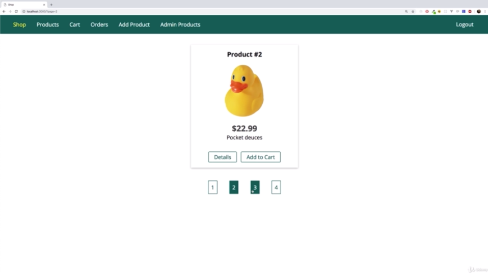


```js
//./controllers/shop.js

const fs = require('fs');
const path = require('path');

const PDFDocument = require('pdfkit');

const Product = require('../models/product');
const Order = require('../models/order');

const ITEMS_PER_PAGE = 2;

exports.getProducts = (req, res, next) => {
  const page = +req.query.page || 1;
  let totalItems;

  Product.find()
    .countDocuments()
    .then(numProducts => {
      totalItems = numProducts;
      return Product.find()
        .skip((page - 1) * ITEMS_PER_PAGE)
        .limit(ITEMS_PER_PAGE);
    })
    .then(products => {
      res.render('shop/product-list', {
        prods: products,
        pageTitle: 'Products',
        path: '/products',
        currentPage: page,
        hasNextPage: ITEMS_PER_PAGE * page < totalItems,
        hasPreviousPage: page > 1,
        nextPage: page + 1,
        previousPage: page - 1,
        lastPage: Math.ceil(totalItems / ITEMS_PER_PAGE)
      });
    })
    .catch(err => {
      const error = new Error(err);
      error.httpStatusCode = 500;
      return next(error);
    });
};

exports.getProduct = (req, res, next) => {
  const prodId = req.params.productId;
  Product.findById(prodId)
    .then(product => {
      res.render('shop/product-detail', {
        product: product,
        pageTitle: product.title,
        path: '/products'
      });
    })
    .catch(err => {
      const error = new Error(err);
      error.httpStatusCode = 500;
      return next(error);
    });
};

exports.getIndex = (req, res, next) => {
  const page = +req.query.page || 1;
  let totalItems;

  Product.find()
    .countDocuments()
    .then(numProducts => {
      totalItems = numProducts;
      return Product.find()
        .skip((page - 1) * ITEMS_PER_PAGE)
        .limit(ITEMS_PER_PAGE);
    })
    .then(products => {
      res.render('shop/index', {
        prods: products,
        pageTitle: 'Shop',
        path: '/',
        currentPage: page,
        hasNextPage: ITEMS_PER_PAGE * page < totalItems,
        hasPreviousPage: page > 1,
        nextPage: page + 1,
        previousPage: page - 1,
        lastPage: Math.ceil(totalItems / ITEMS_PER_PAGE)
      });
    })
    .catch(err => {
      const error = new Error(err);
      error.httpStatusCode = 500;
      return next(error);
    });
};

exports.getCart = (req, res, next) => {
  req.user
    .populate('cart.items.productId')
    .execPopulate()
    .then(user => {
      const products = user.cart.items;
      res.render('shop/cart', {
        path: '/cart',
        pageTitle: 'Your Cart',
        products: products
      });
    })
    .catch(err => {
      const error = new Error(err);
      error.httpStatusCode = 500;
      return next(error);
    });
};

exports.postCart = (req, res, next) => {
  const prodId = req.body.productId;
  Product.findById(prodId)
    .then(product => {
      return req.user.addToCart(product);
    })
    .then(result => {
      console.log(result);
      res.redirect('/cart');
    })
    .catch(err => {
      const error = new Error(err);
      error.httpStatusCode = 500;
      return next(error);
    });
};

exports.postCartDeleteProduct = (req, res, next) => {
  const prodId = req.body.productId;
  req.user
    .removeFromCart(prodId)
    .then(result => {
      res.redirect('/cart');
    })
    .catch(err => {
      const error = new Error(err);
      error.httpStatusCode = 500;
      return next(error);
    });
};

exports.postOrder = (req, res, next) => {
  req.user
    .populate('cart.items.productId')
    .execPopulate()
    .then(user => {
      const products = user.cart.items.map(i => {
        return { quantity: i.quantity, product: { ...i.productId._doc } };
      });
      const order = new Order({
        user: {
          email: req.user.email,
          userId: req.user
        },
        products: products
      });
      return order.save();
    })
    .then(result => {
      return req.user.clearCart();
    })
    .then(() => {
      res.redirect('/orders');
    })
    .catch(err => {
      const error = new Error(err);
      error.httpStatusCode = 500;
      return next(error);
    });
};

exports.getOrders = (req, res, next) => {
  Order.find({ 'user.userId': req.user._id })
    .then(orders => {
      res.render('shop/orders', {
        path: '/orders',
        pageTitle: 'Your Orders',
        orders: orders
      });
    })
    .catch(err => {
      const error = new Error(err);
      error.httpStatusCode = 500;
      return next(error);
    });
};

exports.getInvoice = (req, res, next) => {
  const orderId = req.params.orderId;
  Order.findById(orderId)
    .then(order => {
      if (!order) {
        return next(new Error('No order found.'));
      }
      if (order.user.userId.toString() !== req.user._id.toString()) {
        return next(new Error('Unauthorized'));
      }
      const invoiceName = 'invoice-' + orderId + '.pdf';
      const invoicePath = path.join('data', 'invoices', invoiceName);

      const pdfDoc = new PDFDocument();
      res.setHeader('Content-Type', 'application/pdf');
      res.setHeader(
        'Content-Disposition',
        'inline; filename="' + invoiceName + '"'
      );
      pdfDoc.pipe(fs.createWriteStream(invoicePath));
      pdfDoc.pipe(res);

      pdfDoc.fontSize(26).text('Invoice', {
        underline: true
      });
      pdfDoc.text('-----------------------');
      let totalPrice = 0;
      order.products.forEach(prod => {
        totalPrice += prod.quantity * prod.product.price;
        pdfDoc
          .fontSize(14)
          .text(
            prod.product.title +
              ' - ' +
              prod.quantity +
              ' x ' +
              '$' +
              prod.product.price
          );
      });
      pdfDoc.text('---');
      pdfDoc.fontSize(20).text('Total Price: $' + totalPrice);

      pdfDoc.end();
      // fs.readFile(invoicePath, (err, data) => {
      //   if (err) {
      //     return next(err);
      //   }
      //   res.setHeader('Content-Type', 'application/pdf');
      //   res.setHeader(
      //     'Content-Disposition',
      //     'inline; filename="' + invoiceName + '"'
      //   );
      //   res.send(data);
      // });
      // const file = fs.createReadStream(invoicePath);

      // file.pipe(res);
    })
    .catch(err => next(err));
};

```

```js
<!--./views/shop/index.ejs-->

<%- include('../includes/head.ejs') %>
    <link rel="stylesheet" href="/css/product.css">
</head>

<body>
    <%- include('../includes/navigation.ejs') %>

    <main>
        <% if (prods.length > 0) { %>
            <div class="grid">
                <% for (let product of prods) { %>
                    <article class="card product-item">
                        <header class="card__header">
                            <h1 class="product__title"><%= product.title %></h1>
                        </header>
                        <div class="card__image">
                            "
                                alt="<%= product.title %>">
                        </div>
                        <div class="card__content">
                            <h2 class="product__price">$<%= product.price %></h2>
                            <p class="product__description"><%= product.description %></p>
                        </div>
                        <div class="card__actions">
                            <a href="/products/<%= product._id %>" class="btn">Details</a>
                            <% if (isAuthenticated) { %>
                                <%- include('../includes/add-to-cart.ejs', {product: product}) %>
                            <% } %>
                        </div>
                    </article>
                <% } %>
            </div>
            <%- include('../includes/pagination.ejs', {currentPage: currentPage, nextPage: nextPage, previousPage: previousPage, lastPage: lastPage, hasNextPage: hasNextPage, hasPreviousPage: hasPreviousPage}) %>
        <% } else { %>
            <h1>No Products Found!</h1>
        <% } %>
    </main>
<%- include('../includes/end.ejs') %>
```

```js
<!--./views/includes/pagination.ejs-->

<section class="pagination">
    <% if (currentPage !== 1 && previousPage !== 1) { %>
        <a href="?page=1">1</a>
    <% } %>
    <% if (hasPreviousPage) { %>
        <a href="?page=<%= previousPage %>"><%= previousPage %></a>
    <% } %>
    <a href="?page=<%= currentPage %>" class="active"><%= currentPage %></a>
    <% if (hasNextPage) { %>
        <a href="?page=<%= nextPage %>"><%= nextPage %></a>
    <% } %>
    <% if (lastPage !== currentPage && nextPage !== lastPage) { %>
        <a href="?page=<%= lastPage %>"><%= lastPage %></a>
    <% } %>
</section>
```

```js
<!--./views/shop/product-list.ejs-->

<%- include('../includes/head.ejs') %>
    <link rel="stylesheet" href="/css/product.css">
    </head>

    <body>
        <%- include('../includes/navigation.ejs') %>

            <main>
                <% if (prods.length > 0) { %>
                    <div class="grid">
                        <% for (let product of prods) { %>
                            <article class="card product-item">
                                <header class="card__header">
                                    <h1 class="product__title">
                                        <%= product.title %>
                                    </h1>
                                </header>
                                <div class="card__image">
                                    " alt="<%= product.title %>">
                                </div>
                                <div class="card__content">
                                    <h2 class="product__price">$
                                        <%= product.price %>
                                    </h2>
                                    <p class="product__description">
                                        <%= product.description %>
                                    </p>
                                </div>
                                <div class="card__actions">
                                    <a href="/products/<%= product._id %>" class="btn">Details</a>
                                    <% if (isAuthenticated) { %>
                                        <%- include('../includes/add-to-cart.ejs', {product: product}) %>
                                    <% } %>
                                </div>
                            </article>
                            <% } %>
                    </div>
                    <%- include('../includes/pagination.ejs', {currentPage: currentPage, nextPage: nextPage, previousPage: previousPage, lastPage: lastPage, hasNextPage: hasNextPage, hasPreviousPage: hasPreviousPage}) %>
                    <% } else { %>
                        <h1>No Products Found!</h1>
                        <% } %>
            </main>
            <%- include('../includes/end.ejs') %>
```

