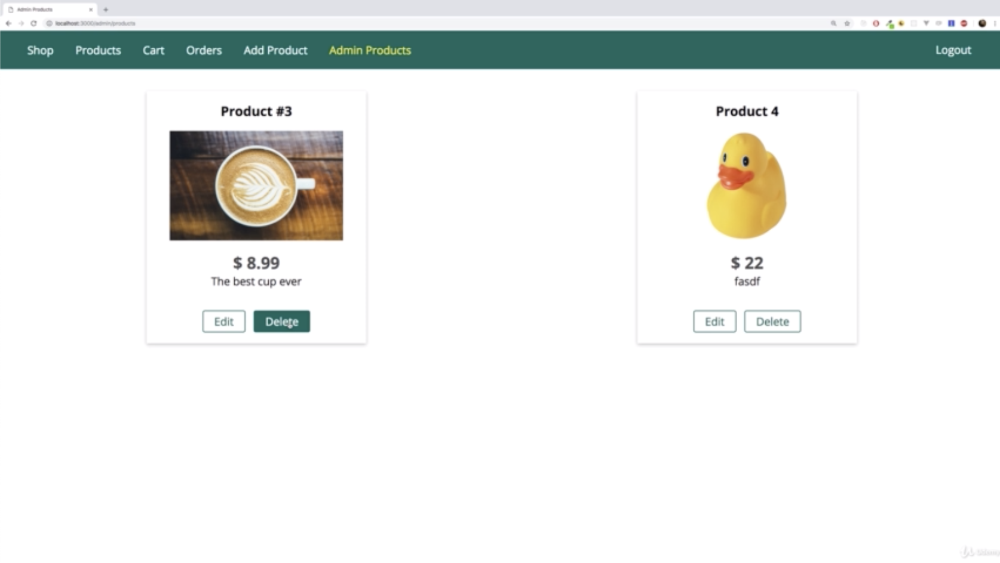

\* Chapter 342: Module Introduction
===================================


- response always was a HTML page or a redirect to another route that then return an HTML page.

- response is not a new HTML page that needs to be rendered, but some dat ain that JSON format

\* Chapter 343: Adding Client Side JS Code
==========================================

1\. update

- ./public/js/admin.js

- ./views/admin/products.ejs




- when i click delete, i would delete that, send that request to the server, get back a new version of the page where this product is then missing. and once we are done, the server will response with JSON Data. so some success message or something. once we get that message in our browser, we can delete this DOM element, so we can delete this article here. we could do all that with client side javascript. 

————————————


```js
<!--./views/admin/products.ejs-->

<%- include('../includes/head.ejs') %>
    <link rel="stylesheet" href="/css/product.css">
    </head>

    <body>
        <%- include('../includes/navigation.ejs') %>

            <main>
                <% if (prods.length > 0) { %>
                    <div class="grid">
                        <% for (let product of prods) { %>
                            <article class="card product-item">
                                <header class="card__header">
                                    <h1 class="product__title">
                                        <%= product.title %>
                                    </h1>
                                </header>
                                <div class="card__image">
                                    " alt="<%= product.title %>">
                                </div>
                                <div class="card__content">
                                    <h2 class="product__price">$
                                        <%= product.price %>
                                    </h2>
                                    <p class="product__description">
                                        <%= product.description %>
                                    </p>
                                </div>
                                <div class="card__actions">
                                    <a href="/admin/edit-product/<%= product._id %>?edit=true" class="btn">Edit</a>
                                    <!--
                                        i will remove this entire '<form action="/admin/delete-product" method="POST">'
                                            because this form was required for sending a request through the browser,
                                            sending a request with this x-www-url-form-encoded-data

                                            so i will listen to a click to that button
                                            and then i will gather the productId and the CSRF token through the help of my client side javascript
                                    -->
                                        <input type="hidden" value="<%= product._id %>" name="productId">
                                        <input type="hidden" name="_csrf" value="<%= csrfToken %>">
                                        <!--
                                            i wanna react to a click on this 'Delete' button
                                            and therefore this button should not be of type of submit anymore
                                            but typeof 'button' instead

                                            'this' refer to the element on which we clicked. 
                                        -->
                                        <button class="btn" type="button" onclick="deleteProduct(this)">Delete</button>
                                </div>
                            </article>
                            <% } %>
                    </div>
                    <% } else { %>
                        <h1>No Products Found!</h1>
                        <% } %>
            </main>
            <%- include('../includes/end.ejs') %>
            <!--
                i will import that javascript file from the js folder
                which is in a public folder
                which is served statically

                if we load it at the end of this file,
                we make sure that the entire DOM has been rendered
                and parsed by the time we execute our javascript code.
            -->
            <script src="/js/admin.js"></script>
```

```js
//./public/js/admin.js

/**this is javascript code that will now not run on the server
 * but that will run in the client.
 */

const deleteProduct = (btn) => {
    btn.parentNode.querySelector('[name=productId]').value
    const csrf = btn.parentNode.querySelector('[name=_csrf]').value
}
```

\* Chapter 346: Sending & Handling Background Requests
======================================================


 

\* Chapter 347: Manipulating The DOM
====================================

1\. update

- ./routes/admin.js

- ./controllers/admin.js

- ./public/js/admin.js


—————————————————


- let me log in with my other user

```js
// ./routes/admin.js

const path = require('path');

const express = require('express');
const { body } = require('express-validator/check');

const adminController = require('../controllers/admin');
const isAuth = require('../middleware/is-auth');

const router = express.Router();

// /admin/add-product => GET
router.get('/add-product', isAuth, adminController.getAddProduct);

// /admin/products => GET
router.get('/products', isAuth, adminController.getProducts);

// /admin/add-product => POST
router.post(
  '/add-product',
  [
    body('title')
      .isString()
      .isLength({ min: 3 })
      .trim(),
    body('price').isFloat(),
    body('description')
      .isLength({ min: 5, max: 400 })
      .trim()
  ],
  isAuth,
  adminController.postAddProduct
);

router.get('/edit-product/:productId', isAuth, adminController.getEditProduct);

router.post(
  '/edit-product',
  [
    body('title')
      .isString()
      .isLength({ min: 3 })
      .trim(),
    body('price').isFloat(),
    body('description')
      .isLength({ min: 5, max: 400 })
      .trim()
  ],
  isAuth,
  adminController.postEditProduct
);

/**'delete' is HTTP method which makes sense for deleting
 * now it's a only sementic thing
 * and we can use 'post',
 * you can in general use any HTTP berb to do anything
 * because you define with your server side logic what happen.
 */
router.delete('/product/:productId', isAuth, adminController.deleteProduct);

module.exports = router;

```

```js
// ./controllers/admin.js

const mongoose = require('mongoose');

const fileHelper = require('../util/file');

const { validationResult } = require('express-validator/check');

const Product = require('../models/product');

exports.getAddProduct = (req, res, next) => {
  res.render('admin/edit-product', {
    pageTitle: 'Add Product',
    path: '/admin/add-product',
    editing: false,
    hasError: false,
    errorMessage: null,
    validationErrors: []
  });
};

exports.postAddProduct = (req, res, next) => {
  const title = req.body.title;
  const image = req.file;
  const price = req.body.price;
  const description = req.body.description;
  if (!image) {
    return res.status(422).render('admin/edit-product', {
      pageTitle: 'Add Product',
      path: '/admin/add-product',
      editing: false,
      hasError: true,
      product: {
        title: title,
        price: price,
        description: description
      },
      errorMessage: 'Attached file is not an image.',
      validationErrors: []
    });
  }
  const errors = validationResult(req);

  if (!errors.isEmpty()) {
    console.log(errors.array());
    return res.status(422).render('admin/edit-product', {
      pageTitle: 'Add Product',
      path: '/admin/add-product',
      editing: false,
      hasError: true,
      product: {
        title: title,
        price: price,
        description: description
      },
      errorMessage: errors.array()[0].msg,
      validationErrors: errors.array()
    });
  }

  const imageUrl = image.path;

  const product = new Product({
    // _id: new mongoose.Types.ObjectId('5badf72403fd8b5be0366e81'),
    title: title,
    price: price,
    description: description,
    imageUrl: imageUrl,
    userId: req.user
  });
  product
    .save()
    .then(result => {
      // console.log(result);
      console.log('Created Product');
      res.redirect('/admin/products');
    })
    .catch(err => {
      // return res.status(500).render('admin/edit-product', {
      //   pageTitle: 'Add Product',
      //   path: '/admin/add-product',
      //   editing: false,
      //   hasError: true,
      //   product: {
      //     title: title,
      //     imageUrl: imageUrl,
      //     price: price,
      //     description: description
      //   },
      //   errorMessage: 'Database operation failed, please try again.',
      //   validationErrors: []
      // });
      // res.redirect('/500');
      const error = new Error(err);
      error.httpStatusCode = 500;
      return next(error);
    });
};

exports.getEditProduct = (req, res, next) => {
  const editMode = req.query.edit;
  if (!editMode) {
    return res.redirect('/');
  }
  const prodId = req.params.productId;
  Product.findById(prodId)
    .then(product => {
      if (!product) {
        return res.redirect('/');
      }
      res.render('admin/edit-product', {
        pageTitle: 'Edit Product',
        path: '/admin/edit-product',
        editing: editMode,
        product: product,
        hasError: false,
        errorMessage: null,
        validationErrors: []
      });
    })
    .catch(err => {
      const error = new Error(err);
      error.httpStatusCode = 500;
      return next(error);
    });
};

exports.postEditProduct = (req, res, next) => {
  const prodId = req.body.productId;
  const updatedTitle = req.body.title;
  const updatedPrice = req.body.price;
  const image = req.file;
  const updatedDesc = req.body.description;

  const errors = validationResult(req);

  if (!errors.isEmpty()) {
    return res.status(422).render('admin/edit-product', {
      pageTitle: 'Edit Product',
      path: '/admin/edit-product',
      editing: true,
      hasError: true,
      product: {
        title: updatedTitle,
        price: updatedPrice,
        description: updatedDesc,
        _id: prodId
      },
      errorMessage: errors.array()[0].msg,
      validationErrors: errors.array()
    });
  }

  Product.findById(prodId)
    .then(product => {
      if (product.userId.toString() !== req.user._id.toString()) {
        return res.redirect('/');
      }
      product.title = updatedTitle;
      product.price = updatedPrice;
      product.description = updatedDesc;
      if (image) {
        fileHelper.deleteFile(product.imageUrl);
        product.imageUrl = image.path;
      }
      return product.save().then(result => {
        console.log('UPDATED PRODUCT!');
        res.redirect('/admin/products');
      });
    })
    .catch(err => {
      const error = new Error(err);
      error.httpStatusCode = 500;
      return next(error);
    });
};

exports.getProducts = (req, res, next) => {
  Product.find({ userId: req.user._id })
    // .select('title price -_id')
    // .populate('userId', 'name')
    .then(products => {
      console.log(products);
      res.render('admin/products', {
        prods: products,
        pageTitle: 'Admin Products',
        path: '/admin/products'
      });
    })
    .catch(err => {
      const error = new Error(err);
      error.httpStatusCode = 500;
      return next(error);
    });
};

exports.deleteProduct = (req, res, next) => {
  /**'prodId' is not extracted from the req.body anymore
   * because delete request also are not allowed to have a req.body
   * but instead, we have now that URL parameter 'prodId' in ./routes/admin.js
   * so i change body for params and that's it.  
   */
  const prodId = req.params.productId;
  Product.findById(prodId)
    .then(product => {
      if (!product) {
        return next(new Error('Product not found.'));
      }
      fileHelper.deleteFile(product.imageUrl);
      return Product.deleteOne({ _id: prodId, userId: req.user._id });
    })
    .then(() => {
      console.log('DESTROYED PRODUCT');
      /**i will not redirect anymore 'res.redirect('/admin/products')'
       * because i will not load a new page. 
       * the request triggering this action will be sent behind the scenes for the existing page
       * so i wanna keep that existing page
       * therefoe my response will be a response
       * where i send JSON data
       * which is a special format
       * and with express.js, i can use a JSON helper method to conveniently return JSON data
       * and JSON is a data format that looks like a javascript object
       * so with curly brace and then key-value pairs. 
       * 
       * since we don't redirect it and so on,
       * where we get a status code set automatically,
       * it would make sense to be very clear
       * about the tatus code we have
       * 
       * you pass a javascript object
       * which will be transformed to JSON automatically
       * so you can pass your normal javascript object here
       * you don't need double quotation marks around your keys
       * 
       * we return JSON responses
       * because we don't wanna render a new page
       */
      res.status(200).json({ message: 'Success!' });
    })
    .catch(err => {
      res.status(500).json({ message: 'Deleting product failed.' });
    });
};

```

```js
//./public/js/admin.js

const deleteProduct = btn => {
    const prodId = btn.parentNode.querySelector('[name=productId]').value;
    const csrf = btn.parentNode.querySelector('[name=_csrf]').value;
  
      /**'closest()' method provided by javascript pass a selector to closest
       * which gives you the closest element with that selector
       * and the closest ancestor element
       * and i will use <article>
       * because i only have one article in my ancestor history for this button
       * so if i select my closest article,
       * that should be the element i wanna delete
       */
    const productElement = btn.closest('article');
        /**'fetch()' method is a method supported by the browser for sending HTTP requests
         * and it's not just for fetching data
         * but for sending data.
         *
         * '/product/' will send that to the same server
         * if you don't specify a different host with HTTP
         * and i will add my prodId
         * and then 2nd argument is an object where you can configure this fetch
         *
         * i'm not sending any JSON data with my request
         * because it is delete request without a post body
         * if it were and that is something we will see in the REST API section,
         * then i would have to parse JSON data in my backend
         * in app.js,
         * we only have 2 parsers, one for urlencoded data which we don't have when we send JSON data
         *
         *      'app.use(bodyParser.urlencoded({ extended: false }))'
         *
         * and one for multipart data which we don't have there
         *
         *      'app.use(multer({ storage: fileStorage, fileFilter }).single('image'))'
         *
         * we have to add a new body parser that is able to handle JSON data
         * and extract that from incoming request.
         * but i don't add it here because we don't need it here
         */
  
    fetch('/admin/product/' + prodId, {
      method: 'DELETE',
          /**in 'headers', we could encode our CSRF token
           * because we still need to attach this to our request.
           * we can't send it in the req.body
           * because delete request don't have a body
           *
           * the good thing is the csurf package we are using on the server
           * doesn't just look into req.body,
           * it also looks into the query parameters
           * and therefore we could add it there
           * it also looks into the headers.
           * so there we can add a csrf token header.
           */
      headers: {
        'csrf-token': csrf
      }
    })
      .then(result => {
          /**we can return 'result.json()'
           * which is a function that will throw or return a new promise
           */
        return result.json();
      })
      .then(data => {
        console.log(data);
        productElement.parentNode.removeChild(productElement);
      })
      .catch(err => {
        console.log(err);
      });
  };
  
```