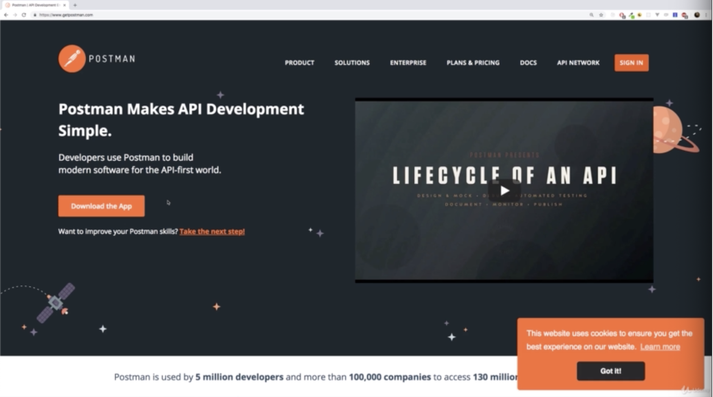
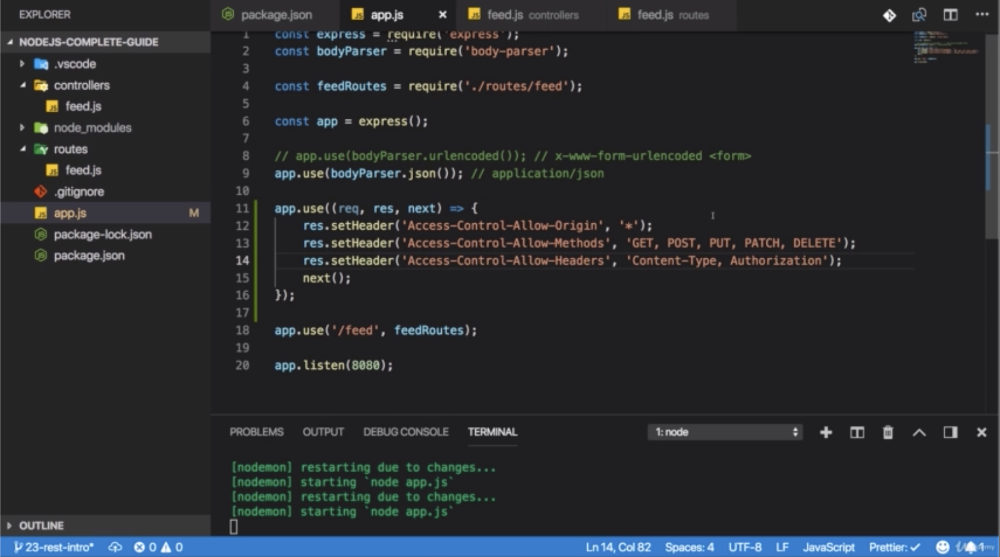
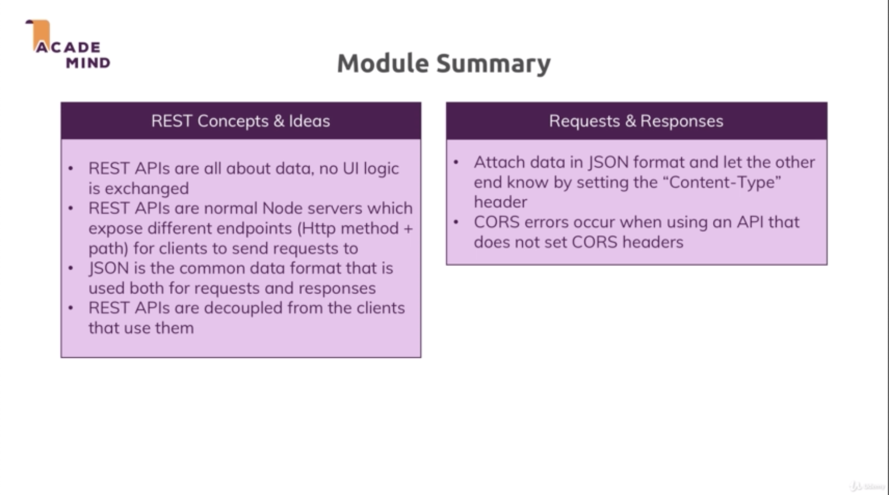

\* Chapter 354: Module Introduction
===================================


\* Chapter 355: What Are REST APIs And Why Do We Use Them?
==========================================================


- for example, the Twitter app, these apps don’t work with server-side rendered HTML code. theny don’t need a templating language on the server to render the HTML code because you build these apps with Java for Android or with Swift Objective C for iOs and you use rich suite of pre-built UI widgets, you use libraries provided by Apple, by Google to build your user interfaces in the respective IDEs of these programming language language like Android Studio for Android development. 

- not just on Udemy but on many modern web application is that you only fetch one initial HTML page that does not really contain a lot of real HTML content but that does load all these javascript script files and then these javascript script reach out to some backend API, to a RESTFUL API and only fetch the data they need to work with to then re-render the user interface. 

- so such web application are very popular because they give us a mobile app like feeling. we click around and we don’t have to wait for a page refresh. we always stay on the same page and only the data that gets rendered changes and therefore only the data is exchanged behind the scenes, all the user interface rendering is done through browser side javascript.

- maybe you are working on a classic node application as we did thus far but you also have certain service API like Google Maps API. it’s not the frontend that requires us to build a REST API on our own but this is another example for a case where you only need the data and no user interface. you don’t expect the Google Maps API to give you back the HTML code. you might be interested in some coordinates, something like this. 

- we have a frontend or we have code that is decoupled from the backend or from a certain backend logic like Google Maps and we only need to exchange the data because we don’t wanna get any user interface, we don’t wanna get HTML Code. we build that on our own. we just have a backend that needs to serve us data and that is a core idea of building REST API.


- we just transfer data and we leave it to the client or to the front-end. be that a mobile app, be that a single page application. 

- REST APIs and Traditional web apps where you render the views on the server are seen as 2 totally different things. but they are not, they only differ in the response and in the kind of data you expect but they don’t differ in what happens on the server besides that the fact that you don’t render the view there and that is really important

- we will reuse 99% of the knowledge, only tune our data usage or our data handling and the response a little bit. 

\* Chapter 356: Accessing Data With REST APIs
=============================================


- one advangtage by the way is that we can use one and the same API for multiple clients. because mobile apps and single page web apps use the same data.


- when we rendered an EJS view, what we did is we sent HTML code to the browser because the view was rendered on the server and the result of that rendering process was HTML page, was HTML code. 

- it’s unnecessarily difficult to parse in plain text because thext is easy for human but for the computer, it isn’t. there is no clear pattern in the text and therefore this is not really a great way of exchanging data. 

- JSON is our winner data format. 

\* Chapter 357: Understanding Routing & HTTP Methods
====================================================


- the core thing is we in the end still send norma requests, these are totally normal requests that don’t expect any HTML response and we send a combination of HTTP method and path and this is how we communicate with our server. 

- in the rest world or in the API world, we like to call these things ‘API endpoints’. so when i’m talking about the combination of a HTTP method like POST and GET and the respective path. these are the endpoints we defined on our REST API and we defined a logic that should execute on the server when a request reaches such an endpoint. 


- if we wanna put a resource onto the server, which means we wanna create it or overwrite an existing resource. POST will never overwrite or should never overwrite. 

- PATCH also don’t overwrite it entirely neccessarily but update parts of it. 

- for the rest world, we should use a POST request to create or append a resource. no one is stopping you from deleting something on a server because you only define a method path pair on your server side and then you run any code you want. and what happens in that code is not restricted by the method that was used to execute that code. you can restrict it yourself and you wanna implement the REST API that follows these ideas but you don’t have to. 

\* Chapter 358: REST APIs - The Core Principles
===============================================


- when building a REST API, the server and the client are totally separated, they don’t share a common history. so no connection history is stored and no sessions will be used because every incoming request is treated as if no prior requests were sent. the server has a look at every request on its own. it doesn’t store a session for the client. it doesn’t care about the client at all.

- for example, like the Google Maps API and you don’t care about the individual client. you just say here are the endpoints i have, here’s the data you get back for each endpoint. here’s the data i expect from you for my endpoints and then i don’t care about you. i don’t store a sesion with you. we have a strong decoupling of the client and the server even if they were to run on the same server because we are building our own API for our own frontend. we still would decouple both so that they work independently and just exchange data. this means that every time we set up a new endpoint, we have to make sure that it works independently from prior requests. and a typical problem is authentication where once we logged in, future requests should be treated as logged in. 

- ‘Cacheable’ means on your REST API, you could send back some headers that tell the client how long the response is valid so that the client may cache the response. 

- ‘Layered System’ means as a client when we send a request to an API, we can’t rely on that server we sent it to you immediately handling the request, the server might instead forward the request or distribute it to another server. ultimately we only care about the data we get back which should follow the structure that was defined by the API.

- ‘Code on demand’ is last optional principle that means API could also for some endpoints transfer executable code to the client. in reality, you don’t see that to often. we are mostly talking about normal data. we are using. 

\* Chapter 359: Creating Our REST API Project & Implementing The Route Setup
============================================================================

1\. update

- .gitignore

- package.json

- app.js

- ./routes/feed.js

- ./controllers/feed.js


- Let’s build our first simple REST API and for that, i’m in a brand new folder. 

- i only did one thing in there, i ran ’npm init’ and confirmed all the default settings. 


- since i’m using version control, i also added a .gitignore file so that i can ignore an upcoming node\_modules folder and that is it. 


- we will use express which is a great all-rounder and therefore i will install as a production dependency with ‘—save express’, we need express to build an API convenitently. 

 

- and i’m gonna install nodemon with development dependency because i still don’t wanna restart my server manually after every change. 


- now to add some routes and to do something with them, i will also install the ‘body-parser’ as a production dependency. so that i can parse incoming request bodies.

- the views folder will not be recreated because we will not render my views anymore. we will just exchange datas.

```js
//.gitignore

node_modules
```

```js
//package.json

{
  "name": "nodejs-complete-guide-2",
  "version": "1.0.0",
  "description": "",
  "main": "index.js",
  "scripts": {
    "test": "echo \"Error: no test specified\" && exit 1",
    "start": "nodemon app.js"
  },
  "author": "",
  "license": "ISC",
  "dependencies": {
    "express": "^4.16.4"
  },
  "devDependencies": {
    "nodemon": "^1.19.0"
  }
}
```

```js
//app.js

const express = require('express')

const feedRoutes = require('./routes/feed')

const app = express();

/**we forward any incoming request to feed route
 * or we only forward requests
 * that start with '/feed'
 * so into ./routes/feed.js file
 * and we handle one request. '/post'
 * so in total, /feed/posts would be handled right now
 * as long as it is a GET request
 */
app.use('/feed', feedRoutes)

app.listen(8080)
```

```js
//./routes/feed.js

const express = require('express')

const feedController = require('../controllers/feed')

const router = express.Router()

// GET /feed/posts
router.get('/posts', feedController.getPosts)

module.exports = router
```

```js
//./controllers/feed.js

exports.getPosts = (req, res, next) => {
    
}
```

\* Chapter 360: Sending Requests & Responses And Working With Postman
=====================================================================

1\. update

- ./controllers/feed.js

- app.js

- ./routes/feed.js


- now we can simply enter ‘localhost:8080/feed/posts’. so you should get some JSON data here.


- and we can see ‘application/json’ was set automatically by our server because we used that json method and we get back the content we defined here. 


- there might be multiple posts and therefore adding or appending sounds good to me and hence i wanna use the POST method instead of PUT. if we were to manage the user data here, then maybe PUT might be better because we create or overwrite the resource. 





- you can choose your method and then send a request. 


- you see that the ‘body’ tab now got enabled. with GET it was disabled because GET requests can’t hold a body. POST requests can. here. you can choose your format and we don’t need any of these. instead i will choose ‘raw’. and then there in the dropdown, JSON(application/json). so now here we can write some JSON data. 


- so we wanna pass these 2 fields to our server ‘req.body.title’, ‘req.body.content’. 


- and now we can click ’Send’ button and we get back a response which loos good because it’s the response i defined.

```js
//./controllers/feed.js

exports.getPosts = (req, res, next) => {
    /**you will not call 'res.render()'
   * because REST APIs don't render views
   * becasue they don't return HTML code
   * 
   * we can pass a normal javascript object to json()
   * and it will be converted to the JSON format
   * and sent back as a response to the client who sent the request.
   * 
   * 'status(200)' is a default
   * but we will work with different status codes throughout this module
   * and we wanna be clear about the status code our response has.
   * 
   * the client now has to render the user interface based on your response
   * and therefore error codes are super important to pass back to the client
   * so that the client can just have a look at the status code
   * should i render my normal user interface
   * because the requests succeeded or did i get an error
   * and i wanna render an appropriate error interface. 
   */
res.status(200).json({
  posts: [{ title: 'First Post', content: 'This is the first post!' }]
});
};

exports.createPost = (req, res, next) => {
const title = req.body.title;
const content = req.body.content;
  //Create post in db
  /**201 is the better status code to use
   * if you wanna tell the client success a resource was created
   * just 200 is just success.
   * 201 indicate that we created a resource. 
   */
  res.status(201).json({
  message: 'Post created successfully!',
  post: { id: new Date().toISOString(), title: title, content: content }
});
};
```

```js
//app.js

const express = require('express')
const bodyParser = require('body-parser')

const feedRoutes = require('./routes/feed')

const app = express();

/**'app.use(bodyParser.urlencoded())'
 * this is great for data format
 * or for requests that hold data in the format of x-www-form-urlencoded
 * this is the default data
 * that data has if submitted through a form post request.
 * but we don't need form data
 * we have no form data
 *
 * instead we wanna use body parser with the json method
 * which is able to parse json data from incoming requests
 * this is good for 'application/json' as is the official name
 * that you will find in the header.
 * this is how the data will be appended to the request that reaches our server.
 * so we need this middleware to parse incoming json data
 * so that we are able to extract it on the body.
 * because 'req.body.title' or 'req.body.content' will be added by body parser
 * this body field on the incoming request.
 *
 * with that
 * we can extract all that data
 * but how can we test this?
 * we can create a form 
 * in which we submit
 * because we would be back to x-www-form-urlencoded data
 * it would not be a realistic test
 * because you don't use forms like this
 * when working with REST APIs
 * 
 * but you can instead use 'postman'
 */
app.use(bodyParser.json())

app.use('/feed', feedRoutes)

app.listen(8080)
```

```js
//./routes/feed.js

const express = require('express');

const feedController = require('../controllers/feed');

const router = express.Router();

// GET /feed/posts
router.get('/posts', feedController.getPosts);

// POST /feed/post
router.post('/post', feedController.createPost);

module.exports = router;
```

\* Chapter 361: REST APIs, Clients & CORS Errors
================================================

1\. update

- app.js


- when you click ‘Get Posts’, and you should get a no access control allow origin headers present error. this is the error you see a lot when building modern web applications and it often leads to a lot of confusion. this error is also called a CORS error and you see the word CORS down there. 


- CORS error is not allowed by browsers. before here, we render our HTML files on the server and therefore they were served by the same server as you send your requests too. so we never had issues

- however here, if client server run on different domains like the client on ‘localhost:4000’ which is a different domain than 3000 and in production, you would run on my [app.com](http://app.com) and let’s say [myAPI.com](http://myAPI.com). if you send requests and responses here, you get problems, you get a CORS error because it’s a security mechanism provided by the browser that you can’t share resources across domains, across servers, across origins. as it’s called here.

- however we can overwrite this becasue this mechanism makes sense for some applications, for REST APIs, it typically doesn’t. we wanna allow our server to share its data. we wanna offer data from our server to different clients and these clients will often not be served by the same server as our API runs on. take Google Maps, you are not running your app on Google servers. but you still can access it and the same is true for your own APi and even if you build both the frontend and backend, you will often serve the 2 ends from different servers because you can choose a server. because you can choose server for the frontend that is optimized for frontend code that really serves that well and you serve your server side code, your node code from a different server, so you will have different domains, different address there too. 

- therefore we need to solve such a CORS error or tell the browser that it may accept the response sent by our server. and to tell the browser, we have to chagne something on the server

- you can’t solve CORS error in frontend javascript code. you can solve in serverside code. we wanna set these headers on any responses that leaves our server. so the app.js file and general middleware is a great place. 


- now it just works as you can see becvause now we set the appropriate CORS headers on the server.

```js
//app.js

const express = require('express')
const bodyParser = require('body-parser')

const feedRoutes = require('./routes/feed')

const app = express();

app.use(bodyParser.json())

/**before i forward the requests to my routes where i will send the response,
 * i wanna add headers to any response.
 * so i will set up a general middleware in app.js
 * which gets my request response next function. 
 */
app.use((req, res, next) => {
    /**'setHeader' only modify it and add a new header.
     * the first header is the 'Access-Control-Allow-Origin'
     * and we wanna set it to all the URLs or domain 
     * that should be able to access our server
     * often you will just set this to '*'(start) to access from any client.
     */
    res.setHeader('Access-Control-Allow-Origin', 'start');
    /**here we allow that origins to use specific HTTP methods
     * because by just unlocking the origins,
     * it would still not work. 
     * we also need to tell the clients, the origins
     * which methods are allowed.
     * there you can allow 'GET, POST, PUT, PATCH, DELETE'
     * you can allow what you wanna be usable from outside.
     */
    res.setHeader('Access-Control-Allow-Methods', 'GET, POST, PUT, PATCH, DELETE');
    /**'Headers' is that our clients might set on their requests
     * now there are some default headers
     * which are always allowed
     * but you wanna add the 'Content-Type' header and 'Authorization' header
     * so that your clients can send requests that hold extra authorization data in the header
     * and also define the content-type of the request
    */
    res.setHeader('Access-Control-Allow-Headers')
    next()
})

app.use('/feed', feedRoutes)

app.listen(8080)
```

```js
//HTML

<button id="get">Get Posts</button>
<button id="post">Create a Post</button>
```

```js
//JS

const getButton = document.getElementById('get');
const postButton = document.getElementById('post');

getButton.addEventListener('click', () => {
  fetch('http://localhost:8080/feed/posts')
    .then(res => res.json())
    .then(resData => console.log(resData))
    .catch(err => console.log(err));
});
```

\* Chapter 362: Sending POST Requests
=====================================

1\. update

- app.js

- ./controllers/feed.js


- i get post created successfully but if we inspect the post object, we see that the title and content are missing because we didn’t send that data. 


- we can see in the console ‘undefined undefined’ so we are not able to extract that data


- because we see the content-type was text/plain and that is the problem. it should be application/json

- but we also see that the request payload was not json data which in the end is just text. but that it was a javascript object which can’t be sent or which can’t be handled. 

- first of all on the body, i will call JSON.stringify() which is method provided by default by javascript. it will take a javascript object and convert it to JSON. we can see that immediately if i click ‘Create a Post’ again. 


- the payload is text in the JSON format but we need to tell the server that our content 


- we can see title or content because now that data is sent and extracted correctly because we send it in the right format and we inform the server about the content type. 

 


- this also allows me to demonstrate what happens if i would comment out this header here, the access-control-allow-headers on the server side. 

- after clicking ‘Create a Post’, i fail because i’m not allowed to set content-type. 



- i allow this by adding this header on the server side. this is how you communicate between client and server.

- the client code differs depending on the client you are using. 


- you might see that i have 2 requests being sent. 


- the second one is our POST requests


- but first request is just ‘POST'. and headers are interesting. Requesting Methods is OPTIONS which would be sent automatically by the browser and also by many mobile app clients. what is the idea behind the options? 


- the browser goes ahead and checks whether the requests you plan to send which is a POST request, that is why, in the request headers, which are generated automatically by the browser, it checks for the POST requests, it checks if that will be allowed. otherwise it will throw an error. 


- this is a mechanism the browser and many other clients use and there is not too much you need to do to make this work. you wanna make sure that you set the right CORS headers here. you can add OPTIONS here to the allowed methods

- but as you see, it was able to make this request before. this is not really something you need to do. but you can do it

- the important thing is that you are not confused by that extra request, it is a mechanism the browser uses to see if the next request, which it wanna view, the post request will succeed if it is allowed.

```js
//HTML

<button id="get">Get Posts</button>
<button id="post">Create a Post</button>
```

```js
//JS

const getButton = document.getElementById('get');
const postButton = document.getElementById('post');

getButton.addEventListener('click', () => {
  fetch('http://localhost:8080/feed/posts')
    .then(res => res.json())
    .then(resData => console.log(resData))
    .catch(err => console.log(err));
});

postButton.addEventListener('click' () => {
  fetch('http://localhost:8080/feed/post', {
    method: 'POST',
    body: JSON.stringify({
      title: 'A Codepen Post',
      content: 'Created via Codepen'
    }),
    headers: {
      'Content-Type': 'application/json'
    }
  })
    .then(res => res.json())
    .then(resData => console.log(resData))
    .catch(err => console.log(err));
});
```

```js
//app.js

const express = require('express')
const bodyParser = require('body-parser')

const feedRoutes = require('./routes/feed')

const app = express();

app.use(bodyParser.json())

app.use((req, res, next) => {
    res.setHeader('Access-Control-Allow-Origin', 'start');
    res.setHeader('Access-Control-Allow-Methods', 'GET, POST, PUT, PATCH, DELETE');
    res.setHeader('Access-Control-Allow-Headers')
    next()
})

app.use('/feed', feedRoutes)

app.listen(8080)
```

```js
//./controllers/feed.js

exports.getPosts = (req, res, next) => {
  res.status(200).json({
  posts: [{ title: 'First Post', content: 'This is the first post!' }]
});
};

exports.createPost = (req, res, next) => {
const title = req.body.title;
const content = req.body.content;
console.log(title, content);
  //Create post in db
  res.status(201).json({
  message: 'Post created successfully!',
  post: { id: new Date().toISOString(), title: title, content: content }
});
};
```

\* Chapter 363: Wrap Up
=======================

