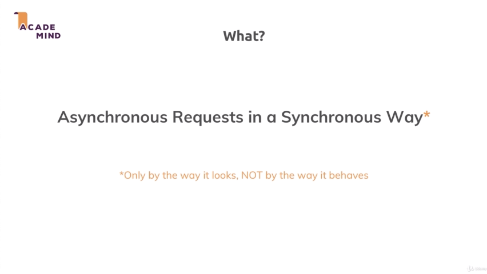
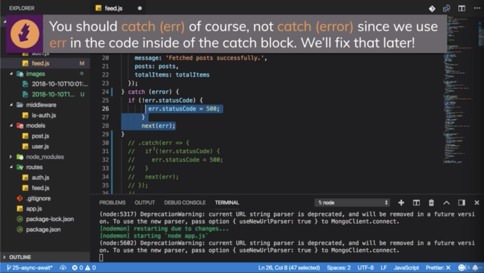
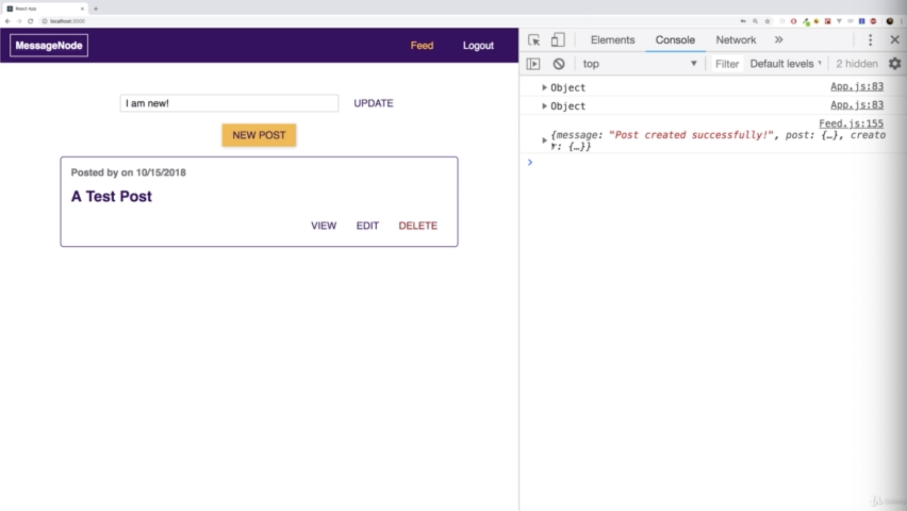
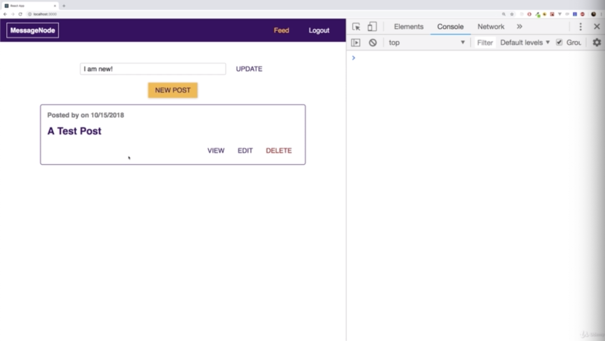

\* Chapter 395: What Is Async Await All About?
==============================================

1\. update

- ./controllers/feed.js(b)



- async and await are 2 keywords which are part of the core javascript language and not an exclusive part of the node.js runtime. they are not part of node.js but you can use them in node.js project.

- Async allows you to write asynchronous requests so requests where you have some operation that takes a little while and comes back later in a synchronous way and you see there is an asterisk after synchronous way because in a way it allows you to write asynchronous statements in a way that looks synchronous but it still isn’t a synchronous requests.

```js
//./controllers/feed.js(b)

const fs = require('fs');
const path = require('path');

const { validationResult } = require('express-validator/check');

const Post = require('../models/post');
const User = require('../models/user');

exports.getPosts = (req, res, next) => {
  const currentPage = req.query.page || 1;
  const perPage = 2;
  let totalItems;
  Post.find()
  /**you could define a function that gets executed
   * once it's done instead of '.then()' like below
   *
   *    Post.find().countDocuments(count => {})
   *
   * but we don't use callbacks
   * because in there, we would use that code
   *
   *    Post.find().countDocuments(count => {
        totalItems = count;
        return Post.find()
          .skip((currentPage - 1) * perPage)
          .limit(perPage);
        })
   *
   * and then we would need a callback in the '.find()' function
   * and we would nest all these callbacks(count => {})
   * leading to very unreadable code
   * that is why you often prefer promises
   * even though you could do it with callbacks
   * because you have one then block after each other
   * and it's very readable. 
   * */
    .countDocuments()
    .then(count => {
      totalItems = count;
      return Post.find()
        .skip((currentPage - 1) * perPage)
        .limit(perPage);
    })
    .then(posts => {
      res.status(200).json({
        message: 'Fetched posts successfully.',
        posts: posts,
        totalItems: totalItems
      });
    })
    .catch(err => {
      if (!err.statusCode) {
        err.statusCode = 500;
      }
      next(err);
    });
  /**if there is some code under the async codes,
   * then code under the async codes will be executed
   * before async code(.then, .catch).
   * the reason for that is that
   * with '.then()' we define code snippets
   * or we define functions that should run in the future
   * once it is longer taking a synchronous operation is done
   * and it's called asynchronous
   * because it doesn't happen instantly
   * but it takes a little while
   *
   * callbacks are another way of working with asynchronous code
   */
};

exports.createPost = (req, res, next) => {
  const errors = validationResult(req);
  if (!errors.isEmpty()) {
    const error = new Error('Validation failed, entered data is incorrect.');
    error.statusCode = 422;
    throw error;
  }
  if (!req.file) {
    const error = new Error('No image provided.');
    error.statusCode = 422;
    throw error;
  }
  const imageUrl = req.file.path;
  const title = req.body.title;
  const content = req.body.content;
  let creator;
  const post = new Post({
    title: title,
    content: content,
    imageUrl: imageUrl,
    creator: req.userId
  });
  post
    .save()
    .then(result => {
      return User.findById(req.userId);
    })
    .then(user => {
      creator = user;
      user.posts.push(post);
      return user.save();
    })
    .then(result => {
      res.status(201).json({
        message: 'Post created successfully!',
        post: post,
        creator: { _id: creator._id, name: creator.name }
      });
    })
    .catch(err => {
      if (!err.statusCode) {
        err.statusCode = 500;
      }
      next(err);
    });
};

exports.getPost = (req, res, next) => {
  const postId = req.params.postId;
  Post.findById(postId)
    .then(post => {
      if (!post) {
        const error = new Error('Could not find post.');
        error.statusCode = 404;
        throw error;
      }
      res.status(200).json({ message: 'Post fetched.', post: post });
    })
    .catch(err => {
      if (!err.statusCode) {
        err.statusCode = 500;
      }
      next(err);
    });
};

exports.updatePost = (req, res, next) => {
  const postId = req.params.postId;
  const errors = validationResult(req);
  if (!errors.isEmpty()) {
    const error = new Error('Validation failed, entered data is incorrect.');
    error.statusCode = 422;
    throw error;
  }
  const title = req.body.title;
  const content = req.body.content;
  let imageUrl = req.body.image;
  if (req.file) {
    imageUrl = req.file.path;
  }
  if (!imageUrl) {
    const error = new Error('No file picked.');
    error.statusCode = 422;
    throw error;
  }
  Post.findById(postId)
    .then(post => {
      if (!post) {
        const error = new Error('Could not find post.');
        error.statusCode = 404;
        throw error;
      }
      if (post.creator.toString() !== req.userId) {
        const error = new Error('Not authorized!');
        error.statusCode = 403;
        throw error;
      }
      if (imageUrl !== post.imageUrl) {
        clearImage(post.imageUrl);
      }
      post.title = title;
      post.imageUrl = imageUrl;
      post.content = content;
      return post.save();
    })
    .then(result => {
      res.status(200).json({ message: 'Post updated!', post: result });
    })
    .catch(err => {
      if (!err.statusCode) {
        err.statusCode = 500;
      }
      next(err);
    });
};

exports.deletePost = (req, res, next) => {
  const postId = req.params.postId;
  Post.findById(postId)
    .then(post => {
      if (!post) {
        const error = new Error('Could not find post.');
        error.statusCode = 404;
        throw error;
      }
      if (post.creator.toString() !== req.userId) {
        const error = new Error('Not authorized!');
        error.statusCode = 403;
        throw error;
      }
      // Check logged in user
      clearImage(post.imageUrl);
      return Post.findByIdAndRemove(postId);
    })
    .then(result => {
      return User.findById(req.userId);
    })
    .then(user => {
      user.posts.pull(postId);
      return user.save();
    })
    .then(result => {
      res.status(200).json({ message: 'Deleted post.' });
    })
    .catch(err => {
      if (!err.statusCode) {
        err.statusCode = 500;
      }
      next(err);
    });
};

const clearImage = filePath => {
  filePath = path.join(__dirname, '..', filePath);
  fs.unlink(filePath, err => console.log(err));
};

```

\* Chapter 396: Transforming “Then Catch” To “Async Await”
==========================================================

1\. update

- ./controllers/feed.js(b)








```js
//./controllers/feed.js(b)

const fs = require('fs');
const path = require('path');

const { validationResult } = require('express-validator/check');

const Post = require('../models/post');
const User = require('../models/user');
/**if you use async and await,
 * then prepend async in front of arrow function
 * where you you plan to use await keyword
 * so where you wanna use these 2 keywords
 * they always are used together async in front of the function
 *
 */

exports.getPosts = async (req, res, next) => {
  const currentPage = req.query.page || 1;
  const perPage = 2;
  let totalItems;
  /**since this now runs almost like asynchronous code,
   * we use 'try and catch'
   */
  try {
  /**you can write this syntax almost
   * as if it would run synchronously.
   * you can get your count a new constant or variable you create
   * by awaiting Post.find().countDocuments()
   * and then you would get rid of this '.then()' block
   *
   * this looks like normal javascript code
   * but behind the scenes async await it takes your code
   * and transforms it into the old '.then()'-like structure we used.
   * so it uses then behind the scenes we just can't see it.
   * and we have this more convenient way of writing our asynchronous code.
   * 
   * await does some behind the scenes transformation of your code
   * it takes your code and adds then after it
   * gets the result of that operation
   * and then stores it in totalItems.
   * then moves onto the next line execute that inside of that ".then" block
   * it creates implicitly. 
   * 
   * so the exact same code we had before
   * this is done by a single await behind the scenes. 
   */
    const totalItems = await Post.find().countDocuments();
    const posts = await Post.find()
      .skip((currentPage - 1) * perPage)
      .limit(perPage);

    res.status(200).json({
      message: 'Fetched posts successfully.',
      posts: posts,
      totalItems: totalItems
    });
  } catch (error) {
    if (!err.statusCode) {
      err.statusCode = 500;
    }
    next(err);
  }
};

exports.createPost = (req, res, next) => {
  const errors = validationResult(req);
  if (!errors.isEmpty()) {
    const error = new Error('Validation failed, entered data is incorrect.');
    error.statusCode = 422;
    throw error;
  }
  if (!req.file) {
    const error = new Error('No image provided.');
    error.statusCode = 422;
    throw error;
  }
  const imageUrl = req.file.path;
  const title = req.body.title;
  const content = req.body.content;
  let creator;
  const post = new Post({
    title: title,
    content: content,
    imageUrl: imageUrl,
    creator: req.userId
  });
  post
    .save()
    .then(result => {
      return User.findById(req.userId);
    })
    .then(user => {
      creator = user;
      user.posts.push(post);
      return user.save();
    })
    .then(result => {
      res.status(201).json({
        message: 'Post created successfully!',
        post: post,
        creator: { _id: creator._id, name: creator.name }
      });
    })
    .catch(err => {
      if (!err.statusCode) {
        err.statusCode = 500;
      }
      next(err);
    });
};

exports.getPost = (req, res, next) => {
  const postId = req.params.postId;
  Post.findById(postId)
    .then(post => {
      if (!post) {
        const error = new Error('Could not find post.');
        error.statusCode = 404;
        throw error;
      }
      res.status(200).json({ message: 'Post fetched.', post: post });
    })
    .catch(err => {
      if (!err.statusCode) {
        err.statusCode = 500;
      }
      next(err);
    });
};

exports.updatePost = (req, res, next) => {
  const postId = req.params.postId;
  const errors = validationResult(req);
  if (!errors.isEmpty()) {
    const error = new Error('Validation failed, entered data is incorrect.');
    error.statusCode = 422;
    throw error;
  }
  const title = req.body.title;
  const content = req.body.content;
  let imageUrl = req.body.image;
  if (req.file) {
    imageUrl = req.file.path;
  }
  if (!imageUrl) {
    const error = new Error('No file picked.');
    error.statusCode = 422;
    throw error;
  }
  Post.findById(postId)
    .then(post => {
      if (!post) {
        const error = new Error('Could not find post.');
        error.statusCode = 404;
        throw error;
      }
      if (post.creator.toString() !== req.userId) {
        const error = new Error('Not authorized!');
        error.statusCode = 403;
        throw error;
      }
      if (imageUrl !== post.imageUrl) {
        clearImage(post.imageUrl);
      }
      post.title = title;
      post.imageUrl = imageUrl;
      post.content = content;
      return post.save();
    })
    .then(result => {
      res.status(200).json({ message: 'Post updated!', post: result });
    })
    .catch(err => {
      if (!err.statusCode) {
        err.statusCode = 500;
      }
      next(err);
    });
};

exports.deletePost = (req, res, next) => {
  const postId = req.params.postId;
  Post.findById(postId)
    .then(post => {
      if (!post) {
        const error = new Error('Could not find post.');
        error.statusCode = 404;
        throw error;
      }
      if (post.creator.toString() !== req.userId) {
        const error = new Error('Not authorized!');
        error.statusCode = 403;
        throw error;
      }
      // Check logged in user
      clearImage(post.imageUrl);
      return Post.findByIdAndRemove(postId);
    })
    .then(result => {
      return User.findById(req.userId);
    })
    .then(user => {
      user.posts.pull(postId);
      return user.save();
    })
    .then(result => {
      res.status(200).json({ message: 'Deleted post.' });
    })
    .catch(err => {
      if (!err.statusCode) {
        err.statusCode = 500;
      }
      next(err);
    });
};

const clearImage = filePath => {
  filePath = path.join(__dirname, '..', filePath);
  fs.unlink(filePath, err => console.log(err));
};

```