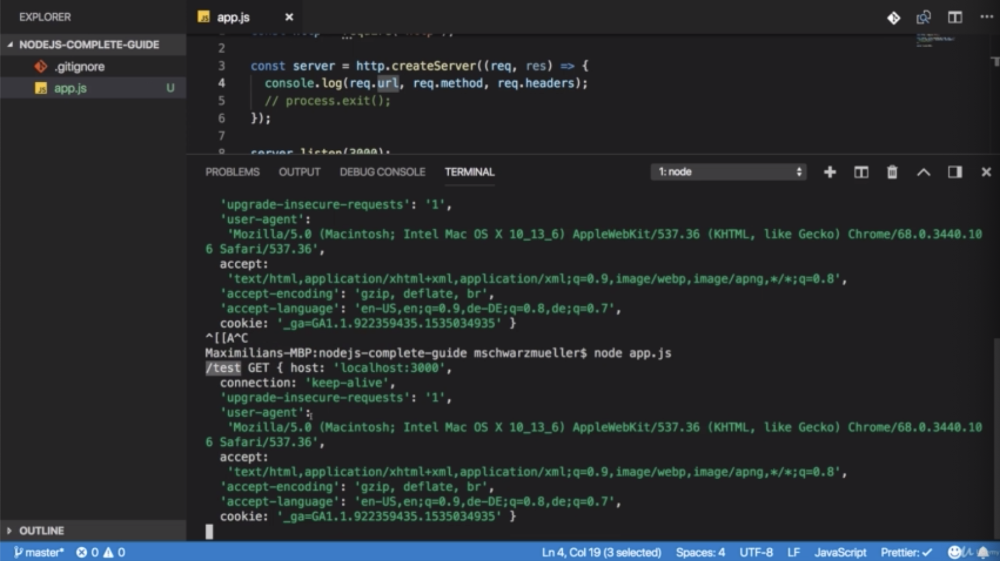
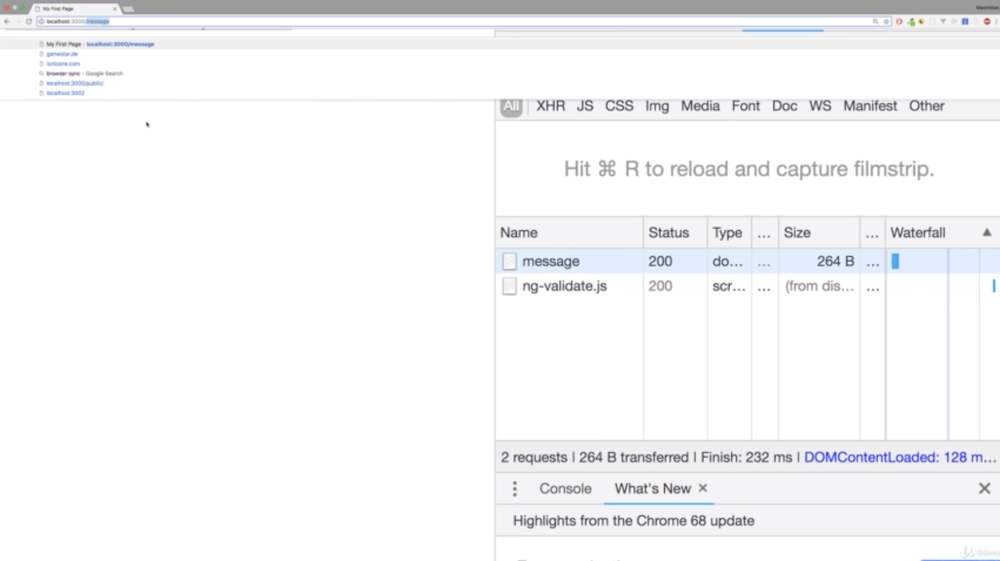
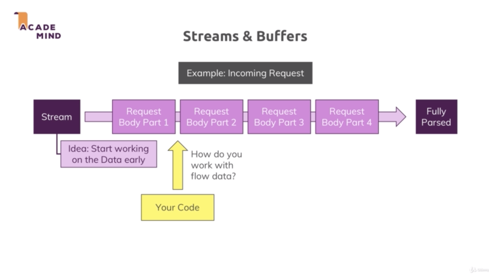
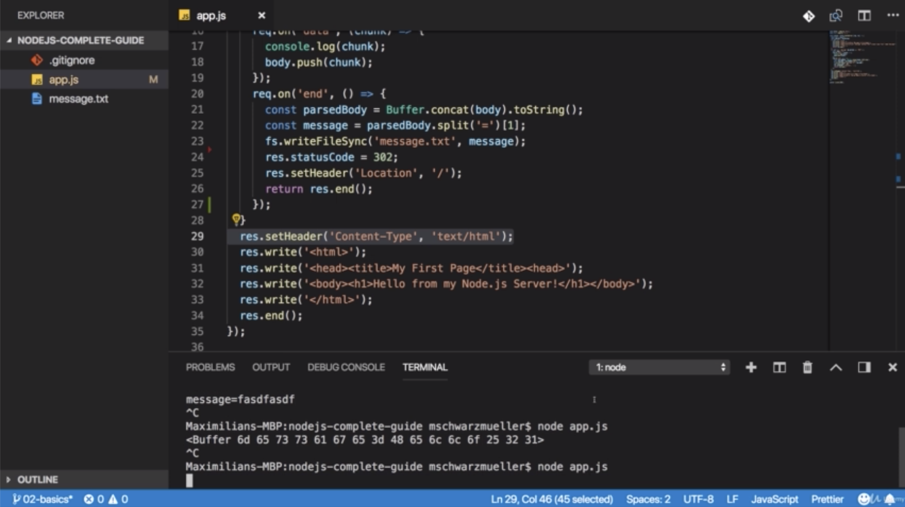

\* Chapter 23: Module Introduction
==================================


\* Chapter 24: How The Web Works
================================


\* Chapter 25: Creating a Node Server
=====================================


- in browser, nothing happens but if you go back to terminal, you will see a lot of output there and that is your request being logged to the console.

```js
//app.js

//how to creating a node server 1.

const http = require('http')

function rqListener(req, res){
    
}

/**this is like saying that "Look for 'rqListener' function with this name
 * and execute it for every incoming request" */
http.createServer(rqListener)

//how to creating a node server 2 (using anonymous function)

const http = require('http')
http.createServer(function(req, res){})

//how to creating a node server 3 (using arrow function)

const http = require('http')
http.createServer((req, res) => {})
```

```js
//app.js

/**this is the way you import file in node.js 
 * you can import your own javascript files
 * or if you don't have a path to one of your files,
 * you can also import a core module like http
 * 
 * a path to one of your files always has to start with ./(relative path) or /(absolute path)
 * and it's up to you to use '.js' or not
*/
const http = require('http')

const server = http.createServer((req, res) => {
    console.log(req)
})

/**'listen()' start a process where node.js will not immediately exit our script
 * but where node.js will instead keep this running to listen for incoming request.
 * 
 * default hostname will be the name of the machine this is running on,
 * so for our local machine, this is localhost by default
 */
server.listen(3000)
```

\* Chapter 26: The Node Lifecycle & Event Loop
==============================================


```js
//app.js

const http = require('http');

const server = http.createServer((req, res) => {
    console.log(req);
    //process.exit()
})

server.listen(3000)
```

\* Chapter 27: Controlling The Node.js Process
==============================================

- Do you wanna quit your running Node.js Server

- You can always do that by pressing CTRL + C in the terminal / command prompty window where you started your server (i.e. where you ran node app.js)

\* Chapter 28: Understanding Requests
=====================================


- now the URL has changed. we still have all the header stuff, because we are outputting request headers but prior to that, we output the method which you see here

- it’s GET and you see the URL and the URL is just the slach / because URL is basically everything after our host and we just have localhost and that basically translate to localhost/




- if i had /test, we see another output and there we see another output and there we see /test being logged here and then also get for the method and our headers. 

- this is basically how we can access some information about our request. 

\* Chapter 29: Sending Responses
================================


```js
//app.js

const http = require('http');

const server = http.createServer((req, res) => {
    console.log(req.url, req.method, req.headers);
    //process.exit()
    /**'Content-Type' is default header which the browser knows
     * and understand and accepts 
     * and in setHeader, we set the value for this header key in 2nd argument
     * now 'text/html' will attach a header to our response where we pass some meta information
     * saying that the type of the content which will also be part of the response is html
     */
    res.setHeader('Content-Type', 'text/html')
    /**'write' allows us to write some data to the response
     * and works in chunks 
     */
    res.write('<html>')
    res.write('<headd><title>My First Page</title></headd>')
    res.write('<body><h1>Hello from my Node.js SErver!</h1></body>')
    res.write('</html>')
    /**once we are done with creating that response
     * and we do this by calling end()
     * after end(), we can write nothing
     * because end() is the part where we will send it back to the client
     */
    res.end()
})

server.listen(3000)
```

\* Chapter 31: Routing Requests
===============================


 

- let’s say localhost:3000/, then we wanna load a page where the user can enter some data which we store in a file on the server once it is sent. 

- we can do this by first of all parsing the URL. i’m storing it in a new constant and i do this by accessing request URL which was something like / or /test which what we entered. 




```js
//app.js

const http = require('http');

const server = http.createServer((req, res) => {
    const url = req.url
    if(url === '/'){
        res.write('<html>')
        res.write('<headd><title>My First Page</title></headd>')
        /**action is the url this request which will be generated automatically should be sent to
         * and i will use '/message' here
         * and this will automatically target the host it's running on. so localhost:3000
         * and http 'method' should be used and  there we previously saw
         * if we expand this, we get a GET request which is the default if we enter the URL
         * 
         * 'POST' request has to be set up by you by creating such a form 
         * 'GET' request is automatically sent when you click a link or enter the URL
         * 
         * 'message' will automatically put that message into the request
         * so when we visit localhost:3000/ , we will return a response where we render this HTML code
         */
        res.write(
            '<body><form action="/message" method="POST"><input type="text" name="message"><button type="submit">Send</button></form></body>
            '
        )
        
        res.write('</html>')
        /**this is not required to return the response
         * but to return from this anonymous function and to not continue this code below
         */ 
        return res.end()
    }
    res.setHeader('Content-Type', 'text/html')
    res.write('<html>')
    res.write('<headd><title>My First Page</title></headd>')
    res.write('<body><h1>Hello from my Node.js SErver!</h1></body>')
    res.write('</html>')
    res.end()
})

server.listen(3000)
```

```js
//clean version

//app.js

const http = require('http');
const fs = require('fs');

const server = http.createServer((req, res) => {
  const url = req.url;
  const method = req.method;
  if (url === '/') {
    res.write('<html>');
    res.write('<head><title>Enter Message</title><head>');
    res.write('<body><form action="/message" method="POST"><input type="text" name="message"><button type="submit">Send</button></form></body>');
    res.write('</html>');
    return res.end();
  }
  if (url === '/message' && method === 'POST') {
    fs.writeFileSync('message.txt', 'DUMMY');
    res.statusCode = 302;
    res.setHeader('Location', '/');
    return res.end();
  }
  res.setHeader('Content-Type', 'text/html');
  res.write('<html>');
  res.write('<head><title>My First Page</title><head>');
  res.write('<body><h1>Hello from my Node.js Server!</h1></body>');
  res.write('</html>');
  res.end();
});

server.listen(3000);
```

\* Chapter 32: Redirecting Requests
===================================


- after filling input field and send any value, then you should simply reload that in the end because you get redirected but you can see that redirect inthe network tab of the devtool in chrome, but status 302 indicates we send a request to message


```js
//app.js

const http = require('http');
const fs = require('fs');

const server = http.createServer((req, res) => {
  const url = req.url;
  const method = req.method;
  if (url === '/') {
    res.write('<html>');
    res.write('<head><title>Enter Message</title><head>');
    res.write('<body><form action="/message" method="POST"><input type="text" name="message"><button type="submit">Send</button></form></body>');
    res.write('</html>');
    return res.end();
  }
  if (url === '/message' && method === 'POST') {
    fs.writeFileSync('message.txt', 'DUMMY');
    res.statusCode = 302;
    res.setHeader('Location', '/');
    return res.end();
  }
  res.setHeader('Content-Type', 'text/html');
  res.write('<html>');
  res.write('<head><title>My First Page</title><head>');
  res.write('<body><h1>Hello from my Node.js Server!</h1></body>');
  res.write('</html>');
  res.end();
});

server.listen(3000);
```

\* Chapter 33: Parsing Request Bodies
=====================================



- Our stream is an ongoing process. the request is simply read by node in chunks. in multiple parts and in the end at some point of time it’s done. this is done so that we theretically can start working on this, on the individual chunks without having to wait for the full request being read. now for a simple request like the one we are working with, this is not really required. we only get one input field data. it doesn’t take so long to parse that.

- but consider a file being uploaded. this will considerably longer and therefore streaming that data could make sense because it could allow you to start writing this to your disk. so to your hard drive where your app runs, your node app runs on your server while that data is coming in, so that you don’t have to parse the entire file which is taking sometime and you have to wait for it being fully uploaded before you can do anything with it.

- this is how node handles all requests because it doesn’t know it advance how complex and big they are.

----------------------------------------------------------------------------------------------------


- the problem is with your code, you can’t arbitrarily try to work with these chunks. instead to organize these incoming chunks, you use a so-called buffer. buffer is like a bus stop. if you consider buses, they’re alway driving but for users or customers being able to work with them, to climb on the bus and leave the bus, you need bus stops where you can track the bus and this is what a buffer is. 

- buffer is a construct which allows you to hold multiple chunks and work with them before they are released once you are done and you work with the buffer.


- ‘\<Buffer 6d 65 73 73 61 67 65 3d 66 61 73 64 66 61 73 64 66\>’ is a chunk we can’t work with.

- but the ‘message=fasdfasdf’ which is the parsedBody receive or yields this line and that is something we can work with 

and it’s message equals something because we named our input here message and as i said, that form will automatically send that request where it takes all the input data and puts it into the request body as key value pairs where the names assigned to the inputs are the keys and the values are what the user entered and that’s what we have here. ‘message=fasdfasdf’

- an with that, we can now work with that and finally store the input in our file and we can do that ‘parsedBody’


```js
//app.js

const http = require('http');
const fs = require('fs');

const server = http.createServer((req, res) => {
  const url = req.url;
  const method = req.method;
  if (url === '/') {
    res.write('<html>');
    res.write('<head><title>Enter Message</title><head>');
    res.write('<body><form action="/message" method="POST"><input type="text" name="message"><button type="submit">Send</button></form></body>');
    res.write('</html>');
    return res.end();
  }
  if (url === '/message' && method === 'POST') {
    /**i will create a new constant 'body' here
     * because i will try to read the request body
     * 
     * const means 'we can never re-assign new value.'
     * but push() we are changing the object behind that body element we are editing 
     * that data in that object not the value itself,
     * 
     */
    const body = [];
    /**'on()' allows us to listen to certain events and the event i wanna listen to is the data event
     * data event will be fire whenever a new chunk is ready to be read
     * that buffer thing is helping us with that. 
     * 
     * we have to add a second argument which is that function
     * which should be executed for every data event.
     * 
     * this listener receives a chunk of data.
     * so here we receive a chunk which is something we can work with here
     * and we have to something with this chunk to be able to interact with it.
     */
    req.on('data', (chunk) => {
      console.log(chunk);
      body.push(chunk);
    });
    /**'end' listener will be fired when once it's done parsing the incoming requests data or incoming requests in general.
     * 
     * i will use Buffer object which is available globally. 
     * why we convert to String is because the incoming data will be text 
     * because the body of that request will be text. 
     * if it were a file, we would have to do something different.
     */
    req.on('end', () => {
      const parsedBody = Buffer.concat(body).toString();
      /**'[1]' is index of value in key-value pair */
      const message = parsedBody.split('=')[1];
      fs.writeFileSync('message.txt', message);
    });
    res.statusCode = 302;
    res.setHeader('Location', '/');
    return res.end();
  }
  res.setHeader('Content-Type', 'text/html');
  res.write('<html>');
  res.write('<head><title>My First Page</title><head>');
  res.write('<body><h1>Hello from my Node.js Server!</h1></body>');
  res.write('</html>');
  res.end();
});

server.listen(3000);
```

```js
//message.txt

'%21' is exclamation mark(!) 

Hello%21
```

```js
//clean version

//app.js

const http = require('http');
const fs = require('fs');

const server = http.createServer((req, res) => {
  const url = req.url;
  const method = req.method;
  if (url === '/') {
    res.write('<html>');
    res.write('<head><title>Enter Message</title><head>');
    res.write('<body><form action="/message" method="POST"><input type="text" name="message"><button type="submit">Send</button></form></body>');
    res.write('</html>');
    return res.end();
  }
  if (url === '/message' && method === 'POST') {
    const body = [];
    req.on('data', (chunk) => {
      console.log(chunk);
      body.push(chunk);
    });
    req.on('end', () => {
      const parsedBody = Buffer.concat(body).toString();
      const message = parsedBody.split('=')[1];
      fs.writeFileSync('message.txt', message);
    });
    res.statusCode = 302;
    res.setHeader('Location', '/');
    return res.end();
  }
  res.setHeader('Content-Type', 'text/html');
  res.write('<html>');
  res.write('<head><title>My First Page</title><head>');
  res.write('<body><h1>Hello from my Node.js Server!</h1></body>');
  res.write('</html>');
  res.end();
});

server.listen(3000);

```

\* Chapter 34: Understanding Event Driven Code Execution
========================================================

- the order of execution of your code is not necessarily the order in which you write it. for example,

```js
req.on('end', () => {
    const parsedBody = Buffer.concat(body).toString();
    const message = parsedBody.split('=')[1]
    fs.writeFileSync('message.txt', message)
})
```

will execute after this code.

```js
    res.statusCode = 302;
    res.setHeader('Location', '/');
    return res.end();
```

so it will even execute after we already sent the response.

- sending the response doesn’t mean that our event listeners are dead. they will still execute even if the response is already gone.

- but it also means that if we do something in the event listener that should influence the response this is a wrong way of setting it up. we should then also move the response code into the event listener. if we had such a dependency like below

```js
req.on('end', () => {
    const parsedBody = Buffer.concat(body).toString();
    const message = parsedBody.split('=')[1];
    fs.writeFileSync('message.txt', message)
    res.statusCode = 302
    res.setHeader('Location', '/')
    return res.end()
})
```

- and ‘req.on()’ and ‘http.createServer()’ are examples where node.js uses a pattern where you pass a function to a function and node.js will execute these passed in functions at a later point of time which is called asynchronously. now it’s not always the case that a passed-in function is necessarly executed at a later point of time. but node.js has used this pattern heaveily and let you know when this is to case and when node executes something asynchronously. 

- in such case, node.js won’t immediately run that function. instead, it will add a new event listener internally, it manages all these listeners initially. in this case for the ‘end’ event. and then it iwll then call that function for you once it is done

- so in the end, you can think of this like node.js having some internal registry of events and listeners to these events and a function like this is such a listener and when served something happens.

- when node.js is done parsing your request, it will go through the registry and see ‘i’m done with the request so i should now send the end event.’ so let’s see which listener i have for that, and will then find this function

```js
req.on('end', () => {
    const parsedBody = Buffer.concat(body).toString();
    const message = parsedBody.split('=')[1];
    fs.writeFileSync('message.txt', message)
    res.statusCode = 302
    res.setHeader('Location', '/')
    return res.end()
})
```

- and any other functions will now call them but it will not POST code execution. 

- flow is like this

 - it will reach if statement and if these conditions are met, it will go inside of it.

 - it will then register these 2 handlers(req.on()) and not immediately execute inner function. instead the functions are just registered internally in. it’s event emitter registry and then it will jump to the next line(res.setHeader()~res.end())




 - if i enter something here and i get redirected to this page or not even redirect it as you can see. there is no 300 status code


 - instead of just this line(res.setHeader()~res.end()). because it executes these lines because it will not execute inner function of below right away.

```js
req.on('end', () => {
    const parsedBody = Buffer.concat(body).toString();
    const message = parsedBody.split('=')[1];
    fs.writeFileSync('message.txt', message)
    res.statusCode = 302
    res.setHeader('Location', '/')
    return res.end()
})
```

- so this return statement will therefore not quit this overarching function. instead it just registers this callback and immediately move onto the next line. this above codes eventually will be executed but that is already too late. that’s why we get ‘Cannot set headers after they are sent to the client’ because it already moved the long and executed this code.

 - when all of sudden the parsing of the request finished, and it executed callback innerfunction and tried to again send a response which obviously it too late because it already did here. 

- you can register callback function which run sometime in the future but not necessarily right now. so therefore the next line of code(res.setHeader()~res.end()) will run before callback function

- this setup is important because otherwise node would have to pause until it’s done pause until it wrote the file and if it does that, it will simply slow our server down and it’s not able to handle our incoming requests or do anything of that kind until it’s done

\* Chapter 35: Blocking and Non-Blocking Code
=============================================


- ’Sync’ in ‘writeFileSync’ stands for synchronous and this is special method which will block code execution until this file is created.

- if you do something with the huge file, you block the code execution until huge file is done. then the next line and all the other code will not continue to run until that file operation is done. 

- so it’s better to use ‘writeFile()’ method than ‘writeFileSync()’ method. and 3rd argument is callbackfunction which will be executed when it’s done. so there i pass another function and this callback function receive an error object which will be null if no error occurs.


```js
const http = require('http');
const fs = require('fs');

const server = http.createServer((req, res) => {
  const url = req.url;
  const method = req.method;
  if (url === '/') {
    res.write('<html>');
    res.write('<head><title>Enter Message</title><head>');
    res.write(
      '<body><form action="/message" method="POST"><input type="text" name="message"><button type="submit">Send</button></form></body>'
    );
    res.write('</html>');
    return res.end();
  }
  if (url === '/message' && method === 'POST') {
    const body = [];
    req.on('data', chunk => {
      console.log(chunk);
      body.push(chunk);
    });
    return req.on('end', () => {
      const parsedBody = Buffer.concat(body).toString();
      const message = parsedBody.split('=')[1];
      fs.writeFile('message.txt', message, err => {
        res.statusCode = 302;
        res.setHeader('Location', '/');
        return res.end();
      });
    });
  }
  res.setHeader('Content-Type', 'text/html');
  res.write('<html>');
  res.write('<head><title>My First Page</title><head>');
  res.write('<body><h1>Hello from my Node.js Server!</h1></body>');
  res.write('</html>');
  res.end();
});

server.listen(3000);

```

\* Chapter 36: Node.js - Looking Behind The Scenes
==================================================


- ’thread’ is basically like a process in your operating system. 

- Event Loop is automatically started by node.js when your program starts.

- long taking file operation is not handled by event loop, just the callback that we might have defined on writeFile once it’s done. the event loop will only handle callbacks that contain fast finishing code. 

- Worker Pool is spun up and managed by node.js automatically and automatically. this worker pool is responsible for all the heavy lifting. Worker Pool is really detached from your code and this worker pool is therefore doing all the heavy lifting. if you’re doing something with a file, well a worker from that pool will take care and will do its job totally detached from your code and from the request and from the event loop.

- The one connection to the event loop we will have though is that once the worker is done, so for example once we read a file, it will trigger the callback for that read file operation and since the event loop is responsible for the event and the callbacks, this will in the end end up in the event loop. 


- at the beginning of each new iteration, it checks if there are any timer callbacks it should execute. 

- in node.js, you set a timer and always pass a method, a function that should be executed once that timer completes and node.js is aware of this and at that beginning of each new loop iteration, it executes any due timer callback. so any callbacks that have to be executed because timer completes. 

------------------------------------------------------------------------------------------------------------------------

- then as a next step, it checks other callback for example, if we had write or read file, we might have a callback because that operation finished and it will then execute these callbacks. 

- in here, I/O means blocking operation

- it’s important to understand that node.js will leave that phase at a certain point of time and that can also mean that if there are too many outstanding callbacks, it will continue its loop iteration and posttone these callbacks to the next iteration to execute them. After working on these open callbacks and hopefully finishing them all, it will enter a poll phase

————————————————————————————————————————————————————————————

- The Poll phase is a phase where node.js will look for new I/O event and do its best to execute their callbacks immediately if possible. if that’s not possible, it will defer the execution and register this as a pending callback.

————————————————————————————————————————————————————————————

- and it also will check if there are any timer callbacks due to be executed and if that is the case, it will jump to that timer phase and execute them right away. so it can actually jump back there and not finish the iteration otherwise it continue.

————————————————————————————————————————————————————————————

- and next setImmediate() callbacks will be executed in a so-called check phase. setImmediate() is like setTimeout or setInterval, just that it will execute immediately but always after any open callbakcks have been executed. so typically faster than setTimeout with 1 millisecond of open duration, but after the current cycle well finished or at least finished open callbacks that were duto be handled in that current iteration. 

————————————————————————————————————————————————————————————

- now we are entering a highly theoretical terrain. now we are nearing the end of each iteration cycle and now node.js will execute all close event callbacks. so if you registered any close events and in our code we haven’t but if you had any close event, this would be the point of time where node.js executes their appropriate callbacks. 

- close events are basically handled separately or their callbacks are handled separately.

————————————————————————————————————————————————————————————

- and then we might exit the whole node.js program but only if there are no remaining event handler which are registered and that is what i mean with this refs==null here, internally node.js keeps track of its open listener and it basically has a counter, references or refs which increments by 1 for every new callback that is registered, every new event listener that is registered. so every new future work that it has to do. and it reduces that counter by 1 for every event listener that it doesn’t need anymore every callback it finished and since in a server environment, we create a server with createServer and then listen to incoming request with listen, this is an event which never is finished by default and therefore, we always have at least one reference and therefore we don’t exit in a normal node web server program. we can call the exit function.

- when we used node to execute a file that didn’t listen to a web server or on a web server, then it also finishes eventually once its done with its works.

\* Chapter 37: Using The Node Modules System
============================================


- we split our code over 2 files, having 1 file which is very lean that just spins up the server.

- that’s important that also create a connection to another file through that import and through that export where we export our requestHandler function. 

- now One important node about node module system, the file content is actually cached by node and we can’t edit it externally. 


- if we somehow would define routes as an object and we tried to add a new property on the fly like above, this would not manipulate the original file. so this is basically locked, not accessible from outside. we can only export stuff that we can now read from outside. 

- though you could have functions which you export that start changing stuff inside of that file

- sometimes you export many things then do like below

```js
module.exports = {
    handler: requestHandler,
    someText: 'Some ahrd coded text'
}
```

or

```js
module.exports.handler = requestHandler
module.exports.someText = 'Some hard coded text'
```

or

```js
//shortcut provided by node.js

exports.handler = requestHandler
exports.someText = 'Some hard coded text'
```

to

```js
const routes = require('./routes')

console.log(routes.someText)
const server = http.createServer(routes.handler);

server.listen(3000);
```

```js
//app.js

const http = require('http');

const routes = require('./routes');

console.log(routes.someText);

const server = http.createServer(routes.handler);

server.listen(3000);

```

```js
//routes.js

const fs = require('fs');

const requestHandler = (req, res) => {
  const url = req.url;
  const method = req.method;
  if (url === '/') {
    res.write('<html>');
    res.write('<head><title>Enter Message</title><head>');
    res.write(
      '<body><form action="/message" method="POST"><input type="text" name="message"><button type="submit">Send</button></form></body>'
    );
    res.write('</html>');
    return res.end();
  }
  if (url === '/message' && method === 'POST') {
    const body = [];
    req.on('data', chunk => {
      console.log(chunk);
      body.push(chunk);
    });
    return req.on('end', () => {
      const parsedBody = Buffer.concat(body).toString();
      const message = parsedBody.split('=')[1];
      fs.writeFile('message.txt', message, err => {
        res.statusCode = 302;
        res.setHeader('Location', '/');
        return res.end();
      });
    });
  }
  res.setHeader('Content-Type', 'text/html');
  res.write('<html>');
  res.write('<head><title>My First Page</title><head>');
  res.write('<body><h1>Hello from my Node.js Server!</h1></body>');
  res.write('</html>');
  res.end();
};

// module.exports = requestHandler;

// module.exports = {
//     handler: requestHandler,
//     someText: 'Some hard coded text'
// };

// module.exports.handler = requestHandler;
// module.exports.someText = 'Some text';

exports.handler = requestHandler;
exports.someText = 'Some hard coded text';
```

\* Chapter 38: Wrap Up
======================


\* Assignment
=============

```js
//app.js

const http = require('http');

const server = http.createServer((req, res) => {
  const url = req.url;
  if (url === '/') {
    res.setHeader('Content-Type', 'text/html');
    res.write('<html>');
    res.write('<head><title>Assignment 1</title></head>');
    res.write(
      '<body><form action="/create-user" method="POST"><input type="text" name="username"><button type="submit">Send</button></form></body>'
    );
    res.write('</html>');
    return res.end();
  }
  if (url === '/users') {
    res.setHeader('Content-Type', 'text/html');
    res.write('<html>');
    res.write('<head><title>Assignment 1</title></head>');
    res.write('<body><ul><li>User 1</li><li>User 2</li></ul></body>');
    res.write('</html>');
    return res.end();
  }
  // Send a HTML response with some "Page not found text
  if (url === '/create-user') {
    const body = [];
    req.on('data', chunk => {
      body.push(chunk);
    });
    req.on('end', () => {
      const parsedBody = Buffer.concat(body).toString();
      console.log(parsedBody.split('=')[1]); // username=whatever-the-user-entered
    });
    res.statusCode = 302;
    res.setHeader('Location', '/');
    res.end();
  }
});

server.listen(3000);
```