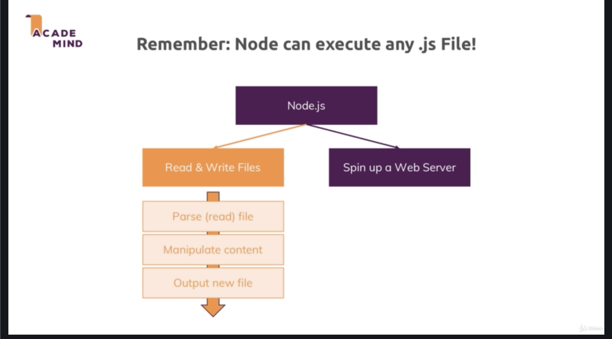

\* Chapter 477: Npm & Node.js
=============================

\* Chapter 478: Using NPM
=========================

\* Chapter 479: Versioning In Package.json
==========================================

- When installing a package with ’npm install —save’ or ‘—save-dev’(or ‘—save-prod’, which replaces ‘—save’), you end up with entries in your package.json file, that looks something like this

1. "express": "^4.16.3"

- What does the ^ mean? you can learn about all available version annotations/syntaxes here: [http://docs.npmjs.com/misc/semver\#versions](http://docs.npmjs.com/misc/semver#versions)

- This post on Stackoverflow provides a great summary: <https://stackoverflow.com/a/25861938>

\* Chapter 480: What Is A Build Tool?
=====================================

- node.js in this course was primarily used to spin up a web server and write code that runs on the server-side. that is the main thing you do with node.js when you write your own apps. 

- but we have to remember that you can run any javascript code with node.js and specifically you can also interact with your local file system. you can read and write files afterall. we could use node.js to execute utility script for example parse (read) file, manipulate content, output new file. that is the idea behind so called- ‘build tool’ and that is something node.js also capabale of being used for.

- it’s important pointing out that when we talk about build tooling and build workflows, we mostly talk about front-end web development like our React application. 

- this is not node.js app but still use a package.json file and we use NPM to install package. these package are all holding code that runs in the browser and in the end the code we write in the source folder will also end up in the browser

- but the way we write in App.js file would not run in the browser at least not in all browsers. for example, we are splitting our javascript code across multiple files and we are using it as module import syntax for merging these files together. this doesn’t natively work in all browsers only in very modern browsers and therefore this is not the code that will end up in the browser. 

- this is the code we work with but we use a build tool, build workflow which is started during development with ’npm start’ and for production ’npm run build’. this build workflow we will take our code and kind of merge it together and transform it into code that runs in older browsers too. that is also minified and optimized because that’s all important we use build tools to optimize 

- we might write code like this. that is how our code looks like into react. but as i mentioned, this doesn’t run in all browsers. even if it would, it would be very large in the browser since all the code has to be downloaded by your users before it runs. so you wanna keep it as samll as possible so that your app and your javascript code in the browser starts as quickly as possible. 

- therefore we wanna end up with optimized code and the idea is that we also have code that is not only too big but that is using next gen feature like this to spread operator or arrow functions and we wanna work this to code that runs an older browsers too.

- this is primarily important in frontend because not all browsers support the next feature. that doesn’t matter that much on the serverside. 

- if i run ’npm run build’ in your project, you start production workflow which means it’s creating an optimized production bundle. this is all done by NPM and node

- and it completed and now if we look into this build folder and this now holds our app code. 

- if we look into that, this is the our code optimized. just minified a lot it’s pretty hard to read but it’s our code and this code is now very condensed and only contains current gen javascript logic so logic that runs in all the browsers too

\* Chapter 481: Using Node.js In Build Processes
================================================

- we wanna end up with optimized code. this is most important for Front-end projects. it’s our duty as a developer to ensure that we don’t try to install express.js into this project. because we couldn’t use any functionality from Express.js in the browser. but we know as a frontend developer which package we can use. we can install these package 

- and we can import them and our files with a slightly different syntex that happens to be primarily used for front-end development import, export syntax with ES module style. because that is the style that is supported in modern browsers too. 

- this is done by NPM, we install the packages and now we wanna start a script with NPM ’npm start’. now npm work is over and node.js take over. 

- let’s look into that in node\_modules folder. and let’s 'npm install’ which will install all the package as listed in package.json and look into node\_modules folder.

- let’s search for it at React script package. you can see the list is very long and all package have a lot of dependencies which in turn have dependencies which is why we end up with a lot of packages being installed here. 

- if you find ‘./react-scripts’ folder, there that folder also have package.json file. if you share a package, you also need that. you need to add some extra information to the package.json file

- and there you will also fnd the entry point that is executed which is in the ./bin folder the react-script.js code here

- now something important is that this code in the end will be executed by node.js because the idea behind the workflow is it runs on your computer before you deploy your optimized code. so before you uploaded your optimized code to some server. so this code will not run in the browser or anything like that. this code will run on your local machine and therefore it will be executed by node.js. this in the end will kick start other script, code that will work with your local file system. 

- for example, in the ./react-scripts/scripts/build.js file, there we will see what else it does. this is complex build workflow. in the end this uses tool called ‘webpack’ which is used heavily in frontend development to orchestrate your build workflow to compile your different files and unlock next gen features and make sure that you can handle the features correctly by using all the other tools like babel.

- the idea here we are using node.js and we can also tell that we are. and we are loading different packages here. we are running them and some of these packages will in the end all pick up our files. 

- so our local source code we have written here in the source folder. we will parse them and we will transform the content in there. pull all of them together because we don’t wanna have multiple files in the end but only very few files with one main file. pull all together and then also rewrite our code in a way that runs in older browsers. this is all done by a couple of packages which are used behind the scenes which are installed by NPM and then the code in the packages is executed through node.js