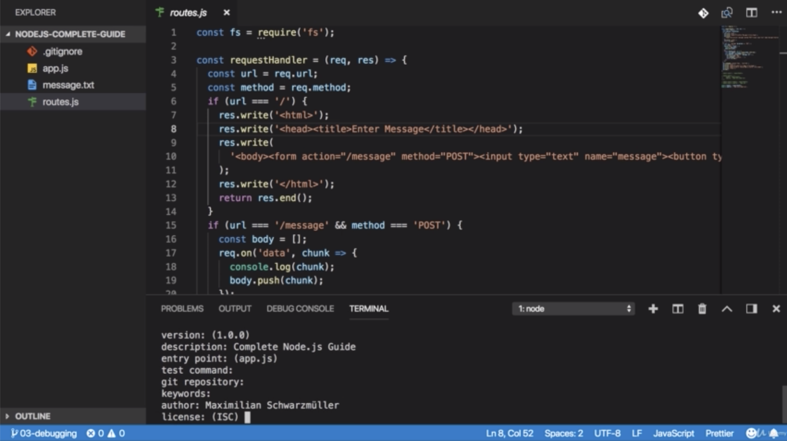
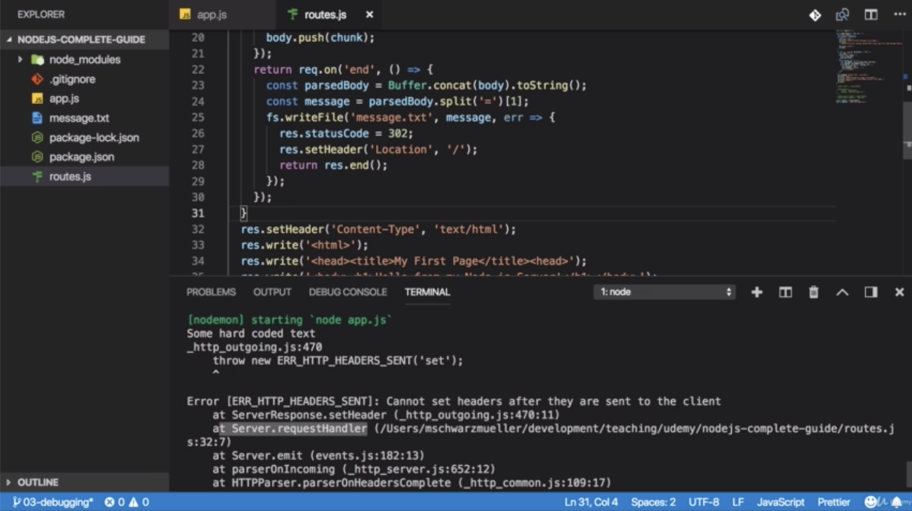
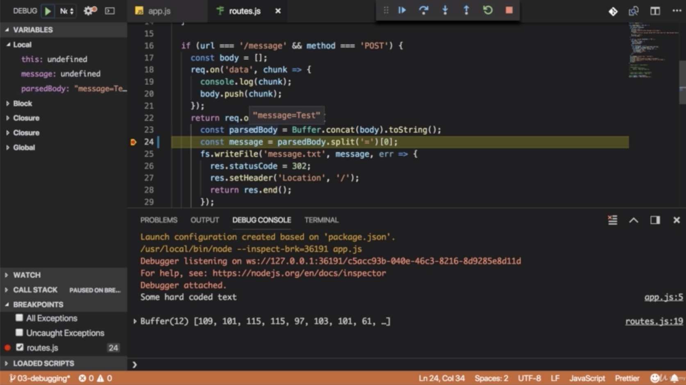
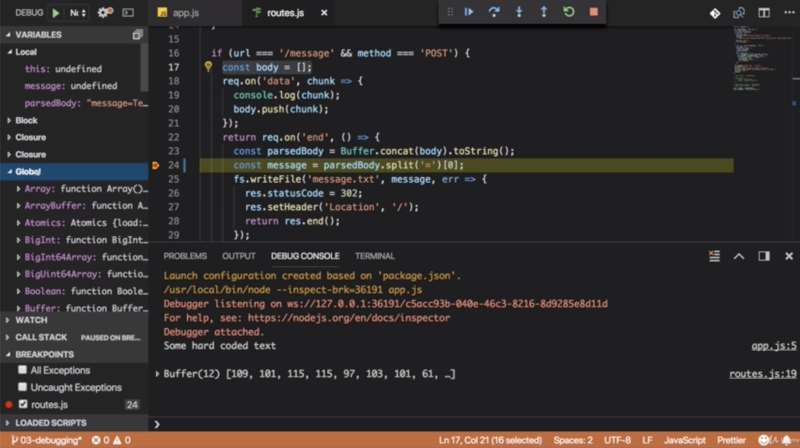
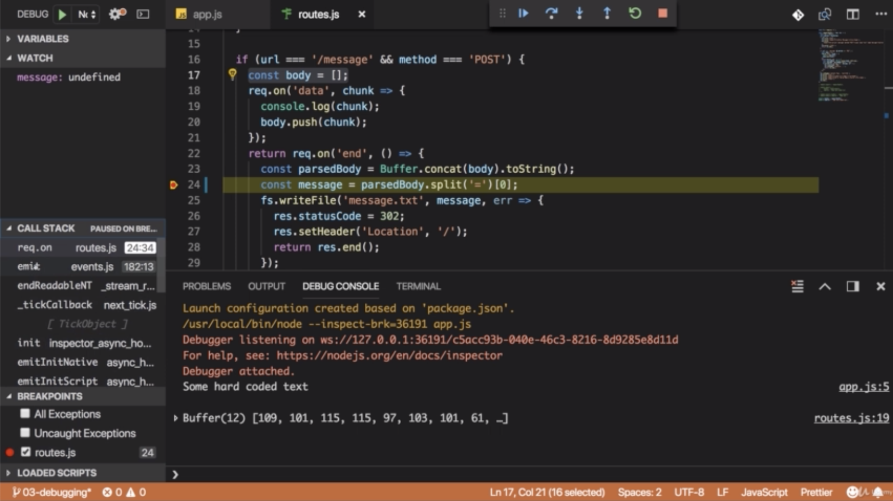
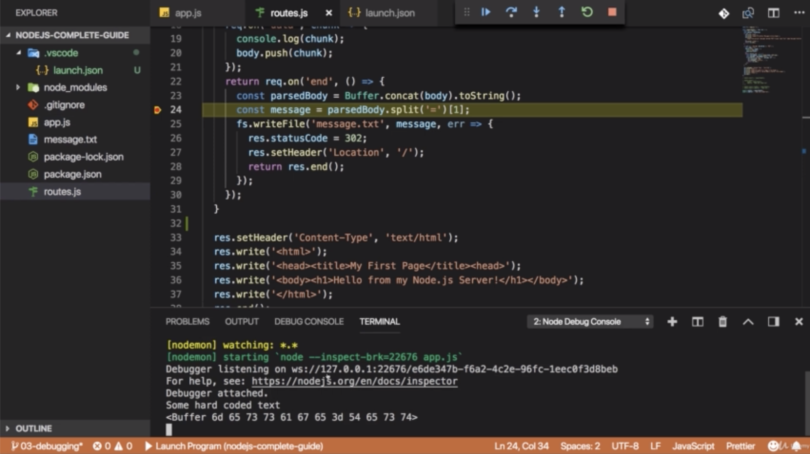

\* Chapter 41: Understanding NPM Scripts
========================================




- you will be prompted with a couple of questions. it will ask you first of all for a name of your package and now you can simply translate this with your project name. now you can pick any name you want, the part in the parenthese here always is the suggetstion, the default it will pick if you don’t choose your own name. 

- and you can choose license but if you don’t plan on sharing this project publicly, this doesn’y matter. 


- and you get package.json and there you also see all these settings or configurations you just set up and you can edit them there too. 

- this is using the JSON format which is a special kind of data format which basically looks a lot like javascript objects and it pretty much is based on that

- the key are always put between double quotation marks and so are the values, except for numbers or arrays or true or false which are not put between these.

—————————————————————————————————————


- what does this configuration file give you? you will see that we got a scripts section there which has one default script that won’t do anything for you now. 

- and you can add your own scripts here and i will tell you how to execute them too. 


- ’start’ is actually a special script name as you will see in a second. then you type a command that should be executed. 

- ’start’ is reserved name and this will always look for such a start script.

- you can always just run this command instead of running node app.js 


- you get a error that is not a known command and indeed it isn’t because just typing the script name will not work. ’start’ is just a special case. 

- for normal script with their own custom names, you have to run npm run + script name

\* Chapter 42: Installing 3rd Party Packages
============================================


- we will install one big 3rd package because you typically have such dependencies 3rd party packages. 

- ‘nodemon’ which is auto-restart mechanism 

- you can define how this should be installed because packages which you nstall can be divided into development packages, so packages which mostly help you during development and production dependencies. so packages that helps you for the app as it’s running on a server, for example nodemon would be a development dependency because we only use it during the development process. once we install our app on a real server, we don’t need it there. the real server which is running somewhere in the internet shouldn’t restart. 

- and you can tell npm which kind of dependency this is, this doesn’t make a huge difference and you can omit the setting but it helps you understand which package is used for what. 

- we are indicating that this only adds something we used during development


- if you had just save like this, this would install it as a production dependency. so a package which we really use and use in our code and work with and with this 


- ‘-g’ is that we will not install it in this project but globally on your machine so that you can use it anywhere. 


- after installing, it gives you that node\_modules folder, the package-lock.json file and it updated the package.json file. 


- we see that the new devDependencies section was added and that stands for development dependencies


- this defines how this package will be updated. if you rerun just npm install, without defining an extra package name because this command standalone will simply go through all your packages mentioned in package.json and install them and it would automatically pick a later version if available. 


- where is it installed? that is the node\_modules folder. 

- this is basically the source code of the package or the build version of the package we installed. 

- this package simply happends to have a couple of peer dependencies. so we got a bunch of dependencies in there and their dependencies are also installed, that is why you could end up with quite a big node\_modules folder 


- but you can always delete that node\_modules folder. you can’t use that package but you can then rerun ’npm install’ if you start working on that project again. 

\* Chapter 43: Global Features Vs Core Modules Vs 3rd Party Modules
===================================================================

- You can basically differentiate between:

 - Global Features: Keywords like ‘const’ or ‘function’ but also some global objects like process

 - Core Node.js Modules: Examples would be the file-system modules(‘fs’), the path module(“path”) or the Http module(‘http’)

 - 3rd-party Modules: installed via ’npm install’ - you can add any kind of feature to your app via this way.

- Global features are always available, you don’t need to import them into the file where you wanna use them

- Core Node.js Modules don’t need to be installed (NO ’npm install’ is required) but you need to import them when you wanna use features exposed by them.

 - example

 - const fs = require(‘fs’)

 - you can now use the ‘fs’ object exported by the ‘fs’ modules

- 3rd-party Modules need to be installed (via ’npm install’ in the project folder) and imported

 - example(which you don’t need to understand yet - we willl cover this later in the course)

```js
//In terminal / command prompt
npm install --save express-session

//in code file(e.g. app.js)
const sessions = require('express-session')
```

\* Chapter 44: Using Nodemon For Auto Restart
=============================================


- Nodemon is a utility tool and it allows us to run our application, our node application through this package which will run node app.js and will also watch our files for changes and restart the process for us if we do change something.


- so we can simply change start here, so the node app.js command to nodemon app.js.

- this will look for a nodemon tool which it will find in this project because we installed it here


- as a side note here, if you were to run nodemon app.js down here, you would get an error that this command is not found. because it’s only installed in this project and not globally on your machine but the terminal will try to find this globally. 


- but here, it will work because this will look globally. i mean ‘locally!’ npm scripts will look for the LOCAL version of the package. so if you run npm start, this will simply start the node server and output some extra information.

- and if you now go to your routes.js file and edit something and save that file, you see it’s restarting. 

\* Chapter 45: Global & Local npm Package
=========================================

- In the last lecture, we added ’nodemon’ as a local dependency to our project

- The good thing about local dependencies is that you can share projects without the node\_modules folder(where they are stored) and you can run ’npm install’ in a project to then re-create that node\_modules folder. This allows you to share only your source code, hence reducing the size of the shared project vastly.

- The attached course code snippets also are shared in that way, hence you need to run ’npm install’ in the extracted packages to be able to run my code

- I showed that ’nodemon app.js’ would not work in the terminal or command line because we don’t use local dependencies there but global packages. 

- You could install ’nodemon’ globally if you wanted (this is not required though - because we can just run it locally) ’npm install -g nodemon’ would do the trick Specifically the ‘-g’ flag ensures that the package gets added as a global package which you now can use anywhere on your machine, directly from inside the terminal or command prompt. 

\* Chapter 46: Understanding Different Error Types
==================================================


- Syntax E rrors is that if you have a typo in your code or you forget like a closing curly brace or anything like that. so you have an error which should automatically be thrown when you try to run your project. most of time, these are pretty easy to fix but we will have a look at this and how we find and fix them in a second

- Runtime Errors is the errors which are not typos but where you try to execute some code which will just break when it runs. 

- Logical Errors are most difficult ones because you will never see an error message. your app just doesn’t work the way it should. 

\* Chapter 47: Finding & Fixing Syntax Errors
=============================================


- we see ‘unexpected identifier’ const server. so in the end, whilst it doesn’t clearly tell us that we forget the t here because it’s not smart enough to understand that this is the error here. so in such cases, as dumb as it sounds, you should simply take a closer look at this line and see what could be wrong there.


- if we jump there, we see at the end that the closing curly brace is expected. now it’s not expected at this point where it’s showing this message but it’s expected somewhere in the file. you should then check your block statement like this if statement and see if there are all closed correctly.

- if you run this, you will see that it crashes and there, you also see unexpected token. and it points us at routes.js and then you see the line number too. so it points at line 52 and it shows us the same place as VS Code which is the wrong place. but in such cases, you should really take the IDE help, see that error mesage and then go through your file and see where could i be missing a character or where do i have an extra closing curly brace or something like that. and eventually you should be able to find this error and therefore fix it. 

\* Chapter 48: Dealing With Runtime Errors
==========================================


- The Great example of the runtime errors can be shown with the res.write() method. 

- You have to return to prevent the execution of the code after if statement. otherwise this is something node specific. you would end the request here but the code execution would continue


- and eventually we would reach this line and this is no syntax error, this is correct but if we run our code, seems to work right. 


- but if we visit our page, eventually it breaks here and this is the point where it should go back to your code and should find an error message there too.

- this error message is something you shouldn’t just take and paste into the Q&A section but actually read it. a lot of the error message are helpful. 


- at the bottom, you always find uninteresting stuff i would saya but you have to scroll to the top of the error message and all of a sudden, it should get more meaningful. 


- for example, you see the error code which already indicates that it’s something with headers being sent


- and here you find a detailed error message, cannot setHeaders after they are sent to the client. then you see that it was caused by a call to setHeader and unfortunately, the line numbers don’t help you. 



- but then it does help you here. it’s in the requestHandler and hter it points at the routes.js file line 32\. and now this is the point where you can dive in and see 


- i’m calling setHeader here, since it’s complaining that i can’t set them after they are sent to the client

- so i should look well in the code before this statement because it looks like i’m finishing my response there for example.


- and indeed at some point, you should find this statement and see i do actually not finish my code execution after this statement which is not parse a problem but it becomes a problem if in the following code, i then work on my response again as i’m doing here


- so this is the point where we can fix this by stoppin the code execution 


- or by wrapping this in an extra if statement which is guaranteed to not run 


if we make it into this statement


\* Chapter 49: Logical Errors
=============================

- Logical error is the most difficult one to fix because it will not cause an error message, your app will just not behave the way you expect it to. 


- for example, let’s say i have the first element being stored in message here, and now we are actually storing the wrong element. 


- so if i save this and my server restarts, and type something and go to message.txt, i can see message there.

- this is a logical error because we got no error message. but the app is not behaving the way we want it to

- we know that we used the wrong index because i just changed that 

- with node.js debugger, you can fix it. 


- this means that you can look into your code as it’s running, to do that you need to set ‘breakpoint’


- set the breakpoint by clicking red point. 


- if you not submit some text, it should automatically jump back and mark this line

- this line means the code execution now stopped here, so that you can look inside of it and actually you can now analyze your code in the moment it’s running. 


- for example, you can hover over your variable to see what’s stored inside of them. so you see that the parsedBody is this string which we are splitting in the yellow highlighted line. 


- you see what’s inside of the body you passed to concat, that it’s an array with a buffer of length 12\. 


- you can see the key variables you have avaliable in your code right now. message is undefined because we stopped in that line where we would set it but it stops before it executes the line.



- but the parsedBody hold the value which you can also see if you hover over it


- you don’t just see local variable which are available in this function but block variables too, this is the variable which is always available outside of this function.



- and you can also look into global values and the value they currently have stored


- and you can define watchers here, you can click pluss here, and then watch message and hit enter 


- you see all the breakpoints you set in below of the left side

- if you uncheck them to not stop execution the next time they are reached and so on. 



- you also see the call stack which looks very cryptic but what in the end just shows how the process went through your code and you can click on these different parts to see where actually this code which belongs to the code that was executed can be found and not all of that is code you wrote, a lot of that is core node.js code. 


- now to work it and to continue with your code execution, you can resume code execution with the play button but we don’t wanna do that instead we wanna step through our code step by step so that we can see when it fails or where it goes wrong. 


- you can do that with this button. which steps to the next line


- or with this button. which doesn’t just step into the next line but actually even goes into functions like this one 


- so if you click here and again, now all of sudden, you are in the writeFile function defined by node.js 


- you can step back by this key.

\* Chapter 50: Using The Debugger
=================================


- let’s send another message here, hit send, and it breaks again because i didn’t remove the breakpoint. and let’s fix that error we have. 


- now it registers this code and here you also see that it doesn’t immediately execute this function because if i click that button again, we jump to the end of this function here and that makes a lot of sense because as i mentioned, this function is just registered by node.js to be executed in the future once the file is read. 


- the problem we wanna solve is not inside of there though. 


- but if you wanna get notified once a part in here is reached, you can simply add a breakpoint there, 


resume execution and it will break once it reaches that, so once that callback is triggered because the right file operation is done. 

- our problem is the message. message is not available here anymore. so this analysis is not useful to us.


 


- so let’s remove that breakpoint and resume and let’s again run this one more time

- and now let’s not resume execution but look into message and we see message is message and that looks wrong. 

- we see that parsedBody is message equals and then our value.


- now since this is what we stored in the message constant, we now can tell pretty clearly that our error has to be stemming from that part because we clearly have our value in here. but then we seem to be extracting the wrong piece

 


- and you can even use the console here to run some commands for example. so you can see you get an array with message and tist because i mistyped test. 

- this clearly tells you. split is working. i’m in theory getting all the values i need, so the only thing that can be wrong now is the value i’m extracting here and we see that message. and message holds message which is incorrect(not hold value but hold key). message the first element in the array. so i seem to be extracting the wrong element from the arrray


- and indeed we are extracting the first one when we should be extracting the second one here. 


- and now we get this error fixed

- you have to keep in mind that node doesn’t execute line after line, but it register callbacks which are executed sometime in the future, and which should therefore also have to control with breakpoins if you wanna look into them. 

\* Chapter 51: Restarting The Debugger Automatically After Editing Our App
==========================================================================


- you can execute code here in that debug console at the bottom, so you don’t see the console log here, you can also execute code here. 


- something which is available in your code at this point of time, in general something which you can find in local or in block here or in global.

- you can also type that down there and hit enter to print its value. 


- you cannot just print the value, you can also run operation on it that will not affect your code as it’s running but that will allow you to to look into it or try out some transformation before you add it to your real code. 


- if you add a blank line, our debugger doesn’t restart but with nodemon we actually have a package that does allow us to restart. so it would be nice if the debugger would also restart if we change our code. otherwise it just behaves differently than the rest of our app and we have to restart it manually. 


- now to restart it, let’s go back to the explorer view for a second. then you have to go to debug and then add a configuration for node.js 

- this adds the .vscodes folder with the launch json file. 


- this allows you to configure debugging for this project and how it behaves. you can click on add configuration to see some demo settings you can add but you can also just type in there 


- and one setting you can add is restart and you can set it to true.

- you have to make sure that nodemon is used and for that, you set the runtime executable not to node which would be the default but to nodemon. now it will use nodemon and it will restart the debugger when a change is detected. so that not just the server is restarted but also the debugging process.


- you can also change the console where things are logged to the integrated terminal which is the normal terminal. 

- when you start debugging, if fails though because the reason for this is that it will not use the local nodemon but global nodemon. 


- so to add it globally, you have to run an install nodemon -g


- after installing, you can also run this debugger here which will use the global version and you will see it now opens terminal, starts nodemon 


- and if you now add a breakpoint somewhere and submit this again. it works as before. you now see terminal all is logged in here and you can still use the debug console to output message though, so you can still work. 


- but in the terminal, you get the normal output and you have to use the terminal because if you now change something, it restart the debugger and node and these are 2 separate processes.




- and if you stop the debugger, nodemon has to quit separately or has to exit separately and you do this by ctrl + C

- and this couldn’t be done in the debug console which is why you have to funnel this to the terminal. 

- you have to stop that process separtely which you can do from the terminal which is why if you are using that nodemon process, you should use the integrated terminal

\* Chapter 53: Changing Variables In The Debug Console
======================================================


\* Chapter 54: Wrap Up
======================

