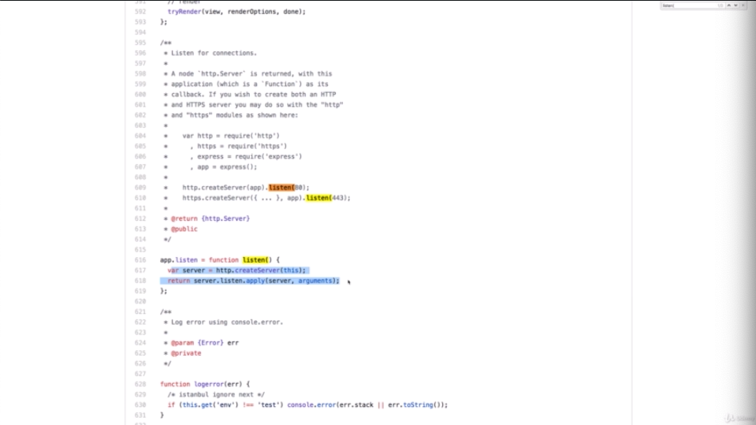
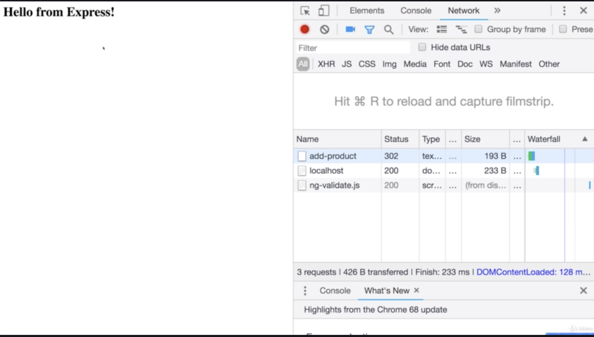
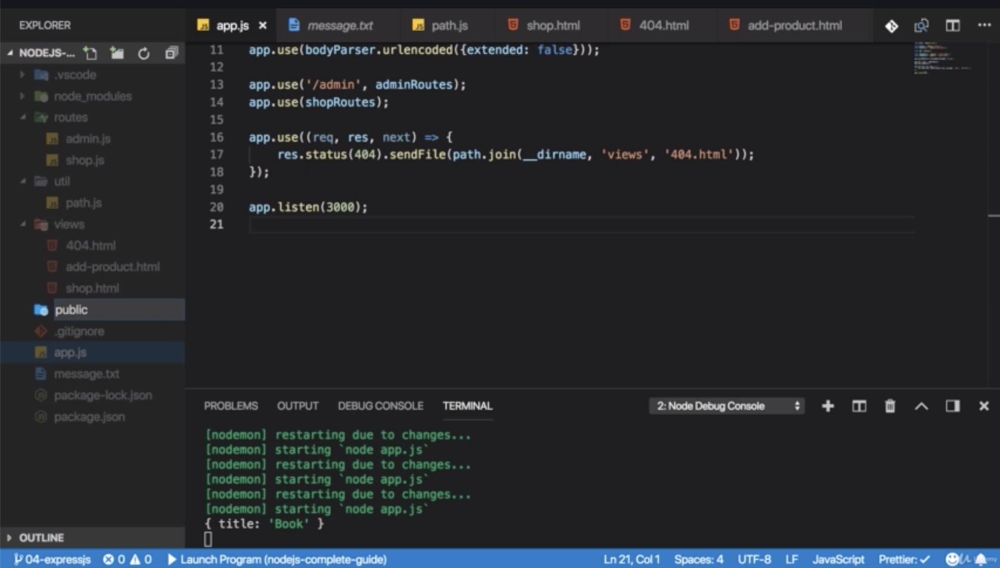
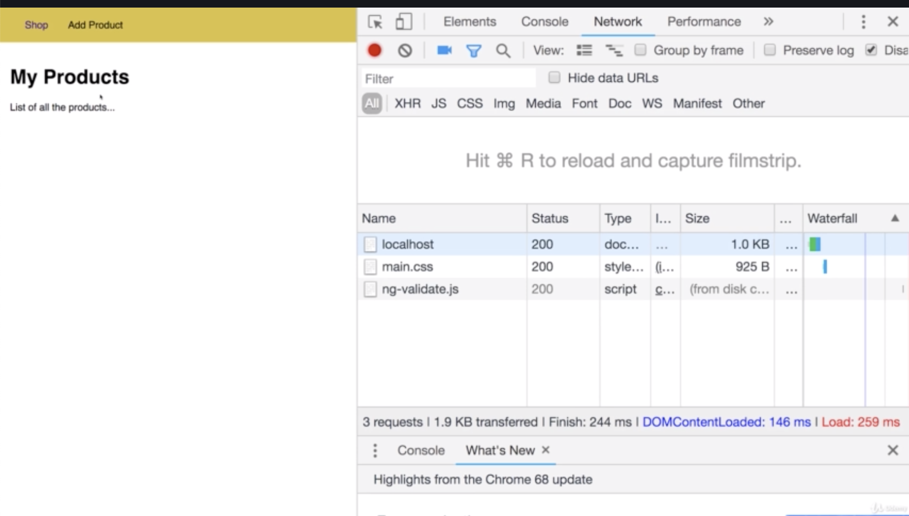

\* Chapter 56: Module Introduction
==================================


\* Chapter 57: What Is Express.js?
==================================


\* Chapter 58: Installing Express.js
====================================

1\. update

- app.js


- why not —save-dev but —save? because this will be a production dependency. we don’t just use that as a tool during development. it will be an integral part of the application we ship and therefore it definitely also has to be installed on any server or any computer where we run our aplication once we deploy it. it’s a major piece of our application. 


- after npm start, you will actually have a running server.

```js
//app.js

const http = require('http');

/**this will initalize new object
*/
const express = require('express');

const app = express()

/** 'app' happens to be a valid request handler 
 * so you can pass 'app' here to create server.
 * 
 * app sets up a certain way of handling incoming requests 
 * that defines or that is a key characteristic of express.js
*/
const server = http.createServer(app);

server.listen(3000);
```

\* Chapter 59: Adding Middleware
================================

1\. update

- app.js


- Express.js is all about middleware which means an incoming request is automatically funneled through a bunch of function by express.js

- so instead of just having one request handler, you will actually have a possibility of hooking in multiple

functions which the request will go through until you send a response. 

- This allows you to split your code into multiple blocks or pieces instead of having one huge functionthat does everythingand this is the pluggable nature of expressjs, where you can easily add other third party packageswhich simply happen to give you such middleware functions that you can plug into expressjs and addcertain functionalities


- this spinner will keep on spinning. so we don’t get a response. because we got no logic.


- but i don’t see in another middleware. because we need to type ’next()’ to get next middleware.


```js
//app.js

const http = require('http');

const express = require('express');

const app = express()

/**'use()' allows us to add a new middleware function 
 * use() allows us this function to be executed for every incoming request
 * 
 * 'next' is a function that will be passed to this function by Express.js
*/
app.use((req, res, next) => {
    /**this function you are receiving has to be executed 
     * to allow the request to travel onto the next middleware */
    console.log('In the middleware')
    /**if we don't call 'next', we should actually send back a response
     * because otherwise the request can't continue
     * so it will never reach a place where we might send a response 
     */
    next();
})

app.use((req, res, next) => {
    console.log('In another middleware')
    //...
})

const server = http.createServer(app);

server.listen(3000);
```

\* Chapter 60: How Middleware Works
===================================

1\. update

- app.js


- under header, the content-type is automatically set to text/html here. this is another feature provided by Express.

```js
const http = require('http');

const express = require('express');

const app = express()

app.use((req, res, next) => {
    console.log('In the middleware')
    next();
})

app.use((req, res, next) => {
    console.log('In another middleware')
    /**'send()' allows us to send well a response 
     * this allows us to attach a body which is of type any.
     * 
     * this is particularly easier 
     * once we start sending back real files or the content of files
    */
    res.send('<h1>Hello from Express!</h1>')
})

const server = http.createServer(app);

server.listen(3000);
```

\* Chapter 61: Express.js - Looking Behind The Scenes
=====================================================

1\. update

- app.js


- you will see how the send function. 


- so basically a function we are calling here, how this is defined internally and this helps us understand 

- by the way, this is always a great technique if you wanna see what something does behind the scene and if you need to do something yourself, set someHeader or if that is done for you and we had that default header of text/html. so let’s see what send does internally. 


- it basically analyzes what kind of data you sending. 


- if it’s a string data, so some text as we are doing it here, in this case, it sets content-type to html. but only if we haven’t set it yet. so it checks if the content type header is not present yet in which case it sets it, otherwise it would leave our default. 

- if we have other values like a number, a boolean and so on, it would set it to binary or json data.


- now one other interesting thing to see is that we can actually also shorten this code here where we set up the server. 

- app.listen() do both these things for us, something we can see in the official code. 



- listen function in the end does the 2 things we did before.

```js
//app.js

const http = require('http');

const express = require('express');

const app = express()

app.use((req, res, next) => {
    console.log('In the middleware')
    next();
})

app.use((req, res, next) => {
    console.log('In another middleware')
    res.send('<h1>Hello from Express!</h1>')
})

app.listen(3000);
```

\* Chapter 62: Handling Different Routes
========================================

1\. update

- app.js


- if we type not ‘/‘ but ‘/add-product’, we still see ‘Hello from Express’ and we still see i’m in another middleware, so this middleware gets executed for both slash and add-product because this ‘/' doesn’t mean that the full path. so the part after the domain has to be a slash but that it has to start with that. 


- we have this runs twice because this first app.use() always runs.

```js
//app.js

const express = require('express');

const app = express()

/** why 'add-product' middleware is before '/'? not after it?
 * because the request goes through the file from top to bottom
 * and if we don't call next, it's not going to the next middleware
 * i'm not calling next()
 * so in the end, if we have '/add-product', 
 * this middleware will be reached first.
 * 
 * since i don't call next(), '/' middleware will never 
 * get a chance of handling that request 
 * even though '/' the filter would have matched that request too.
 * 
 * this is the code that allows us to route our request 
 * into different middleware. 
 */
app.use('/add-product', (req, res, next) => {
    console.log('In another middleware-1')
    res.send('<h1>Hello "Add Product"</h1>')
})

/**this one should only trigger for requests 
 * that go to just slash nothing 
 * this is the default. 
*/

app.use('/', (req, res, next) => {
    console.log('In another middleware-2')
    res.send('<h1>Hello from Express!</h1>')
})

app.listen(3000);
```

\* Assignment: Time To Practice - Express.js
============================================

```js
//app.js

const express = require('express');

const app = express();

// app.use((req, res, next) => {
//   console.log('First Middleware');
//   next();
// });

// app.use((req, res, next) => {
//   console.log('Second Middleware');
//   res.send('<p>Assignment solved (almost!)</p>');
// });

app.use('/users', (req, res, next) => {
    console.log('/users middleware');
    res.send(
        '<p>The Middleware that handles just /users</p>'
        );
});

app.use('/', (req, res, next) => {
    console.log('/ middleware');
    res.send('<p>The Middleware that handles just /</p>');
});


app.listen(3000);

```

```js
//package.json

{
  "name": "nodejs-complete-guide",
  "version": "1.0.0",
  "description": "",
  "main": "index.js",
  "scripts": {
    "test": "echo \"Error: no test specified\" && exit 1",
    "start": "nodemon app.js"
  },
  "author": "",
  "license": "ISC",
  "dependencies": {
    "express": "^4.16.3"
  },
  "devDependencies": {
    "nodemon": "^1.18.3"
  }
}

```

\* Chapter 63: Parsing Incoming Requests
========================================

1\. update

- app.js


- if we go back to ‘/add-product’ and fill out input field, we redirect to ‘/‘


- and we see ‘undefined’ in the console. 

- request gives us .body convenience property. but by default, request doesn’t try to parse the incoming request body. so we need to register a parser and we do that by adding another middleware. 

- and you typically do that before your route handling middlewares because the parsing of the body should be done no matter where your request ends up. and there i wanna parse the incoming req.body.

- so we can install a third party package. 


- —save because this will also be a package that is used in our code that does matter for production. and the package name is ‘body-parser

’

- we get that body parser enabled 


- and go back ‘/add-product’ again, fill out input field. 


- and it redirect. 


- and we see this is what we get, a javascript object with a key-value pair which also makes extracting the value easier than we had to do before with the split function where we manually had to create that array and so on.

```js
//app.js

const express = require('express');
const bodyParser = require('body-parser');

const app = express()

/**'urlencoded()' is a function you have to execute
 * and you can pass options to configure it
 * but you don't have to here
 * 
 * and 'bodyParser' is the middleware
 * so 'urlencoded()' function in the end just yields us such a middleware function like (req, res, next) => {}
 * so 'bodyParser.urlencoded()' parse such a function like (req, res, next) => {} in the end even though we can't see it 
 * and in the end, this middleware function call 'next' in the end,
 * so that the request also reaches our middleware 
 * 
 * but before it does that, it will do that whole request body parsing we had to do manually in the previous core section.
 * 
 * now this will not parse all kinds of possible bodies, files, json and so on
 * but this will parse bodies like the one which is sent through a form.
 */

 /** in 'urlencoded()', you should pass the config options
  * '{extended: false}' is added to comply with what we should use here
  */
app.use(bodyParser.urlencoded({extended: false}))

app.use('/add-product', (req, res, next) => {
    /**the path, the URL to which the request should be sent */
    res.send('<form action="/product" method="POST"><input type="text" name="title"><button type="submit">Add Product</</button></form>')
})

/**'/product' has to be after '/add-product' because of preventing '/product' from overlapping to '/add-product'
 * '/' has to be after '/product' because of preventing '/' from overlapping to '/product'
 */
app.use('/product', (req, res, next) => {
    /**'req.body' is a new field added by express */
    console.log(req.body)
    /**i can use res.redirect which certainly is easier than manually setting the status code and setting the location header.
     * 
     */
    res.redirect('/');
})

app.use('/', (req, res, next) => {
    res.send('<h1>Hello from Express!</h1>')
})

app.listen(3000);
```

\* Chapter 64: Limiting Middleware Execution To POST Requests
=============================================================

1\. update

- app.js


- if i go to ‘/product’, i see ‘hello from express’ so i don’t end up here

```js
//app.js

app.post('/product', (req, res, next) => {
    console.log(req.body)
    res.redirect('/');
})
```

even though i entered ‘/product’ but it was a GET request. 


- but if i send POST request through that form, ‘/add-product’, you see we get this output ‘book 2’. so we clearly made it into this below middleware due to our filtering.

```js
//app.js

app.post('/product', (req, res, next) => {
    console.log(req.body)
    res.redirect('/')
})
```

- so this is another way of using that middleware function, instead of ’use()’ which will work with all http methods.

- we can also use get or post to filter for these.

```js
//app.js

const express = require('express');
const bodyParser = require('body-parser');

const app = express()

app.use(bodyParser.urlencoded({extended: false}))

app.use('/add-product', (req, res, next) => {
    res.send('<form action="/product" method="POST"><input type="text" name="title"><button type="submit">Add Product</</button></form>')
})

/**this middleware always execute, not just for POST requests but also for GET requests.
 * what can we do regarding tha?
 * we can use app.get() which is basically app.use(), it has the same syntax as app.use
 * it only will fire for incoming GET request. 
 * this is another form of filtering besides filtering for the path, app.get allows us to filter for GET request.
 * 
  */

/**'app.post()' to filter for incoming POST requests
 * and this 'app.post()' will only trigger for incoming POST requests with this path
 * and not for GET request. */
app.post('/product', (req, res, next) => {
    console.log(req.body)
    res.redirect('/');
})

app.use('/', (req, res, next) => {
    res.send('<h1>Hello from Express!</h1>')
})

app.listen(3000);
```

\* Chapter 65: Using Express Router
===================================

1\. update

- app.js

- ./routes/admin.js

- ./routes/shop.js


- the order matters. so if we put this after this middleware, we will never reach that. 


- if i save and reload, this works. 


- if i would switch the position of ‘app.use(shopRoutes)’ and ‘app.use(adminRoutes)’ 


- and i reload, it would work and we would not end up in this route

- this only happens because i have .get() here. get, post and so on will actually do an exact match here. 


- if i would use ‘use()’ here as i did before to handle any incoming http method, 


- then if i reload here, we see hello from express again. 


- so this exact matching is not achieved by using the router but because we use get here, and that would have been the same if we stick to app way of doing this in the app.js file we had previously

- so ‘get()’ method make sure that it’s not just a get method but this exact path 


- and therefore now if i enter some random stuff, i get an error because now i got no single middleware that would handle that stuff.

```js
//app.js

/**the order of import doesn't matter */
const express = require('express');
const bodyParser = require('body-parser');

const app = express()

const adminRoutes = require('./routes/admin');
const shopRoutes = require('./routes/shop');

app.use(bodyParser.urlencoded({extended: false}))

/**this order matters */
app.use(adminRoutes);
app.use(shopRoutes);

app.listen(3000);
```

```js
//./routes/admin.js

/**this should be the route that handles the creation of products which the admin of the shop can do.*/

const express = require('express')

/** 'Router()' is like a mini express app tied to the other express app or pluggable into the other express app */
const router = express.Router();

/**'router' can be used to again define a use() function for all requests, 
 * get function for GET, post function for POST  
 * 
 * 'router' functions basically work in exactly the ame way as the app.use function does
 * or the app.get() and so on.
 * 
 * i will rename this to 'get()' because i only wanna handle GET requests to 'add-product'
 * and return this form.
 * */
router.get('/add-product', (req, res, next) => {
    res.send('<form action="/product" method="POST"><input type="text" name="title"><button type="submit">Add Product</</button></form>')
})

router.post('/product', (req, res, next) => {
    console.log(req.body)
    res.redirect('/');
})

/**with that, we can import that into the app.js file 
 * 
 * 'router()' is a valid middleware function. 
 * so we can take admin routes and just call app.use and put our admin routes in app.js file
*/
module.exports = router;
```

```js
//./routes/shop.js

const express = require('express');

const router = express.Router();

router.get('/', (req, res, next) => {
    res.send('<h1>Hello from Express!</h1>')
})

module.exports = router
```

\* Chapter 66: Adding A 404 Error Page
======================================

1\. update

- app.js


```js
//app.js

/**the order of import doesn't matter */
const express = require('express');
const bodyParser = require('body-parser');

const app = express()

const adminRoutes = require('./routes/admin');
const shopRoutes = require('./routes/shop');

app.use(bodyParser.urlencoded({extended: false}))

app.use(adminRoutes);
app.use(shopRoutes);

/**if we got no fitting middleware and we don't have one here,
 * then we make it all the way to the bottom 
 * and eventually we don't handle that request. 
 * so to send 404 error page, we simply have to add a catch all middleware at the bottom 
 */

/**maybe we also wanna set the 404 status code
 * and you can do that by chaining another method prior to send 
 * and that is the status() method. 
 */
app.use((req, res, next) => {
    res.status(404).send('<h1>Page not found</h1>')
})

app.listen(3000);
```

\* Chapter 67: Filtering Paths
==============================

1\. update

- app.js

- ./routes/admin.js

- ./routes/shop.js


- the same path can be used if the methods differ. 


- if we have such a setup where our paths in such a router file start with the same part or with the same segment ‘/admin’, we can take that segment out of this route 


- and then go to the app.js file and add it here, so add that segment as a filter. 

- only routes starting with ‘/admin’ will go into the admin routes file. 


- so now ‘/add-product’ will match the ‘/admin/add-product’ route because ‘/admin’ was already stripped out. 


- if i go to just ‘/add-product’, we see ‘Page not found’ because it doesn’t exist anymore.


- but if we go to ‘admin/add-product’, here is the form. 

- if i fill out input, i get 'page not found’


- so this should be done like below. need to be added ‘/admin’ in 'send()’ because we wanna reach that route which is the admin.js file which is only reachable through requests that have /admin at the beginning.

```js
//./routes/admin.js

router.get('/add-product', (req, res, next) => {
    res.send('<form action="/admin/add-product" method="POST"><input type="text" name="title"><button type="submit">Add Product</</button></form>')
})
```



- so go to ‘/admin/add-product’ and fill out input field, the it’s redirected. 


- and also see that we are logging this here. 


- so this filtering mechanism here in app.js allow us to put a common starting segment for our path which all routes in a given file use to outsource that into this app.js so that we don’t have to repeat it for all the routes here.

```js
//app.js

const express = require('express');
const bodyParser = require('body-parser');

const app = express()

const adminRoutes = require('./routes/admin');
const shopRoutes = require('./routes/shop');

app.use(bodyParser.urlencoded({extended: false}))

app.use('/admin', adminRoutes);
app.use(shopRoutes);

app.use((req, res, next) => {
    res.status(404).send('<h1>Page not found</h1>')
})

app.listen(3000);
```

```js
//./routes/admin.js

const express = require('express')

const router = express.Router();


// /admin/add-product => GET
router.get('/add-product', (req, res, next) => {
    res.send('<form action="/admin/add-product" method="POST"><input type="text" name="title"><button type="submit">Add Product</</button></form>')
})


// /admin/add-product => POST
router.post('/add-product', (req, res, next) => {
    console.log(req.body)
    res.redirect('/');
})

module.exports = router;
```

```js
//./routes/shop.js

const express = require('express');

const router = express.Router();

router.get('/', (req, res, next) => {
    res.send('<h1>Hello from Express!</h1>')
})

module.exports = router
```

\* Chapter 68: Creating HTML Pages
==================================

1\. update

- shop.html

- add-product.html

```html
<!--./views/shop.html-->

<!--
    it's a file i wanna serve for users visiting just '/'
-->

<!DOCTYPE html>
<html lang="en">

<head>
    <meta charset="UTF-8">
    <meta name="viewport" content="width=device-width, initial-scale=1.0">
    <meta http-equiv="X-UA-Compatible" content="ie=edge">
    <title>Add Product</title>
</head>

<body>
    <header>
        <nav>
            <ul>
                <li><a href="/">Shop</a></li>
                <li><a href="/admin/add-product">Add Product</a></li>
            </ul>
        </nav>
    </header>

    <main>
        <h1>My Products</h1>
        <p>List of all the products...</p>
    </main>
</body>

</html>
```

```html
<!--./views/add-product.html-->

<!DOCTYPE html>
<html lang="en">

<head>
    <meta charset="UTF-8">
    <meta name="viewport" content="width=device-width, initial-scale=1.0">
    <meta http-equiv="X-UA-Compatible" content="ie=edge">
    <title>Add Product</title>
</head>

<body>
    <header>
        <nav>
            <ul>
                <li><a href="/">Shop</a></li>
                <li><a href="/admin/add-product">Add Product</a></li>
            </ul>
        </nav>
    </header>

    <main>
        <form action="/add-product" method="POST">
            <input type="text" name="title">
            <button type="submit">Add Product</button>
        </form>
    </main>
</body>

</html>
```

\* Chapter 69: Serving HTML Pages
=================================

1\. update

- admin.js

- shop.js


- i don’t see anything because this path ‘/views/shop.html’ is incorrect. if we now reload, path must be absolute is the error we get.

- absolute path would be correct but slash like this refers to our root folder on our operating system. not the project folder. 


- so in order to construct the path to this directory and this file ultimately, we can use a feature provided by node.js called ‘path’ the core module.

- ‘join()’ yields us a path at the end, it returns a path but it construct this path by concatenating the different segment. 

- the first segment we should pass here is then a global variable made available by node.js and that is ‘\_\_dirname’ which is a global variable to holds the absolute path on our operating system. to this project folder and now we can add a , ‘views’ because the first segment is the path to this whole project folder \_\_dirname. and the next segment is that we wanna go into the views folder and then the 3rd segment will be our file. so here shop.html and don’t add / because we use path.join() not because of the absolute path, we could build this with \_\_dirname and then concatenating this manually too. 

- but we are using path.join() because this will automatically build the path in a way that works on both linux and windows systems. on linux, you have paths like ‘/user/products’ but in windows backslash is used like ‘\\user\\products’ adding path. 

- therefore if you manually construct this with slashes, it would not run on windows and the other way around. 

- path.join() detects operating system you are running on and then automatically build a correct path. 


- but actually \_\_dirname will point routes folder because ‘\_\_dirname’ gives us the path to a file in which we use it and we are using it in the shop.js file in the routes folder. but views folder is located in a sibling folder to routes folder. 

- so we use ‘../‘ and this simply means go up 1 level. so this will now build a path where it first goes into the folder of these files, so into routes folder then it goes up 1 level then into views folder. 


- so if we go to ‘localhost:3000/‘ again, we see that html file being served. 


- if we go to ‘/admin/add-product’, we see this page too.

```js
//./routes/admin.js
const path = require('path')

const express = require('express')

const router = express.Router();


// /admin/add-product => GET
router.get('/add-product', (req, res, next) => {
    res.sendFile(path.join(__dirname, '../', 'views', 'add-product.html'))
})


// /admin/add-product => POST
router.post('/add-product', (req, res, next) => {
    console.log(req.body)
    res.redirect('/');
})

module.exports = router;
```

```js
//./routes/shop.js
const path = require('path');

const express = require('express');

const router = express.Router();

router.get('/', (req, res, next) => {
    res.sendFile(path.join(__dirname, '../', 'views', 'shop.html'))
})

module.exports = router
```

\* Chapter 70: Returning A 404 Page
===================================

1\. update

- 404.html

- app.js


```js
//app.js

const path = require('path')

const express = require('express');
const bodyParser = require('body-parser');

const app = express()

const adminRoutes = require('./routes/admin');
const shopRoutes = require('./routes/shop');

app.use(bodyParser.urlencoded({extended: false}))

app.use('/admin', adminRoutes);
app.use(shopRoutes);

app.use((req, res, next) => {
    res.status(404).sendFile(path.join(__dirname, 'views', '404.html'))
})

app.listen(3000);
```

```html
<!--./views/404.html-->

<!DOCTYPE html>
<html lang="en">
<head>
    <meta charset="UTF-8">
    <meta name="viewport" content="width=device-width, initial-scale=1.0">
    <meta http-equiv="X-UA-Compatible" content="ie=edge">
    <title>Page Not Found</title>
</head>
<body>
    <h1>Page Not Found</h1>
</body>
</html>
```

\* Chapter 71: Using A Helper Function For Navigation
=====================================================

1\. update

- ./util/path.js

- shop.js

- admin.js


- after reload, it still works. because now we are in the end having a pretty neat way of constructing a path to our root directory. 

- i will do the same in shop.js


- you could have sticked to the old approach but this one is a even cleaner one and one that should work on all operating systems and it always gives you the path to the root file.

```js
//./routes/shop.js
const path = require('path');

const express = require('express');

const rootDir = require('../util/path')

const router = express.Router();

router.get('/', (req, res, next) => {
    res.sendFile(path.join(rootDir, 'views', 'shop.html'))
})

module.exports = router
```

```js
//./routes/admin.js
const path = require('path')

const express = require('express')

const rootDir = require('../util/path')

const router = express.Router();


// /admin/add-product => GET
router.get('/add-product', (req, res, next) => {
    res.sendFile(path.join(rootDir, 'views', 'add-product.html'))
})


// /admin/add-product => POST
router.post('/add-product', (req, res, next) => {
    console.log(req.body)
    res.redirect('/');
})

module.exports = router;
```

```js
//./util/path.js

const path = require('path')

/**if we use that 
 * we just have to find out 
 * which directory or for which file we wanna get the directory name 
 * 
 * there we can use the global 'process' variable that is also a variable that is available in all files. 
 * you don't need to import it
 * and there you will have a mainModule property. 
 * this will refer to the main module that started your application
 * so to the module we created in app.js
 * and now we can call file name to find out in which file this module was spun up.
 * 
 * so 'process.mainModule.filename' gives us the path to the file
 * that is responsible for the fact that our application is running
 * and filename is what we put into dirname to get a path to that directory. 
 * */
module.exports = path.dirname(process.mainModule.filename)
```

\* Chapter 72: Styling Our Pages
================================

1\. update

- shop.html

- add-product.html

- 404.html

```js
<!--shop.html-->

<!DOCTYPE html>
<html lang="en">

<head>
    <meta charset="UTF-8">
    <meta name="viewport" content="width=device-width, initial-scale=1.0">
    <meta http-equiv="X-UA-Compatible" content="ie=edge">
    <title>Add Product</title>
    <style>
        body {
            padding: 0;
            margin: 0;
            font-family: sans-serif;
        }

        main {
            padding: 1rem;
        }

        .main-header {
            width: 100%;
            height: 3.5rem;
            background-color: #dbc441;
            padding: 0 1.5rem;
        }

        .main-header__nav {
            height: 100%;
            display: flex;
            align-items: center;
        }

        .main-header__item-list {
            list-style: none;
            margin: 0;
            padding: 0;
            display: flex;
        }

        .main-header__item {
            margin: 0 1rem;
            padding: 0;
        }

        .main-header__item a {
            text-decoration: none;
            color: black;
        }

        .main-header__item a:hover,
        .main-header__item a:active,
        .main-header__item a.active {
            color: #3e00a1;
        }
    </style>
</head>

<body>
    <header class="main-header">
        <nav class="main-header__nav">
            <ul class="main-header__item-list">
                <li class="main-header__item"><a class="active" href="/">Shop</a></li>
                <li class="main-header__item"><a href="/admin/add-product">Add Product</a></li>
            </ul>
        </nav>
    </header>

    <main>
        <h1>My Products</h1>
        <p>List of all the products...</p>
    </main>
</body>

</html>
```

```js
<!--add-product.html-->

<!DOCTYPE html>
<html lang="en">

<head>
    <meta charset="UTF-8">
    <meta name="viewport" content="width=device-width, initial-scale=1.0">
    <meta http-equiv="X-UA-Compatible" content="ie=edge">
    <title>Add Product</title>
    <style>
        body {
            padding: 0;
            margin: 0;
            font-family: sans-serif;
        }

        main {
            padding: 1rem;
        }

        .main-header {
            width: 100%;
            height: 3.5rem;
            background-color: #dbc441;
            padding: 0 1.5rem;
        }

        .main-header__nav {
            height: 100%;
            display: flex;
            align-items: center;
        }

        .main-header__item-list {
            list-style: none;
            margin: 0;
            padding: 0;
            display: flex;
        }

        .main-header__item {
            margin: 0 1rem;
            padding: 0;
        }

        .main-header__item a {
            text-decoration: none;
            color: black;
        }

        .main-header__item a:hover,
        .main-header__item a:active,
        .main-header__item a.active {
            color: #3e00a1;
        }

        .product-form {
            width: 20rem;
            max-width: 90%;
            margin: auto;
        }

        .form-control {
            margin: 1rem 0;
        }

        .form-control label,
        .form-control input {
            display: block;
            width: 100%;
        }

        .form-control input {
            border: 1px solid #dbc441;
            font: inherit;
            border-radius: 2px;
        }

        button {
            font: inherit;
            border: 1px solid #3e00a1;
            color: #3e00a1;
            background: white;
            border-radius: 3px;
            cursor: pointer;
        }

        button:hover,
        button:active {
            background-color: #3e00a1;
            color: white;
        }
    </style>
</head>

<body>
    <header class="main-header">
        <nav class="main-header__nav">
            <ul class="main-header__item-list">
                <li class="main-header__item"><a href="/">Shop</a></li>
                <li class="main-header__item"><a class="active" href="/admin/add-product">Add Product</a></li>
            </ul>
        </nav>
    </header>

    <main>
        <form class="product-form" action="/admin/add-product" method="POST">
            <div class="form-control">
                <label for="title">Title</label>
                <input type="text" name="title" id="title">
            </div>

            <button type="submit">Add Product</button>
        </form>
    </main>
</body>

</html>
```

```js
<!--./views/404.html-->

<!DOCTYPE html>
<html lang="en">

<head>
    <meta charset="UTF-8">
    <meta name="viewport" content="width=device-width, initial-scale=1.0">
    <meta http-equiv="X-UA-Compatible" content="ie=edge">
    <title>Page Not Found</title>
    <style>
        body {
            padding: 0;
            margin: 0;
            font-family: sans-serif;
        }

        main {
            padding: 1rem;
        }

        .main-header {
            width: 100%;
            height: 3.5rem;
            background-color: #dbc441;
            padding: 0 1.5rem;
        }

        .main-header__nav {
            height: 100%;
            display: flex;
            align-items: center;
        }

        .main-header__item-list {
            list-style: none;
            margin: 0;
            padding: 0;
            display: flex;
        }

        .main-header__item {
            margin: 0 1rem;
            padding: 0;
        }

        .main-header__item a {
            text-decoration: none;
            color: black;
        }

        .main-header__item a:hover,
        .main-header__item a:active,
        .main-header__item a.active {
            color: #3e00a1;
        }
    </style>
</head>

<body>
    <header class="main-header">
        <nav class="main-header__nav">
            <ul class="main-header__item-list">
                <li class="main-header__item"><a class="active" href="/">Shop</a></li>
                <li class="main-header__item"><a href="/admin/add-product">Add Product</a></li>
            </ul>
        </nav>
    </header>
    <h1>Page Not Found!</h1>
</body>

</html>
```

\* Chapter 73: Serving Files Statically
=======================================

1\. update

- app.js

- ./views/shop.html

- ./views/add-product.html

- ./views/404.html

- ./public/css/main.css

- ./public/css/product.css



- but the convention is to call it ‘public’ because you wanna indicate that this is a folder that holds content which are always exposed to the public crowd or which is always exposed to the public. so where you don’t need any permissions to access and that’s important.


- all your files are not accessible by your users. if you ever tried to enter localhost and then something like views, shop.html, that will not work because this is simply accepted by express and it tries to find a route that matches this. it tries to find it here in app.js. and also in shop routes and so on. it doesn’t find that route and therefore it doesn’t give you access, you can’t access the file system here through URL


- but now i wanna make an exception. i want the some requests can access the file system because let’s say in shop.html, i wanna have something like a link here where i point at something like main.css anything like that.

- and my imagination would be that in public folder, i have a css folder with main css file. that’s the file i wanna serve with this link. 


- if i save and reload my main page, all the styling is gone because it can’t find the main css file as far as you can see here in the developer tools because we can’t access the file system.

- path is incorrect. it’s public/css. 


- if i change like that and reload and you will see it never work. and now it does look in the public folder.

- for this, we need a feature express.js offers us. we need to be able to serve files statically and statically simply means not handled by the express router or other middleware. but instead directly forwarded to the file system


- still doesn’t work because the path with public at the beginning is wrong. 


- we should omit this and directly act as if we are in the public folder already. because this is basically what express will do here.

- it will take any request that tries to find some file. so anything that tries to find a .css or .js files, if we have such a request, it automatically forwards it to the public folder 

- and therefore then the remaining path has to be everything but that public. 





```js
//app.js

const path = require('path')

const express = require('express');
const bodyParser = require('body-parser');

const app = express()

const adminRoutes = require('./routes/admin');
const shopRoutes = require('./routes/shop');

app.use(bodyParser.urlencoded({extended: false}))
/**'static' is built-in method and this is a built-in middleware
 * it serve static files. so we can execute this function. 
 * 
 * we have to pass in a path to the folder which we wanna serve statically
 * so a folder which we wanna grant read access to. 
 * 
 * with this, user should be able to access the public path
 */

 /**this could register multiple static folders 
  * and it will funnel the request through all of them until it has a first hit for the file it's looking for */
app.use(express.static(path.join(__dirname, 'public')))

app.use('/admin', adminRoutes);
app.use(shopRoutes);

app.use((req, res, next) => {
    res.status(404).sendFile(path.join(__dirname, 'views', '404.html'))
})

app.listen(3000);
```

```html
<!--./views/shop.html-->

<!DOCTYPE html>
<html lang="en">

<head>
    <meta charset="UTF-8">
    <meta name="viewport" content="width=device-width, initial-scale=1.0">
    <meta http-equiv="X-UA-Compatible" content="ie=edge">
    <title>Add Product</title>
    <link rel="stylesheet" href="/css/main.css">
</head>

<body>
    <header class="main-header">
        <nav class="main-header__nav">
            <ul class="main-header__item-list">
                <li class="main-header__item"><a class="active" href="/">Shop</a></li>
                <li class="main-header__item"><a href="/admin/add-product">Add Product</a></li>
            </ul>
        </nav>
    </header>

    <main>
        <h1>My Products</h1>
        <p>List of all the products...</p>
    </main>
</body>

</html>
```

```html
<!--./views/add-product.html-->

<!DOCTYPE html>
<html lang="en">

<head>
    <meta charset="UTF-8">
    <meta name="viewport" content="width=device-width, initial-scale=1.0">
    <meta http-equiv="X-UA-Compatible" content="ie=edge">
    <title>Add Product</title>
    <link rel="stylesheet" href="/css/main.css">
    <link rel="stylesheet" href="/css/product.css">
</head>

<body>
    <header class="main-header">
        <nav class="main-header__nav">
            <ul class="main-header__item-list">
                <li class="main-header__item"><a href="/">Shop</a></li>
                <li class="main-header__item"><a class="active" href="/admin/add-product">Add Product</a></li>
            </ul>
        </nav>
    </header>

    <main>
        <form class="product-form" action="/admin/add-product" method="POST">
            <div class="form-control">
                <label for="title">Title</label>
                <input type="text" name="title" id="title">
            </div>

            <button type="submit">Add Product</button>
        </form>
    </main>
</body>

</html>
```

```html
<!--./views/404.html-->

<!DOCTYPE html>
<html lang="en">

<head>
    <meta charset="UTF-8">
    <meta name="viewport" content="width=device-width, initial-scale=1.0">
    <meta http-equiv="X-UA-Compatible" content="ie=edge">
    <title>Page Not Found</title>
    <link rel="stylesheet" href="/css/main.css">
</head>

<body>
    <header class="main-header">
        <nav class="main-header__nav">
            <ul class="main-header__item-list">
                <li class="main-header__item"><a class="active" href="/">Shop</a></li>
                <li class="main-header__item"><a href="/admin/add-product">Add Product</a></li>
            </ul>
        </nav>
    </header>
    <h1>Page Not Found!</h1>
</body>

</html>
```

```css
/*./public/css/main.css*/

body {
    padding: 0;
    margin: 0;
    font-family: sans-serif;
}

main {
    padding: 1rem;
}

.main-header {
    width: 100%;
    height: 3.5rem;
    background-color: #dbc441;
    padding: 0 1.5rem;
}

.main-header__nav {
    height: 100%;
    display: flex;
    align-items: center;
}

.main-header__item-list {
    list-style: none;
    margin: 0;
    padding: 0;
    display: flex;
}

.main-header__item {
    margin: 0 1rem;
    padding: 0;
}

.main-header__item a {
    text-decoration: none;
    color: black;
}

.main-header__item a:hover,
.main-header__item a:active,
.main-header__item a.active {
    color: #3e00a1;
}
```

```css
/*./public/css/product.css*/

body {
    padding: 0;
    margin: 0;
    font-family: sans-serif;
}

main {
    padding: 1rem;
}

.main-header {
    width: 100%;
    height: 3.5rem;
    background-color: #dbc441;
    padding: 0 1.5rem;
}

.main-header__nav {
    height: 100%;
    display: flex;
    align-items: center;
}

.main-header__item-list {
    list-style: none;
    margin: 0;
    padding: 0;
    display: flex;
}

.main-header__item {
    margin: 0 1rem;
    padding: 0;
}

.main-header__item a {
    text-decoration: none;
    color: black;
}

.main-header__item a:hover,
.main-header__item a:active,
.main-header__item a.active {
    color: #3e00a1;
}

.product-form {
    width: 20rem;
    max-width: 90%;
    margin: auto;
}

.form-control {
    margin: 1rem 0;
}

.form-control label,
.form-control input {
    display: block;
    width: 100%;
}

.form-control input {
    border: 1px solid #dbc441;
    font: inherit;
    border-radius: 2px;
}

button {
    font: inherit;
    border: 1px solid #3e00a1;
    color: #3e00a1;
    background: white;
    border-radius: 3px;
    cursor: pointer;
}

button:hover,
button:active {
    background-color: #3e00a1;
    color: white;
}
```

\* Chapter 74: Wrap Up
======================


