\* Chapter 76: Module Introduction
==================================

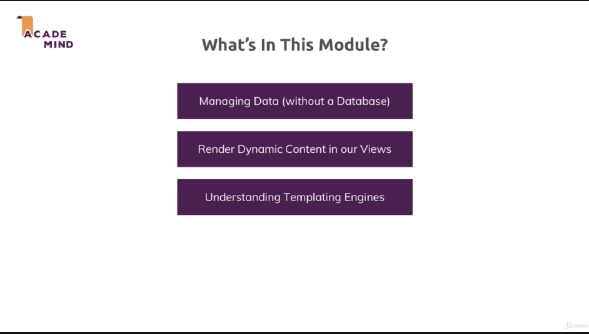

\* Chapter 77: Sharing Data Across Requests & Users
===================================================

1\. update

- ./routes/admin.js

- ./routes/shop.js

- app.js


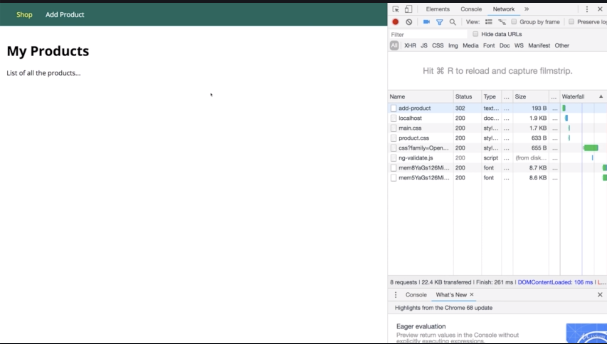

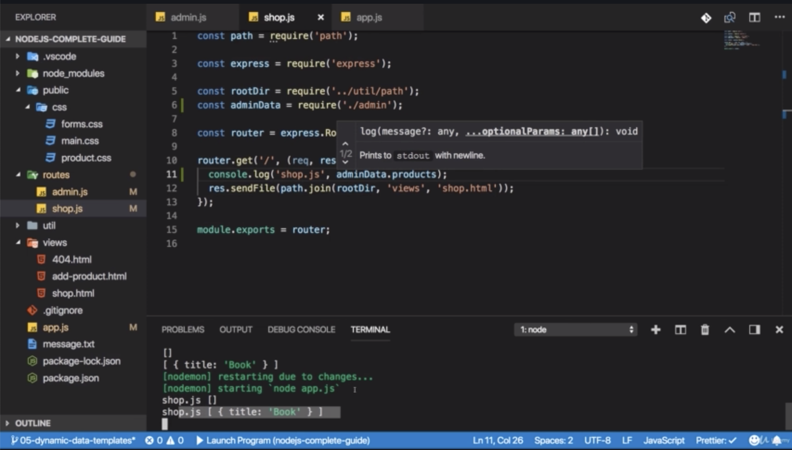

- we see something interesting. we see the array with the book inside of it and that console.log statement, where is this actually coming from shop.js file.

```js
//app.js

const path = require('path');

const express = require('express');
const bodyParser = require('body-parser');

const app = express();

const adminData = require('./routes/admin');
const shopRoutes = require('./routes/shop');

app.use(bodyParser.urlencoded({extended: false}));
app.use(express.static(path.join(__dirname, 'public')));

app.use('/admin', adminData.routes);
app.use(shopRoutes);

app.use((req, res, next) => {
    res.status(404).sendFile(path.join(__dirname, 'views', '404.html'));
});

app.listen(3000);
```

```js
//./routes/admin.js

const path = require('path');

const express = require('express');

const rootDir = require('../util/path');

const router = express.Router();

const products = [];

// /admin/add-product => GET
router.get('/add-product', (req, res, next) => {
  res.sendFile(path.join(rootDir, 'views', 'add-product.html'));
});

// /admin/add-product => POST
router.post('/add-product', (req, res, next) => {
  /**if we change that in other file, it also gives us the update here. 
   * 
   * the problem is that this is data which is inherit to our node server
   * as it is running and therefore it's shared across all users. 
   * sometimes this is what you may want but very rarely. you will probably never implement this.
   * you always wanna fetch data for a specific request
   * and if that happens to be the same data you show for all users that send this request.
   * 
  */
  products.push({ title: req.body.title });
  res.redirect('/');
});

exports.routes = router;
exports.products = products;
```

```js
//./routes/shop.js

const path = require('path');

const express = require('express');

const rootDir = require('../util/path');
const adminData = require('./admin');

const router = express.Router();

router.get('/', (req, res, next) => {
  console.log('shop.js', adminData.products);
  res.sendFile(path.join(rootDir, 'views', 'shop.html'));
});

module.exports = router;

```

\* Chapter 78: Templating Engines - An Overview
===============================================

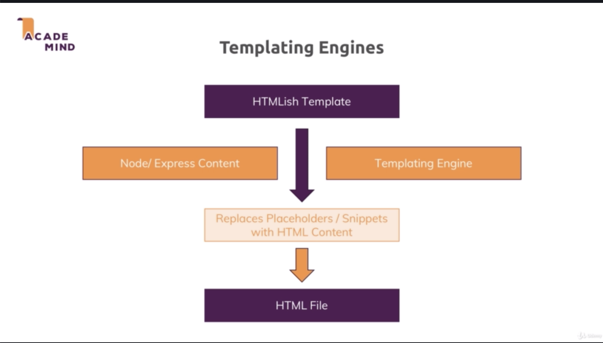

- Putting dynamic content into our html pages, we would use something called templating engines

- templating engines work like this. 

- we got HTML-ish template which means you typically write some code, files that contains a lot of HTML, your HTML Structure and Markup, your style and javascript imports, all of that is typically included but you have some blanks in there, some placeholders. 

- and then you have your node express content in your app like our dummy array, our products array we are currently using.

- and you have got a templating engine which understands a certain syntax for which it scans your HTML-ish template and where it then replaces placeholders or certain snippets depending on the engine you are using with real HTML content. this HTML conetent, it uses there, is generated on the fly, on the server by templating engine, taking that dynamic content into account. 

- for example, you could output unordered list with list items for the data you have in your node express app with the help of the templating engine 

- and in the end, the result will be dynamically, on the fly generated HTML file which is then sent back to your users. So the users never see the template, placeholders, all that happens on the server. they just get a normal html page. but it’s not hardcoded by tou as it currently is in our project, but instead, it’s generated on the fly. 

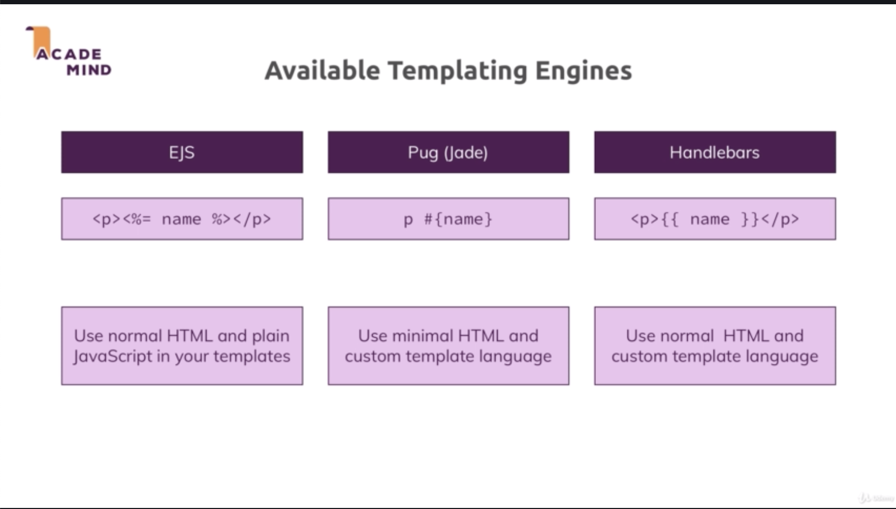

- now we got a couple of different available templating engines and you get even more options.

- there 3 are free templating engines that use a different syntax and different set of features, different philoso;hies that you can use to well create these templates, inject your dynamic content and get HTML files out of them. 

\* Chapter 79: Installing & Implementing Pug
============================================

1\. update

- app.js

- ./views/shop.pug

- ./views/shop.html

- ./routes/shop.js

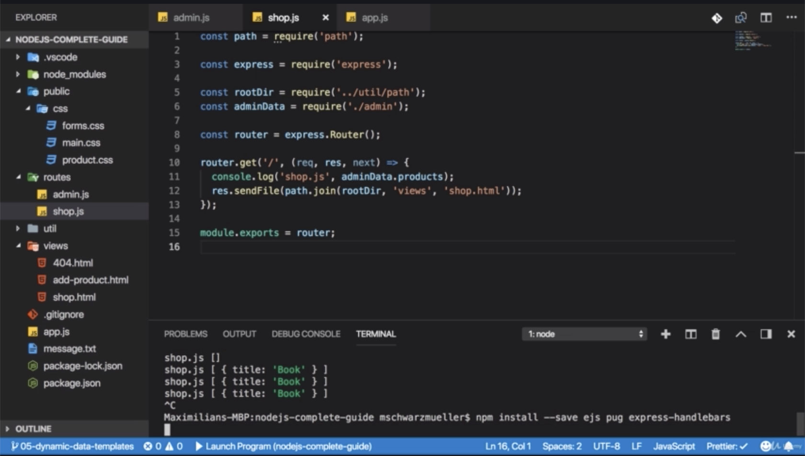

- —save because all 3 engines are part of our node code and ship with the code, we deploy on some computer in the end. 

- you can install multiple pacakge at once by simply repeating or by adding all the names after npm install. 

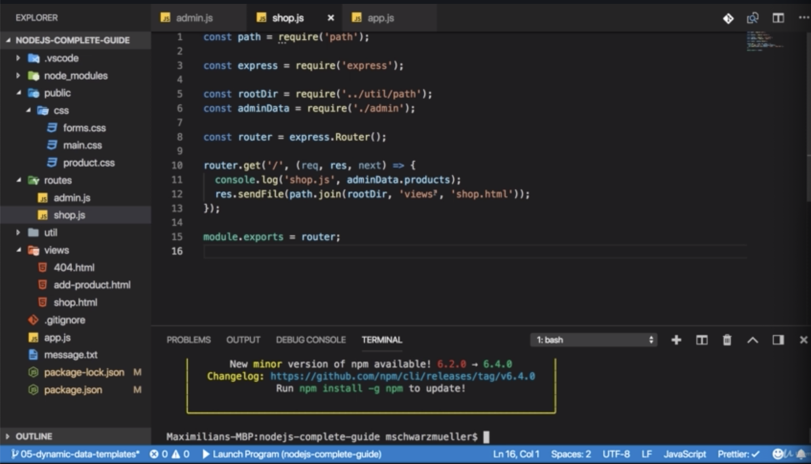

- after installing, go to app.js and now we have to let Express.js know and that is an express feature not node by the way.

- another strong reason why we wanna use express because standalone node will be harder. you would have to do all that manually, here we can just tell Express that ‘we got a templating engine’ that is express conforming and that is the case for all 3 we installed. so use it to render dynamic template. 

- after installing, go to app.js and after we createed our express app here and store it in the app constant, we can set a global configuration value. what is that?

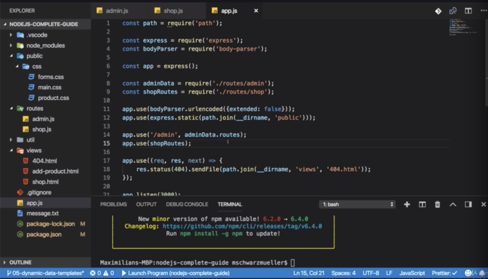

- app.set() allows us to set any values globally on our express application. and this can also be keys or configuration items express doesn’t understand. but in that case, it just ignore them. 

- but we could actually read them from the app object with app.get() and this would be another way of sharing data across our application. but not really something i’m interested in here. 

- what we can do is to use a couple of reserved key names. so configuration items we can set that do lead to Express.js behaving differently. 

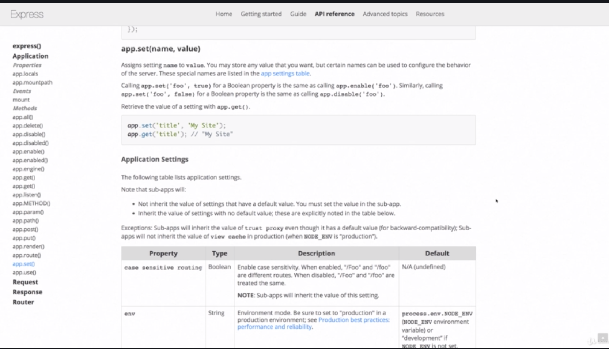

- now most of them don’t really matter for us. but interesting for us is the 'view engine' and the ‘views' key.

- view engine allows us to tell express ‘for any dynamic templates we are trying to render and there will be a special function for doing that, please use this engine we are registering here’

- view allows us to tell express where to find these dynamic views. 

- so what we can do is to set and set the view engine to a string pug.

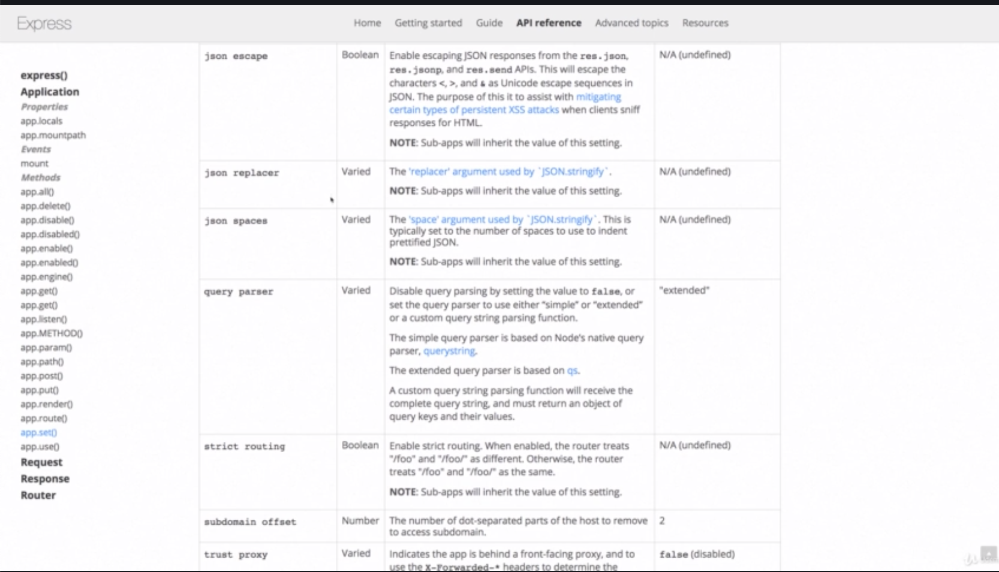

- with this, if i run npm start, we wouldn’t see anything. however we wouldn’t render this template because we are not telling express to do so. we are telling express that it should use this templating engine whenever we try to render a template but we don’t try to do that. 

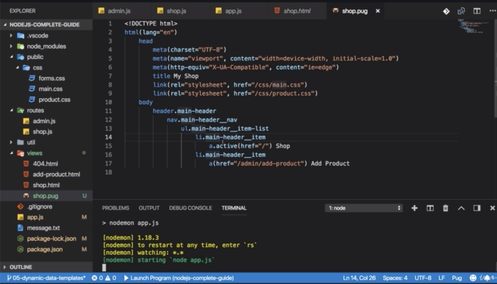

- so in shop.js, where we define what should be our response, we have to change the response because right now, we are sending HTML file. 

- we will use the special ‘render()’ method which is provided by Express.js and it will use the default templating engine which is why we had to define here in app.js. it will use that default templating engine and then return that template. 

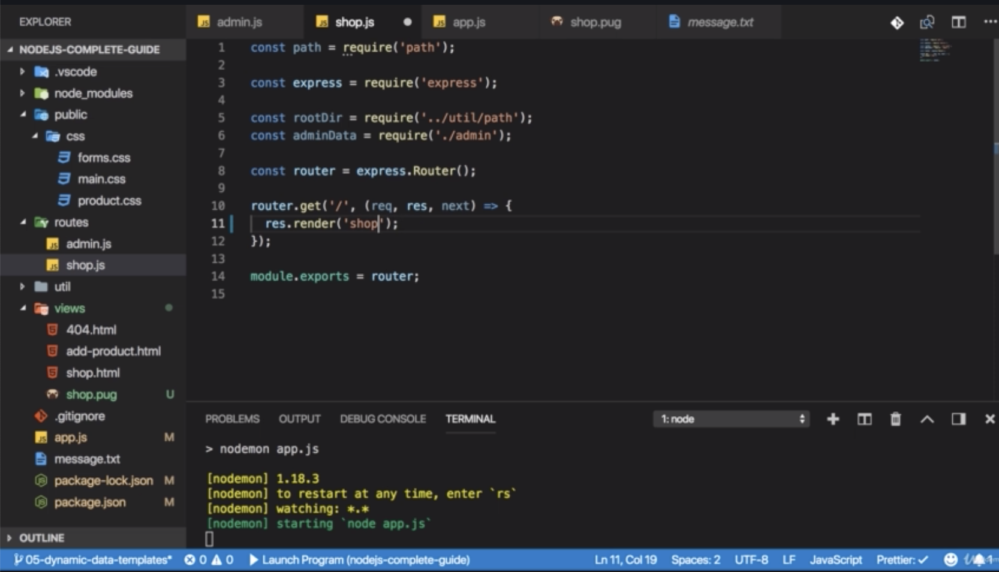

- and we defined that all that views are in the veiws folder, we don’t have to construct a path to that folder. instead we can just say shop. 

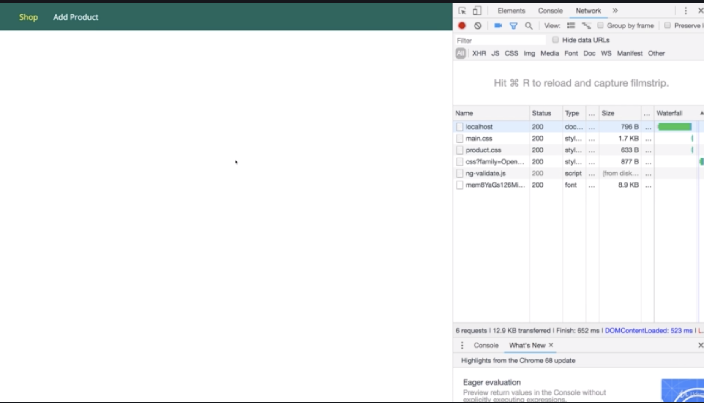

- so if we reload shop page, we see the header, we don’t see the main content because we didn’t add this but rest of this working fine. 

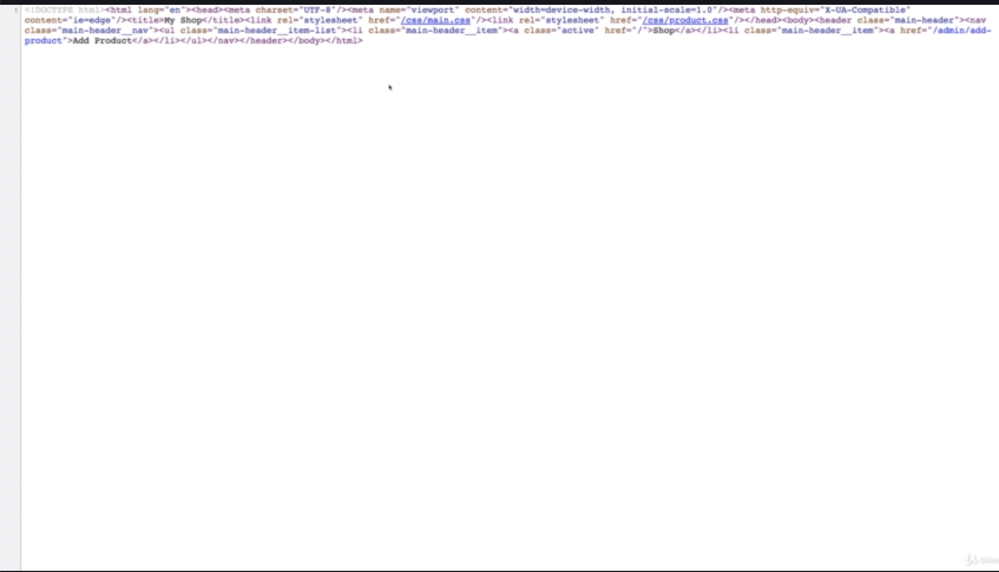

- and if you see inspector or view the page source, you will see this is normal HTML code. so it’s not our minimal version which the browser wouldn’t be able to read anyways but it is the HTML code pug-generated for us based on that minimal version.

```js
//app.js

const path = require('path');

const express = require('express');
const bodyParser = require('body-parser');

const app = express();

/** you can't enter anything inside 'pug' 
 * we use pug because we installed the pug templating engine
 * and this engine actually ships with built in express support and auto registers itself with express
 * so that is why this works. pug is supported out of the box and with that, we are already set to go.
*/
app.set('view engine', 'pug');
/**we can let express know where to find our views 
 * however the default setting for views already is our main directory and then the views folder.
 * 
 * i will still send it explicitly here to show you how this would work 
 * if you would store your views in another folder which is not called views
 * but maybe templates or whatever it is, that you have to set this configuration 
 * i will set it too even though it wouldn't be needed
 * because views is the default. 
*/

/** now we are telling express that we wanna compile dynamic templates with the pug engine
 * and where to find these templates. 
 */
app.set('views', 'views');

const adminData = require('./routes/admin');
const shopRoutes = require('./routes/shop');

app.use(bodyParser.urlencoded({extended: false}));
app.use(express.static(path.join(__dirname, 'public')));

app.use('/admin', adminData.routes);
app.use(shopRoutes);

app.use((req, res, next) => {
    res.status(404).sendFile(path.join(__dirname, 'views', '404.html'));
});

app.listen(3000);

```

```html
//-<!--./views/shop.pug-->

//-<!--pug works differently to normal HTML

//-we get no normal HTML tags. 
//-but keep in mind that the pug templating engine will compile our code to normal HTML in the end.
//-it's important to keep this file's indentation level.-->

<!DOCTYPE html>
html(lang="en")
    head
        meta(charset="UTF-8")
        meta(name="viewport", content="width=device-width, initial-scale=1.0")
        meta(http-equiv="X-UA-Compatible", content="ie=edge")
        title My Shop
        link(rel="stylesheet", href="/css/main.css")
        link(rel="stylesheet", href="/css/product.css")
    body
        header.main-header
            nav.main-header__nav
                ul.main-header__item-list
                    li.main-header__item
                        a.active(href="/") Shop
                    li.main-header__item
                        a(href="/admin/add-product") Add Product
```

```js
//./routes/shop.js

const path = require('path');

const express = require('express');

const rootDir = require('../util/path');
const adminData = require('./admin');

const router = express.Router();

router.get('/', (req, res, next) => {
  /**you don't need to type .pug because it know that this in here is .pug file  */
  res.render('shop');
});

module.exports = router;

```

\* Chapter 80: Outputting Dynamic Content
=========================================

1\. update

- ./routes/shop.js

- ./views/shop.pug

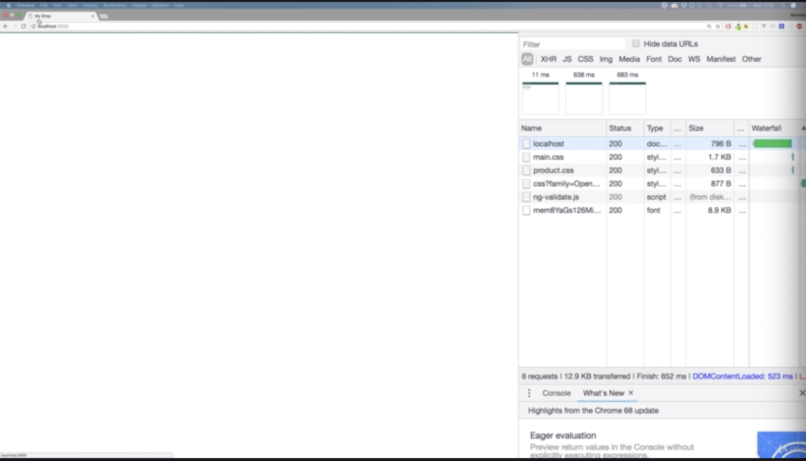

- right now, it’s still ‘My Shop’

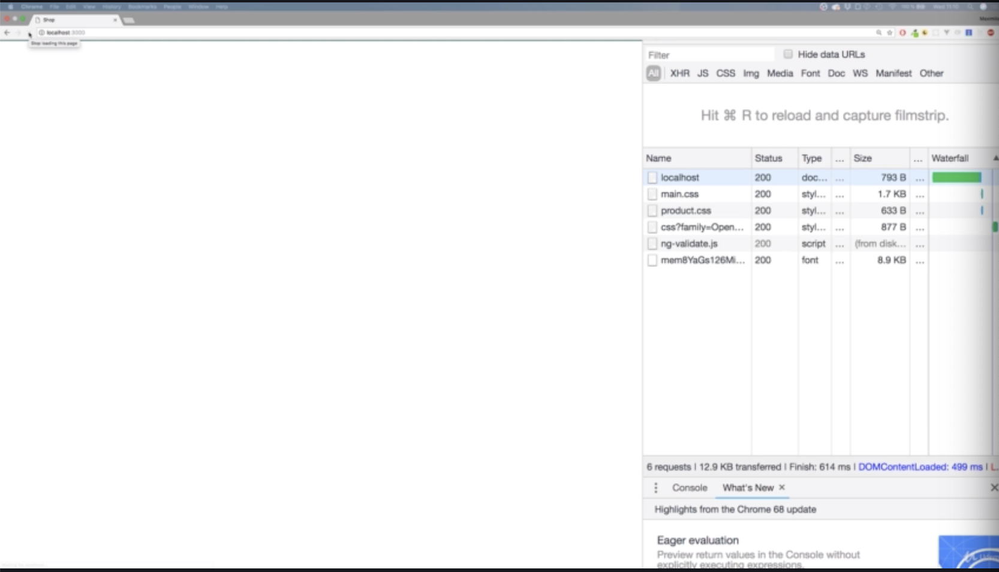

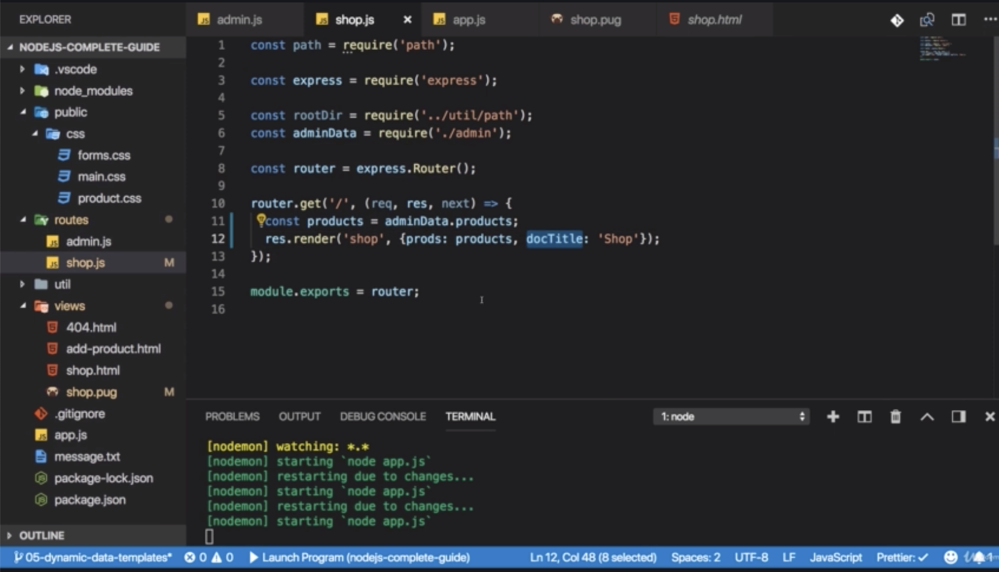

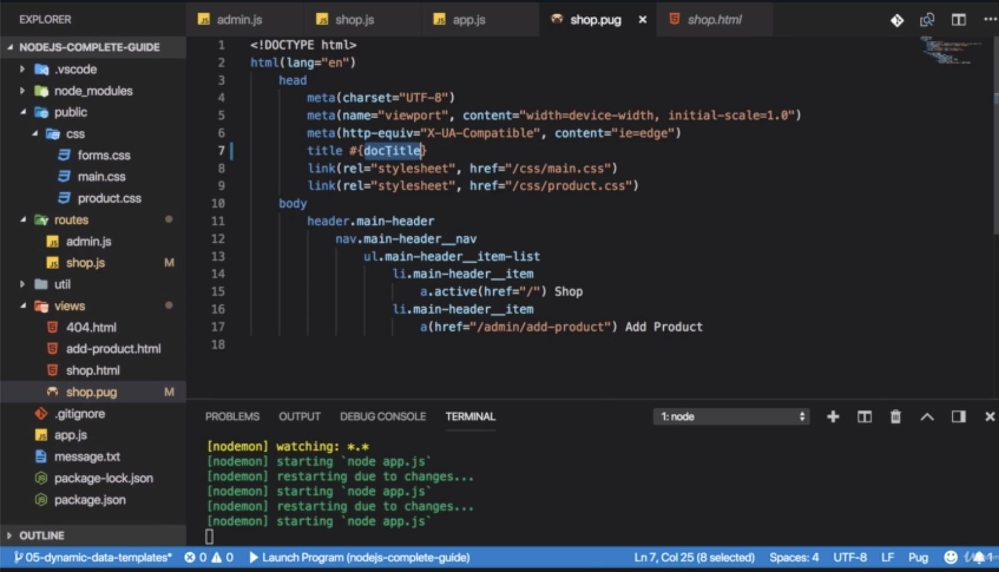

- if i now reload, it’s Shop because this is the title i’m storing in ‘docTitle’ and ‘docTitle’ is what we outputting here.

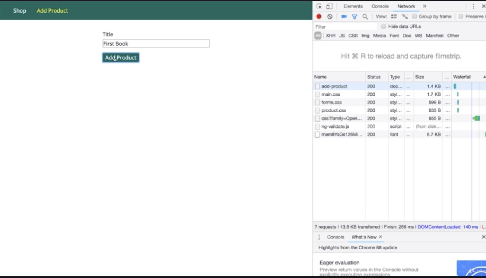

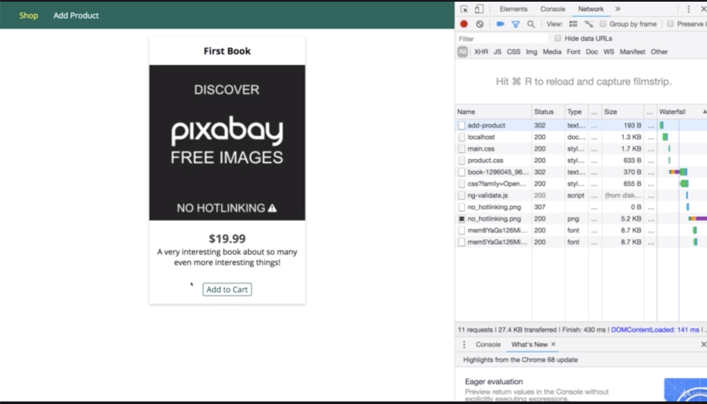


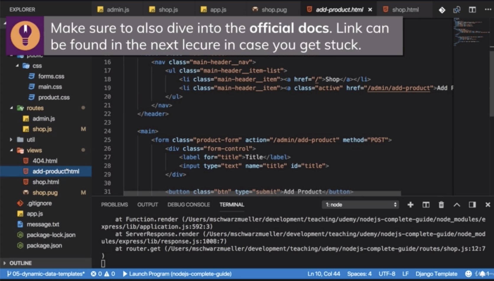

```js
//./routes/shop.js

const path = require('path');

const express = require('express');

const rootDir = require('../util/path');
const adminData = require('./admin');

const router = express.Router();

router.get('/', (req, res, next) => {
  const products = adminData.products;
  /**now we wanna pass that into our template, inject it into our template
   * so that we can use it in .pug template file and somehow output it there
   * 
   * to do that, we can simply pass a second argument to the render method,
   * the render() method allows us to pass in data that should be added into our view
   * 
   * as a javascript object where we map it to key name 
   * which we then can use in the template to refer to the data we are passing in.
   * 
   * simply let's use 'prods' to avoid naming confusion. 
   * then i will bind my products. 
   * 
   * this is passed to the template. 
   * now in the template (shop.pug file), we will just be able to access prods.
   */

   /**by the way, we can also pass more than 1 field.
    * we could pass in 'docTitle: 'shop'' and now we can use that too.
    */
  res.render('shop', {prods: products, docTitle: 'Shop'});
});

module.exports = router;
```

```html
//-<!--./views/shop.pug-->

<!DOCTYPE html>
html(lang="en")
    head
        meta(charset="UTF-8")
        meta(name="viewport", content="width=device-width, initial-scale=1.0")
        meta(http-equiv="X-UA-Compatible", content="ie=edge")
        //-<!--we can use the custom templating syntax pug gives us
        //-if you just wanna output some text, this is a hashtag followed by 2 curly braces
        //-and between these curly braces, you can pass any value you are passing into your view like 'docTitle' in shop.js.
            -->
        title #{docTitle}
        link(rel="stylesheet", href="/css/main.css")
        link(rel="stylesheet", href="/css/product.css")
    body
        header.main-header
            nav.main-header__nav
                ul.main-header__item-list
                    li.main-header__item
                        a.active(href="/") Shop
                    li.main-header__item
                        a(href="/admin/add-product") Add Product
        main
            if prods.length > 0
                .grid
                    //-<!--we don't need header tag
                        because this is added automatically,
                        //-now this output a grid of product cards
                            but only with static content.
                            now make this less static, we need to iterate through all the products
                            and that we do pass the product into the view on the 'prods' key in the shop.js file
                            and so to iterate and repeat this article in shop.pug for all the products,
                            we can simply add a special syntax provided by pug 
                            and you create such a loop by adding 'each' keyword 
                            then a value in which you wanna store the value for the current iteration.
                            so a single 'product' in our case. 
                            then after 'in', you can put what you want which is 'prods' refered from shop.js passing to our view.-->
                    each product in prods
                        //-<!--you don't need div 
                            because if you don't have anything, it's assumed to be a div-->
                        article.card.product-item
                            //-<!--if you have got multiple classes, 
                            you need to merge them 
                            and simply concatenate them separated by dots . 
                            and never forget the indentation-->
                            header.card__header
                                //-<!--one single 'product' is in prods which is the product array refered from shop.js
                                    so product.title is title filled in browser-->
                                h1.product__title #{product.title}
                                    //-<!--you never need closing tags here 
                                        because pug will handle it for you.-->
                            div.card__image
                                img(src="https://cdn.pixabay.com/photo/2016/03/31/20/51/book-1296045_960_720.png", alt="A Book")
                            div.card__content
                                h2.product__price $19.99
                                p.product__description A very interesting book about so many even more interesting things!</p>
                            .card__actions
                                button.btn Add to Cart
            else
                h1 No Products
```

\* Chapter 82: Converting HTML Files To Pug
===========================================

1\. update

- ./views/add-product.pug

- ./routes/admin.js

- ./views/404.pug

- app.js

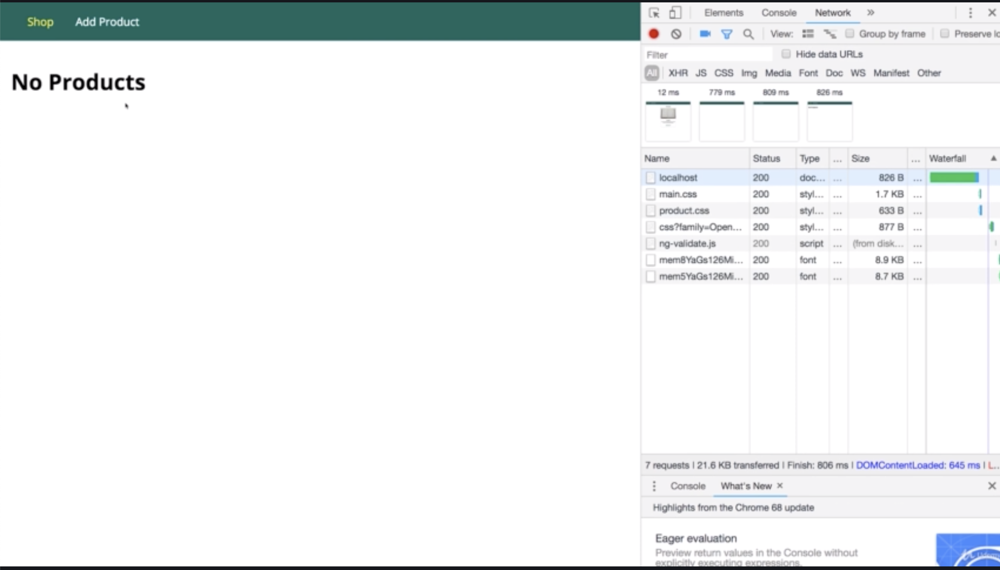

- this is gone because the server restarted due to our server-side changes. 

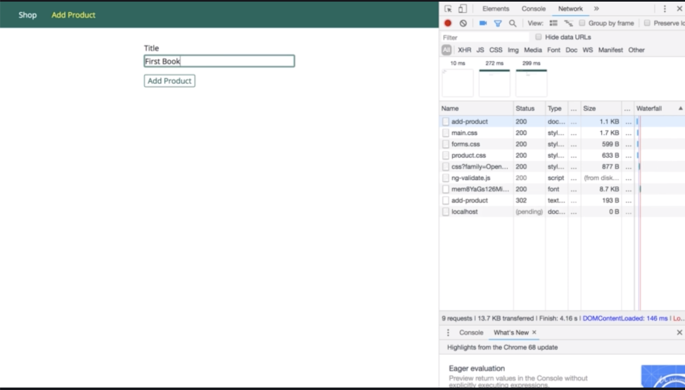

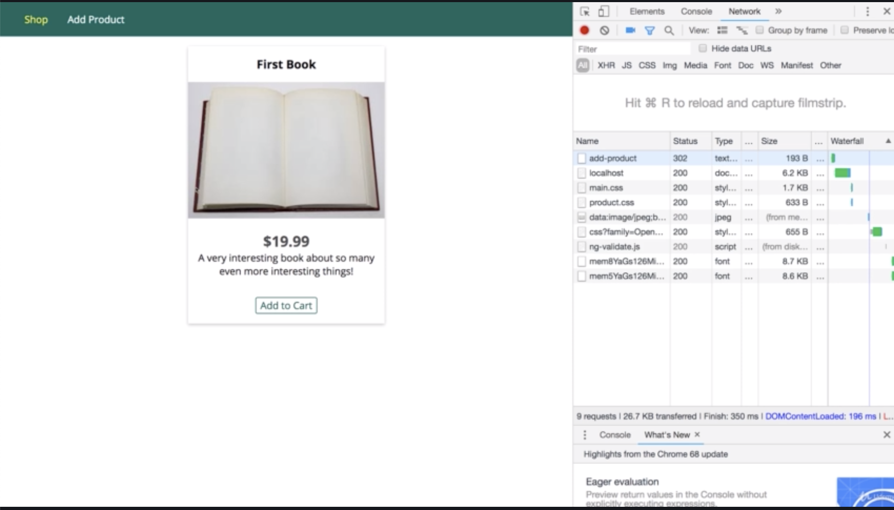

now if you click ‘product’, and fill out input field, it works well. 

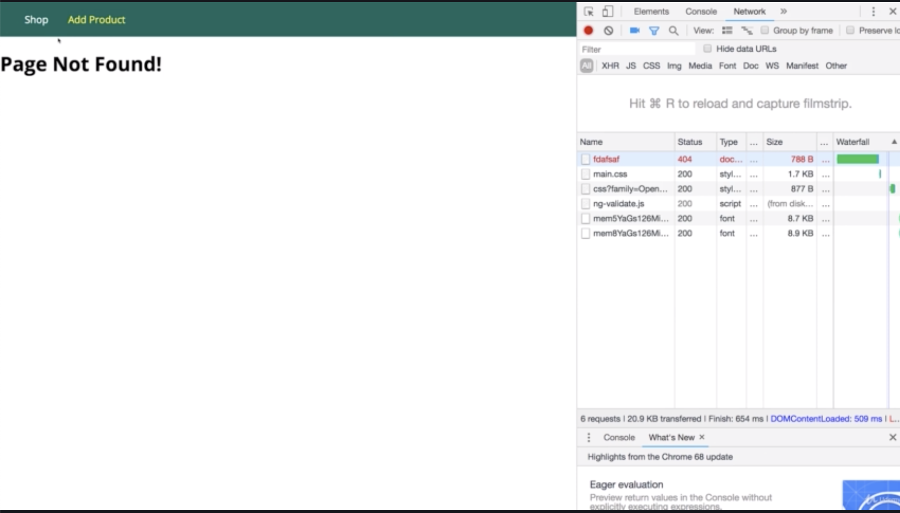

```js
//app.js

const path = require('path');

const express = require('express');
const bodyParser = require('body-parser');

const app = express();

/** you can't enter anything inside 'pug' 
 * we use pug because we installed the pug templating engine
 * and this engine actually ships with built in express support and auto registers itself with express
 * so that is why this works. pug is supported out of the box and with that, we are already set to go.
*/
app.set('view engine', 'pug');
/**we can let express know where to find our views 
 * however the default setting for views already is our main directory and then the views folder.
 * 
 * i will still send it explicitly here to show you how this would work 
 * if you would store your views in another folder which is not called views
 * but maybe templates or whatever it is, that you have to set this configuration 
 * i will set it too even though it wouldn't be needed
 * because views is the default. 
*/

/** now we are telling express that we wanna compile dynamic templates with the pug engine
 * and where to find these templates. 
 */
app.set('views', 'views');

const adminData = require('./routes/admin');
const shopRoutes = require('./routes/shop');

app.use(bodyParser.urlencoded({extended: false}));
app.use(express.static(path.join(__dirname, 'public')));

app.use('/admin', adminData.routes);
app.use(shopRoutes);

app.use((req, res, next) => {
    res.status(404).render('404')
});

app.listen(3000);

```

```js
//./routes/admin.js

const path = require('path');

const express = require('express');

const rootDir = require('../util/path');

const router = express.Router();

const products = [];

// /admin/add-product => GET
router.get('/add-product', (req, res, next) => {
  res.render('add-product', { pageTitle: 'Add Product' })
});

// /admin/add-product => POST
router.post('/add-product', (req, res, next) => {
  /**if we change that in other file, it also gives us the update here. 
   * 
   * the problem is that this is data which is inherit to our node server
   * as it is running and therefore it's shared across all users. 
   * sometimes this is what you may want but very rarely. you will probably never implement this.
   * you always wanna fetch data for a specific request
   * and if that happens to be the same data you show for all users that send this request.
   * 
  */
  products.push({ title: req.body.title });
  res.redirect('/');
});

exports.routes = router;
exports.products = products;

```

```html
//-<!--./views/404.pug-->

<!DOCTYPE html>
html(lang="en")
    head
        meta(charset="UTF-8")
        meta(name="viewport", content="width=device-width, initial-scale=1.0")
        meta(http-equiv="X-UA-Compatible", content="ie=edge")
        title Page Not Found
        link(rel="stylesheet", href="/css/main.css")
    body
        header.main-header
            nav.main-header__nav
                ul.main-header__item-list
                    li.main-header__item
                        a.active(href="/") Shop
                    li.main-header__item
                        a.active(href="/admin/add-product") Add Product
        h1 Page Not Found
```

```html
//-<!--./views/add-product.pug-->

<!DOCTYPE html>
html(lang="en")
    head
        meta(charset="UTF-8")
        meta(name="viewport", content="width=device-width, initial-scale=1.0")
        meta(http-equiv="X-UA-Compatible", content="ie=edge")
        title #{pageTitle}
        link(rel="stylesheet", href="/css/main.css")
        link(rel="stylesheet", href="/css/form.css")
        link(rel="stylesheet", href="/css/product.css")
    body
        header.main-header
            nav.main-header__nav
                ul.main-header__item-list
                    li.main-header__item
                        a.active(href="/") Shop
                    li.main-header__item
                        a.active(href="/admin/add-product") Add Product

        main
            form.product-form(action="/admin/add-product", method="POST")
                .form-control
                    label(for="title") Title
                    input(type="text", name="title")#title

                button.btn(type="submit") Add Product
```

\* Chapter 83: Adding A Layout
==============================

1\. update

- ./views/layouts/main-layout.pug

- ./views/404.pug

- ./views/add-product.pug

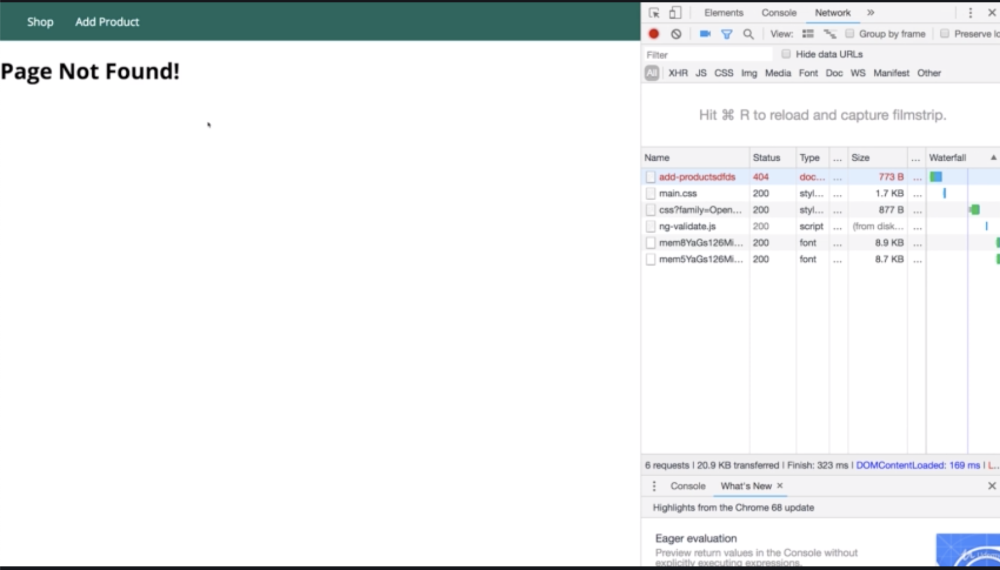

- if i save and i enter some random path which doesn’t exist, i still get Page Not Found. 

- but now behind the scenes, this uses my layout and we can do the same on the other pages like add-product.pug file


```html
//-<!--/views/layouts/main-layout.pug-->

//-<!--./views/404.pug-->

<!DOCTYPE html>
html(lang="en")
    head
        meta(charset="UTF-8")
        meta(name="viewport", content="width=device-width, initial-scale=1.0")
        meta(http-equiv="X-UA-Compatible", content="ie=edge")
        title Page Not Found
        link(rel="stylesheet", href="/css/main.css")
        //-<!--we can extend this layout from inside our other pug views
                and we can actually define some placeholders, some hooks in this layout
                where other views can then enter their content.

                for example, in the links, we get a base layout which looks like this
                but in other views that should extend this layout,
                they might use this layout and add more links in this place
                we can define such a hook by adding the 'block' keyword which pug understand
                and then defining any name of our choice. styles for example
                we will be able to add more styles from inside other files here

                we get this basic layout with 2 hooks(styles, content).
                we can dynamically enter content into from inside our other files
                -->
        block styles
    body
        header.main-header
            nav.main-header__nav
                ul.main-header__item-list
                    li.main-header__item
                        a.active(href="/") Shop
                    li.main-header__item
                        a(href="/admin/add-product") Add Product
        block content
```

```html
//-<!--./views/add-product.pug-->
extends layouts/main-layout.pug

block styles
    //-<!--these are the 2 styles imports which are not part of the default layout-->
    link(rel="stylesheet", href="/css/form.css")
    link(rel="stylesheet", href="/css/product.css")

block content
    main
        form.product-form(action="/admin/add-product", method="POST")
            .form-control
                label(for="title") Title
                input(type="text", name="title")#title

            button.btn(type="submit") Add Product
```

```html
//-<!--./views/404.pug-->

//-<!--we can now extend the layout 
        by adding the extends keyword which pug understands
        and now we just need to point at the 'layouts' folder.
        we have the layouts folder and we wanna use the 'main-layout' file in there
        -->
extends layouts/main-layout.pug

//-<!-- and now we have to tell it what to render in that content
            and maybe also in that styles hook, we defined.
            for styles, i don't need any special setting here
            but for the content block, i wanna enter my own custom content
            and i do this by again typing block content
            but now since i extend a layout, this will not define a hook
            but allow me to add content in that layout
            and then indent it here. and i define what should be injected into the content block in the layout.
            -->
block content
    h1 Page Not Found
```

\* Chapter 84: Finishing The Pug Template
=========================================

1\. update

- ./routes/admin.js

- ./routes/shop.js

- ./views/main-layout.pug

- ./views/shop.pug

- app.js

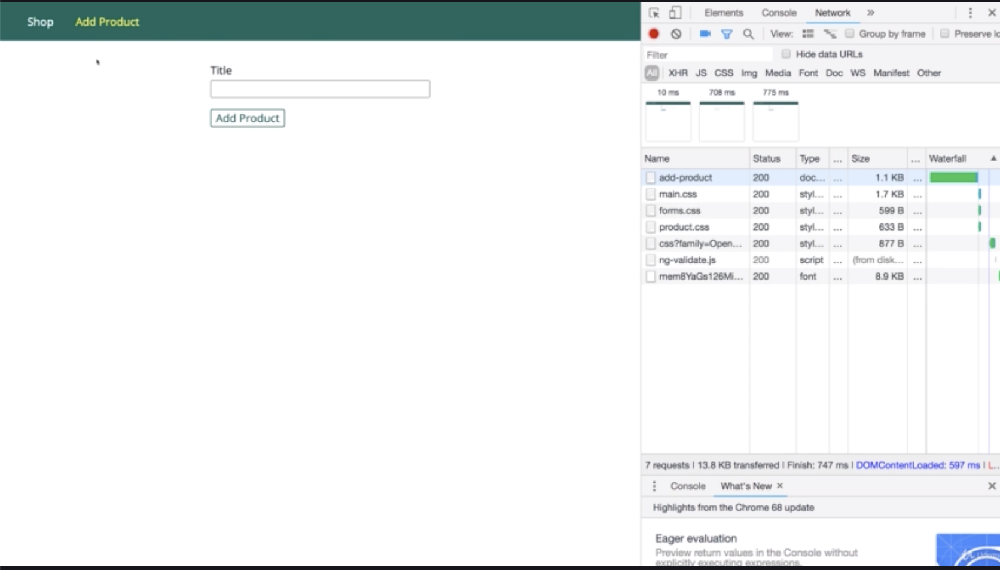

- you see add-product is yellow because it’s marked as active. 


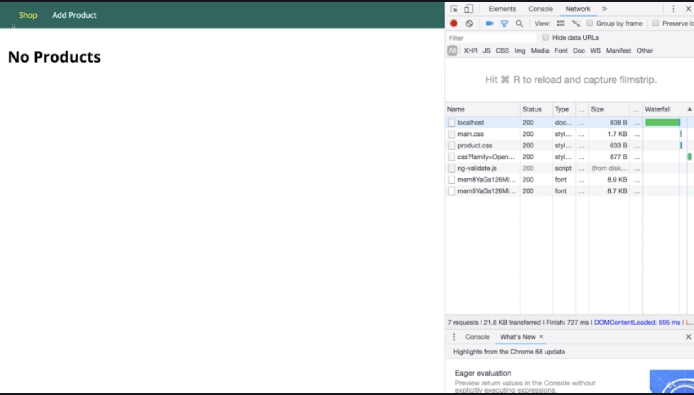


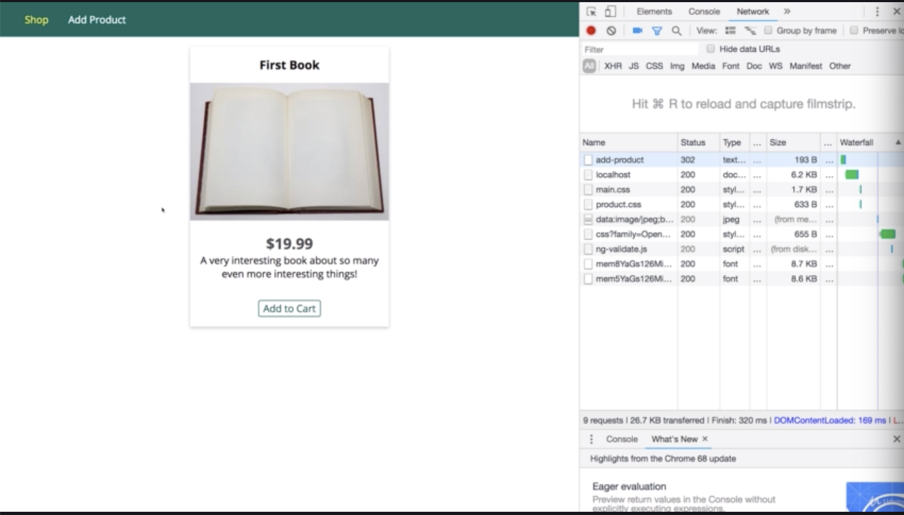

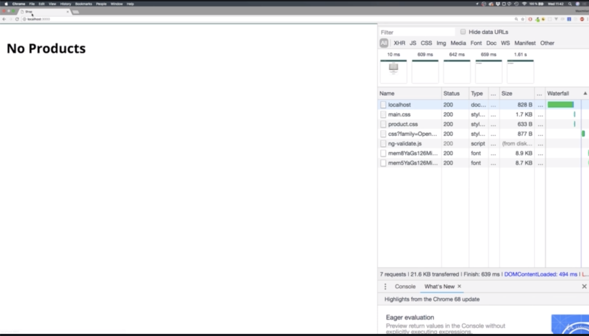

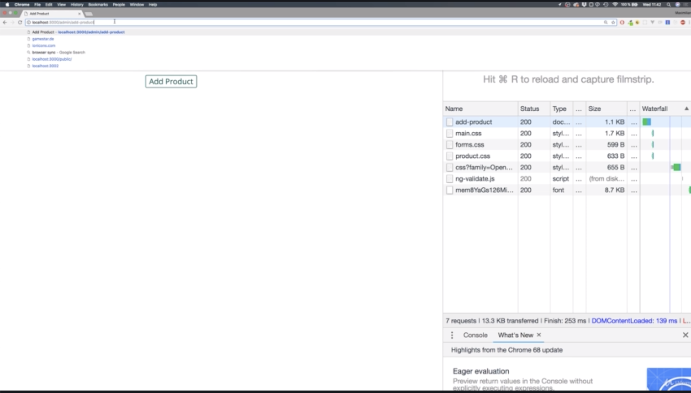

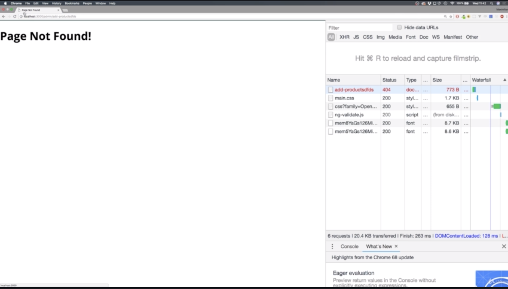

```js
//app.js

const path = require('path');

const express = require('express');
const bodyParser = require('body-parser');

const app = express();

app.set('view engine', 'pug');
app.set('views', 'views');

const adminData = require('./routes/admin');
const shopRoutes = require('./routes/shop');

app.use(bodyParser.urlencoded({extended: false}));
app.use(express.static(path.join(__dirname, 'public')));

app.use('/admin', adminData.routes);
app.use(shopRoutes);

app.use((req, res, next) => {
    res.status(404).render('404', {pageTitle: 'Page Not Found'})
});

app.listen(3000);
```

```js
//./routes/admin.js

const path = require('path');

const express = require('express');

const rootDir = require('../util/path');

const router = express.Router();

const products = [];

// /admin/add-product => GET
router.get('/add-product', (req, res, next) => {
  /**i pass this path into my view,
   * so that the view can find out what is the path for which this was loaded
   */
  res.render('add-product', { pageTitle: 'Add Product', path: '/admin/add-product' })
});

// /admin/add-product => POST
router.post('/add-product', (req, res, next) => {
  products.push({ title: req.body.title });
  res.redirect('/');
});

exports.routes = router;
exports.products = products;

```

```js
//./routes/shop.js

const path = require('path');

const express = require('express');

const rootDir = require('../util/path');
const adminData = require('./admin');

const router = express.Router();

router.get('/', (req, res, next) => {
  const products = adminData.products;
  res.render('shop', {prods: products, pageTitle: 'Shop', path:'/'});
});

module.exports = router;
```

```html
//-<!--/views/layouts/main-layout.pug-->

<!DOCTYPE html>
html(lang="en")
    head
        meta(charset="UTF-8")
        meta(name="viewport", content="width=device-width, initial-scale=1.0")
        meta(http-equiv="X-UA-Compatible", content="ie=edge")
        title #{pageTitle}
        link(rel="stylesheet", href="/css/main.css")
        block styles
    body
        header.main-header
            nav.main-header__nav
                ul.main-header__item-list
                    li.main-header__item
                        a(href="/", class=(path === '/' ? 'active' : '')) Shop
                    li.main-header__item
                        //-<!--in the main-layout,
                            i know i wanna add the active class to this add-product
                            if the path and the path now simply is a variable i get passed into the page(main-layout.pug file),
                            if the path simply is '/admin/add-product' and that is something we define
                            and therefore you could pick any path you want

                            so i will add a check here.
                            a class can be added, a CSS class as an attribute too
                            and now i will have some javascript code which we can enclose with bracket
                            now we gonna check if path is equal to '/admin/add-product'
                            this is why i meant you can use whatever path you want, you are defining the condition here.

                            then if path is equal to this, then i know that add-product is the page i'm on
                            because only for the add-product route i do set this path.
                            then if that is the case, i wanna render active as a class here.-->
                        a(href="/admin/add-product", class=(path === '/admin/add-product' ? 'active' : '')) Add Product
        block content
```

```html
//-<!--./views/shop.pug-->

extends layouts/main-layout.pug

block styles
    link(rel="stylesheet", href="/css/product.css")

block content
    main
        if prods.length > 0
            .grid
                each product in prods
                    article.card.product-item
                        //-<!--you need to merge them
                            and simply concatenate them separated by dots .
                            and never forget the indentation-->
                        header.card__header
                            h1.product__title #{product.title}
                        div.card__image
                            img(src="https://cdn.pixabay.com/photo/2016/03/31/20/51/book-1296045_960_720.png", alt="A Book")
                        div.card__content
                            h2.product__price $19.99
                            p.product__description A very interesting book about so many even more interesting things!</p>
                        .card__actions
                            button.btn Add to Cart
        else
            h1 No Products
```

\* Chapter 85: Working With Handlebars
======================================

1\. update

- app.js

- ./views/404.hbs

- handlebars doesn’t follow such a minimal HTML approach but uses normal HTML mixed with some templating logic.

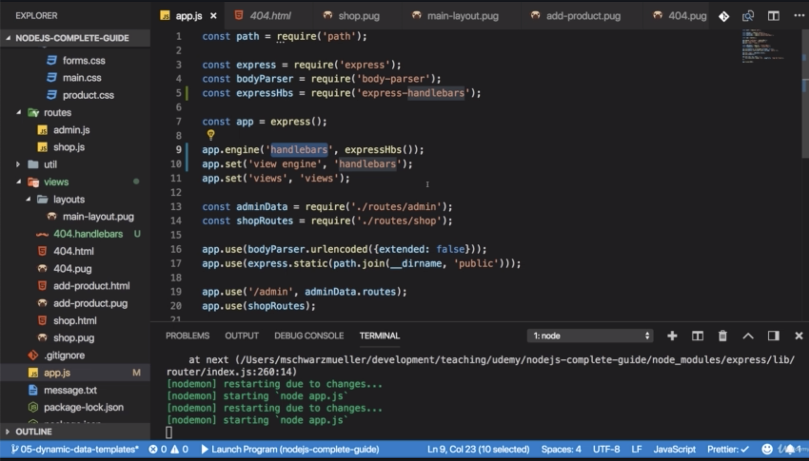

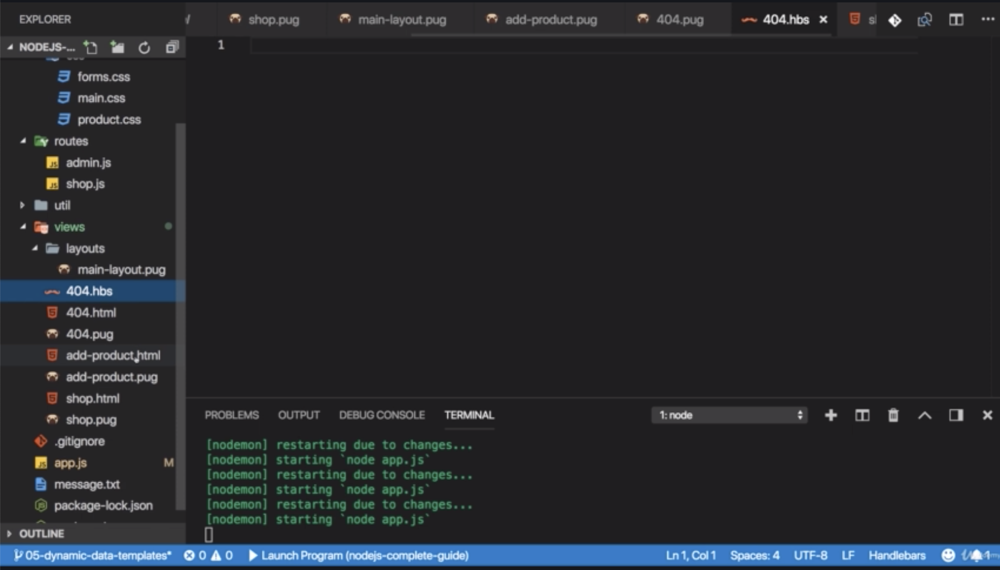

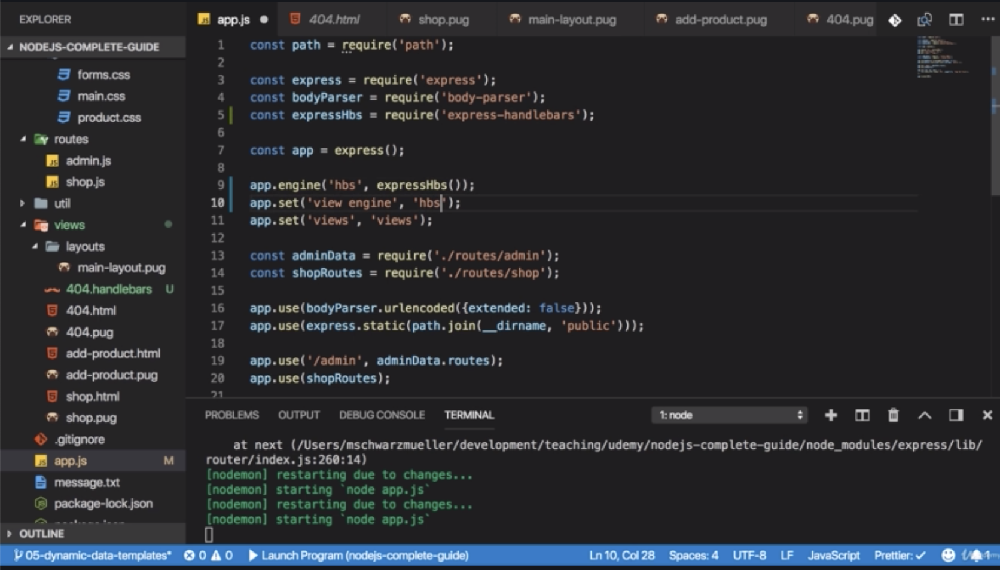

- you can change the engine name

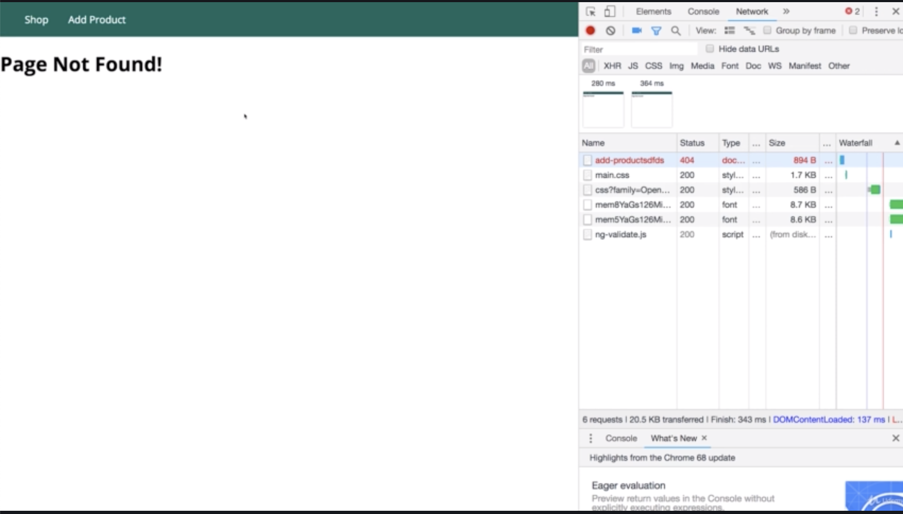

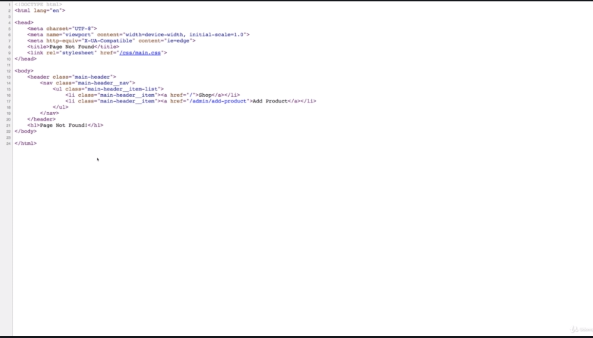

- if we inspect this, the doubly curly braces was replaced with the content that should be rendered.


```js
//app.js

const path = require('path');

const express = require('express');
const bodyParser = require('body-parser');
const expressHbs = require('express-handlebars')

const app = express();

/**'engine()' method register a new templating engine,
 * in case, we are using one which is not built-in.
 * pug was built-in kind of it.
 * express-handlebars is not.
 */

/**now we have to tell express that 'handlebars' is the name
 * now what's the actual tool i should use?
 * that is 'expressHbs' and that is object we just imported,
 * that turns out to be a function we can call
 * and we have to call, that initialize this engine. 
 * so this function returns the initialized view engine which we can assign to engine here.
 * 
 */
app.engine('hbs', expressHbs())
/**in here, second argument have to be matched to first arguemnt in 'app.engine()' */
app.set('view engine', 'hbs');
app.set('views', 'views');

const adminData = require('./routes/admin');
const shopRoutes = require('./routes/shop');

app.use(bodyParser.urlencoded({extended: false}));
app.use(express.static(path.join(__dirname, 'public')));

app.use('/admin', adminData.routes);
app.use(shopRoutes);

app.use((req, res, next) => {
    /**keep in mind that in app.js where we load that 404 pages,
     * we are passing in {pageTitle: 'Page Not Found'}
     * and the way you pass into templates doesn't change with the engine. 
     * this is always the same type of flow.
     * you pass in an object with key-value pairs where the keys 
     * and therefore indirectly also the values are available in the template,
     * the way you use it in a template differs from engine to engine.
     */
    res.status(404).render('404', {pageTitle: 'Page Not Found'})
});

app.listen(3000);

```

```html
<!--./views/404.hbs-->

<!DOCTYPE html>
<html lang="en">

<head>
    <meta charset="UTF-8">
    <meta name="viewport" content="width=device-width, initial-scale=1.0">
    <meta http-equiv="X-UA-Compatible" content="ie=edge">
    <title>{{ pageTitle }}</title>
    <link rel="stylesheet" href="/css/main.css">
</head>

<body>
    <header class="main-header">
        <nav class="main-header__nav">
            <ul class="main-header__item-list">
                <li class="main-header__item"><a href="/">Shop</a></li>
                <li class="main-header__item"><a href="/admin/add-product">Add Product</a></li>
            </ul>
        </nav>
    </header>
    <h1>Page Not Found!</h1>
</body>

```

\* Chapter 86: Converting Our Project To Handlebars
===================================================

1\. update

- ./views/add-product.hbs

- ./views/shop.hbs

- ./routes/shop.js

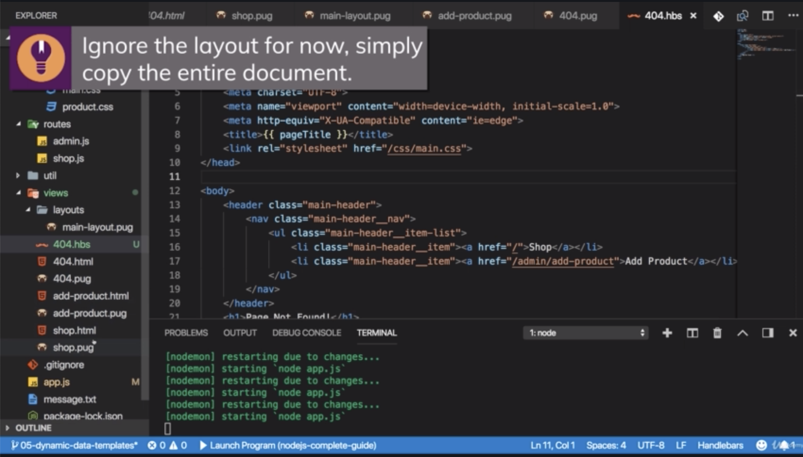

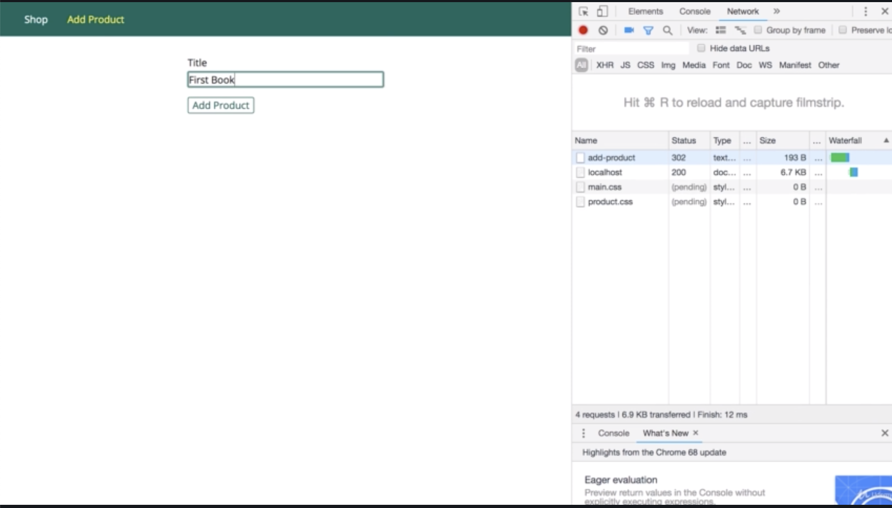


```js
//app.js

const path = require('path');

const express = require('express');
const bodyParser = require('body-parser');
const expressHbs = require('express-handlebars')

const app = express();

/**'engine()' method register a new templating engine,
 * in case, we are using one which is not built-in.
 * pug was built-in kind of it.
 * express-handlebars is not.
 */

/**now we have to tell express that 'handlebars' is the name
 * now what's the actual tool i should use?
 * that is 'expressHbs' and that is object we just imported,
 * that turns out to be a function we can call
 * and we have to call, that initialize this engine. 
 * so this function returns the initialized view engine which we can assign to engine here.
 * 
 */
app.engine('hbs', expressHbs())
/**in here, second argument have to be matched to first arguemnt in 'app.engine()' */
app.set('view engine', 'hbs');
app.set('views', 'views');

const adminData = require('./routes/admin');
const shopRoutes = require('./routes/shop');

app.use(bodyParser.urlencoded({extended: false}));
app.use(express.static(path.join(__dirname, 'public')));

app.use('/admin', adminData.routes);
app.use(shopRoutes);

app.use((req, res, next) => {
    /**keep in mind that in app.js where we load that 404 pages,
     * we are passing in {pageTitle: 'Page Not Found'}
     * and the way you pass into templates doesn't change with the engine. 
     * this is always the same type of flow.
     * you pass in an object with key-value pairs where the keys 
     * and therefore indirectly also the values are available in the template,
     * the way you use it in a template differs from engine to engine.
     */
    res.status(404).render('404', {pageTitle: 'Page Not Found'})
});

app.listen(3000);
```

```js
//./routes/shop.js

const path = require('path');

const express = require('express');

const rootDir = require('../util/path');
const adminData = require('./admin');

const router = express.Router();

router.get('/', (req, res, next) => {
  const products = adminData.products;
  /**now we just pass the key 'hasProducts' which is true or false, the result of check.
   * this is core difference between pug and express-handlebars.
  */
  res.render('shop', {prods: products, pageTitle: 'Shop', path:'/', hasProducts: products.length > 0});
});

module.exports = router;
```

```html
<!--./views/shop.hbs-->

<!DOCTYPE html>
<html lang="en">

<head>
    <meta charset="UTF-8">
    <meta name="viewport" content="width=device-width, initial-scale=1.0">
    <meta http-equiv="X-UA-Compatible" content="ie=edge">
    <title>{{ pageTitle }}</title>
    <link rel="stylesheet" href="/css/main.css">
    <link rel="stylesheet" href="/css/product.css">
</head>

<body>
    <header class="main-header">
        <nav class="main-header__nav">
            <ul class="main-header__item-list">
                <li class="main-header__item"><a class="active" href="/">Shop</a></li>
                <li class="main-header__item"><a href="/admin/add-product">Add Product</a></li>
            </ul>
        </nav>
    </header>

    <main>
            <!--block statememnt is our statement which are not just outputting some text
             but wrap some contents that should be outputted conditionally or loop

             express-handlebars support the output of keys that yields true or false.
             this means we have to move that logic from template into our node express code
             and pass the result of this check into the template.  -->
        {{#if hasProducts }}
            <div class="grid">
                <!--the codes inside of '#each prods' is repeated every thing(product) in prods -->
                {{#each prods}}
                    <article class="card product-item">
                        <header class="card__header">
                            <!--now the problem is that how can we access this product.
                                express-handlebars gives us only 1 way which gives us 'this' keyword
                                which refers to the element in the array for the occured iteration

                                this.title always refer to every product
                                which still a javascript object
                                as the stored in the array in the admin.js file
                                and the object 'title' key -->
                            <h1 class="product__title">{{ this.title }}</h1>
                        </header>
                        <div class="card__image">
                            
                        </div>
                        <div class="card__content">
                            <h2 class="product__price">$19.99</h2>
                            <p class="product__description">A very interesting book about so many even more interesting things!</p>
                        </div>
                        <div class="card__actions">
                            <button class="btn">Add to Cart</button>
                        </div>
                    </article>
                {{/each}}
            </div>
        {{ else }}
            <h1>No Product Found!</h1>
        <!--now we wanna close block in the end.
        we do that with closing statement.-->
        {{/if}}
    </main>
</body>

</html>
```

\* Chapter 87: Adding The Layout To Handlebars
==============================================

1\. update

- app.js

- ./views/layouts/main-layout.hbs

- ./views/add-product.hbs

- ./routes/shop.js

- ./views/shop.hbs

- ./routes/admin.js

```js
//app.js

const path = require('path');

const express = require('express');
const bodyParser = require('body-parser');
const expressHbs = require('express-handlebars')

const app = express();

/**Handlebars does support layouts but it works a bit differently than it did with pug. 
 * First of all, we have to configure something.
 * in app.js where we register our handlebars engine, we have to pass in the options.
 * 
 * 'layoutDir' allows you to set up where my layouts live,
 * so which folder i can find my layouts. 
 * and let's set this here to string which by default is 'views/layout'
 * so you don't need to set this
 * but you can set it kind of to reconfirm this but this is redundant.
 * you only need to set it if you would store it somewhere else, 
 * like in lays or if you have a different default views folder.
 * 
 * and you can also define a default layout that should be used for all files 
 * and i will just name it 'main'
 * and that means you will have to have a main or main-layout in my case, 
 * you will have to have 'main-layout.hbs' file in your layouts folder.
*/
app.engine(
    'hbs', 
    expressHbs({
        layoutsDir: 'views/layouts/', 
        defaultLayout: 'main-layout',
        /** for whatever reason, you explicitly have to tell handlebars to do that differently.
         * you have to go to options
         * and set the extension name which only applies to the layout and not to all files,
         * just as this applies to all files but the layout, you have to set the extname here to 'hbs' 
         * this is really strange but it's how express-handlebars works. 
         */
        extname: 'hbs'
    })
)
app.set('view engine', 'hbs');
app.set('views', 'views');

const adminData = require('./routes/admin');
const shopRoutes = require('./routes/shop');

app.use(bodyParser.urlencoded({extended: false}));
app.use(express.static(path.join(__dirname, 'public')));

app.use('/admin', adminData.routes);
app.use(shopRoutes);

app.use((req, res, next) => {
    res.status(404).render('404', {pageTitle: 'Page Not Found'})
});

app.listen(3000);

```

```js
//./routes/admin.js

const path = require('path');

const express = require('express');

const rootDir = require('../util/path');

const router = express.Router();

const products = [];

// /admin/add-product => GET
router.get('/add-product', (req, res, next) => {
  /**i pass this path into my view,
   * so that the view can find out what is the path for which this was loaded
   */
  res.render(
    'add-product',
    {
      pageTitle: 'Add Product',
      path: '/admin/add-product' ,
      formsCSS: true,
      productCSS: true,
      activeAddProduct: true
    })
});

// /admin/add-product => POST
router.post('/add-product', (req, res, next) => {
  products.push({ title: req.body.title });
  res.redirect('/');
});

exports.routes = router;
exports.products = products;
```

```html
<!--./views/layouts/main-layout.hbs-->

<!DOCTYPE html>
<html lang="en">

<head>
    <meta charset="UTF-8">
    <meta name="viewport" content="width=device-width, initial-scale=1.0">
    <meta http-equiv="X-UA-Compatible" content="ie=edge">
    <title>{{ pageTitle }}</title>
    <link rel="stylesheet" href="/css/main.css">
    <!--however if you have some part like this
    where you need to add some styling depending on the page you are on,
    you will have to solve this differently, in a kind of a similar approach as we solved the active class in pug

    you will have to add an if statement here in main-layout
    -->
    {{#if formsCSS}}
        <link rel="stylesheet" href="/css/forms.css">
    {{/if}}
    {{#if productCSS}}
        <link rel="stylesheet" href="/css/product.css">
    {{/if}}
</head>

<body>
    <header class="main-header">
        <nav class="main-header__nav">
            <ul class="main-header__item-list">
                <!--if 'activeShop' is true, then active will be rendered
                but if 'activeAddProduct' is false. because we don't pass it at all
                and therefore this would not be rendered.-->
                <li class="main-header__item"><a class="{{#if activeShop }}active{{/if}}" href="/">Shop</a></li>
                <li class="main-header__item"><a class="{{#if activeAddProduct }}active{{/if}}" href="/admin/add-product">Add Product</a></li>
            </ul>
        </nav>
    </header>
    <!--the only thing we can do is that
    we can define a placeholder with 3 curly braces
    then adding 'body' here
    and you have to exactly use this placeholder
    this is understood by handlebars
    and you will then be able to target this in your views
    that extend the layout automatically
    because you set it as the default layout-->

    <!--what should be injected into our 3 curly brace body tag in the main-layout
    so whatever should get entered in this place should be added to shop.hbs and nothing else.
    -->
    {{{ body }}}
</body>

</html>
```

```html
<!--./views/add-product.hbs-->

<main>
    <form class="product-form" action="/admin/add-product" method="POST">
        <div class="form-control">
            <label for="title">Title</label>
            <input type="text" name="title" id="title">
        </div>
        
        <button class="btn" type="submit">Add Product</button>
    </form>
</main>

```

```js
//./routes/shop.js

const path = require('path');

const express = require('express');

const rootDir = require('../util/path');
const adminData = require('./admin');

const router = express.Router();

router.get('/', (req, res, next) => {
  const products = adminData.products;
  res.render('shop', {
    prods: products,
    pageTitle: 'Shop',
    path:'/',
    hasProducts: products.length > 0,
    activeShop: true,
    productCSS: true,
    /**if you move over to shop.hbs,
     * now this will use the layout by default,
     * you could disable this by going to the render function for a given page
     * and setting a special layout key and seeting to false like below.
     * 
     *  layout: false
     * 
     * 'layout' is special key that is understood by handlebars
     * and it would not use the default layout. otherwise it will.
     */
  });
});

module.exports = router;
```

```html
<!--./views/shop.hbs-->

<main>
    {{#if hasProducts }}
    <div class="grid">
        {{#each prods}}
            <article class="card product-item">
                <header class="card__header">
                    <h1 class="product__title">{{ this.title }}</h1>
                </header>
                <div class="card__image">
                    
                </div>
                <div class="card__content">
                    <h2 class="product__price">$19.99</h2>
                    <p class="product__description">A very interesting book about so many even more interesting things!</p>
                </div>
                <div class="card__actions">
                    <button class="btn">Add to Cart</button>
                </div>
            </article>
        {{/each}}
    </div>
    {{ else }}
    <h1>No Product Found!</h1>
    {{/if}}
</main>
```

\* Chapter 88: Working With EJS
===============================

1\. update

- app.js

- ./views/404.ejs

- ./views/add-product.ejs

- ./views/shop.ejs

- EJS is a templating engine which is just like pug, supported out of the box. so we don’t need to register the engine as we did it with handlebars.

- EJS has a nice mixture of the extended functionalities of pug, so not regarding the HTML, but regarding the javascript code. 

- we will stick to EJS and all source code will therefore be provided with that templating engine. 

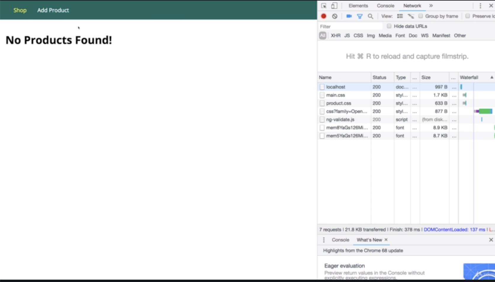

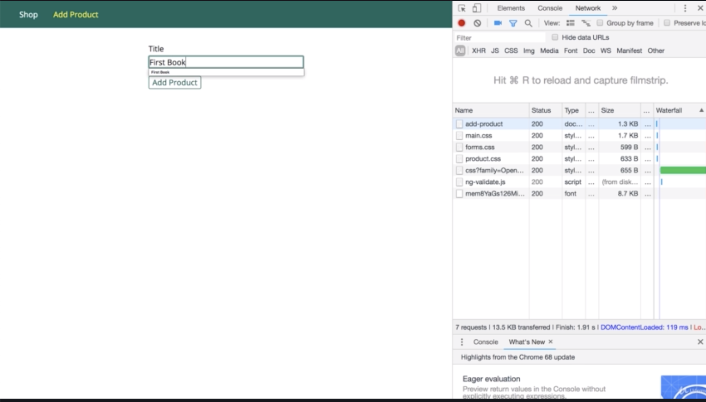


```js
//app.js

const path = require('path');

const express = require('express');
const bodyParser = require('body-parser');

const app = express();

app.set('view engine', 'ejs');
app.set('views', 'views');

const adminData = require('./routes/admin');
const shopRoutes = require('./routes/shop');

app.use(bodyParser.urlencoded({extended: false}));
app.use(express.static(path.join(__dirname, 'public')));

app.use('/admin', adminData.routes);
app.use(shopRoutes);

app.use((req, res, next) => {
    res.status(404).render('404', {pageTitle: 'Page Not Found'})
});

app.listen(3000);
```

```html
<!--./views/404.ejs-->


<!--EJS doesn't support layouts.-->

<!DOCTYPE html>
<html lang="en">

<head>
    <meta charset="UTF-8">
    <meta name="viewport" content="width=device-width, initial-scale=1.0">
    <meta http-equiv="X-UA-Compatible" content="ie=edge">
    <!--if you wanna output a value in the place we are placing this placeholder,
    we add an equal sign right after the percentage sign
    and then we close this with just a percentage sign and a greater sign

    so we can output the data which our template receives 
    and just as before, the method of how we receive hasn't change.-->
    <title><%= pageTitle %></title>
    <link rel="stylesheet" href="/css/main.css">
</head>

<body>
    <header class="main-header">
        <nav class="main-header__nav">
            <ul class="main-header__item-list">
                <li class="main-header__item"><a href="/">Shop</a></li>
                <li class="main-header__item"><a href="/admin/add-product">Add Product</a></li>
            </ul>
        </nav>
    </header>
    <h1>Page Not Found!</h1>
</body>

</html>
```

```html
<!--./views/add-product.ejs-->

<!DOCTYPE html>
<html lang="en">

<head>
    <meta charset="UTF-8">
    <meta name="viewport" content="width=device-width, initial-scale=1.0">
    <meta http-equiv="X-UA-Compatible" content="ie=edge">
    <title><%= pageTitle %></title>
    <link rel="stylesheet" href="/css/main.css">
    <link rel="stylesheet" href="/css/forms.css">
    <link rel="stylesheet" href="/css/product.css">
</head>

<body>
    <header class="main-header">
        <nav class="main-header__nav">
            <ul class="main-header__item-list">
                <li class="main-header__item"><a href="/">Shop</a></li>
                <li class="main-header__item"><a class="active" href="/admin/add-product">Add Product</a></li>
            </ul>
        </nav>
    </header>

    <main>
        <form class="product-form" action="/admin/add-product" method="POST">
            <div class="form-control">
                <label for="title">Title</label>
                <input type="text" name="title" id="title">
            </div>

            <button class="btn" type="submit">Add Product</button>
        </form>
    </main>
</body>

</html>
```

```html
<!--./views/shop.ejs-->

<!DOCTYPE html>
<html lang="en">

<head>
    <meta charset="UTF-8">
    <meta name="viewport" content="width=device-width, initial-scale=1.0">
    <meta http-equiv="X-UA-Compatible" content="ie=edge">
    <title><%= pageTitle %></title>
    <link rel="stylesheet" href="/css/main.css">
    <link rel="stylesheet" href="/css/product.css">
</head>

<body>
    <header class="main-header">
        <nav class="main-header__nav">
            <ul class="main-header__item-list">
                <li class="main-header__item"><a class="active" href="/">Shop</a></li>
                <li class="main-header__item"><a href="/admin/add-product">Add Product</a></li>
            </ul>
        </nav>
    </header>

    <main>
        <!--if you use if statement,
        then don't use equal sign because we don't directly output a value in this place.
        instead we wanna enclose, wrap a certain block of code
        and we do this by adding our opening and closing EJS Tags
        then you can write vanila javascript code.
        we will get our 'prods key' in shop.js which holds our 'products' array
        and this will be array and therefore we can write a normal javascript if statement
    
        so in the end what you do is you write a normal if statement as you would write it in a javascript file,
        just that the part inside of that statement is not javascript code
        but this HTML code and i find this to be very straightforward and easy to understand-->
        <% if (prods.length > 0) { %>
        <div class="grid">
            <% for(let product of prods) { %>
            <article class="card product-item">
                <header class="card__header">
                    <h1 class="product__title"><%= product.title %></h1>
                </header>
                <div class="card__image">
                    
                </div>
                <div class="card__content">
                    <h2 class="product__price">$19.99</h2>
                    <p class="product__description">A very interesting book about so many even more interesting things!</p>
                </div>
                <div class="card__actions">
                    <button class="btn">Add to Cart</button>
                </div>
            </article>
            <% } %>
        </div>
        <% } else { %>
            <h1>No Product Found!</h1>
        <% } %>
    </main>
</body>

</html>
```

\* Chapter 89: Working On The Layout With Partials
==================================================

1\. update

- ./views/404.ejs

- ./views/add-product.ejs

- ./views/shop.ejs

- ./views/includes/head.ejs

- ./views/includes/navigation.ejs

- ./views/includes/end.ejs

- EJS doesn’t have layouts, but we can use so-called 'partials' or ‘includes’, by the way that pug and handlebars also know 

- The idea is that you have some code blocks which you reuse in different parts of your templates and you can therefore just share them across your templates. 

- instead of having one master layout where you put your individual view parts into, you have a couple of separated shared view parts which you can merge into the views you are creating

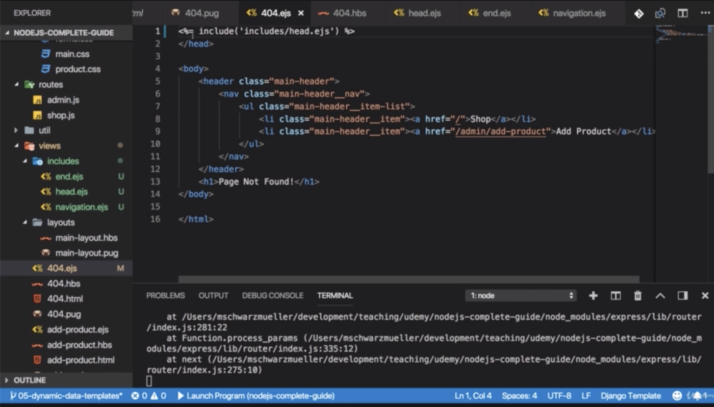

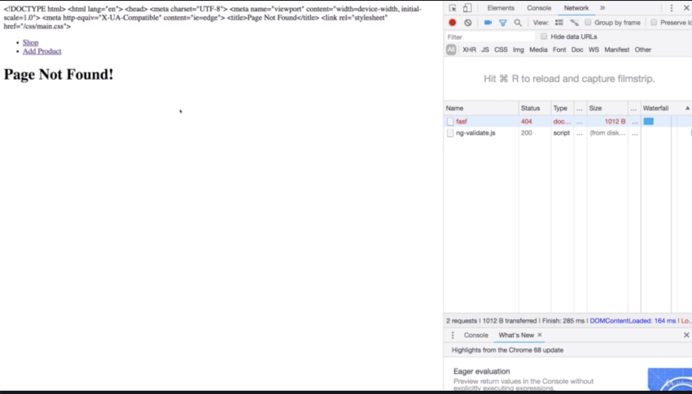

- if you use equal sign here, now it gets rendered as text and this is what i meant. this is escaping the values. so it’s not rendering it.

```html
<!--./views/404.ejs-->

<!--i need to import head.ejs 
    and this can be imported into the 404.ejs file
    by adding our EJS syntax
    now with a minus - 
    and you use that if you wanna output unescaped HTML code,
    that by the way means that by default, if you have this syntax with the equal sign
    and you would render some variable that holds a string that holds HTML code,
    it would not render that HTML code, but render it as text to avoid cross-site scripting attacks, 
    with a minus you can avoid this and really render the HTML code

    'include()' keyword allows us to include a certain element into this page
    in 'include()', you add a string which holds the path to the file you wanna include
    and you have to enter this path as it's seen from the file you are in.
    so the 404.ejs file is in the views folder. so the file we wanna include is in the subfolder.
-->
<%- include('includes/head.ejs') %>
</head>

<body>
    <%- include('includes/navigation.ejs') %>
    <h1>Page Not Found!</h1>

<%- include('includes/end.ejs') %>
```

```html
<!--./views/add-product.ejs-->

<%- include('includes/head.ejs') %>
<!--these 2 links which are exclusie to this page here,
    so which we really only need there 
    but instead of the other part, we can now include our 'includes' folder
    and there -->
    <link rel="stylesheet" href="/css/forms.css">
    <link rel="stylesheet" href="/css/product.css">
</head>

<body>
<%- include('includes/navigation.ejs') %>
    <main>
        <form class="product-form" action="/admin/add-product" method="POST">
            <div class="form-control">
                <label for="title">Title</label>
                <input type="text" name="title" id="title">
            </div>

            <button class="btn" type="submit">Add Product</button>
        </form>
    </main>

<%- include('includes/end.ejs') %>
```

```html
<!--./views/shop.ejs-->

<%- include('includes/head.ejs') %>
    <link rel="stylesheet" href="/css/product.css">
</head>

<body>
    <%- include('includes/navigation.ejs') %>

    <main>
        <% if (prods.length > 0) { %>
        <div class="grid">
            <% for(let product of prods) { %>
            <article class="card product-item">
                <header class="card__header">
                    <h1 class="product__title"><%= product.title %></h1>
                </header>
                <div class="card__image">
                    
                </div>
                <div class="card__content">
                    <h2 class="product__price">$19.99</h2>
                    <p class="product__description">A very interesting book about so many even more interesting things!</p>
                </div>
                <div class="card__actions">
                    <button class="btn">Add to Cart</button>
                </div>
            </article>
            <% } %>
        </div>
        <% } else { %>
            <h1>No Product Found!</h1>
        <% } %>
    </main>
<%- include('includes/end.ejs') %>
```

```html
<!--./views/includes/head.ejs-->

<!DOCTYPE html>
<html lang="en">

<head>
    <meta charset="UTF-8">
    <meta name="viewport" content="width=device-width, initial-scale=1.0">
    <meta http-equiv="X-UA-Compatible" content="ie=edge">
    <title><%= pageTitle %></title>
    <link rel="stylesheet" href="/css/main.css">
```

```html
<!--./views/includes/navigation.ejs-->

<header class="main-header">
    <nav class="main-header__nav">
        <ul class="main-header__item-list">
            <!--since i'm inside the class text,
                i will basically just add the active class, this is how you can read this
                always keep in mind that this simply replaced with text when template is rendered
                so this will just become class equal active.-->
            <li class="main-header__item"><a class="<%= path === '/' ? 'active' : '' %>" href="/">Shop</a></li>
            <li class="main-header__item"><a class="<%= path === '/admin/add-product' ? 'active' : '' %>" href="/admin/add-product">Add Product</a></li>
        </ul>
    </nav>
</header>

```

```html
<!--./views/includes/end.ejs-->

</body>

</html>
```