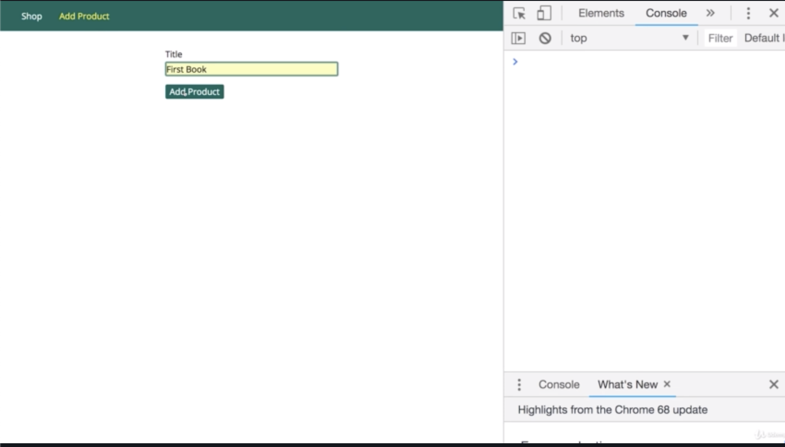
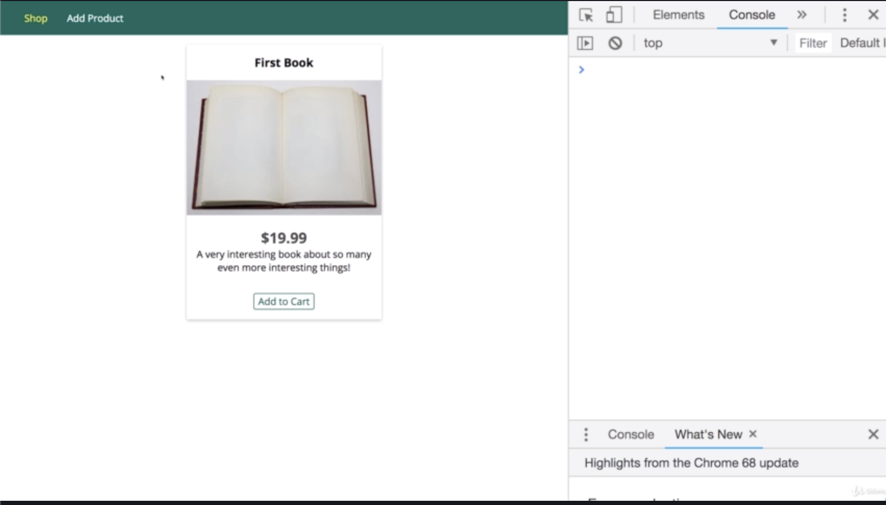
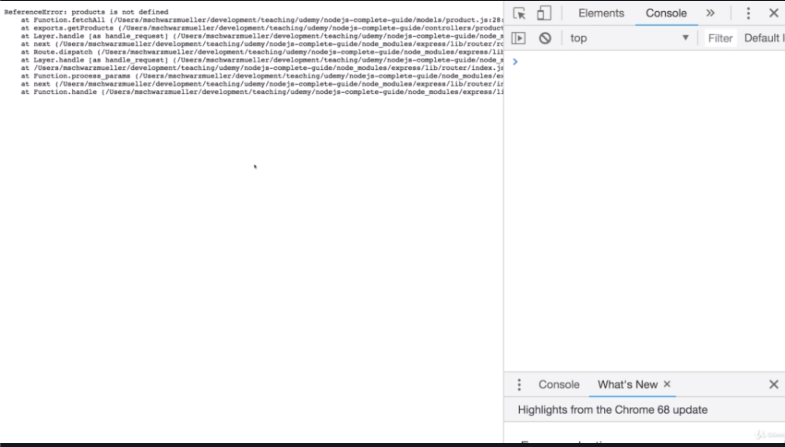
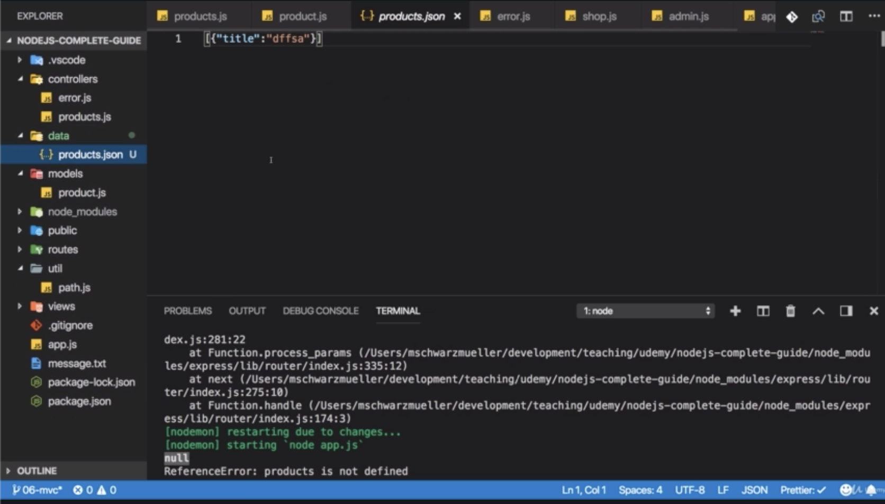
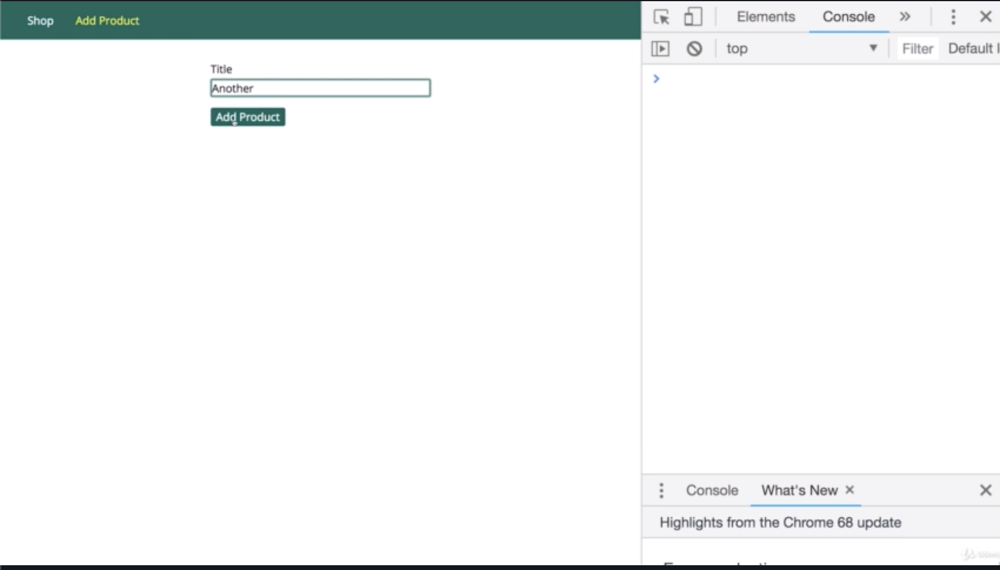
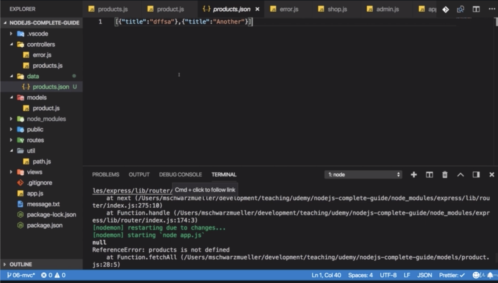
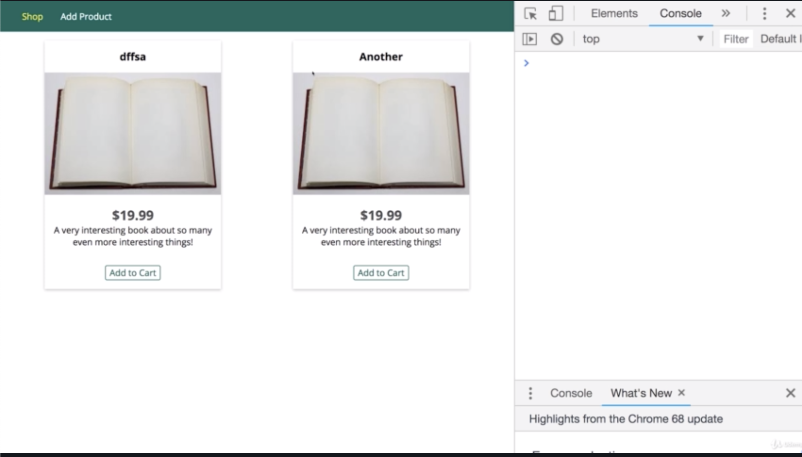
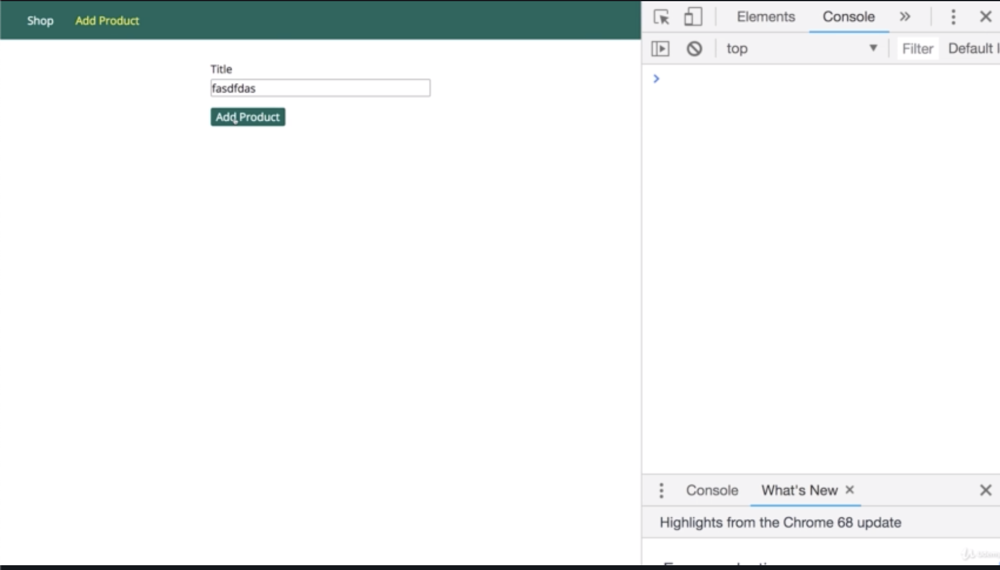
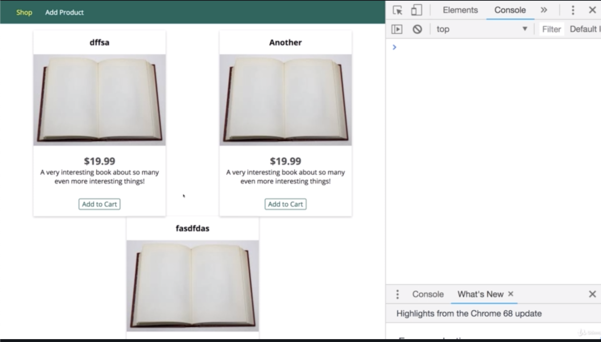

\* Chapter 93: What Is The MVC?
===============================


- you are also wondering how routes fit into this picture.

- routes are basically the things which define upon which path for which http method which controller code should execute.

- the controller is then the thing defining with which model to work and which view to render. 

\* Chapter 94: Adding Controllers
=================================

1\. update

- ./routes/shop.js

- ./routes/admin.js

- ./controllers/product.js

- app.js




```js
//./routes/shop.js

const path = require('path');

const express = require('express');

const productsController = require('../controllers/products')

const router = express.Router();


/**this is all mixed into our route files or into our route function here.
 * the way we route won't change.
 * the logic executed here is the controller logic
 * so files in 'routes' folder already have controller 
 */
router.get('/', productsController.getProducts);

module.exports = router;
```

```js
//./routes/admin.js

const path = require('path');

const express = require('express');

const productsController = require('../controllers/products');

const router = express.Router();

// /admin/add-product => GET
/**we don't execute this function(getAddProduct).
 * so don't add these parentheses.
 * instead we just pass a reference to this function.
 *
 * so we are just saying to express.js that it should take this function and store it
 * and whenever a request reaches this routes,
 * it should go ahead and execute it.*/
router.get('/add-product', productsController.getAddProduct);

// /admin/add-product => POST
router.post('/add-product', productsController.postAddProduct);

module.exports = router
```

```js
// ./controllers/product.js

const products = [];

/**i wanna have it in a controller that only works with product logic. */

exports.getAddProduct = (req, res, next) => {
    res.render(
      'add-product',
      {
        pageTitle: 'Add Product',
        path: '/admin/add-product' ,
        formsCSS: true,
        productCSS: true,
        activeAddProduct: true
      })
}

exports.postAddProduct = (req, res, next) => {
    products.push({ title: req.body.title });
    res.redirect('/');
}

exports.getProducts = (req, res, next) => {
    /**we are interacting with our data even though that's just one line.
     *
     *  const products = adminData.products;
     *
     * products is now an array which is available in that file,
     * so 'products' here doesn't have to be extracted from anywhere. and again we will change this.
     */
    /**then we are returning a view
     * and that's exactly this in-between logic that makes up a controller.
     */
    res.render('shop', {
      prods: products,
      pageTitle: 'Shop',
      path:'/',
      hasProducts: products.length > 0,
      activeShop: true,
      productCSS: true,
    });
}
```

```js
//app.js

const path = require('path');

const express = require('express');
const bodyParser = require('body-parser');

const app = express();

app.set('view engine', 'ejs');
app.set('views', 'views');

const adminRoutes = require('./routes/admin');
const shopRoutes = require('./routes/shop');

app.use(bodyParser.urlencoded({extended: false}));
app.use(express.static(path.join(__dirname, 'public')));

app.use('/admin', adminRoutes);
app.use(shopRoutes);

app.use((req, res, next) => {
    res.status(404).render('404', {pageTitle: 'Page Not Found'})
});

app.listen(3000);

```

\* Chapter 95: Finishing The Controllers
========================================

1\. update

- ./controllers/error.js

- app.js

```js
//app.js

const path = require('path');

const express = require('express');
const bodyParser = require('body-parser');

const errorController = require('./controllers/error')

const app = express();

app.set('view engine', 'ejs');
app.set('views', 'views');

const adminRoutes = require('./routes/admin');
const shopRoutes = require('./routes/shop');

app.use(bodyParser.urlencoded({extended: false}));
app.use(express.static(path.join(__dirname, 'public')));

app.use('/admin', adminRoutes);
app.use(shopRoutes);

app.use(errorController.get404);

app.listen(3000);

```

```js
// ./controllers/error.js

exports.get404 = (req, res, next) => {
    res.status(404).render('404', {pageTitle: 'Page Not Found'})
}
```

\* Chapter 96: Adding A Product Model
=====================================

1\. update

- ./models/product.js

- ./controllers/products.js




```js
// ./models/product.js

const products = []

module.exports = class Product {
    /**i wanna define the shape of a product
     * 
     * i wanna receive a title for the product 
     * which i will then create from inside my controller,
     * 
     */
    constructor(t){
        /**and i will then create a property in this class */
        this.title = t
    }

    save(){
        /**'this' is the object i wanna store in this array.
         */
        products.push(this);
    }

    /**i wanna be able to retrieve all products from that array.
     * however whereas 'save' makes sense to be called on a concrete instantiated object-based on product,
     * i also wanna have a fetchAll method which is like the utility function.
     * This is not called on a single instance of the product
     * because it should fetch all products
     * and i don't wanna create a new object with the new keyword with some dummy title just to fetch all existing products
     * 
     * therefore i will add the static keyword which javascript offeres 
     * which makes sure that i can call 'fetchAll()' method directly on the class itself
     * and not on a instantiated object.
     */
    static fetchAll(){
        return products;
    }
}
```

```js
// ./controllers/product.js

const Product = require('../models/product');

exports.getAddProduct = (req, res, next) => {
    res.render(
      'add-product',
      {
        pageTitle: 'Add Product',
        path: '/admin/add-product' ,
        formsCSS: true,
        productCSS: true,
        activeAddProduct: true
      })
}

exports.postAddProduct = (req, res, next) => {
  /**i will create a new object based on this class blueprint.
   * and that is what classes are in the end.
   */
  const product = new Product(req.body.title)
  product.save();
  res.redirect('/');
}

exports.getProducts = (req, res, next) => {
  /**now i will use that static method
   * because i don't wanna create a new product
   * where i would have to set up some dummy title
   * because i don't create a product here,
   *
   * instead i just wanna use product and call fetchAll()
   * and this should give me all the products and now i have my products here
   */
  const products = Product.fetchAll();
    res.render('shop', {
      prods: products,
      pageTitle: 'Shop',
      path:'/',
      hasProducts: products.length > 0,
      activeShop: true,
      productCSS: true,
    });
```

\* Chapter 97: Storing Data In Files Via The Model
==================================================










\* Chapter 98: Fetching Data From Files Via The Model
=====================================================

1\. update

- ./models/product.js

- ./controllers/products.js







```js
// ./controllers/product.js

const Product = require('../models/product');

exports.getAddProduct = (req, res, next) => {
    res.render(
      'add-product',
      {
        pageTitle: 'Add Product',
        path: '/admin/add-product' ,
        formsCSS: true,
        productCSS: true,
        activeAddProduct: true
      })
}

exports.postAddProduct = (req, res, next) => {
  const product = new Product(req.body.title)
  product.save();
  res.redirect('/');
}

exports.getProducts = (req, res, next) => {
    /** i simply have to pass in a function
     * where i know that i eventually will get my products.
     * therefore i don't need to store it here 
     * because this 'fetchAll()' function will not return anything.
     * 
     * instead here i simply create my own callback process
     * and i render in that function i pass to 'fetchAll()'
     * once i know that fetching all products is done
     * and i receive the products
     * because that is exactly the arguemtn i passed to the callback in fetchAll().
     * because the callback argument 'cb' will refer to this anonymous function((products) => {}) i'm passing into fetchAll()
     * 
     * we have 'fetchAll()' and fetch all takes a function
     * it should execute once it's done
     * and once it's done, we get the products, 
     * thanks to our own implementation of 'fetchAll()',
     * and we then render our response with those products.
     */
  Product.fetchAll(products => {
    res.render('shop', {
      prods: products,
      pageTitle: 'Shop',
      path:'/',
      hasProducts: products.length > 0,
      activeShop: true,
      productCSS: true
    });
  });
}
```

```js
// ./models/product.js

const fs = require('fs');
const path = require('path');

module.exports = class Product {
    constructor(t){
        this.title = t
    }

    save(){
        const p = path.join(
            path.dirname(process.mainModule.filename),
            'data',
            'products.json'
        )
        fs.readFile(p, (err, fileContent) => {
            let products = [];
            if(!err){
                /**'JSON' is a helper object existing in vanila node.js
                 * so you don't need to define this on your own.
                 * then we have a 'parse' method which take incoming JSON
                 * and give us back a javascript array or object or whatever is in the file.
                 *
                 */
                products = JSON.parse(fileContent);
            }
            /**i will call products.push()
             * and push my new product which is this onto it.
             * now important is that to ensure that this refers to the class,
             * you should use arrow function
             * because otherwise this will lose its context
             * and will not refer to the class anymore.
             *
             * we have this setup though where i do use an arrow function,
             * 'this' should refer to my class
             * and therefore now i can push this onto this array,
             * either to the new one or the one i read from the file
             */
            products.push(this);
            /**there is the 'stringify()' method 
             * which takes a javascript object or array
             * and converts it into JSON.
             * so that this has the right format.
             * */
            fs.writeFile(p, JSON.stringify(products), (err) => {
                console.log(err);
            });
        });
    }

    /**'fetchAll()' function itself doesn't return anything.
     * these 'return' statements belong to this inner function '(err, fileContent) => {}' 
     * not the outer function('fetchAll()'function)
     * so it returns undefined therefore 
     * and hence in my view, in the shop.ejs file,
     * if i try to access the length on my products,
     * i try to access length on undefined and i get an error.
     * 
     * so i will simply accept an argument in 'fetchAll()'
     * and that's a 'callback(cb)'
     * and that allows me to pass a function into 'fetchAll()'
     * which 'fetchAll()' will execute once it is done,
     * so that the thing calling 'fetchAll()' can pass a function 
     * and it is then aware of being called which holds the data i wanna return.
     * 
     */

     /**i execute 'cb' this argument as a function to which i pass an empty array
      * 'cb' allows me to go to my controller where i do call 'fetchAll()'
      * */
    static fetchAll(cb){
        const p = path.join(
            path.dirname(process.mainModule.filename),
            'data',
            'products.json'
        );
        fs.readFile(p, (err, fileContent) => {
            if(err){
                cb([]);
            }
            /**this is important
             * because JSON file in the end retrieved as a text.
             * so to return it as an array, you need to call JSON.parse
             * so i return my fileContent in a parsed form 
             * and therefore i get rid of the return product statement.
             * and i will not always return my objects or my list of product.
             */
            cb(JSON.parse(fileContent));
        })
    }
}
```

\* Chapter 99: Refactoring The File Storage Code
================================================

1\. update

- ./models/product.js


```js
// ./models/product.js

const fs = require('fs');
const path = require('path');

const p = path.join(
  path.dirname(process.mainModule.filename),
  'data',
  'products.json'
);

/**we are reusing some code
 * if we reuse code that always streams for some refactoring
 * that is what i wanna do.
 * 
 * i will create a helper function 
 * and i will store it in a constant.
 * 
 * and i even get my callback
 * because i do execute 'cb([])'
 * and return 'cb([])' because the issue of this processing taking some time
 * and need to inform the caller of this function 'cb([])' 
 * about when it's done hasn't gone away.
 * so i still use the same pattern of having this helper function
 * which receive a callback which it executes,
 * once it's done, then read the file.
  */

 const getProductsFromFile = cb => {
    fs.readFile(p, (err, fileContent) => {
      if (err) {
            /**we will input 'return' 
             * to make sure that we never execute 'cb(JSON.parse(fileContent))' after having executed this code that was an error we had in the code before.
             */
        cb([]);
      } else {
        cb(JSON.parse(fileContent));
      }
    });
  };

module.exports = class Product {
    constructor(t){
        this.title = t
    }

    save(){
        /**i don't forward any callback
         * because instead i have my own logic here.
         */
        getProductsFromFile(
            /** i will create a new anonymous function
             * where i know that i will get my products
             * because this again is the callback function.
             * it is the function i will pass as an argument to getProductsFromFile.
             * so it is what will get called here 'cb([])'
             */

             /**make sure you always use arrow function
              * so that 'this' never loses its context
              * and always refer to the class
              * and therefore to the object based on the class.
              * then i write to the file.
              */
            products => {
                products.push(this);
                fs.writeFile(p, JSON.stringify(products), err => {
                    console.log(err);
                })
            })
        }

    static fetchAll(cb){
        /**i simply just call this and forward the callback. */
        getProductsFromFile(cb)
    }
}
```

\* Chapter 100: Wrap Up
=======================

