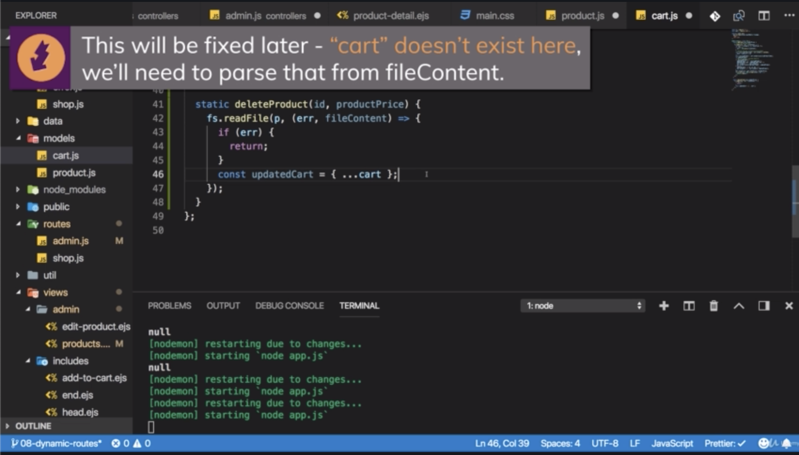

\* Chapter 111: Dynamic Routes & Advanced Models
================================================


\* Chapter 114: Adding The Product ID To The Path
=================================================

1\. update

- ./views/shop/product-list.ejs

- ./models/product.js

- ./data/products.json


```js
<!--./views/shop/product-list.ejs-->

<%- include('../includes/head.ejs') %>
    <link rel="stylesheet" href="/css/product.css">
    </head>

    <body>
        <%- include('../includes/navigation.ejs') %>

            <main>
                <% if (prods.length > 0) { %>
                    <div class="grid">
                        <% for (let product of prods) { %>
                            <article class="card product-item">
                                <header class="card__header">
                                    <h1 class="product__title">
                                        <%= product.title %>
                                    </h1>
                                </header>
                                <div class="card__image">
                                    " alt="<%= product.title %>">
                                </div>
                                <div class="card__content">
                                    <h2 class="product__price">$
                                        <%= product.price %>
                                    </h2>
                                    <p class="product__description">
                                        <%= product.description %>
                                    </p>
                                </div>
                                <div class="card__actions">
                                    <!--/product/0.43432 would be one possible path
                                    now we wanna make sure that we are able to handle that
                                    and then extract that unique ID from the path in our routes file.
                                    so that in the controller, we can load the correct product and how the details for it.

                                    we send some information as part of the path.
                                    so that we can extract all the data we need for the product from the controller or inside of the controller
                                    because we can't really send the entire product as part of the URL
                                    but we can send this key information.
                                    -->
                                    <a href="/products/<%= product.id %>" class="btn">Details</a>
                                    <form action="/add-to-cart" method="POST">
                                        <button class="btn">Add to Cart</button>
                                    </form>
                                </div>
                            </article>
                            <% } %>
                    </div>
                    <% } else { %>
                        <h1>No Products Found!</h1>
                        <% } %>
            </main>
            <%- include('../includes/end.ejs') %>
```

```js
//./models/product.js

const fs = require('fs');
const path = require('path');

const p = path.join(
  path.dirname(process.mainModule.filename),
  'data',
  'products.json'
);

const getProductsFromFile = cb => {
  fs.readFile(p, (err, fileContent) => {
    if (err) {
      cb([]);
    } else {
      cb(JSON.parse(fileContent));
    }
  });
};

module.exports = class Product {
  constructor(title, imageUrl, description, price) {
    this.title = title;
    this.imageUrl = imageUrl;
    this.description = description;
    this.price = price;
  }

  save() {
    this.id = Math.random().toString();
    getProductsFromFile(products => {
      products.push(this);
      fs.writeFile(p, JSON.stringify(products), err => {
        console.log(err);
      });
    });
  }

  static fetchAll(cb) {
    getProductsFromFile(cb);
  }
};

```

```js
//./data/products.json

[{"id": "123456", "title":"A Book","imageUrl":"https://www.publicdomainpictures.net/pictures/10000/velka/1-1210009435EGmE.jpg","description":"This is an awesome book!","price":"19"}]
```

\* Chapter 115: Extracting Dynamic Params
=========================================

1\. update

- ./controllers/shop.js

- ./routes/shop.js


- if i reload this, i’m getting redirected which means we handle this. we don’t get the 404 page anymore.


```js
//./controllers/shop.js

const Product = require('../models/product');

exports.getProducts = (req, res, next) => {
  Product.fetchAll(products => {
    res.render('shop/product-list', {
      prods: products,
      pageTitle: 'All Products',
      path: '/products'
    });
  });
};

exports.getProduct = (req, res, next) => {
  /**we can get access to it by accessing our request
   * and then express.js already gives us a 'params' object on our request
   * and then on that params object,
   * we can access our productId
   * and we can access productId here
   * because we use productId in our ./route/shop.js file as a name after the colon ':'
   * 
   */
  const prodId = req.params.productId
  console.log(prodId);
  res.redirect('/')
}

exports.getIndex = (req, res, next) => {
  Product.fetchAll(products => {
    res.render('shop/index', {
      prods: products,
      pageTitle: 'Shop',
      path: '/'
    });
  });
};

exports.getCart = (req, res, next) => {
  res.render('shop/cart', {
    path: '/cart',
    pageTitle: 'Your Cart'
  });
};

exports.getOrders = (req, res, next) => {
  res.render('shop/orders', {
    path: '/orders',
    pageTitle: 'Your Orders'
  });
};

exports.getCheckout = (req, res, next) => {
  res.render('shop/checkout', {
    path: '/checkout',
    pageTitle: 'Checkout'
  });
};

```

```js
// ./routes/shop.js

/**The order would matter.
 * 
 *    router.get('/products/:productId')
 *    router.get('/products/delete')
 * 
 * keep in mind that your code is parsed from top to bottom
 * and the request goes through that from top to bottom.
 * if you order it like this, you would never reach that route
 * because if you had a route like '/products/delete',
 * express.js would already fire at '/products/:productId'
 * or would already handle it in '/products/:productId'
 * because delete would basically be treated as the dynamic segment.
 * 
 *    router.get('/products/delete')
 *    router.get('/products/:productId')
 * 
 * so if you had a dynamic segment and a specific route,
 * you would have to put the more specific route first.
 * so that for '/products/delete', this handles the request 
 * and thereafter it will not continue its journey
 * because you don't fire next.
 * but if you then have something else which doesn't match '/products/delete',
 * then you would go into that dynamic routes
 */
const path = require('path');

const express = require('express');

const shopController = require('../controllers/shop');

const router = express.Router();

router.get('/', shopController.getIndex);

router.get('/products', shopController.getProducts);

/**we can tell the express router that there will be some variable segment by adding a colon
 * and then any name of our choice like 'productId'
 * later we will be able to extract that information by that name here.
 *
 * the important part is the colon ':'
 * this signals to express that it should not look for a route
 * like '/products/:productId' but only this part ':productId'
 * 
 */
router.get('/products/:productId', shopController.getProducts);

router.get('/cart', shopController.getCart);

router.get('/orders', shopController.getOrders);

router.get('/checkout', shopController.getCheckout);

module.exports = router;

```

\* Chapter 116: Loading Product Detail Data
===========================================

1\. update

- ./models/product.js

- ./controllers/shop.js

- ./data/products.json


```js
//./models/product.js

const fs = require('fs');
const path = require('path');

const p = path.join(
  path.dirname(process.mainModule.filename),
  'data',
  'products.json'
);

const getProductsFromFile = cb => {
  fs.readFile(p, (err, fileContent) => {
    if (err) {
      cb([]);
    } else {
      cb(JSON.parse(fileContent));
    }
  });
};

module.exports = class Product {
  constructor(title, imageUrl, description, price) {
    this.title = title;
    this.imageUrl = imageUrl;
    this.description = description;
    this.price = price;
  }

  save() {
    this.id = Math.random().toString();
    getProductsFromFile(products => {
      products.push(this);
      fs.writeFile(p, JSON.stringify(products), err => {
        console.log(err);
      });
    });
  }

  static fetchAll(cb) {
    getProductsFromFile(cb);
  }

  static findById(id, cb){
    getProductsFromFile(products => {
      /**'find()' will execute a function we pass to find on every element in the array
       * and we will return the element for which this function we pass returns true.
       * 
       * there is a short arrow function syntax where you can omit the curly braces
       * if you only got 1 line in there and you also return the result of this 1 line,
       * so there is a implicit return statement in front of that code,
       * i will now write.
       */
      const product = products.find(p => p.id === id)
      cb(product)
    })
  }
};
```

```js
//./controllers/shop.js

const Product = require('../models/product');

exports.getProducts = (req, res, next) => {
  Product.fetchAll(products => {
    res.render('shop/product-list', {
      prods: products,
      pageTitle: 'All Products',
      path: '/products'
    });
  });
};

exports.getProduct = (req, res, next) => {
  const prodId = req.params.productId
  Product.findById(prodId, product => {
    console.log(product)
  })
  res.redirect('/')
}

exports.getIndex = (req, res, next) => {
  Product.fetchAll(products => {
    res.render('shop/index', {
      prods: products,
      pageTitle: 'Shop',
      path: '/'
    });
  });
};

exports.getCart = (req, res, next) => {
  res.render('shop/cart', {
    path: '/cart',
    pageTitle: 'Your Cart'
  });
};

exports.getOrders = (req, res, next) => {
  res.render('shop/orders', {
    path: '/orders',
    pageTitle: 'Your Orders'
  });
};

exports.getCheckout = (req, res, next) => {
  res.render('shop/checkout', {
    path: '/checkout',
    pageTitle: 'Checkout'
  });
};

```

```js
[{"id":"123245","title":"A Book","imageUrl":"https://www.publicdomainpictures.net/pictures/10000/velka/1-1210009435EGmE.jpg","description":"This is an awesome book!","price":"19"},{"title":"Another Product","imageUrl":"data:image/jpeg;base64,/9j/4AAQSkZJRgABAQAAAQABAAD/2wCEAAkGBw8QDxUQEA8PEhUPFRAVEBAWDQ8WFRAQFhUWFhURFRYaHiggGBolHRUVITEhJSkrLi4uFx8zODMtNygtLisBCgoKDQ0OFxAPFy0ZFRkrLS0rKy0tKy0rLS0rKzcrLS0rNy0rLTctKysrLS03Kys3LSsrLSs4KysrKys3KystK//AABEIALcBFAMBIgACEQEDEQH/xAAcAAEAAgMBAQEAAAAAAAAAAAAABAUDBgcCAQj/xABJEAACAQMABQcHBwkGBwAAAAAAAQIDBBEFEiExcQYTIkFRYbEyQnKBkaHBIzNSU9Lh8AckQ4KSlLLR0xQVRLPC8RY0YoSFk6L/xAAXAQEBAQEAAAAAAAAAAAAAAAAAAQID/8QAGhEBAQEBAQEBAAAAAAAAAAAAAAERITECEv/aAAwDAQACEQMRAD8A7iAAAAAAAAAAAAAAGKtcQhjXlGOdiy0svsAygwK7pN6qqQbe5a8cvgivr6foxerHpS29Bzpwls7ptFwW4K2npGcv0cFxuKfwye5aQkmlze/rU00uIwTwRFePsh66uPgeldPsj/7F/IYJII0rtJZazjqUk36l1niWkYqKk4VNqTwoptdzim3kYJgIn940tXW10u6XRl7JYZ4paXt5PHORT7JbPEZROB4p1Yy8mUXjfhp4PZAAAAAAAAAAAAAAAAAAAAAAAAAAAAAACk5WWVSpQ5yjKSqUHrwipNKoltlTmlslFpbmXZ8k0ltxjr4Fgo6ejba5oRrUYRpSqKMozjFJqSetqzS8pKS2p9hrHLXSM62jmsSVahW5utGOcxmk9qxtw1hp95c6P0iqCrTowq1rdzzCUdTEZvPOqLb6UcqLys7ZSXUaryiv3/aVdQ1qcK6ar03GTUo01rRrbFsaWsnnuN/M6lado+vXTfOc41h7Ja/xPs79rzvA69yaq89RUsvDWzvXBnvSnJy2rL5SnTk+10qefbjJbekcQu9L1I+TNr1lbLlLdp7KzXtOkaa5CUNrp9H2NexlRbclnGW2NtNf9VnQl4xElXY1SlylvX/iJe0z1OUN3q/8xL/5/kdGtOT1HHSt7F/+Pt/smWroWgt1taLhZ26/0kvzSfUQvyOtXXOTuFCrKm+i5Qg8bu7vOo3dGjqN1IU9WCb6UI4il4HOLStK2nGdFRjqvbGMYxTXWmlsLm709Tv6tGzjKVNVczrOUWlLm5R+RjJ7G3ly2fRRL8prYNALW5ysoKEKjSpLVScqcVjXfc+ruXeW55hFJJJYSSSXYl1HoxVAAAAAAAAAAAAAAAAAAAAAAAAAAAAAAhaYVN0Jqq5KGFruLaerlZWVtw9zx1MmlZyiadtVjlZdObS62ljL969pZ6NXvNMU7hxo28oc1DCUI4WxblhbkZLezq3c1TqUXToQXSk8p1VlPmsdaeFltYxlbdbo80qNJ52bOstbTTlxTjiNxWjjqVWePZk7Wc4zHYaNKFOOI4SXUQryt2M5bV5XXy3XdRcVTfiivuOWF+v8Snxo0/gjEiuk3M8keCjnqOW1eXN+vOpPjS+88R/KDfLzbV8aMvtGtR2a2jHG9Hm4pR7Uclp/lHvfq7L92b8ZGdflDvWvKto8LOn8chW9XtFb0yE6CnHUknjKakt8JLdOL7V9z2M0i65X3099y13Ro0I+ESlnfVqtRc5Wqzy1sdSTW/s3E1cfpfRVxzlGMtbXeEpS1cZkt7x1Eso+RscWVPgy8Od9AAEAAAAAAAAAAAAAAAAAAAAAAAAAAACv01YwrUmpeapPdF52PK27uKwywMN383P0ZeDA4vcaItZYkp16OerKcVwT1m/ajGtAJ7IXec7ta3x71Nv3FpWp51T1e4TS4YO9Za3c8nLlbqtvLu/OE/8ALKu40Be9UIPhVS/iSN8gtmTXrlZk1395jWmo19BXv1Uf3ih9owf3HefVQ/erb7Zh0xVqKtNRqTS1ntU5rBDndVXj5Wrv+tl4DRbU+T14/wBFT/e7X7ZLp8mrz6FJf9xB/wAOTDofnJLpSlLd57b/AJm32tBamfFsuI16HJ27f1K4yr/0zJR0DqVoQrXMIzm0oU4Qk9Z+nh6vribtGOwobyknpCk35uGtuMPK+DZnetWcde5I6Mlb0FrVHNzSe1t46uvgtyS7kXpG0csUYeiiSZqAAIAAAAAAAAAAAAAAAAAAAAAAAAAAAGG8+bn6M/BmYw3nzc/Rn4MDmNaGNUxX/lJcOottJ22JLHVj3YKu9XTR3ZeqcVqeo1yulrPq7dvxNjj5BrlzHPt7DFac/wBK556fX0nj7yOoZeM/yJulIvnZ4T8p7tifduI8Eu1rbtXb2AbBoeCcd2cY61tNysqXyaNV0NDZjhxSN2s4dBGkZcFHfLF9TX0tnVu3/A2LBS38Pz6g/wAbpGY1fHZbL5qHox8DOYbRfJx9GPgZjmgAAAAAAAAAAAAAAAAAAAAAAAAAAAAAGOv5EvRl4GQx3HkS4PwA0m/WZFLfLpewur3GsVF2ul7Dsy8JdA125XH2Gyyjima9XjtIrRdJU3zkvSb6/vPFCk0/X2E+8pPXl6T61uPlCjt7uLEgu9D2+7CNvpR2JFDoajhZ4GxwWxGh9ZWXcM3NB98l7mWkiLKGasH9GUX4r4mVdWoLoR4R8DIeafkrgj0cgAAAAAAAAAAAAAAAAAAAAAAAAAAAAADFc+RLg/AymK68iXB+Ag0i7fSIFxHMibcvpESstu47svlaPR9Rr9xT2mwVFsKmvAitOuaOZvZ1vbgyW1ttLGpbLWfEzU6KTKJ1hDES3hHYQLWJYw3AfJnyzjrVEu0S/Gwy6MWaq4oyrpcdyPp8R9OQAAAAAAAAAAAAAAAAAAAAAAAAAAAAABiuvm5cGZTDefNy4MQaPceV7SNU3meu+kY2dmWNrYV9WJYyWwiVYBVPUp7WeYwX4RKlT27vA+au3/cqM9sidBcSJR3ZJiIrHWJGhVmtHiiNWZK0C/l498kQdIAByUAAAAAAAAAAAAAAAAAAAAAAAAAAAAACPpB/JT9FkgiaTfyM/RZZ6NHnPaeW/wAYMeeke3I7MvktxGrErqI9QggSXx2njO0z1O3JiSWfxuKJFFdxIRgpoytkViuJEjk+/wA4h6UfEhXEiZycTdeHpR8SDpqPp8ifTkoAAAAAAAAAAAAAAAAAAAAAAAAAAAAAFZygquFvKSTeMZx9HO33FmeK1NSi4tZTWGu1Fg5vDEulFqSltTXWhOZK0ryUr283Vs5Nxk8ypNay46uVt74tPtTKOld1XUcatFww3lp5UezPnLg0dZUWqezJgqGeE6TWI1Itrqyk/Yz5O2fYVFfI8omu1l2H2Nm+wDBA+zlsJcbXG8i3FajHY6kW/ox6Uv2Y5ZFQayb2E3R9V0pQUfnKkoxprry2sy4RWX6u8i01cV56lvQbfXOa3d+onn9pxNx5LclP7PLn683VrNeU8YgvopLYl3L3vaS0bXHcfQDkoAAAAAAAAAAAAAAAAAAAAAAAAAAAAAAAARrqwo1fnKcJ43a0E2uD6iSAKS45L2s/Nkv1tb3T1seogT5E0PMk4/qtfwSibUC7RqP/AAUuq4qL9e4/qnqPIuPXXm+Mq/8AVNsA/VGsR5F2/nSk/wBWL/j1iwt+TdpD9Frek21+z5PuLcDaMdKjGKxGKiluSSSXqMgBAAAAAAAAAAAAAAAAAAAAAAAAAAAAAAAAAAAAAAAAAAAAAAAAAAAAAAAAAAAAAAAAAAAH/9k=","description":"Another very amazing product!","price":"20.99","id":"0.558673316244021"}]
```

\* Chapter 117: Rendering The Product Detail View
=================================================

1\. update

- ./views/shop/product-detail.ejs

- ./public/css/main.css

- ./controllers/shop.js


```js
<!--./views/shop/product-detail.ejs-->

<%- include('../includes/head.ejs') %>
    </head>

    <body>
        <%- include('../includes/navigation.ejs') %>
        <main class="centered">
            <h1><%= product.title %></h1>
            <hr>
            <div>
                " alt="<%= product.title %>">
            </div>
            <h2><%= product.price %></h2>
            <p><%= product.description %></p>
            <form action="/cart" method="post">
                <button class="btn" type="submit">Add to Cart</button>
            </form>
        </main>
        <%- include('../includes/end.ejs') %>
```

```css
/*./public/css/main.css*/

@import url('https://fonts.googleapis.com/css?family=Open+Sans:400,700');

* {
  box-sizing: border-box;
}

body {
  padding: 0;
  margin: 0;
  font-family: 'Open Sans', sans-serif;
}

main {
  padding: 1rem;
  margin: auto;
}

form {
  display: inline;
}

.centered {
  text-align: center;
}

.main-header {
  width: 100%;
  height: 3.5rem;
  background-color: #00695c;
  padding: 0 1.5rem;
  display: flex;
  align-items: center;
}

.main-header__nav {
  height: 100%;
  display: none;
  align-items: center;
}

.main-header__item-list {
  list-style: none;
  margin: 0;
  padding: 0;
  display: flex;
}

.main-header__item {
  margin: 0 1rem;
  padding: 0;
}

.main-header__item a {
  text-decoration: none;
  color: white;
}

.main-header__item a:hover,
.main-header__item a:active,
.main-header__item a.active {
  color: #ffeb3b;
}

.mobile-nav {
  width: 30rem;
  height: 100vh;
  max-width: 90%;
  position: fixed;
  left: 0;
  top: 0;
  background: white;
  z-index: 10;
  padding: 2rem 1rem 1rem 2rem;
  transform: translateX(-100%);
  transition: transform 0.3s ease-out;
}

.mobile-nav.open {
  transform: translateX(0);
}

.mobile-nav__item-list {
  list-style: none;
  display: flex;
  flex-direction: column;
  margin: 0;
  padding: 0;
}

.mobile-nav__item {
  margin: 1rem;
  padding: 0;
}

.mobile-nav__item a {
  text-decoration: none;
  color: black;
  font-size: 1.5rem;
  padding: 0.5rem 2rem;
}

.mobile-nav__item a:active,
.mobile-nav__item a:hover,
.mobile-nav__item a.active {
  background: #00695c;
  color: white;
  border-radius: 3px;
}

#side-menu-toggle {
  border: 1px solid white;
  font: inherit;
  padding: 0.5rem;
  display: block;
  background: transparent;
  color: white;
  cursor: pointer;
}

#side-menu-toggle:focus {
  outline: none;
}

#side-menu-toggle:active,
#side-menu-toggle:hover {
  color: #ffeb3b;
  border-color: #ffeb3b;
}

.backdrop {
  position: fixed;
  top: 0;
  left: 0;
  width: 100%;
  height: 100vh;
  background: rgba(0, 0, 0, 0.5);
  z-index: 5;
  display: none;
}

.grid {
  display: flex;
  flex-wrap: wrap;
  justify-content: space-around;
  align-items: stretch;
}

.card {
  box-shadow: 0 2px 8px rgba(0, 0, 0, 0.26);
}

.card__header,
.card__content {
  padding: 1rem;
}

.card__header h1,
.card__content h1,
.card__content h2,
.card__content p {
  margin: 0;
}

.card__image {
  width: 100%;
}

.card__image img {
  width: 100%;
}

.card__actions {
  padding: 1rem;
  text-align: center;
}

.card__actions button,
.card__actions a {
  margin: 0 0.25rem;
}

.btn {
  display: inline-block;
  padding: 0.25rem 1rem;
  text-decoration: none;
  font: inherit;
  border: 1px solid #00695c;
  color: #00695c;
  background: white;
  border-radius: 3px;
  cursor: pointer;
}

.btn:hover,
.btn:active {
  background-color: #00695c;
  color: white;
}

@media (min-width: 768px) {
  .main-header__nav {
    display: flex;
  }

  #side-menu-toggle {
    display: none;
  }
}

```

```js
//./controllers/shop.js

const Product = require('../models/product');

exports.getProducts = (req, res, next) => {
  Product.fetchAll(products => {
    res.render('shop/product-list', {
      prods: products,
      pageTitle: 'All Products',
      path: '/products'
    });
  });
};

exports.getProduct = (req, res, next) => {
  const prodId = req.params.productId;
  Product.findById(prodId, product => {
    res.render('shop/product-detail', {
      /**we now need to pass in a product property
       * because we are accessing 'product' in the 'product-detail.ejs' file in the view
       *
       * 'product' of the left is the key by which we will be able to access it in the view
       * 'product' of the right is 'product' in 'Product.findById(prodId, //product// =>{})'
       *
       */
      product: product,
      pageTitle: product.title,
      path: '/products'
    })
  });
};

exports.getIndex = (req, res, next) => {
  Product.fetchAll(products => {
    res.render('shop/index', {
      prods: products,
      pageTitle: 'Shop',
      path: '/'
    });
  });
};

exports.getCart = (req, res, next) => {
  res.render('shop/cart', {
    path: '/cart',
    pageTitle: 'Your Cart'
  });
};

exports.getOrders = (req, res, next) => {
  res.render('shop/orders', {
    path: '/orders',
    pageTitle: 'Your Orders'
  });
};

exports.getCheckout = (req, res, next) => {
  res.render('shop/checkout', {
    path: '/checkout',
    pageTitle: 'Checkout'
  });
};
```

\* Chapter 118: Passing Data With POST Requests
===============================================

1\. update

- ./views/shop/product-detail.ejs

- ./views/admin/add-product.ejs

- ./routes/shop.js

- ./controllers/shop.js

- ./views/shop/index.ejs

- ./views/shop/product-list.ejs

- ./views/includes/add-to-cart.ejs


```js
<!--./views/shop/product-detail.ejs-->

<%- include('../includes/head.ejs') %>
    </head>

    <body>
        <%- include('../includes/navigation.ejs') %>
        <main class="centered">
            <h1><%= product.title %></h1>
            <hr>
            <div>
                " alt="<%= product.title %>">
            </div>
            <h2><%= product.price %></h2>
            <p><%= product.description %></p>
            <!--we can grab the entire <form></form>
                and make sure we also use that form in all the place
                where we also have added to cart button.
            -->
            <%- include('../includes/add-to-cart.ejs') %>        </main>
        <%- include('../includes/end.ejs') %>
```

```js
<!--./views/admin/add-product.ejs-->

<%- include('../includes/head.ejs') %>
    <link rel="stylesheet" href="/css/forms.css">
    <link rel="stylesheet" href="/css/product.css">
</head>

<body>
   <%- include('../includes/navigation.ejs') %>

    <main>
        <!--For adding a product, we have a form
            and as i mentioned there when we added this the first time in the course,
            this automatically gives us a request which puts all the input data and so on into its body
            but this("method="POST"") only works for posting data
            this is not available for getting data but for posting data,
            we therefore don't need to add anything to the URL
            because we can put the information in the POST body.
            so therefore what we should do on product-detail in this form is that
            we should simply pass some important information as part of the POST request
            -->
        <form class="product-form" action="/admin/add-product" method="POST">
            <div class="form-control">
                <label for="title">Title</label>
                <input type="text" name="title" id="title">
            </div>
            <div class="form-control">
                <label for="imageUrl">Image URL</label>
                <input type="text" name="imageUrl" id="imageUrl">
            </div>
            <div class="form-control">
                <label for="price">Price</label>
                <input type="number" name="price" id="price" step="0.01">
            </div>
            <div class="form-control">
                <label for="description">Description</label>
                <textarea name="description" id="description" rows="5"></textarea>
            </div>

            <button class="btn" type="submit">Add Product</button>
        </form>
    </main>
<%- include('../includes/end.ejs') %>
```

```js
// ./routes/shop.js

const path = require('path');

const express = require('express');

const shopController = require('../controllers/shop');

const router = express.Router();

router.get('/', shopController.getIndex);

router.get('/products', shopController.getProducts);

router.get('/products/:productId', shopController.getProduct);

router.get('/cart', shopController.getCart);

router.post('/cart', shopController.postCart)

router.get('/orders', shopController.getOrders);

router.get('/checkout', shopController.getCheckout);

module.exports = router;
```

```js
//./controllers/shop.js

const Product = require('../models/product');

exports.getProducts = (req, res, next) => {
  Product.fetchAll(products => {
    res.render('shop/product-list', {
      prods: products,
      pageTitle: 'All Products',
      path: '/products'
    });
  });
};

exports.getProduct = (req, res, next) => {
  const prodId = req.params.productId;
  Product.findById(prodId, product => {
    res.render('shop/product-detail', {
      /**we now need to pass in a product property
       * because we are accessing 'product' in the 'product-detail.ejs' file in the view
       *
       * 'product' of the left is the key by which we will be able to access it in the view
       * 'product' of the right is 'product' in 'Product.findById(prodId, //product// =>{})'
       *
       */
      product: product,
      pageTitle: product.title,
      path: '/products'
    })
  });
};

exports.getIndex = (req, res, next) => {
  Product.fetchAll(products => {
    res.render('shop/index', {
      prods: products,
      pageTitle: 'Shop',
      path: '/'
    });
  });
};

exports.getCart = (req, res, next) => {
  res.render('shop/cart', {
    path: '/cart',
    pageTitle: 'Your Cart'
  });
};

exports.postCart = (req, res, next) => {
  /**we will now have to retrieve the productId from the incoming request
   * and then also fetch that product in our database so in our file
   * and add it to our cart.
   * 
   * 'productId' is from '<input type="hidden" name="productId" value="<%= product.id %>">' in ./views/shop/product-detail.ejs
   */
  const prodId = req.body.productId;
  console.log(prodId)
  res.redirect('/cart')
}

exports.getOrders = (req, res, next) => {
  res.render('shop/orders', {
    path: '/orders',
    pageTitle: 'Your Orders'
  });
};

exports.getCheckout = (req, res, next) => {
  res.render('shop/checkout', {
    path: '/checkout',
    pageTitle: 'Checkout'
  });
};
```

```js
<!--./views/shop/index.ejs-->

<%- include('../includes/head.ejs') %>
    <link rel="stylesheet" href="/css/product.css">
</head>

<body>
    <%- include('../includes/navigation.ejs') %>

    <main>
        <% if (prods.length > 0) { %>
            <div class="grid">
                <% for (let product of prods) { %>
                    <article class="card product-item">
                        <header class="card__header">
                            <h1 class="product__title"><%= product.title %></h1>
                        </header>
                        <div class="card__image">
                            "
                                alt="<%= product.title %>">
                        </div>
                        <div class="card__content">
                            <h2 class="product__price">$<%= product.price %></h2>
                            <p class="product__description"><%= product.description %></p>
                        </div>
                        <div class="card__actions">
                            <%- include('../includes/add-to-cart.ejs', {product: product}) %>
                        </div>
                    </article>
                <% } %>
            </div>
        <% } else { %>
            <h1>No Products Found!</h1>
        <% } %>
    </main>
<%- include('../includes/end.ejs') %>
```

```js
<!--./views/shop/product-list.ejs-->

<%- include('../includes/head.ejs') %>
    <link rel="stylesheet" href="/css/product.css">
    </head>

    <body>
        <%- include('../includes/navigation.ejs') %>

            <main>
                <% if (prods.length > 0) { %>
                    <div class="grid">
                        <% for (let product of prods) { %>
                            <article class="card product-item">
                                <header class="card__header">
                                    <h1 class="product__title">
                                        <%= product.title %>
                                    </h1>
                                </header>
                                <div class="card__image">
                                    " alt="<%= product.title %>">
                                </div>
                                <div class="card__content">
                                    <h2 class="product__price">$
                                        <%= product.price %>
                                    </h2>
                                    <p class="product__description">
                                        <%= product.description %>
                                    </p>
                                </div>
                                <div class="card__actions">
                                    <!--/product/0.43432 would be one possible path
                                    now we wanna make sure that we are able to handle that
                                    and then extract that unique ID from the path in our routes file.
                                    so that in the controller, we can load the correct product and how the details for it.

                                    we send some information as part of the path.
                                    so that we can extract all the data we need for the product from the controller or inside of the controller
                                    because we can't really send the entire product as part of the URL
                                    but we can send this key information.
                                    -->

                                    <!--we are looping through all the products
                                    and then product is a local variable available in that loop only,
                                    then in 'include', included in the loop doesn't get that variable by default
                                    but you can pass it to that 'include'
                                    you can do so by adding a second argument to the include function
                                    where you pass an object
                                    and simply add that variable again.

                                    so 'product' of the left is what will be available in 'include'
                                    and 'product' of the right is what you include or you add the value you available in this file,
                                    so product in the loop is now passed to product in the include.
                                    this needs to be done for all our include so also in index.ejs.
                                    but not one in the 'product-detail' because it's not inside a loop
                                    so it's available globally and therefore works well.
                                    -->
                                    <a href="/products/<%= product.id %>" class="btn">Details</a>
                                    <%- include('../includes/add-to-cart.ejs', {product: product}) %>                                                        </div>
                            </article>
                            <% } %>
                    </div>
                    <% } else { %>
                        <h1>No Products Found!</h1>
                        <% } %>
            </main>
            <%- include('../includes/end.ejs') %>
```

```js
<!--./views/includes/add-to-cart.ejs-->

<form action="/cart" method="post">
    <!--'Add to Cart' sends a POST request
        and this has one important implication
        we can pass data in the request body
        this was not possible for a GET request
        but for POST request, you typically use the request body
        this is also what we use when adding a product.

        so therefore what we should do on product-detail in this form is that
        we should simply pass some important information as part of the POST request
    -->
    <button class="btn" type="submit">Add to Cart</button>
    <!--i will make it of type 'hidden'
        so that it doesn't really get displayed on the page
        but still encoded in the request that is getting sent
        and i will give this a name of productId
        
        we also need to store a value that will be the value 
        which is added to the request for that productId.

        i will use ejs again in the value to output productId
        because i still wanna pass that ID to my node express app
        but i don't wanna use the URL
        because i do use a POST request so there's no need to use it.
    -->
    <input type="hidden" name="productId" value="<%= product.id %>">
</form>

```

\* Chapter 119: Adding A Cart Model
===================================

1\. update

- ./models/cart.js

- ./controllers/shop.js


- ’null’ means there was no error. so good sign.


- the quantity is increased. but the ’totalPrice’ is misbehaving because it’s stored as a string and therefore concatenated. so we will have to do something about that.

- in cart.js, the price we are extracting, it’s stored as a string in our product model.


- so what we have to do is when we work on the price, i have to add a plus in front of productPrice to convert that string to a number


```js
//./models/cart.js

const fs = require('fs');
const path = require('path');

const p = path.join(
  path.dirname(process.mainModule.filename),
  'data',
  'cart.json'
);

module.exports = class Cart {
    /**what we need on this cart is a way to add and remove our products
     * now the problem is that the cart itself is not really an object we will constantly recreate,
     * not for every new product that we add we wanna have a new cart,
     * instead there always will be cart in our application
     * and we wanna manage the products in there.
     * so the approach i wanna take will be a different one.
     *
     * so i will add a 'static' method
     */
  static addProduct(id, productPrice) {
    // Fetch the previous cart
    fs.readFile(p, (err, fileContent) => {
      let cart = { products: [], totalPrice: 0 };
      if (!err) {
        cart = JSON.parse(fileContent);
      }
      // Analyze the cart => Find existing product
      /**so you will have the existing product index */
      const existingProductIndex = cart.products.findIndex(
      /**'[existingProductIndex]' allows me to use that index to replace the item in our cart products.*/
        prod => prod.id === id
      );
      const existingProduct = cart.products[existingProductIndex];
      let updatedProduct;
      // Add new product/ increase quantity
      if (existingProduct) {
        updatedProduct = { ...existingProduct };
        updatedProduct.qty = updatedProduct.qty + 1;
        cart.products = [...cart.products];
        /**i will not add 'updatedProduct'
         * instead i will set 'cart.products'
         * and overwrite 'existingProductIndex'
         */
        cart.products[existingProductIndex] = updatedProduct;
      } else {
            /**if we are creating a product for the first time,
             * so if i'm in this 'else' block,
             * then i simply will add the updated product as a new additional product.
             * however if i got an existing product here,
             * i don't wanna add a new product.
             * instead i wanna replace the old one
             * and to do that, i need to find out where in my old products existingProduct is located in.
             * so to do that, i will get the index instead of the product.
             */
        updatedProduct = { id: id, qty: 1 };
        cart.products = [...cart.products, updatedProduct];
      }
      /**i have to add a plus in front of productPrice to convert that string to a number */
      cart.totalPrice = cart.totalPrice + +productPrice;
      fs.writeFile(p, JSON.stringify(cart), err => {
        console.log(err);
      });
    });
  }
};

```

```js
//./controllers/shop.js

const Product = require('../models/product');
const Cart = require('../models/cart');

exports.getProducts = (req, res, next) => {
  Product.fetchAll(products => {
    res.render('shop/product-list', {
      prods: products,
      pageTitle: 'All Products',
      path: '/products'
    });
  });
};

exports.getProduct = (req, res, next) => {
  const prodId = req.params.productId;
  Product.findById(prodId, product => {
    res.render('shop/product-detail', {
      product: product,
      pageTitle: product.title,
      path: '/products'
    })
  });
};

exports.getIndex = (req, res, next) => {
  Product.fetchAll(products => {
    res.render('shop/index', {
      prods: products,
      pageTitle: 'Shop',
      path: '/'
    });
  });
};

exports.getCart = (req, res, next) => {
  res.render('shop/cart', {
    path: '/cart',
    pageTitle: 'Your Cart'
  });
};

exports.postCart = (req, res, next) => {
  const prodId = req.body.productId;
  Product.findById(prodId, product => {
    Cart.addProduct(prodId, product.price)
  })
  res.redirect('/cart')
}

exports.getOrders = (req, res, next) => {
  res.render('shop/orders', {
    path: '/orders',
    pageTitle: 'Your Orders'
  });
};

exports.getCheckout = (req, res, next) => {
  res.render('shop/checkout', {
    path: '/checkout',
    pageTitle: 'Checkout'
  });
};
```

\* Chapter 120: Using Query Params
==================================

1\. update

- ./views/admin/edit-product.ejs

- ./controllers/admin.js

- ./routes/admin.js

- ./routes/shop.js


- we wanna get an additional confirmation by ensuring that people have to pass us a so-called ‘query parameter’ in the URL.

- A query parameter can be added to any URL by adding a question mark and then a key-value pair separated by an equal sign


- you can have multiple query parameters by separating and them with ampersand(&)

- so this is so-called optional data. 


- the path, the route which get reached is determined by the part up to the question mark. 


so you don’t need to add any information about query parameters you might get to your routes file. these paths are not affected but you can always check for query parameters in your controller. 


```js
<!--./views/admin/edit-product.ejs-->

<%- include('../includes/head.ejs') %>
    <link rel="stylesheet" href="/css/forms.css">
    <link rel="stylesheet" href="/css/product.css">
</head>

<body>
   <%- include('../includes/navigation.ejs') %>

    <main>
        <form class="product-form" action="/admin/add-product" method="POST">
            <div class="form-control">
                <label for="title">Title</label>
                <input type="text" name="title" id="title">
            </div>
            <div class="form-control">
                <label for="imageUrl">Image URL</label>
                <input type="text" name="imageUrl" id="imageUrl">
            </div>
            <div class="form-control">
                <label for="price">Price</label>
                <input type="number" name="price" id="price" step="0.01">
            </div>
            <div class="form-control">
                <label for="description">Description</label>
                <textarea name="description" id="description" rows="5"></textarea>
            </div>

            <button class="btn" type="submit">Add Product</button>
        </form>
    </main>
<%- include('../includes/end.ejs') %>
```

```js
// ./controllers/admin.js

const Product = require('../models/product');

exports.getAddProduct = (req, res, next) => {
  res.render('admin/edit-product', {
    pageTitle: 'Add Product',
    /**this can be stated as 'add-product'
     * because that is what we use for highlighting a certain navigation item.
     *
     */
    path: '/admin/add-product',
  });
};

exports.postAddProduct = (req, res, next) => {
  const title = req.body.title;
  const imageUrl = req.body.imageUrl;
  const price = req.body.price;
  const description = req.body.description;
  const product = new Product(title, imageUrl, description, price);
  product.save();
  res.redirect('/');
};

exports.getEditProduct = (req, res, next) => {
  /**you don’t need to add any information
   * about query parameters you might get to your routes file.
   * these paths are not affected
   * but you can always check for query parameters in your controller.
   *
   * so here we can check if this get request, and there will be a 'query' object
   * this is also created and managed by express.js
   * and you can access your data by trying to access the keys you got in your query parameters.
   *
   *    http://localhost:3000/admin/edit-product/123245?edit=true&title=new
   *
   * and only if 'edit' is set to somewhere in the list of query parameter which can be separated with ampersand,
   * if this is set, then i will get the value which i set
   * so now i would have true in 'editMode'
   * if i don't have it, if i don't find it, i will get 'undefined' which is treated as false in boolean check
   */

   /**'edit' in 'req.query.edit' is 'edit' in 'http://localhost:3000/admin/edit-product/123245?edit=true&title=new' */
  const editMode = req.query.edit
  if(!editMode){
    return res.redirect('/');
  }
  res.render('admin/edit-product', {
    pageTitle: 'Edit Product',
    path: '/admin/edit-product',
    /**we can pass an additional information field to our view editing
     * and set this to true so that we can check this with an if condition to find out.
     * for example, if upon clicking that save button,
     * we should try to add the product
     * and send a request to that route
     * or try to edit it and send it to a different route.
     */
    editing: editMode
  });
};


exports.getProducts = (req, res, next) => {
  Product.fetchAll(products => {
    res.render('admin/products', {
      prods: products,
      pageTitle: 'Admin Products',
      path: '/admin/products'
    });
  });
};

```

```js
// ./routes/admin.js

const path = require('path');

const express = require('express');

const adminController = require('../controllers/admin');

const router = express.Router();

// /admin/add-product => GET
router.get('/add-product', adminController.getAddProduct);

// /admin/products => GET
router.get('/products', adminController.getProducts);

// /admin/add-product => POST
router.post('/add-product', adminController.postAddProduct);

router.get('/edit-product/:productId', adminController.getEditProduct);

module.exports = router;
```

```js
// ./routes/shop.js

const path = require('path');

const express = require('express');

const shopController = require('../controllers/shop');

const router = express.Router();

router.get('/', shopController.getIndex);

router.get('/products', shopController.getProducts);
/**you don’t need to add any information
 * about query parameters you might get to your routes file.
 * these paths are not affected
 * but you can always check for query parameters in your controller.  */
router.get('/products/:productId', shopController.getProduct);

router.get('/cart', shopController.getCart);

router.post('/cart', shopController.postCart)

router.get('/orders', shopController.getOrders);

router.get('/checkout', shopController.getCheckout);

module.exports = router;
```

\* Chapter 121: Pre-Populating The Edit Product Page With Data
==============================================================

1\. update

- ./controllers/admin.js

- ./views/admin/edit-product.ejs


```js
<!--./views/admin/edit-product.ejs-->

<%- include('../includes/head.ejs') %>
    <link rel="stylesheet" href="/css/forms.css">
    <link rel="stylesheet" href="/css/product.css">
</head>

<body>
   <%- include('../includes/navigation.ejs') %>

    <main>
        <form class="product-form" action="/admin/<% if (editing) { %>edit-product<% } else { %>add-product<% } %>" method="POST">
            <div class="form-control">
                <label for="title">Title</label>
                <input type="text" name="title" id="title" value="<% if (editing) { %><%= product.title %><% } %>">
            </div>
            <div class="form-control">
                <label for="imageUrl">Image URL</label>
                <input type="text" name="imageUrl" id="imageUrl" value="<% if (editing) { %><%= product.imageUrl %><% } %>">
            </div>
            <div class="form-control">
                <label for="price">Price</label>
                <input type="number" name="price" id="price" step="0.01" value="<% if (editing) { %><%= product.price %><% } %>">
            </div>
            <div class="form-control">
                <label for="description">Description</label>
                <textarea name="description" id="description" rows="5"><% if (editing) { %>Update Product<% } else { %>Add Product<% } %></textarea>
            </div>

            <button class="btn" type="submit"><% if (editing) { %>Update Product<% } else { %>Add Product<% } %></button>
        </form>
    </main>
<%- include('../includes/end.ejs') %>
```

```js
// ./controllers/admin.js

const Product = require('../models/product');

exports.getAddProduct = (req, res, next) => {
  res.render('admin/edit-product', {
    pageTitle: 'Add Product',
    path: '/admin/add-product',
    editing: false
  });
};

exports.postAddProduct = (req, res, next) => {
  const title = req.body.title;
  const imageUrl = req.body.imageUrl;
  const price = req.body.price;
  const description = req.body.description;
  const product = new Product(title, imageUrl, description, price);
  product.save();
  res.redirect('/');
};

exports.getEditProduct = (req, res, next) => {
  const editMode = req.query.edit
  if(!editMode){
    return res.redirect('/');
  }
  const prodId = req.params.productId;
  Product.findById(prodId, product => {
    if(!product){
      return res.redirect('/');
    }
    res.render('admin/edit-product', {
      pageTitle: 'Edit Product',
      path: '/admin/edit-product',
      editing: editMode,
      product: product
    });
  })
};


exports.getProducts = (req, res, next) => {
  Product.fetchAll(products => {
    res.render('admin/products', {
      prods: products,
      pageTitle: 'Admin Products',
      path: '/admin/products'
    });
  });
};

```

\* Chapter 123: Editing The Product Data
========================================

1\. update

- ./views/admin/product.ejs

- ./views/admin/edit-product.ejs

- ./routes/admin.js

- ./controllers/admin.js

- ./models/product.js


```js
<!--./views/admin/products.ejs-->

<%- include('../includes/head.ejs') %>
    <link rel="stylesheet" href="/css/product.css">
    </head>

    <body>
        <%- include('../includes/navigation.ejs') %>

            <main>
                <% if (prods.length > 0) { %>
                    <div class="grid">
                        <% for (let product of prods) { %>
                            <article class="card product-item">
                                <header class="card__header">
                                    <h1 class="product__title">
                                        <%= product.title %>
                                    </h1>
                                </header>
                                <div class="card__image">
                                    " alt="<%= product.title %>">
                                </div>
                                <div class="card__content">
                                    <h2 class="product__price">$
                                        <%= product.price %>
                                    </h2>
                                    <p class="product__description">
                                        <%= product.description %>
                                    </p>
                                </div>
                                <div class="card__actions">
                                    <a href="/admin/edit-product/<%= product.id %>?edit=true" class="btn">Edit</a>
                                    <form action="/admin/delete-product" method="POST">
                                        <button class="btn" type="submit">Delete</button>
                                    </form>

                                </div>
                            </article>
                            <% } %>
                    </div>
                    <% } else { %>
                        <h1>No Products Found!</h1>
                        <% } %>
            </main>
            <%- include('../includes/end.ejs') %>
```

```js
<!--./views/admin/edit-product.ejs-->

<%- include('../includes/head.ejs') %>
    <link rel="stylesheet" href="/css/forms.css">
    <link rel="stylesheet" href="/css/product.css">
</head>

<body>
   <%- include('../includes/navigation.ejs') %>

    <main>
        <form class="product-form" action="/admin/<% if (editing) { %>edit-product<% } else { %>add-product<% } %>" method="POST">
            <div class="form-control">
                <label for="title">Title</label>
                <input type="text" name="title" id="title" value="<% if (editing) { %><%= product.title %><% } %>">
            </div>
            <div class="form-control">
                <label for="imageUrl">Image URL</label>
                <input type="text" name="imageUrl" id="imageUrl" value="<% if (editing) { %><%= product.imageUrl %><% } %>">
            </div>
            <div class="form-control">
                <label for="price">Price</label>
                <input type="number" name="price" id="price" step="0.01" value="<% if (editing) { %><%= product.price %><% } %>">
            </div>
            <div class="form-control">
                <label for="description">Description</label>
                <textarea name="description" id="description" rows="5"><% if (editing) { %><%= product.description %><% } %></textarea>
            </div>
            <% if (editing) { %>
                <!--now i can extract it by that name in the incoming request in my controller
                so req.body.productId in ./controllers/admin.js
                -->
                <input type="hidden" value="<%= product.id %>" name="productId">
            <% } %>

            <button class="btn" type="submit"><% if (editing) { %>Update Product<% } else { %>Add Product<% } %></button>
        </form>
    </main>
<%- include('../includes/end.ejs') %>
```

```js
// ./routes/admin.js

const path = require('path');

const express = require('express');

const adminController = require('../controllers/admin');

const router = express.Router();

// /admin/add-product => GET
router.get('/add-product', adminController.getAddProduct);

// /admin/products => GET
router.get('/products', adminController.getProducts);

// /admin/add-product => POST
router.post('/add-product', adminController.postAddProduct);

router.get('/edit-product/:productId', adminController.getEditProduct);

router.post('/edit-product', adminController.postEditProduct);

module.exports = router;
```

```js
// ./controllers/admin.js

const Product = require('../models/product');

exports.getAddProduct = (req, res, next) => {
  res.render('admin/edit-product', {
    pageTitle: 'Add Product',
    path: '/admin/add-product',
    editing: false
  });
};

exports.postAddProduct = (req, res, next) => {
  const title = req.body.title;
  const imageUrl = req.body.imageUrl;
  const price = req.body.price;
  const description = req.body.description;
  /**when adding a new product in 'postAddProduct',
   * we also need to set null as an ID as a first argument here on our product constructor
   * because we just added this as an additional argument in the constructor in ./models/product.js
   *    'constructor(id, title, imageUrl, description, price){}'
   * so if 'id' is null,
   * then this check will fail
   * and we will therefore make it into the new product created mode which is what we want.
   */
  const product = new Product(null, title, imageUrl, description, price);
  product.save();
  res.redirect('/');
};

exports.getEditProduct = (req, res, next) => {
  const editMode = req.query.edit;
  if (!editMode) {
    return res.redirect('/');
  }
  const prodId = req.params.productId;
  Product.findById(prodId, product => {
    if (!product) {
      return res.redirect('/');
    }
    res.render('admin/edit-product', {
      pageTitle: 'Edit Product',
      path: '/admin/edit-product',
      editing: editMode,
      product: product
    });
  });
};

exports.postEditProduct = (req, res, next) => {
  /**we wanna construct a new product
   * and replace the existing one with this product
   * this means that we have to do some work on the product model.
   */

  /**these keys(productId, title, price, imageUrl) 
   * have to match the names you have on your inputs in your added product view 
  */
  const prodId = req.body.productId;
  const updatedTitle = req.body.title;
  const updatedPrice = req.body.price;
  const updatedImageUrl = req.body.imageUrl;
  const updatedDesc = req.body.description;
  /**instantiate a new product
   * therefore and i do pass my existing 'prodId' as first argument
   * and this will ensure that in the product model in ./models/product.js file
   * in this check, we find a valid ID
   * and therefore we go into this updating mode(if) instead of the add mode(else)
   */
  const updatedProduct = new Product(
    prodId,
    updatedTitle,
    updatedImageUrl,
    updatedDesc,
    updatedPrice
  );
  updatedProduct.save();
  res.redirect('/admin/products');
};

exports.getProducts = (req, res, next) => {
  Product.fetchAll(products => {
    res.render('admin/products', {
      prods: products,
      pageTitle: 'Admin Products',
      path: '/admin/products'
    });
  });
};

```

```js
//./models/product.js

const fs = require('fs');
const path = require('path');

const p = path.join(
  path.dirname(process.mainModule.filename),
  'data',
  'products.json'
);

const getProductsFromFile = cb => {
  fs.readFile(p, (err, fileContent) => {
    if (err) {
      cb([]);
    } else {
      cb(JSON.parse(fileContent));
    }
  });
};

module.exports = class Product {
  constructor(id, title, imageUrl, description, price) {
    /**when creating a new product,
     * we should accept an ID too
     * and then set this ID equal to ID
     * but we will simply pass 'null' for a brand new product,
     * so that we can still create products that don't have ID yet,
     * then the ID will be assignd to 'this.id = Math.random().toString()'
     * but if we are editing one,
     * we do have the ID already, so we can simply assign it ID here.
     */
    this.id = id;
    this.title = title;
    this.imageUrl = imageUrl;
    this.description = description;
    this.price = price;
  }
/**now we have a 'save()'function 
 * that we can use both for adding new products
 * or editing existing products. */
  save() {
    getProductsFromFile(products => {
      if (this.id) {
        const existingProductIndex = products.findIndex(
          prod => prod.id === this.id
        );
        const updatedProducts = [...products];
        /**on that array updatedProducts,
         * i will replace my existingProductIndex with 'this'
         * because 'this' inside of class is the updatedProduct
         * because you have to imagine that i create a new product instance
         * i will populate it with information about my existingProduct
         * and then i just call save
         * and i will find out that i already have this product
         * and therefore i just replace it in the array
         * which is stored in the file with the newly created product i'm in.
         *
         * so with that being saved,
         * i have to write that information to the file
         * so fs.writeFile is what i need to execute.
         */
        updatedProducts[existingProductIndex] = this;
        fs.writeFile(p, JSON.stringify(updatedProducts), err => {
          console.log(err);
        });
      } else {
        this.id = Math.random().toString();
        products.push(this);
        fs.writeFile(p, JSON.stringify(products), err => {
          console.log(err);
        });
      }
    });
  }

  static fetchAll(cb) {
    getProductsFromFile(cb);
  }

  static findById(id, cb) {
    getProductsFromFile(products => {
      const product = products.find(p => p.id === id);
      cb(product);
    });
  }
};
```

\* Chapter 125: Deleting Cart Items
===================================

1\. update

- ./routes/admin.js

- ./views/admin/product.ejs

- ./controllers/admin.js

- ./models/product.js

- ./models/cart.js

- ./data/cart.json




```js
// ./routes/admin.js

const path = require('path');

const express = require('express');

const adminController = require('../controllers/admin');

const router = express.Router();

// /admin/add-product => GET
router.get('/add-product', adminController.getAddProduct);

// /admin/products => GET
router.get('/products', adminController.getProducts);

// /admin/add-product => POST
router.post('/add-product', adminController.postAddProduct);

router.get('/edit-product/:productId', adminController.getEditProduct);

router.post('/edit-product', adminController.postEditProduct);

router.post('/delete-product', adminController.postDeleteProduct);

module.exports = router;
```

```js
<!--./views/admin/products.ejs-->

<%- include('../includes/head.ejs') %>
    <link rel="stylesheet" href="/css/product.css">
    </head>

    <body>
        <%- include('../includes/navigation.ejs') %>

            <main>
                <% if (prods.length > 0) { %>
                    <div class="grid">
                        <% for (let product of prods) { %>
                            <article class="card product-item">
                                <header class="card__header">
                                    <h1 class="product__title">
                                        <%= product.title %>
                                    </h1>
                                </header>
                                <div class="card__image">
                                    " alt="<%= product.title %>">
                                </div>
                                <div class="card__content">
                                    <h2 class="product__price">$
                                        <%= product.price %>
                                    </h2>
                                    <p class="product__description">
                                        <%= product.description %>
                                    </p>
                                </div>
                                <div class="card__actions">
                                    <a href="/admin/edit-product/<%= product.id %>?edit=true" class="btn">Edit</a>
                                    <form action="/admin/delete-product" method="POST">
                                        <!--set the value to productId using ejs templating syntax and the name to productId
                                            so that we can extract that information by that name.
                                        -->
                                        <input type="hidden" value="<%= product.id %>" name="productId">
                                        <button class="btn" type="submit">Delete</button>
                                    </form>

                                </div>
                            </article>
                            <% } %>
                    </div>
                    <% } else { %>
                        <h1>No Products Found!</h1>
                        <% } %>
            </main>
            <%- include('../includes/end.ejs') %>
```

```js
// ./controllers/admin.js

const Product = require('../models/product');

exports.getAddProduct = (req, res, next) => {
  res.render('admin/edit-product', {
    pageTitle: 'Add Product',
    path: '/admin/add-product',
    editing: false
  });
};

exports.postAddProduct = (req, res, next) => {
  const title = req.body.title;
  const imageUrl = req.body.imageUrl;
  const price = req.body.price;
  const description = req.body.description;
  const product = new Product(null, title, imageUrl, description, price);
  product.save();
  res.redirect('/');
};

exports.getEditProduct = (req, res, next) => {
  const editMode = req.query.edit;
  if (!editMode) {
    return res.redirect('/');
  }
  const prodId = req.params.productId;
  Product.findById(prodId, product => {
    if (!product) {
      return res.redirect('/');
    }
    res.render('admin/edit-product', {
      pageTitle: 'Edit Product',
      path: '/admin/edit-product',
      editing: editMode,
      product: product
    });
  });
};

exports.postEditProduct = (req, res, next) => {
  const prodId = req.body.productId;
  const updatedTitle = req.body.title;
  const updatedPrice = req.body.price;
  const updatedImageUrl = req.body.imageUrl;
  const updatedDesc = req.body.description;
  const updatedProduct = new Product(
    prodId,
    updatedTitle,
    updatedImageUrl,
    updatedDesc,
    updatedPrice
  );
/**the callback in 'save()' would be best for redirecting */
  updatedProduct.save();
  res.redirect('/admin/products');
};

exports.getProducts = (req, res, next) => {
  Product.fetchAll(products => {
    res.render('admin/products', {
      prods: products,
      pageTitle: 'Admin Products',
      path: '/admin/products'
    });
  });
};

exports.postDeleteProduct = (req, res, next) => {
  const prodId = req.body.productId;
  /**it would be best if we have a callback in deleteById
   * so that only redirect once we are done
   * the same is also true for updating.
   */
  Product.deleteById(prodId);
  res.redirect('/admin/products');
};

```

```js
//./models/product.js

const fs = require('fs');
const path = require('path');

const Cart = require('./cart');

const p = path.join(
  path.dirname(process.mainModule.filename),
  'data',
  'products.json'
);

const getProductsFromFile = cb => {
  fs.readFile(p, (err, fileContent) => {
    if (err) {
      cb([]);
    } else {
      cb(JSON.parse(fileContent));
    }
  });
};

module.exports = class Product {
  constructor(id, title, imageUrl, description, price) {
    this.id = id;
    this.title = title;
    this.imageUrl = imageUrl;
    this.description = description;
    this.price = price;
  }

  save() {
    getProductsFromFile(products => {
      if (this.id) {
        const existingProductIndex = products.findIndex(
          prod => prod.id === this.id
        );
        const updatedProducts = [...products];
        updatedProducts[existingProductIndex] = this;
        fs.writeFile(p, JSON.stringify(updatedProducts), err => {
          console.log(err);
        });
      } else {
        this.id = Math.random().toString();
        products.push(this);
        fs.writeFile(p, JSON.stringify(products), err => {
          console.log(err);
        });
      }
    });
  }

  static deleteById(id) {
    getProductsFromFile(products => {
      const product = products.find(prod => prod.id === id);
      /**'filter' method also take an anonymous function
       * and will return me all elements as part of a new array
       * that do match the criteria, my function returns.
       * so if this returns true, the element is kept.
       *
       * now i wanna keep all elements where the ID of the element is not equal to the ID i'm trying to delete
       * because all elements where the ID is not equal should be kept around,
       * should be part of the new array which will be the array i save back to my file
       *
       * i wanna keep the item
       * so this will then return true if the ID are not equal,
       * therefore the item is kept
       * and only for that single product i'm looking for.
       * this will be false.
       */
      const updatedProducts = products.filter(prod => prod.id !== id);
      fs.writeFile(p, JSON.stringify(updatedProducts), err => {
        if (!err) {
          Cart.deleteProduct(id, product.price);
        }
      });
    });
  }

  static fetchAll(cb) {
    getProductsFromFile(cb);
  }

  static findById(id, cb) {
    getProductsFromFile(products => {
      const product = products.find(p => p.id === id);
      cb(product);
    });
  }
};

```

```js
//./models/cart.js

const fs = require('fs');
const path = require('path');

const p = path.join(
  path.dirname(process.mainModule.filename),
  'data',
  'cart.json'
);

module.exports = class Cart {
  static addProduct(id, productPrice) {
    // Fetch the previous cart
    fs.readFile(p, (err, fileContent) => {
      let cart = { products: [], totalPrice: 0 };
      if (!err) {
        cart = JSON.parse(fileContent);
      }
      // Analyze the cart => Find existing product
      const existingProductIndex = cart.products.findIndex(
        prod => prod.id === id
      );
      const existingProduct = cart.products[existingProductIndex];
      let updatedProduct;
      // Add new product/ increase quantity
      if (existingProduct) {
        updatedProduct = { ...existingProduct };
        updatedProduct.qty = updatedProduct.qty + 1;
        cart.products = [...cart.products];
        cart.products[existingProductIndex] = updatedProduct;
      } else {
        updatedProduct = { id: id, qty: 1 };
        cart.products = [...cart.products, updatedProduct];
      }
      cart.totalPrice = cart.totalPrice + +productPrice;
      fs.writeFile(p, JSON.stringify(cart), err => {
        console.log(err);
      });
    });
  }
  /**we got 'static addProduct()' method
   * now i need a new static method which is deleteProduct
   *
   */
  static deleteProduct(id, productPrice) {
    fs.readFile(p, (err, fileContent) => {
      if (err) {
        /**if i got an error,
         * i can already return
         * because that simply means somehow i didn't find a cart,
         * so there is nothing to delete
         * so i can just ignore this.
         */
        return;
      }
      const updatedCart = { ...JSON.parse(fileContent) };
      const product = updatedCart.products.find(prod => prod.id === id);
      const productQty = product.qty;
      updatedCart.products = updatedCart.products.filter(
        prod => prod.id !== id
      );
      updatedCart.totalPrice =
        updatedCart.totalPrice - productPrice * productQty;

      fs.writeFile(p, JSON.stringify(updatedCart), err => {
        console.log(err);
      });
    });
  }

  static getCart(cb) {
    fs.readFile(p, (err, fileContent) => {
      const cart = JSON.parse(fileContent);
      if (err) {
        cb(null);
      } else {
        cb(cart);
      }
    });
  }
};

```

```js
//./data/cart.json

{"products":[],"totalPrice":0}
```

\* Chapter 126: Displaying Cart Items On The Cart Page
======================================================

1\. update

- ./views/shop/cart.ejs

- ./models/cart.js

- ./controllers/shop.js


```js
<!--./views/shop/cart.ejs-->

<%- include('../includes/head.ejs') %>
    </head>

    <body>
        <%- include('../includes/navigation.ejs') %>
        <main>
                <!--'products' in here is 'products' in the 'getCart()' ./controllers/shop.js
                -->
                <% if (products.length > 0) { %>
                        <ul>
                                <!--
                                        'p' in the 'forEach()' does hold or does refer to a product with a productData field and quantity field
                                        and the productData field is the 'product' i'm interested in.
                                        but i also need the quantity
                                -->
                                <% products.forEach(p => { %>
                                        <li><%= p.productData.title %> (<%= p.qty %>)</li>
                                <% })%>
                        </ul>
                <% } else { %>
                        <h1>No Products in Cart!</h1>
                <% } %>
        </main>
        <%- include('../includes/end.ejs') %>
```

```js
//./controllers/shop.js

const Product = require('../models/product');
const Cart = require('../models/cart');

exports.getProducts = (req, res, next) => {
  Product.fetchAll(products => {
    res.render('shop/product-list', {
      prods: products,
      pageTitle: 'All Products',
      path: '/products'
    });
  });
};

exports.getProduct = (req, res, next) => {
  const prodId = req.params.productId;
  Product.findById(prodId, product => {
    res.render('shop/product-detail', {
      product: product,
      pageTitle: product.title,
      path: '/products'
    })
  });
};

exports.getIndex = (req, res, next) => {
  Product.fetchAll(products => {
    res.render('shop/index', {
      prods: products,
      pageTitle: 'Shop',
      path: '/'
    });
  });
};

exports.getCart = (req, res, next) => {
  Cart.getCart(cart => {
    Product.fetchAll(products => {
      const cartProducts = []
      for(product of products){
        const cartProductData = cart.products.find(
          prod => prod.id === product.id
        )
        if(cartProductData){
          /**this means that after the loop is done,
           * i will have an array of cartProducts that contains all the products
           * which are indeed part of the cart.
           */
          cartProducts.push({productData: product, qty: cartProductData.qty});
        }
      }
      res.render('shop/cart', {
        path: '/cart',
        pageTitle: 'Your Cart',
        products: cartProducts
      });
    })
  })
};

exports.postCart = (req, res, next) => {
  const prodId = req.body.productId;
  Product.findById(prodId, product => {
    Cart.addProduct(prodId, product.price)
  })
  res.redirect('/cart')
}

exports.getOrders = (req, res, next) => {
  res.render('shop/orders', {
    path: '/orders',
    pageTitle: 'Your Orders'
  });
};

exports.getCheckout = (req, res, next) => {
  res.render('shop/checkout', {
    path: '/checkout',
    pageTitle: 'Checkout'
  });
};
```

```js
//./models/cart.js

const fs = require('fs');
const path = require('path');

const p = path.join(
  path.dirname(process.mainModule.filename),
  'data',
  'cart.json'
);

module.exports = class Cart {
  static addProduct(id, productPrice) {
    // Fetch the previous cart
    fs.readFile(p, (err, fileContent) => {
      let cart = { products: [], totalPrice: 0 };
      if (!err) {
        cart = JSON.parse(fileContent);
      }
      // Analyze the cart => Find existing product
      const existingProductIndex = cart.products.findIndex(
        prod => prod.id === id
      );
      const existingProduct = cart.products[existingProductIndex];
      let updatedProduct;
      // Add new product/ increase quantity
      if (existingProduct) {
        updatedProduct = { ...existingProduct };
        updatedProduct.qty = updatedProduct.qty + 1;
        cart.products = [...cart.products];
        cart.products[existingProductIndex] = updatedProduct;
      } else {
        updatedProduct = { id: id, qty: 1 };
        cart.products = [...cart.products, updatedProduct];
      }
      cart.totalPrice = cart.totalPrice + +productPrice;
      fs.writeFile(p, JSON.stringify(cart), err => {
        console.log(err);
      });
    });
  }
  /**we got 'static addProduct()' method
   * now i need a new static method which is deleteProduct
   *
   */
  static deleteProduct(id, productPrice) {
    fs.readFile(p, (err, fileContent) => {
      if (err) {
        /**if i got an error,
         * i can already return
         * because that simply means somehow i didn't find a cart,
         * so there is nothing to delete
         * so i can just ignore this.
         */
        return;
      }
      const updatedCart = { ...JSON.parse(fileContent) };
      const product = updatedCart.products.find(prod => prod.id === id);
      const productQty = product.qty;
      updatedCart.products = updatedCart.products.filter(
        prod => prod.id !== id
      );
      updatedCart.totalPrice =
        updatedCart.totalPrice - productPrice * productQty;

      fs.writeFile(p, JSON.stringify(updatedCart), err => {
        console.log(err);
      });
    });
  }

  static getCart(cb) {
    fs.readFile(p, (err, fileContent) => {
      const cart = JSON.parse(fileContent);
      if (err) {
        cb(null);
      } else {
        cb(cart);
      }
    });
  }
  /**i need to get a callback
   * therefore which i can call once i got the products
   * and then i can use this function to read the file
   */
  static getCart(cb){
    fs.readFile(p, (err, fileContent) => {
      const cart = JSON.parse(fileContent)
      if(err){
        cb(null)
      } else {
        cb(cart)
      }
    })
  }
};

```

\* Chapter 128: Fixing A Delete Product Bug
===========================================

1\. update

- ./views/shop/cart.ejs

- ./routes/shop.js

- ./controllers/shop.js

- ./models/cart.js


```js
<!--./views/shop/cart.ejs-->

<%- include('../includes/head.ejs') %>
    </head>

    <body>
        <%- include('../includes/navigation.ejs') %>
        <main>
                <% if (products.length > 0) { %>
                        <ul>
                                <% products.forEach(p => { %>
                                        <li>
                                                <p><%= p.productData.title %> (<%= p.qty %>)</p>
                                                <form action="/cart-delete-item" method="POST">
                                                        <input type="hidden" value="<%= p.productData.id %>" name="productId">
                                                        <button class="btn" type="submit">Delete</button>
                                                </form>
                                        </li>
                                <% })%>
                        </ul>
                <% } else { %>
                        <h1>No Products in Cart!</h1>
                <% } %>
        </main>
        <%- include('../includes/end.ejs') %>
```

```js
// ./routes/shop.js

const path = require('path');

const express = require('express');

const shopController = require('../controllers/shop');

const router = express.Router();

router.get('/', shopController.getIndex);

router.get('/products', shopController.getProducts);

router.get('/products/:productId', shopController.getProduct);

router.get('/cart', shopController.getCart);

router.post('/cart', shopController.postCart)

router.post('/cart-delete-item', shopController.postCartDeleteProduct)

router.get('/orders', shopController.getOrders);

router.get('/checkout', shopController.getCheckout);

module.exports = router;

```

```js
//./controllers/shop.js

const Product = require('../models/product');
const Cart = require('../models/cart');

exports.getProducts = (req, res, next) => {
  Product.fetchAll(products => {
    res.render('shop/product-list', {
      prods: products,
      pageTitle: 'All Products',
      path: '/products'
    });
  });
};

exports.getProduct = (req, res, next) => {
  const prodId = req.params.productId;
  Product.findById(prodId, product => {
    res.render('shop/product-detail', {
      product: product,
      pageTitle: product.title,
      path: '/products'
    });
  });
};

exports.getIndex = (req, res, next) => {
  Product.fetchAll(products => {
    res.render('shop/index', {
      prods: products,
      pageTitle: 'Shop',
      path: '/'
    });
  });
};

exports.getCart = (req, res, next) => {
  Cart.getCart(cart => {
    Product.fetchAll(products => {
      const cartProducts = [];
      for (product of products) {
        const cartProductData = cart.products.find(
          prod => prod.id === product.id
        );
        if (cartProductData) {
          cartProducts.push({ productData: product, qty: cartProductData.qty });
        }
      }
      res.render('shop/cart', {
        path: '/cart',
        pageTitle: 'Your Cart',
        products: cartProducts
      });
    });
  });
};

exports.postCart = (req, res, next) => {
  const prodId = req.body.productId;
  Product.findById(prodId, product => {
    Cart.addProduct(prodId, product.price);
  });
  res.redirect('/cart');
};

exports.postCartDeleteProduct = (req, res, next) => {
  const prodId = req.body.productId;
  Product.findById(prodId, product => {
    Cart.deleteProduct(prodId, product.price);
    res.redirect('/cart');
  });
};

exports.getOrders = (req, res, next) => {
  res.render('shop/orders', {
    path: '/orders',
    pageTitle: 'Your Orders'
  });
};

exports.getCheckout = (req, res, next) => {
  res.render('shop/checkout', {
    path: '/checkout',
    pageTitle: 'Checkout'
  });
};

```

```js
//./models/cart.js

const fs = require('fs');
const path = require('path');

const p = path.join(
  path.dirname(process.mainModule.filename),
  'data',
  'cart.json'
);

module.exports = class Cart {
  static addProduct(id, productPrice) {
    // Fetch the previous cart
    fs.readFile(p, (err, fileContent) => {
      let cart = { products: [], totalPrice: 0 };
      if (!err) {
        cart = JSON.parse(fileContent);
      }
      // Analyze the cart => Find existing product
      const existingProductIndex = cart.products.findIndex(
        prod => prod.id === id
      );
      const existingProduct = cart.products[existingProductIndex];
      let updatedProduct;
      // Add new product/ increase quantity
      if (existingProduct) {
        updatedProduct = { ...existingProduct };
        updatedProduct.qty = updatedProduct.qty + 1;
        cart.products = [...cart.products];
        cart.products[existingProductIndex] = updatedProduct;
      } else {
        updatedProduct = { id: id, qty: 1 };
        cart.products = [...cart.products, updatedProduct];
      }
      cart.totalPrice = cart.totalPrice + +productPrice;
      fs.writeFile(p, JSON.stringify(cart), err => {
        console.log(err);
      });
    });
  }
  static deleteProduct(id, productPrice) {
    fs.readFile(p, (err, fileContent) => {
      if (err) {
        return;
      }
      const updatedCart = { ...JSON.parse(fileContent) };
      const product = updatedCart.products.find(prod => prod.id === id);
      if (!product) {
        return;
      }
      const productQty = product.qty;
      updatedCart.products = updatedCart.products.filter(
        prod => prod.id !== id
      );
      updatedCart.totalPrice =
        updatedCart.totalPrice - productPrice * productQty;

      fs.writeFile(p, JSON.stringify(updatedCart), err => {
        console.log(err);
      });
    });
  }

  static getCart(cb) {
    fs.readFile(p, (err, fileContent) => {
      const cart = JSON.parse(fileContent);
      if (err) {
        cb(null);
      } else {
        cb(cart);
      }
    });
  }
  static getCart(cb){
    fs.readFile(p, (err, fileContent) => {
      const cart = JSON.parse(fileContent)
      if(err){
        cb(null)
      } else {
        cb(cart)
      }
    })
  }
};
```

\* Chapter 129: Wrap Up
=======================

